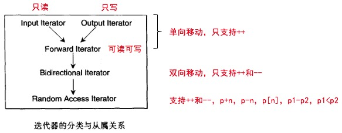

# 第三讲 迭代器概念与`traits`编程技法

> 《Design Patterns》 一书中提供有23个设计模式的完整描述，其中Iterator模式定义如下：提供一种方法，使之能够依序遍历某个容器所含的所有元素，而又可以保证不会暴露该容器的内部表述方式。

***迭代器的作用就是将数据容器和算法联系起来！！！***

# 1. 迭代器的相应型别

> 关于该节内容在另一篇笔记中已有相关陈述，  [STL_Containers.md](STL_Containers.md) 

***关键所在就是我们在算法中使用迭代器的时候，难免需要迭代器所指向的对象的类型名称来定义我们的临时变量，这个时候我们该怎么办？***

由于C++中只支持`sizeof()`，并没有我们所想的`typeof()`, 即便是使用RTTI性质中的`typeid()`，我们也是仅仅可以获得相应对象的名称，不能拿来做变量声明使用。

我们可以利用`function template`的参数自动推导机制来帮我们做这件事情，但是”这仅仅是可以解决迭代器所指对象的性别“，我们最常使用的相应类型有五种：

```c++
// 迭代器的种类
typedef typename Iterator::iterator_category iterator_category;
// 迭代器所指数据的类型
typedef typename Iterator::value_type value_type;
// 迭代器之间的距离,对于原生指针，STL以C++内建的ptrdiff_t作为原生的difference_type
typedef typename Iterator::difference_type difference_type;
// 迭代器所指对象的类型的引用
typedef typename Iterator::reference reference;
// 相应的指针的类型
typedef typename Iterator:pointer pointer;
```

这些类型并不是说所有的类型我们都可以使用模板的参数推导机制来获得，***更何况返回值类型我们是不能获得的，我们写声明的时候怎么写呢？你说是吧？***，所以说就有了下面的大名鼎鼎的`traits`技法，就是萃取嘛！

> 其实说白了，traits编程技法就是利用了模板的特化和偏特化特性而已，起了个名字叫做`traits`编程技法。

# 2. `Traits`编程技法---STL源代码秘钥

> 这里说的很有道理，因为如果你不清楚`Traits`编程技法的话，你就不知道一些类型代表的是什么意思，就别提可以看懂源代码了，还有之前第一讲中的SGI STL里面的一些宏的定义，如果你不知道这个宏代表什么意思，那你怎么看懂那些含有宏的函数声明。
>
> 该节内容在上面所提到的笔记中也有所陈述，在本节中也大致讲一讲就算了：[STL_Containers.md](STL_Containers.md) 

如果我们想要获得函数的返回类型该怎么办？***我们声明内嵌类型好像是可以解决我们的问题的。***

```C++ 
template<class T>
struct MyIter {
  typedef T value_type; // 声明内嵌类型
  T* ptr;
  MyIter(T* p=0) : ptr(p) {}
  T& operator*() const { return *ptr;}
  // ···
};

//···
template<class I>
typename I::value_type // 该行声明的就是函数的返回值类型，typename的作用就是告诉编译器这是一个类型声明
func(I ite)
{ return *itr;}

//···
MyIter<int> ite(new int(8));
cout << func(ite);
```

看到这里，我们感觉已经可以了，其他的类型我们也全部这样声明就好了，***但是，我们忘记了还有我们的基本变量类型呢！***他们是没有类的，我们没有办法声明其他的类型，除非你将其在进行一层封装，Java中的`int`就是被封装为了什么来着，我忘记了，就那样。

> 注释：
>
> 这里的看法是错误的，原生指针指的并不是说只有我们的基本变量类型这些对应的指针，所有的指针都属于原生指针，唯有你将指针另外的封装为一个类或者另外的一个东西的时候，该指针才会被称为非原生指针。

那么我们可以不可以针对特殊情况去另外的处理呢？

当然是可以了，就是利用我们的偏特化，就可以做到这一点。

```C++
template<typename T>
class C {};

template<typename T>
class C<T*> {};
// 该版本的模板就是针对原生指针的特化，如果传进来的类型是原生指针的话，那么我们就可以进行额外的处理
// 从而获得我们想要的5种基本类型
```

利用偏特化，我们便可以解决前面所述“内嵌类型”不能解决的问题，先前的问题是原生指针并非是`class`, 因此他们是无法定义自己的内嵌型别的，现在我们就可以利用偏特化来解决这个问题。


***下面所展示的类模板就是我们用来萃取出我们想要的5种类型所设计的：即所谓的Traits.***

```C++
// 下面的第一个模板是针对那些不是原生指针，也就是类的类型
// 由于我们所定义的迭代器中都是需要定义内嵌类型的，这是大家公认的，否则的话，我们的萃取机制就不能有效的工作，你就不可以融入STL的大家庭
template <class Iterator>
struct iterator_traits {
  typedef typename Iterator::iterator_category iterator_category;
  typedef typename Iterator::value_type        value_type;
  typedef typename Iterator::difference_type   difference_type;
  typedef typename Iterator::pointer           pointer;
  typedef typename Iterator::reference         reference;
};

// 这里定义了五个类，分别对应5种不同的Iterator, 从下面的代码中，我们可以看到这5种迭代器之间的关系
struct input_iterator_tag {};
struct output_iterator_tag {};
struct forward_iterator_tag : public input_iterator_tag {};
struct bidirectional_iterator_tag : public forward_iterator_tag {};
struct random_access_iterator_tag : public bidirectional_iterator_tag {};

// 是针对当迭代器为原生指针的时候
template <class T>
struct iterator_traits<T*> {
  typedef random_access_iterator_tag iterator_category;
  typedef T                          value_type;
  typedef ptrdiff_t                  difference_type;
  typedef T*                         pointer;
  typedef T&                         reference;
};

// 针对const int *这一类的指针的时候
template <class T>
struct iterator_traits<const T*> {
  typedef random_access_iterator_tag iterator_category;
  typedef T                          value_type;
  typedef ptrdiff_t                  difference_type;
  typedef const T*                   pointer;
  typedef const T&                   reference;
};
```

从上面的代码中我们可以看到，无论是`class iterator`还是`原生指针`，我们最终都是可以得到5种基本的类型：

```C++
value_type;
difference;
pointer;
reference;
iterator_category;// 该类型应该使我们最陌生的
```

> 注意，如果说我们希望我们所开发的容器，都可以和STL水乳交融的话，我们一定要给***我们的容器的迭代器设计这五种相应的类型***，特性萃取机`traits`会很忠实的将我们所需要的内容萃取出来。

# 3. 迭代器的型别解析

## 3.1 value_type

所谓`value_type`就是指的迭代器所指对象的类型，比如说我们经常使用的`vector<int>`，其`value_type`就是`int`.

我们通过查看SGI STL关于list的源码：  [stl_list.h](stl_source_code\sgi-stl-master\g++\stl_list.h)  可以看到：

```C++
// 定义链表的节点类
template <class T>
struct __list_node {
  typedef void* void_pointer;
  void_pointer next;
  void_pointer prev;
  T data;
};

// 链表迭代器中内嵌的类型
template<class T, class Ref, class Ptr>
struct __list_iterator {
  typedef __list_iterator<T, T&, T*>             iterator;
  typedef __list_iterator<T, const T&, const T*> const_iterator;
  typedef __list_iterator<T, Ref, Ptr>           self;

  typedef bidirectional_iterator_tag iterator_category;
  // 1. 我们从这里可以看到，如果我们使用traits对其迭代器进行萃取，我们得到的value_type就是T
  typedef T value_type;
  // ····
}

// 链表内部分内嵌类型 
template <class T, class Alloc = alloc>
class list {
// ····

public:
  // 2. 在这里我们可以看到我们直接是传入
  typedef __list_iterator<T, T&, T*>             iterator;
  typedef __list_iterator<T, const T&, const T*> const_iterator;
}
```

## 纠错：对于原生指针的认识


> ***注意注意注意！！！！！！***
>
> 我们可以通过比较SGI STL源码中对各种容器的实现发现，`list`容器还有`map`和`set`还有几个容器，他们的迭代器的实现是不一样的，比如说`vector`容器就根本没有定义自己专属的`iterator`类，人家直接就是像下面这样去定义自己的`iterator`:
>
> ```C++
> template <class T, class Alloc = alloc>
> class vector {
> public:
> typedef T value_type;
> // ···
> typedef value_type* iterator;
> typedef const value_type* const_iterator;
> // ···
> ```
>
> ***这样的话，如果我们使用萃取工具对其迭代器进行萃取的话，我们肯定是将其迭代器类型当作原生指针来处理了。***
>
> 所以说我之前的理解是错误的，我之前是认为我们那些基本变量对应的迭代器是原生指针，我以为只有当遇到了T \*类型的迭代器采去执行我们偏特化的萃取机制，这样理解是错误的，***我们这里的原生指针记住指的就是那些我们平时使用的指针，这个指针他不单单可以指向我们的基本类型的变量，他还可以指向我们自定义的一些类。什么不是原生指针呢？就是我们设计了一个类，叫做Iterator, 就是我们将指针进行封装，将其封装为一个类，这才不是原生指针！***
>
> 说到这里，我们可以去看看SGI设计的几种容器的实现，我们可以发现，***有的非原生指针的迭代器的模板他是有三个参数的***，我第一次看到的时候也有点蒙：
>
> ```C++
> template<class T, class Ref, class Ptr>
> struct __list_iterator {
>   typedef __list_iterator<T, T&, T*>             iterator;
>   typedef __list_iterator<T, const T&, const T*> const_iterator;
>   typedef __list_iterator<T, Ref, Ptr>           self;
> 
> // 5种非原生迭代器种必须定义的内嵌类型
>   typedef bidirectional_iterator_tag iterator_category;
>   typedef T value_type;
>   typedef Ptr pointer;
>   typedef Ref reference; 
>   typedef ptrdiff_t difference_type;
> // ····
> ```
>
> 但是往下面看，我们在`list`容器类中定义我们的`iterator`的时候：
>
> ```C++
> template <class T, class Alloc = alloc>
> class list {
> // ·····
> // 注意下面的代码的写法，我们实例化我们的迭代器的时候传进去三个参数: T, T&, T*分别对应值的类型、值的引用、值的指针
> // 我们这样就可以在我们的迭代器中去构造我们的五种基本类型
> public:
>   typedef __list_iterator<T, T&, T*>             iterator;
>   typedef __list_iterator<T, const T&, const T*> const_iterator;
> ```
>
> 像这样去定义迭代器中五种基本类型占据所有的容器的一大半，学习一下！！

## 3.2 difference type

`difference type`是用来表示两个迭代器之间的距离。我们有的算法比如说：STL`count()`, 其是必须返回迭代器的`difference type` 的：

```C++
template<class I, class T>
typename iterator_traits<I>::difference_type
count(I first, I last, const T& value) {
  // 注意下面现在看来很优美的代码段
  typename iterator_traits<I>::difference_type n = 0; 
  for(; first != last; ++first)
    if(*first == value)
      ++n
      ;
  return n;
}
```

## 3.3 reference type

就是引用

## 3.4 pointer type

就是指针

# 4. 第五种迭代器中内嵌型别 iterator_category

> 个人感悟：
>
> 该种迭代器是为什么服务的呢？就是性能，就是根据我们传入进来的迭代器的类型来判断我们应该执行哪一种模板。
>
> 我们怎么实现根据不同类型的迭代器实现重载函数呢，这种方式我们在前面也是看到过，我们定义五个什么都不干的类，然后将其作为函数的最后一个参数：
>
> ```C++
> struct input_iterator_tag {};
> struct output_iterator_tag {};
> struct forward_iterator_tag : public input_iterator_tag {};
> struct bidirectional_iterator_tag : public forward_iterator_tag {};
> struct random_access_iterator_tag : public bidirectional_iterator_tag {};
> ```
>
> 从上面这五个类中我们可以看出来该五种迭代器之间的继承关系，很明显可以看出来`random_access_iterator_tag`类型的迭代器是最灵活的。
>
> 下面是各种容器的迭代器的类型：
>
>  [stl_deque.h](stl_source_code/sgi-stl-master/g++/stl_deque.h)   [stl_iterator.h](stl_source_code/sgi-stl-master/g++/stl_iterator.h)   [stl_list.h](stl_source_code/sgi-stl-master/g++/stl_list.h)   [stl_queue.h](stl_source_code/sgi-stl-master/g++/stl_queue.h)  [stl_set.h](stl_source_code/sgi-stl-master/g++/stl_set.h)   [stl_stack.h](stl_source_code/sgi-stl-master/g++/stl_stack.h)   [stl_tree.h](stl_source_code/sgi-stl-master/g++/stl_tree.h)   [stl_vector.h](stl_source_code/sgi-stl-master/g++/stl_vector.h) 
>
> ```C++
> // list
> typedef bidirectional_iterator_tag iterator_category;
> 
> // vector
> // 由于vector容器的迭代器是原生指针，所以说我们利用偏特化萃取出来的迭代器的类型是下面所示
> // 原生指针的迭代器的类型都是random_access_iterator_tag
> template <class T>
> struct iterator_traits<T*> {
>   typedef random_access_iterator_tag iterator_category;
>   typedef T                          value_type;
>   typedef ptrdiff_t                  difference_type;
>   typedef T*                         pointer;
>   typedef T&                         reference;
> };
> 
> // deque
> typedef random_access_iterator_tag iterator_category;
> 
> // queue
> // 继承自deque
> template <class T, class Sequence = deque<T> >
> class queue {}
> 
> // stack
> // 也是继承自deque
> template <class T, class Sequence = deque<T> >
> class stack {}
> 
> // set
> // set就有意思了，因为其底层实现是一个红黑树，这是一个数据结构，所以说其Iterator肯定是很特殊的
> template <class Key, class Compare = less<Key>, class Alloc = alloc>
> class set {
> public:
>   // typedefs:
>   typedef Key key_type;
>   typedef Key value_type;
>   typedef Compare key_compare;
>   typedef Compare value_compare;
> private:
>   typedef rb_tree<key_type, value_type, 
>                   identity<value_type>, key_compare, Alloc> rep_type;
>   rep_type t;  // red-black tree representing set
> public:
>   typedef typename rep_type::const_pointer pointer;
>   typedef typename rep_type::const_pointer const_pointer;
>   typedef typename rep_type::const_reference reference;
>   typedef typename rep_type::const_reference const_reference;
>   typedef typename rep_type::const_iterator iterator;
>   typedef typename rep_type::const_iterator const_iterator;
>   typedef typename rep_type::const_reverse_iterator reverse_iterator;
>   typedef typename rep_type::const_reverse_iterator const_reverse_iterator;
>   typedef typename rep_type::size_type size_type;
>   typedef typename rep_type::difference_type difference_type;
> }
> // 我们可以看到我们先将rb_tree类定义为内嵌类型rep_type,之后所有的内嵌类型的声明全部取自它
> template <class Key, class Value, class KeyOfValue, class Compare,
>           class Alloc = alloc>
> class rb_tree {
>   // ····
> public:
>   typedef __rb_tree_iterator<value_type, reference, pointer> iterator;
>   typedef __rb_tree_iterator<value_type, const_reference, const_pointer> 
>           const_iterator;
>   // ····
> }
> 
> // 我们可以看到红黑树类也是自己定义了一个迭代器类:
> template <class Value, class Ref, class Ptr>
> struct __rb_tree_iterator : public __rb_tree_base_iterator
> {}
> 
> struct __rb_tree_base_iterator
> {
>   typedef __rb_tree_node_base::base_ptr base_ptr;
>   typedef bidirectional_iterator_tag iterator_category;
>   typedef ptrdiff_t difference_type;
> }
> 
> // 看到这里直呼666，然后其他的容器我觉得应该类似就不去看了。
> ```

上面是对迭代器类型的一些小小的补充,你接下来可能会疑惑，***为什么要区分迭代器的类型呢？***



这是几种迭代器的概念和强化的关系。

这是五种迭代器的类型实现：

```C++
struct input_iterator_tag {};
struct output_iterator_tag {};
struct forward_iterator_tag : public input_iterator_tag {};
struct bidirectional_iterator_tag : public forward_iterator_tag {};
struct random_access_iterator_tag : public bidirectional_iterator_tag {};
```

我们从上面可以看到继承关系，这里还需要关于动态绑定的一些知识，就是父类和子类之间的很微妙的关系。

```C++
//父类的引用可以用来接受子类的对象
// 例如，Bulk_quote是Quote的一个派生类，那么下面这些操作是合法的
Bulk_quote bulk;
Quote* quote = & bulk;
Quote& quote1 = bulk;
```

这也就是为什么？假设现在有一个算法可以接受`Forward_Iterator`，但是我们传参数的时候我们传进去一个`Random_Access_Iterator`类型的参数，他也肯定会接受。

> ***注意注意注意：***
>
> 我们在研究STL的过程中，每一分每一秒我们都要牢记在心，效率是一个重要的课题。

***我们下面以一个例子来说明为什么我们要对迭代器的类型进行区分：***

***以advance()函数为例：***

```	C++
// 该函数有两个参数: 迭代器p和数值n,其所实现的内容是将p累加n次

// 版本一
template <class InputIterator, class Distance>
// 这里的名字也是一个重点，注意一下为什么他要以最基本的迭代器的名字来命名呢？
void advance_II(InputIterator &i, Distance n)
{
  // 单项，逐一的累加
  while (n--) ++i;
}

// 版本二
template <class BidirectionalIterator, class Distance>
void advance_BI(BidirectionalIterator &i, Distance n)
{
// 双向, 逐一前进
  if(n >= 0 )
    while(n--) ++i;
  else 
    while(n++) --i;
}

// 版本三
template <class RandomAccessIterator, class Distance>
void advance_RAI(RandomAccessIterator &i, Distance n)
{
// 双向，跳跃前进
  i+=n;
}
```

看完上面三个实现版本，你应该知道我们为什么需要分情况了吧。

接下来我们就该考虑我们怎么实现根据不同的类型去执行不一样的函数了。

> 我们在之前的`destory`函数的实现上也遇到过同样的问题，我们可以回想一下当时我们是如何进行实现的？

我们之所以定义五种什么也不敢的类就是为了能够让我们可以实现重载，我们将其加在函数的第三个参数中：

```C++
struct input_iterator_tag {};
struct output_iterator_tag {};
struct forward_iterator_tag : public input_iterator_tag {};
struct bidirectional_iterator_tag : public forward_iterator_tag {};
struct random_access_iterator_tag : public bidirectional_iterator_tag {};


template <class InputIterator, class Distance>
void __advance(InputIterator &i, Distance n,
               input_iterator_tag)
{
  // 单项，逐一的累加
  while (n--) ++i;
}

// 单纯的传递调用函数，这里其实我们就不需要写，因为forward_iterator_tag类是继承自input_iterator_tag
// 所以说父类是直接可以接受子类的对象的
template <class InputIterator, class Distance>
void __advance(InputIterator &i, Distance n,
               forward_iterator_tag)
{
  // 单纯的进行传递调用
  __advance(i,n,input_iterator_tag()); // 随便构造一个对象传递过去
}

template <class InputIterator, class Distance>
void __advance(InputIterator &i, Distance n,
               bidirectional_iterator_tag)
{
// 双向, 逐一前进
  if(n >= 0 )
    while(n--) ++i;
  else 
    while(n++) --i;
}

template <class InputIterator, class Distance>
void __advance(InputIterator &i, Distance n,
               random_access_iterator_tag)
{
// 双向，跳跃前进
  i+=n;
}

```

这样我们不就可以实现最大的效率的吗？

我们注意上述语法，每一个函数的最后一个参数都是只声明型别，并未指定参数的名称，因为我们纯粹是用来激活重载机制的，函数中根本不使用该参数。

接下来我们对上述所有的功能进行封装，上层接口仅仅提供两个：

```	C++
template <class InputIterator, class Distance>
inline void advance(InputIterator &i, Distance n)
{
  __advance(i,n,
           iterator_traits<InputIterator>::iterator_category());
}
```

以上的代码看完是不是感觉这个世界·····

接下来我们回到上面涉及到的一个问题，就是那个模板参数命名为什么是`InputIterator`, ***这其实是STL算法的一个命名规则：以算法所能接受的最低迭代器类型来为模板中的迭代器参数命名。***

好了到这里关于迭代器中内嵌的五种类型已经说明完毕。

# 5. `std::Iterator`的保证

为了符合规范，任何迭代器都必须提供5个内嵌相应类型，以利于`traits`萃取，否则你就无法和其他的算法相融合，但是难免有人不小心忘记了，所以STL提供了`Iterators class`，如果每一个新设计的迭代器都继承自它就可以保证STL所需：

```	C++
template <class Category, class T, class Distance = ptrdiff_t,
          class Pointer = T*, class Reference = T&>
struct iterator {
  typedef Category  iterator_category;
  typedef T         value_type;
  typedef Distance  difference_type;
  typedef Pointer   pointer;
  typedef Reference reference;
};
```

这样的话，我们有的自己设计的迭代器就可以这样设计：

```C++
template<class Item>
struct MyIter : public std::iterator<std::forward_iterator_tag, Item>
{}
```

# 6. SGI STL的私房菜: __type_traits

> 双下划线前置表示这是SGI STL内部使用的东西，并不在STL标准规范之中。

SGI将`traits`编程技法进一步进行扩大，将其扩大到迭代器之外的世界。

`__type_traits`所做的事情简单的来说，就是通过我们变量的不同类型去选择执行不同的函数模板，可以针对不同的类型属性，在编译时期完成具体执行哪一个被重载的函数版本。

例如在前面讲解***析构函数的时候***，如果我们析构的对象是基本类型变量，也就是所谓的`POD:Plain Old Data`类型的变量，那么我们就没有必要再去调用相关的析构函数，我们就没有必要说再去执行一遍没有用的析构函数(***non-trivial***)，这个时候就需要我们针对不同类型来执行不一样的重载函数。

> 其实就分为两种情况：基本类型变量和类这两种。

这个时候就需要我们的`__type_traits`的萃取机制来解决这个问题了，我们在前面讲解迭代器的类型的时候，我们根据不同类型的分别去创建什么都没有的类，这样我们才可以成功的利用函数的重载机制。***一样的，我们在实现__type_traits的时候同样也是需要两个什么都不包含的类：` struct __true_type {} ;  struct __false_type {};`***

 [type_traits.h](stl_source_code/sgi-stl-master/g++/type_traits.h) 

```C++
// 我们可以看到
template <class type>
struct __type_traits { 
   typedef __true_type     this_dummy_member_must_be_first;// 这个先不要管
  // 我们可以看到下面分别对应是否含有默认的没有用的构造函数、拷贝构造函数、重载赋值运算符、析构函数、还有最后的是否是基本变量类型
   typedef __false_type    has_trivial_default_constructor;
   typedef __false_type    has_trivial_copy_constructor;
   typedef __false_type    has_trivial_assignment_operator;
   typedef __false_type    has_trivial_destructor;
   typedef __false_type    is_POD_type;
};

// 重载类型1
__STL_TEMPLATE_NULL struct __type_traits<char> {
   typedef __true_type    has_trivial_default_constructor;
   typedef __true_type    has_trivial_copy_constructor;
   typedef __true_type    has_trivial_assignment_operator;
   typedef __true_type    has_trivial_destructor;
   typedef __true_type    is_POD_type;
};
// ···
```

我们可以回忆一下当时学的析构函数是怎么实现的？

```C++
// 最终destroy函数会移交给下面的函数进行实现，下面的函数中:
template <class ForwardIterator, class T>
inline void __destroy(ForwardIterator first, ForwardIterator last, T*) {
  // 1. 利用__type_traits的萃取机制，我们成功的判断出变量的类型是否含有无关轻重的构造函数
  // 如果是的话，获得的has_trivial_destructor就会返回__true_type;
  // 如果不是的话，获得的has_trivial_destructor就会返回__false_type;
  typedef typename __type_traits<T>::has_trivial_destructor trivial_destructor;
  // 2. 注意此时trivial_destructor仅仅是一个类的名字，我们还需要创建一个临时变量传送进去，这样才可以实现我们的重载机制
  __destroy_aux(first, last, trivial_destructor());
}
```

同样的，STL里面很多算法都需要进行判断来执行哪一个版本的函数。

比如说我们之前提到的`uninitialized_fill_n()`全局函数：

 [stl_uninitialized.h](stl_source_code/sgi-stl-master/g++/stl_uninitialized.h) 

```C++
// 下面是定义在stl_iterator.h文件中的函数，大家可以观摩一下，就会有感觉traits编程技法是多么的强大
template <class Iterator>
inline typename iterator_traits<Iterator>::value_type*
value_type(const Iterator&) {
  return static_cast<typename iterator_traits<Iterator>::value_type*>(0);
}


// 这是泛化的函数
template <class ForwardIterator, class T>
inline void uninitialized_fill(ForwardIterator first, ForwardIterator last, 
                               const T& x) {
  __uninitialized_fill(first, last, x, value_type(first));
  // value_type函数返回的是对应变量的指针，该指针被赋为0, 即nullptr
}

// 下面是上面调用的函数，我们可以看到通过最后一个参数我们获得了对应变量的类型
template <class ForwardIterator, class T, class T1>
inline void __uninitialized_fill(ForwardIterator first, ForwardIterator last, 
                                 const T& x, T1*) {
  // 我们利用获得的变量的类型来萃取出该变量类型的是否是老的数据，就是所谓的基本变量类型
  // 根据最后一个参数进行重载
  typedef typename __type_traits<T1>::is_POD_type is_POD;
  __uninitialized_fill_aux(first, last, x, is_POD());
                   
}

//  destructor is trivial.
template <class ForwardIterator, class T>
inline void
__uninitialized_fill_aux(ForwardIterator first, ForwardIterator last, 
                         const T& x, __true_type)
{
  fill(first, last, x);
}
// 下面就是那些变量类类型不是基本变量类型的函数
template <class ForwardIterator, class T>
void
__uninitialized_fill_aux(ForwardIterator first, ForwardIterator last, 
                         const T& x, __false_type)
{
  ForwardIterator cur = first;
  __STL_TRY {
    for ( ; cur != last; ++cur)
      construct(&*cur, x);
  }
  __STL_UNWIND(destroy(first, cur));
}
```

当然了如果说我们自定义了一个类，该类其实也是一个POD类型的类，就是里面没有什么动态获取的内存之类的，大部分编译器而言。我们的`__type_traits`萃取出来的每一个特性也会是`false_type`，除非你编译器很牛逼，或者我们去告诉编译器遇到我们自己定义的类型的类，让他去识别：

```C++
template<> struct __type_traits<Customed> {
   typedef __true_type    has_trivial_default_constructor;
   typedef __true_type    has_trivial_copy_constructor;
   typedef __true_type    has_trivial_assignment_operator;
   typedef __true_type    has_trivial_destructor;
   typedef __true_type    is_POD_type;
}
```

这样的话，编译器就会告诉编译器去执行恰当的函数，以提高我们的效率。

究竟一个类什么时候该有自己的`non-trival default constructor`呢？很简单就是我们深拷贝和浅拷贝的那个问题，只有当我们设计的类中含有指针成员的话，并且对其进行了内存动态配置，那么我们的类就需要实现出自己的`non-trival default constructor `.

# 总结一个字：绝！
