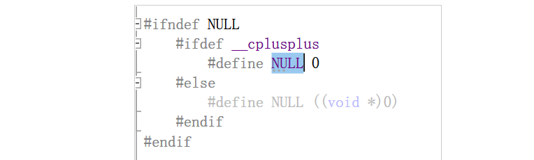
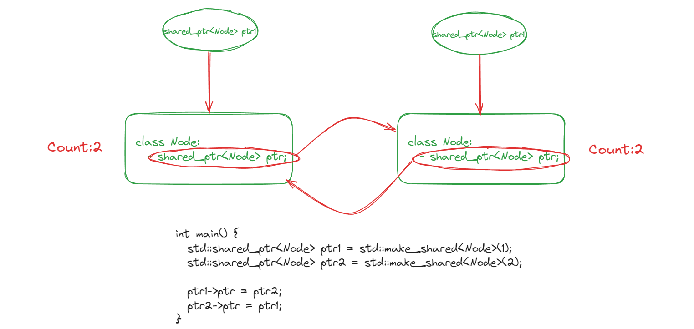
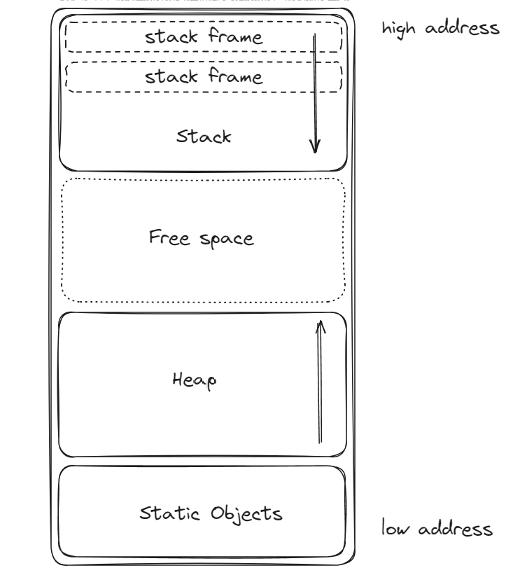

[TOC]


# C/C++知识点盲区

# 1.指针函数与函数指针

先看下面的信号处置设置函数：

```c
#include<signal.h>
void (*signal(int sig,void (*handler)(int)))(int);
```

***指针函数的定义，指针函数就是返回指针的函数，***定义如下：

类型名 *函数名（函数参数表列），例如，`int *fun(int ,int)`

由于\*的优先级低于()的优先级，所以fun先和后面的()结合，意味着fun就是一个函数；接着与前面的\*结合,这意味着这个函数的返回值是一个指针，由于前面还有一个`int`,也就是说fun是一个返回值为整形指针的函数。

***返回值是函数指针的函数：***

`int (* fun)(int a,int b);`

实际上一个函数指针不关心他的输入变量名字，只关心输入变量类型，因此输入变量名字可以省略掉：

`int (* fun)(int,int);`

这样就定义了一个函数指针，去掉变量名和最后的分号就是变量类型，因此fun这个函数指针的变量类型为`int (*)(int,int)`

还可以使用`typedef`定义:

`typedef int(* fun)(int,int);`

这样就可以直接利用fun去定义函数指针变量了，让这个函数指针指向某一个函数：

```c
#include <stdio.h>
int add(int a, int b)
{
    return a + b;
}
int sub(int a, int b)
{
    return a - b;
}
int(*func(int a)) (int, int)
/*该函数的作用是定义一个函数，该函数的目的是返回函数的地址，我们肯定是要用一个函数指针类型的变量来接收的*/
{
    if (a == 1) {
        return add;
    }
    return sub;
}

/* 定义函数指针类型 */
typedef int (* func_t)(int, int);

int main(int argc, const char *argv[])
{
    int k;
    func_t p1;
    int (*p2)(int, int);

    p1 = func(1);
    p2 = func(2);
    k = p1(1, 3);
    printf("k = %d\n", k);

    k = p2(1, 3);
    printf("k = %d\n", k);

    return 0;
}
```

总结一下：

如果一个函数的返回值为一个函数指针类型。我们可以分为两步来写：

第一步，先写出函数的返回值类型：

`int (*)(int,int)`

第二步，再写出一个其他返回类型的函数：

`int fun(int a)`

接下来，我们只需要将这个函数的`int`替换成`int (*)(int,int)`

`int (*fun(int a))(int int)`，将`fun(int a)`直接加到函数指针类型的星号后面即可。


再回头看signal函数的声明:

`void (*signal(int signal,void (*func)int))(int)`

我们先看最外面，可以知道该函数的返回类型是函数指针，其类型为`void (*)(int)`

再看里面，该函数的参数，参数1是signal，参数2是一个函数指针变量func。

# 2.` nullptr`和NULL的区别

我们声明空指针一般有以下三种办法：

```c++
int *p1 = nullptr;
int *p2 = 0;
// 需要首先#inlcude <cstdlib>
int *p3 = NULL;
```

我们也可以使用NULL来初始化空指针，但是这样会导致编译器无法区分他是指针还是一个int类型的变量，比如说以下代码：

```c++
#include <iostream>
#include <cstdlib>
using namespace std;

class Myclass
{
public:
        void printf(char *)
        {
                cout << "This is char\n" << endl;
        }
        void printf(int)
        {
                cout << "This is int\n" << endl;
        }

};

int main(int argc,char **argv)
{
        Myclass a;
        a.printf(NULL);
        a.printf(nullptr);
        return 0;
}
```

本质上来讲，`nullptr`是一个指针类型的变量值，该值代表着指针是空指针，我们用它只能来初始化指针，并不能初始化其他的Int类型的变量。但是NULL就不一样了，因为NULL本来就是0.

在C++中，在源文件中：



# 3. 编写自己的头文件

由于我们在编写代码的时候有可能会出现先后包含了多个相同文件的问题，所以说，我们应当在书写头文件的时候进行适当的处理，使其可以在遇到多次包含的情况下依旧可以安全和正常的运行。

我们确保头文件多次包含仍能安全工作的常用技术是预处理器。***预处理器就是在编译之前执行的一段程序，可以部分地改变我们所写的程序。***

比如说`#include`就是一项与处理功能，当预处理器看到`#include`标记的时候，就会是使用指定的头文件的内容代替`#include`。


我们还经常使用到的一项预处理功能是***头文件保护符***，就是我们平时如何去解决头文件多次被包含的问题，这里依赖于预处理变量。预处理变量有两种状态：***已经定义***和***未定义***。

`#define`指令就是将一个名字的设定为预处理变量，另外的两个指令则分别检查某一个指定的预处理变量是否已经被定义：

`ifdef`指令当且仅当已定义时为真，`ifndef`当且仅当变量未定义的时候为真。一旦检查结果为真，则执行后续操作直到遇到`#endif`指令为止。

我们平时写头文件的时候一般是这样去写：

```c++
#ifndef SALES_DATA_H
#define SALES_DATA_H
#include<string>

...
   
#endif
```

有一点需要我们去注意，预处理变量无视C++语言中关于作用域的规则。

# 4. `const`的用法

> 参考文章：https://zhuanlan.zhihu.com/p/134654903

## 4.1 常变量

变量使用`const`修饰，其值不得被改变。任何改变此变量的代码都会产生编译错误。`const`加在数据类型的前后均可。

```c++
void main(void)
{
    const int i = 10;    //i,j都用作常变量
    int const j = 20;
    i = 15;            //错误，常变量不能改变
    j = 25;            //错误，常变量不能改变
}
```

## 4.2 常指针

`const`和指针一起使用的时候有两种不同的情况：

`const`可以用来限制指针不可以改变，就是说，指针指向的内存地址不可以改变，但是可以随意的改变该地址指向的内存的内容。

```c++
int main(void) 
{ 
 int i = 10;
 int *const j = &i;  //常指针, 指向int型变量
 (*j)++;     //可以改变变量的内容
 j++;      //错误，不能改变常指针指向的内存地址
}
```

`const` 也可以用来限制指针指向的内存不可以改变，但是指针指向的内存地址可以改变。

```c++
int main(void)
{
 int i = 20;
 const int *j = &i;  //指针,指向int型常量
 //也可以写成int const *j = &i;
 j++;    //指针指向的内存地址可变
 (*j)++;   //错误,不能改变内存内容
}
```

我们怎么判断`const`修饰的是指针本身还是指针指向的内存呢？

我们可以通过`const `后面修饰的内容来判断:

如果`const`后面修饰的直接是指针变量的话，那么说明，指针的内容不可以改变，也就是指针指向不能改变；

但是如果`const`后面修饰的是* 和指针变量的话，说明指针指向的内存内容不可以改变。

两种方式还可以结合起来，使得指针指向的内存以及内存的内容都不可以改变。

```c++
int main(void)
{
 int i = 10;
 const int *const j = &i; //指向int常量的常指针
 j++;       //错误，不能改变指针指向的地址
 (*j)++;    //错误，不能改变常量的值
}
```

## 4.3 `const`和引用

我们引用的时候可以使用`const`修饰符进行修饰，使得我们不能通过别名来修改变量，但是我们可以通过变量本身来修改变量的值。

```c++
void main(void)
{
    int i = 10;
    int j = 100;
    const int &r = i;
    int const &s = j;
    r = 20;          //错，不能改变内容
    s = 50;          //错，不能改变内容
    i = 15;          // i和r 都等于15
    j = 25;          // j和s 都等于25
}
```

## 4.4 `const` 和成员函数

声明成员函数的时候，末尾加`const`修饰，表示在成员函数内不得改变该对象的任何数据。该种模式常常内用来表示对象数据只读的访问模式。

```c++
class MyClass
{
    char *str ="Hello, World";
    MyClass()
    {
        //void constructor
    } 
    ~MyClass()
    {
//destructor 
    }
 
    char ValueAt(int pos) const    //const method is an accessor method
    {
        if(pos >= 12)
               return 0;
  *str = 'M';       //错误，不得修改该对象
        return str[pos];     //return the value at position pos
    }
}
```

## 4.5 `const`和重载

参考：https://www.cnblogs.com/qingergege/p/7609533.html

### 4.5.1 常成员函数和非常成员函数之间的重载

**首先先回忆一下常成员函数**

声明：<类型标志符>函数名（参数表）`const`；

说明：

（1）`const`是函数类型的一部分，在实现部分也要带该关键字。

（2）`const`关键字可以用于对重载函数的区分。

（3）常成员函数不能更新类的成员变量，也不能调用该类中没有用`const`修饰的成员函数，只能调用常成员函数。

（4）**非常量对象也可以调用常成员函数，但是如果有重载的非常成员函数则会调用非常成员函数**（就是说，在有重载的情况下，非常量对象调用函数的时候，会去调用非常成员函数）。

 ```C++
 #include<iostream>  
 using namespace std;  
    
 class Test  
 {  
 protected:  
     int x;  
 public:  
     Test (int i):x(i) { }  
     void fun() const  
     {  
         cout << "fun() const called " << endl;  
     }  
     void fun()  
     {  
         cout << "fun() called " << endl;  
     }  
 };  
    
 int main()  
 {  
     Test t1 (10);  
     const Test t2 (20);  
     t1.fun();  
     t2.fun();  
     return 0;  
 }
 ```


### 4.5.2 `const`修饰成员函数的重载

分两种情况，一种情况可以重载，另一种情况不可以重载。


### 4.5.3 常量指针和指针常量

```c++
#include <iostream>
int main() {
  int x = 10;
  int y = 20;
  // test pointer to const
  const int *ptr = &x;
  ptr = &y;
  std::cout << *ptr << std::endl;
  // test const pointer
  int * const ptr2 = &x;
  // ptr2 = &y; wrong
  *ptr2 = 30;
  std::cout << *ptr2 << std::endl;
}
```

*指针常量就是指针本身是一个常量，我们只可以修改指针指向的数据，但是不能将指针指向其余的数据。*

*常量指针就是指针指向一个常量，该常量的值不能被修改，但是我们可以将该指针指向其余的数据。*


# 5. `constexpr`的用法

`constexpr`主要用来将变量声明为该种类型，以便由编译器来验证变量的值是否是一个常量表达式。声明为`constexpr`的变量一定是一个常量，而且必须使用常量表达式来初始化。

```c++
constexpr int size = size() //注意，只有当size是一个constexpr函数时才是一条正确的声明
```

可以不可以写出一种函数，它既可以在编译期运行也可以在运行期运行，C++11引入的`constexpr`关键字很好的解决了这个问题。


> 尽管编译器运算会延长我们的编译时间，但是我们有的时候会利用它来加快程序的运行速度，但是在使用的时候，我们应该抱着谨慎的态度。有些人说，反正`constexpr`函数在运行期和编译器都可以执行，那我们为什么不可以给每一个函数都加上`constexpr`呢？我对此观点持保留意见，因为它会让我们的代码中充斥着不必要的关键字，影响阅读不说，他到底给我们编译器带来的好处能不能将坏的影响抵消掉还是要好好权衡的。

***by刘元老师：***

以上功能仅仅是`constexpr`的用法之一，但是这并不是我们创建这个关键字的目的，它将常量给固定了，并且赋予了常量数据类型，我们在C中，想要写常量，我们可以使用`const`，但是其实他并没有真正的固定下来，我们是可以对该常量进行修改的。

比如说:

```c++
#include <stdio.h>

int main()
{
    const int a = 5;
    int *p = &a;
    *p = 6;
    
    printf("%d",*p);
    printf("%d",a);
    return 0;
}
```

最终的输出结果为：

```c++
66
```

我们可以发现我们是可以对常量进行修改的。

我们进行反汇编：


但是如果到了C++我们想要去定义一个：

- 不可更改的常量；
- 常量需要有类型；

我们不能简单的使用宏来实现，这个时候就得需要`constexpr`对于可以确定的类型，在编译期间直接给我们构造好，固定住，我们使用的时候，依然可以让座对应的类型使用，但是我们不能去修改他。

# 6. 为什么尽量不要使用`using namespace std`

其实底线就一条：如果你的头文件(`*.cpp`、`*.hpp`)又被外部使用，则尽量不要使用任何`using`语句引其他命名空间或者其他命名空间中的标识符。因为这样做可能会给使用你的头文件的人添加麻烦。更何况头文件之间都是相互套用的，假如说人人都在头文件中包含了若干个命名空间，到了第N层以后突然发现了一个命名冲突，这得往前回溯多少层才可以找到冲突。然而这个冲突本来是可以避免的。

其实在源文件`*.cpp`里面怎么使用`using`都是没有关系的，因为`*.cpp`里面的代码不影响到别人。甚至如果你的头文件仅仅是自己使用话，那么`using`也是没有问题的，但是为了养成良好的习惯，很多人仍然建议不要随便的使用`using`，以防写顺手。

# 7. 关于类声明参数`explicit`

```c++
/*****************************************************************//**
 * \file   Test.cpp
 * \brief  Test the function of explicit!
 * 
 * \author Kirito
 * \date   December 2022
 *********************************************************************/
#include "A.h"

#include <iostream>

void dosomething(A a)
{
	std::cout << "Test the function of explicit! \n";
}

int main()
{
	A a;
	dosomething(a);
	/// 隐式转换发生在此处，如果我们传参传进来一个int类型的变量，函数会先判断可不可以对其隐式转换
	/// 为相应的变量类型，然后再去执行函数的功能；
	///	我们也可以去为我们自定义的类，说明它可不可以进行隐式类型转换，如果构造函数声明为explicit
	///	的话，就是告诉编译器，该处不可以进行隐式类型转换，但是并不影响其显式转换。
	dosomething(14);
	
	std::cout << "Hello World!\n";
}
```

```
/*****************************************************************//**
 * \file   A.h
 * \brief  the class of A
 * 
 * \author Kirito
 * \date   December 2022
 *********************************************************************/

#pragma once
class A
{
protected:
	int _a;
public:
	// explicit A(int x = 0){};
	A(int x = 0) {}
};
```

# 8. 类

## 8.1 类的基本知识

- 对于使用`struct`和`class`关键字，使用`class`和`struct`定义类唯一的区别就是默认访问权限，`struct`的默认访问权限是`public`而`class`的默认访问权限是`private`。

- 类是允许其他类或者函数访问它的非公有成员的，方法是令其他类或者函数成为他的**友元**。

## 8.2 定义基类和派生类

- 作为继承关系中根节点的类往往都会定义一个虚析构函数。
- 基类中的成员函数分为两种：一种是基类希望其派生类进行覆盖的函数；另有一种是基类希望派生类直接继承而不要改变的函数。对于前者，我们往往将其定义为**虚函数**。当我们使用指针或者引用调用虚函数时，该调用将被动态绑定。根据引用或指针绑定的对象类型不同，该调用将会执行基类的版本，也可能执行某一个派生类的版本。

> **批注：**
>
> 动态绑定就是根据传进来的对象是基类的对象还是派生类的对象，来决定执行哪一个版本。

- 派生类对象以及派生类对象向基类的类型转换，就是我们可以将基类的指针或者引用绑定到派生类对象中的基类部分上。

```c++
Quote item;  // 基类对象
Bulk_quote bulk; // 派生类对象

Quote *p = &item; // p指向Quote对象
p = &bulk;        // p指向bulk的Quote部分
Quote &r = bulk;  // r绑定到bulk的Quote部分
```

## 8.3 关于构造函数

对于一个普通的类来讲，必须定义他自己的构造函数，***因为编译器只有在发现类内没有定义任何构造函数的时候，才会为我们生成一个默认的构造函数，一旦说我们定义了一个构造函数，无论你定义什么构造函数，编译器就会认为你要自己去构造，就不会自己生成指定过的构造函数。***

C++11标准中，我们可以使用`default`关键字来指定我们需要默认的行为，比如说我们需要默认的构造函数，就可以通过***该关键字来要求编译器生成构造函数***。

```c++
Sales_data = default;
```

----------------------------------------------------------***构造函数中的初始值列表***----------------------------------------------------------

构造函数中的初始值列表指的就是我们构造函数中的冒号***表达式***，冒号表达式的部分就相当于定义类内的变量的同时进行初始化，因为一般情况下我们定义变量的时候习惯于立即对其进行初始化，而非说你定义一个`int`的类型，然后再说去初始化其值：

```C++
int a;
a = 10;
```

所以说，我们定义一个类变量的时候，其初始化是在冒号表达式结束的时候结束的，***构造函数体内的表达式是对变量进行赋值操作***。

这个时候就会引入一个小问题：***就是如果类内有`const`类型或者引用的话的问题。***

我们知道如果是`const`或者引用类型的话，我们必须定义其的时候进行初始化，***所以说该种类型的数据变量，我们必须在冒号表达式中对其进行初始化，如果在构造函数体中对其进行赋值操作是错误的***。


------------------------------------------------------***构造函数初始值列表的书写顺序要求***----------------------------------------------------

最好令构造函数初始值的顺序与成员声明的顺序保持一致，而且如果可能的话，尽量避免使用某一些成员初始化其他成员。

```c++
class X {
    int i;
    int j;
public:
    X(int val): j(val),i(j) {}
};
```

我们像上面的方式去初始化的话，会出现错误信息，***因为我们成员的初始化顺序与他们在类定义的出现顺序保持一致***，也就是说在上面的代码中，`i`会比`j`先初始化，这个时候我们就会发现问题所在，我们会发现`i`是使用`j`来初始化的，但是`j`此时并未完成初始化，所以说这里会报错。我们在书写初始化列表的时候尽量不要去用别的成员来初始化其他的成员，就是为了防止上面情况的发生。

***除了上述情况，虽说初始值列表中初始值的前后关系不会影响实际的初始化顺序。***

------------------------------------------------------------***委托构造函数***-----------------------------------------------------------------------------

C++11标准扩展了构造函数初始值的功能，就是我们可以在冒号表达式中调用其他的构造函数来实现自己的职责，这就是委托构造函数，

```c++
class Sales_data {
public:
    Sales_data(std::string a, unsigned cnt, double price) :
    	bookNo(s),unit_sold(cnt), revenue(cnt * price) {}
    
    // 以下构造函数全部是委托构造函数
    Sales_data():Sales_data("",0,0) {}
    Sales_data(std::string s):Sales_data(s,0,0) {}
    Sales_data(std::istream& is):Sales_data() {read(is, *this);}
}
```

-------------------------------------------------------------***类的隐式转换构造函数***--------------------------------------------------------------------------

> 参看第7点知识点

-------------------------------------------------------------***使用default和delete***----------------------------------------------------------------------------

我们可以使用`default`和`delete`来通知编译器是否生成或者删除默认的构造函数、拷贝构造函数、析构函数、拷贝复制运算函数。

## 8.4 类的静态成员

我们通过在成员的声明之前加上关键字`static`使得其与类关联在一起，和其他成员一样，静态成员可以是`public`的或者`private`的。

***关键就在于，类的静态成员仅仅和类有关，和对象个体无关。***


静态成员函数不与任何对象绑定在一起，他们不包含`this`指针，所以说我们不能在`static`函数体内使用`this`指针。

> 另外我们知道类中的所有的函数单独独立存在的，就是说我们实例化出来的所有的对象访问的成员函数其实都是一个，我们调用的时候，是将指向对象的指针传进去。


# 9. `NDEBUG`预处理变量

我们在编译文件的时候，可以选择定义预处理变量：

```c++
$g++ -D NDEBUG main.cpp 
```

该条命令的作用等价于在main.cpp文件的一开始写`#define NDEBUG`。


# 10. `size_t` 和 `int`

> 让我们从定义开始。`int`是基本的有符号整数类型，并且保证至少有16位宽。`std::size_t`被定义为一个无符号整数，有足够的字节来表示任何类型的大小[2]。这意味着除了在C++的实现中`int`和`size_t`的宽度相同外，`size_t`总是能够比`int`存储更多的数字。`int`和`size_t`具有相同宽度的系统很可能很难处理，但这可能也是使它们有趣的原因。由于`size_t`有能力表示所有类型的大小--从而表示数组和向量的索引--***人们倾向于使用`size_t`来表示索引***，因为他们有保证可以表示他们想要的大小或索引。

使用`size_t`可能会提高代码的可移植性、有效性或者可读性，或许可以同时提高这三者。

可读性：当你看到一个对象声明为`size_t`类型，你就马上知道它代表字节的大小或者数组索引，而不是一个错误代码或者是一个普通的算数值，另外其表示的范围更大，我们不需要担心大小不够的问题。


# 11. 使用尾置返回类型

我们知道数组的类型是由数组的维数和数据的类型所组成，比如说下面示例：

```c++
int a[10];
// 该处声明了一个类型为int [10]的变量；
```

虽然说函数不可以返回数组，但是我们是可以返回指向数组的指针的，我们是如何声明数组的指针的呢?

```c++
typedef int arrT[10];
// 利用类型别名，我们就可以声明出数组的别名为int[10];
using arrT = int[10];
// 我们还可以使用新特性中的using,也相当于声明了一个别名

arrT* func(int i);

//该处声明了一个函数，该函数的返回值是arrT* ，即函数的指针
    
```

如果我们不使用这些别名去定义一个返回值类型为`int [10]`的话，我们要想定义一个函数就得像下面这样声明:

```c++
Type (*function(parameter_list)) [dimension]
```

具体例子：

```c++
int (*func(int i)) [10];
```

按照以下的顺序来理解：

- `func(int i)`是调用函数传进来的参数；
- `*func(int i)`意味着我们可以利用*运算符来获得一个变量；
- `*func(int i) [10]`意味着我们执行*运算符之后将会得到一个大小为10的数组；
- `int (*func(int i)) [10]`意味着数组中的元素是`int`类型，

我们应该可以看到这样声明的话会十分的麻烦，并且不容易让人理解，所以说，我们引进了尾置返回类型的方法来完整的表示一个函数

```c++
auto func(int i) -> int (*) [10];
// 该种声明方法，auto仅仅是占位符号,使用`->`指明真正的返回类型为int(*)[10];
```

# 11. OOP的核心思想是数据抽象、继承、和动态绑定

## 11.1 关于动态绑定

通常情况下，如果我们想要把引用或者指针绑定到一个对象上的话，则引用或者指针的类型应该与对象的类型保持一致。这想一想也是一定的，但是存在继承关系的类是一个重要的例外：***我们可以将基类的指针后者引用绑定到派生类的对象中。***

```c++
// 例如，Bulk_quote是Quote的一个派生类，那么下面这些操作是合法的
Bulk_quote bulk;
Quote* quote = & bulk;
Quote& quote1 = bulk;
```

可以将基类的指针或者引用绑定在派生类对象上意味着：

***当使用基类的指针或者引用的时候，实际上我们并不清楚该引用或者指针所绑定对象的真实类型。该对象可能是基类的对象，也可以是派生类的对象。***

这就涉及到动态类型和静态类型。

> 和内置指针一样，智能指针类也是支持派生类向基类的类型转换，这意味着我们可以将一个派生类对象的指针存储在一个基类的智能指针里面。

***动态绑定就是在运行的时候，函数才可以知道传进来的参数的类型到底是什么。***

## 11.2 虚函数

虚函数的一个关键就是可以利用动态绑定来决定我们去执行基类与派生类中的函数的版本。

> 就比如我们在基类中声明一个虚函数并定义，在派生类中将该虚函数进行重写，然后我们这里有一个函数，函数的参数是基类函数的引用或者指针，这样的话，如果我们传进去的是基类对象，那么里面关于对象成员函数的调用，全都调用基类的版本。但是如果我们传进去一个派生类参数，那么就会动态绑定到派生类重写的那个函数的版本。

关于虚函数重载的问题，一般来将，我们如果需要重新定义相应的虚函数，直接重载定义即可。***但是难免派生类中如果定义了一个函数与基类中的虚函数名字相同但是形参列表不同的话，这仍然是合法的的行为***。这个如果继续下去的话，就会导致不可预知的错误，所以说我们引入了`override`关键字，该关键字会通知编译器该函数是要覆盖掉基类中的虚函数，编译器会去检查是否覆盖，如果参数错误的话，就会报错，提醒程序员有地方写错了。

## 11.3 抽象函数

有的时候我们需要虚函数和各种派生类来完成指定的功能，***但是又不希望我们去实例化我们的基类，我们只希望去实例化派生出来的类。***这个时候我们只需要将基类中虚函数的定义给去除掉：

```c++
virtual void test() = 0;
```

***这个时候，很显然，我们基类中的虚函数没有定义，所以说我们不能实例化一个含有纯虚函数的基类，该基类此时被称为抽象类。***

## 11.4 虚析构函数

当我们`delete`一个动态分配的对象的指针时将执行析构函数。如果该指针指向继承体系中的某一个类型，则有可能出现指针的静态类型与被删除对象的动态类型不符合的情况。

比如说我们定义一个Quote\*类型的指针，则该指针有可能实际上指向的是Bulk_quote类型的对象，如果这样的话，编译器就应该清楚它应该执行的是Bulk_quote的析构函数。***和其他函数一样，我们需要通过在基类中将析构函数定义为虚函数以确保执行正确的析构函数版***。否则的话，我们可能会错误的执行析构函数。


> 所以说我们在继承这一块，我们不仅需要在基类中声明必要的虚函数，还需要声明虚析构函数，以保证我们之后析构对象的时候，可以析构正确。

## 11.5 static成员初始化

一般情况下，一个`static`类成员是静态分布的，而不是每一个类对象的一部分。也就是说***static成员声明充当类外定义的声明，也可以这样理解，`static`类成员的定义和声明是分开的。***

```c++
class Node{
    //...
    static int node_count;   // 声明
};

int Node::node_count = 0; // 定义
```

当然了，在极少数的情况下，在类内声明初始化`static`成员也是有可能的。条件是`static`成员必须是整型或者枚举类型的`const`, 或者是字面值类型的`constexpr`。


# 12. lambda表达式

一个`lambda`表达式表示一个可以调用的代码单元，我们可以将其理解为一个未命名的内联函数，因为如我们所见，`lambda`表达式总是出现在我们的函数内部，即内联函数。

与任何函数一样，***`lambda`表达式具有一个返回类型、一个参数列表和一个函数体。***

```c++
[capture list] (parameter list) -> return type { function body}
// capture list, 捕获列表, 就是lambda表达式所在函数中定义的局部变量的列表(通常为空)
// parameter list, 就是传进来参数的列表
// return type, 就是函数的返回类型，注意lambda表达式的返回类型书写的时候使用表达式后置的方法，就将对象的类型写在参数的后面, 前面的其实也是使用auto作为占位符
```

***我们在书写lambda表达式的时候，我们可以忽略参数列表和返回值类型，但是必须包含捕获列表和函数体.***

```c++
auto f = [] { return 42;}
cout << f() << endl;// 打印42
```

当我们书写lambda表达式的时候，如果忽略返回类型，编译器会根据函数体内的代码推断出返回的值的类型，如果没有返回`return`语句的话，那么返回类型就是void。

```c++
// 以下内容是一个简单的程序
#include <iostream>

int main()
{
	auto f = [] { return 42;};
	std :: cout << f() << std:: endl;
  return 0;
}
```

```c++
// 以下内容是编译器看到的内容
#include <iostream>

int main()
{
    
  class __lambda_5_11
  {
    public: 
    inline int operator()() const
    {
      return 42;
    }
    
    using retType_5_11 = auto (*)() -> int;
    // 就相当于 typedef int (* retType_5_11)()
    // 编译器看到的都是using retType_5_11 = auto (*)() -> int
    // 这里的auto声明是函数的返回值类型后置写法，auto仅仅是一个占位符，后面的int才是函数的返回类型
    // 我们可以从这里看到，编译器自动识别其返回类型，并且将retType_5_11定义为函数指针，该函数的返回类型是int类型
    inline operator retType_5_11 () const noexcept
    {
      return __invoke;
    };
    
    private: 
    static inline int __invoke()
    {
      return __lambda_5_11{}.operator()();
    }
    
    public: 
    // inline /*constexpr */ __lambda_5_11(__lambda_5_11 &&) noexcept = default;
    
  };
  
  __lambda_5_11 f = __lambda_5_11(__lambda_5_11{});
  std::cout.operator<<(f.operator()()).operator<<(std::endl);
  return 0;
}
```

通过编译器看到的内容，我们可以看到编译器是将lambda表达式定义为一个类，然后调用该类，已完成输出。

如果我们像下面这样定义lambda表达式：

```c++
#include <iostream>

int main()
{
	auto f = [] { std::cout << 43;};
	f();
  	return 0;
}
```

编译器看来是这样的：

```c++
#include <iostream>

int main()
{
    
  class __lambda_5_11
  {
    public: 
    inline void operator()() const
    {
      std::cout.operator<<(43);
    }
    
    using retType_5_11 = auto (*)() -> void;
    // 我们可以看到编译器识别将其返回值定义为void
    inline operator retType_5_11 () const noexcept
    {
      return __invoke;
    };
    
    private: 
    static inline void __invoke()
    {
      __lambda_5_11{}.operator()();
    }
    
    public: 
    // inline /*constexpr */ __lambda_5_11(__lambda_5_11 &&) noexcept = default;
    
  };
  
  __lambda_5_11 f = __lambda_5_11(__lambda_5_11{});
  f.operator()();
  return 0;
}
```

## 12.1 参考刘元老师笔记（http://mtw.so/6lHAIT）

在泛型算法中，我们可以传进来一个***谓词***，来帮助泛型算法更好的进行运算。

例如：我们可以在`find_if`函数中传入第三个参数，这个参数是一个接受且只接受一个参数的可调用对象（`这里需要注意，第三个参数是只能接受一个参数的可调用对象,如果我们传进来含有多余参数的可调用对象，就会报错`），其可以帮助`find_if`判断是否找到了我们需要的元素：

```c++\
bool getOdd(int numToPredicate) { return numToPredicate == 0; }
int main()
{
	vector<int> vec({1, 2, 3});
	find_if(vec.cbegin(), vec.cend(), getOdd);
}
```

但是有的时候，我们需要向函数里面传递两个参数才可以确定我们是否找到了我们需要的元素，在不进行额外的操作的时候，我们是无法使用的，这个时候，***我们就可以使用到lambda表达式，因为lambda表达式可以捕获局部变量，这样的话我们就实现了往里面传入多个参数的功能。***

## 12.2 值的捕获

***类似于参数传递，变量的捕获方式也 可以是值或者引用。采用值捕获的前提是变量可以拷贝。与参数不同，被捕获的变量的值是在lambda创建时的拷贝，而不是调用的时候拷贝，编译器会在编译的时候，创建一个相对应的类，然后在类中重载调用运算符（）重载的时候，其中写的是我们lambda函数的主体部分。***比如说下面的例子：

```c++
// 我们书写了含有lambda表达式的式子
stable_sort(words.begin(), words.end(), 
	[](const string& str1, const string& str2)
		{ return str1.size() < str2.size(); });

// 编译器看来是这样的：
class ShorterString
{
public:
	bool operator()(const string& str1, const string& str2) const
	{
		return str1.size() < str2.size();// 我们所写lambda表达式的主体
  }
};
```

## 12.3 值捕获

值的捕获又分为两种，一种是lambda表达式中可以修改的，另一种是lambda表达式中不可以修改的。这二者通过`mutable`关键字来进行区分：

```c++
// 下面lambda表达式内是不可以修改捕捉到的值的
int test;
auto f = [test] {test = 5; };
// 上面的代码会报错，原因是`cannot assign to a variable captured by copy in a non-mutable lambda`
// 翻译过来就是无法赋值给不可变lambda中由copy捕获的变量

// 下面的代码成功运行
int test;
auto f = [test]() mutable{ test = 5; }
```

这大概已经是`mutable`的使用方法了，但是为什么呢？

原因其实也很简单，我们接下来来看一下：

我们将下面的代码以编译器的视角来看一下, 我们先查看不加关键字`mutable`的情况，为什么选择下面这么长的代码，因为这段代码在测试的时候发现了右值引用相关的知识点，很有趣的：

```c++
// 测试代码，测试不加关键字mutable的情况
#include <iostream>
using namespace std;
class Test
{
public:
        Test(int val) : _val(val) { cout << "Test::Test()" << endl; }
        Test(const Test& other) : _val(other._val) { cout << "Test::Test(const Test&)" << endl; }
        ~Test() { cout << "Test::~Test()" << endl; }
        Test& operator=(const Test& other) { this->_val = other._val; cout << "Test::operator=(const Test& other)" << endl; return *this; }
private:
        int _val;
};

int main()
{
        Test test(5);
        auto func_value = [test]() { return test; };
        func_value();
}
```

下面的代码是编译器看见的代码：

```c++
#include <iostream>

using namespace std;

class Test
{
  public: 
  inline Test(int val)
  : _val{val}
  {
    std::operator<<(std::cout, "Test::Test()").operator<<(std::endl);
  }
  inline Test(const Test & other)
  : _val{other._val}
  {
    std::operator<<(std::cout, "Test::Test(const Test&)").operator<<(std::endl);
  }
  
  inline ~Test() noexcept
  {
    std::operator<<(std::cout, "Test::~Test()").operator<<(std::endl);
  }
  inline Test & operator=(const Test & other)
  {
    this->_val = other._val;
    std::operator<<(std::cout, "Test::operator=(const Test& other)").operator<<(std::endl);
    return *this;
  }
  private: 
  int _val;
};

int main()
{
  Test test = Test(5);
    
  class __lambda_21_27
  {
    public: 
    inline Test operator()() const  //这一行是关键所在
    {
      return Test(test);
    }
    private: 
    Test test;
    public: 
    // inline __lambda_21_27 & operator=(const __lambda_21_27 &) /* noexcept */ = delete;
    __lambda_21_27(const Test & _test)
    : test{_test}
    {}
  };
  __lambda_21_27 func_value = __lambda_21_27{test};
  func_value.operator()();
  return 0;
}

```

从上面的代码中我们可以看到编译器是先将lambda表达式先转换成一个类，然后通过实例化该类以及调用相关的函数从而实现了lambda表达式的功能。

好了我们回到为什么不加关键字`mutable`，lambda表达式就无法修改捕获到的值呢？

从上面的代码中我们可以看到，如果我们捕捉一个变量的话，lambda相应的类就会生成一个相应的私有成员变量，然后其拷贝构造函数声明方式为：

```c++
 __lambda_21_27(const Test & _test)
    : test{_test}
    {}
```

这里很正常，因为我们平时声明拷贝构造函数就是声明为`const `的引用,然后将其值再初始化给`test`, ***然后还有就是，我们捕捉到的值是左值，并不是右值。这一点其实就不用看，如果你和我意见不一样，在下面的引用捕获你可以体会到是左值。***

关键看第40行的代码：

```c++
    public: 
    inline Test operator()() const  //这一行是关键所在
    {
      return Test(test);
    }
```

我们可以看到这里重载了调用运算符`()`，并且将其声明为`const`，这就是一切的来源了，就是因为其声明为`const`的原因，才导致我们不可以在lambda表达式中去修改相应的变量，虽然说，我们已经通过copy得到了一份副本，但是对于这一份副本，我们声明为`const`,就是不可以修改。

好，看到这里你应该可以猜到如果加上关键字`mutable`会发生什么了，没错就是将重载函数的`const`声明去掉了：

```c++
#include <iostream>
using namespace std;

class Test
{
public:
        Test(int val) : _val(val) { cout << "Test::Test()" << endl; }
        Test(const Test& other) : _val(other._val) { cout << "Test::Test(const Test&)" << endl; }
        ~Test() { cout << "Test::~Test()" << endl; }
        Test& operator=(const Test& other) { this->_val = other._val; cout << "Test::operator=(const Test& other)" << endl; return *this; }
private:
        int _val;
};
int main()
{
        Test test(5);
        auto func_value = [test]() mutable { test = Test(6); };
        func_value();
}
```

编译器看到的是下面代码：

```c++
#include <iostream>

using namespace std;
class Test
{
  public: 
  inline Test(int val)
  : _val{val}
  {
    std::operator<<(std::cout, "Test::Test()").operator<<(std::endl);
  }
  inline Test(const Test & other)
  : _val{other._val}
  {
    std::operator<<(std::cout, "Test::Test(const Test&)").operator<<(std::endl);
  }
  inline ~Test() noexcept
  {
    std::operator<<(std::cout, "Test::~Test()").operator<<(std::endl);
  }
  inline Test & operator=(const Test & other)
  {
    this->_val = other._val;
    std::operator<<(std::cout, "Test::operator=(const Test& other)").operator<<(std::endl);
    return *this;
  }
 
  private: 
  int _val;
};
int main()
{
  Test test = Test(5);
    
  class __lambda_21_27
  {
    public: 
    inline /*constexpr */ void operator()()  // 我在这里我在这里
      																	  // 我们在这里可以很清晰的看到，该函数没有const所以我们是可以对lambda中的
      																		// 变量进行修改的
    {
      test.operator=(Test(Test(6)));
    }
    private: 
    Test test;
    public: 
    // inline __lambda_21_27 & operator=(const __lambda_21_27 &) /* noexcept */ = delete;
    __lambda_21_27(const Test & _test)
    : test{_test}
    {}
  };
  __lambda_21_27 func_value = __lambda_21_27{test};
  func_value.operator()();
  return 0;
}

```

重点在于第38行：

```c++
    inline /*constexpr */ void operator()()  // 我在这里我在这里
      																	  // 我们在这里可以很清晰的看到，该函数没有const所以我们是可以对lambda中的
      																		// 变量进行修改的
    {
      test.operator=(Test(Test(6)));
    }
```

我们也可以看到这里对`test`进行了修改，怎么修改的呢，是通过调用重载赋值运算符`=`来修改的，这里有一处代码实践了之前学到的知识：

> 我们是可以通过`const `引用来引用右值的！！！

我们可以看到重载赋值运算符函数里面的参数`Test(Test(6))`,首先，我们是先构造一个临时变量这才是右值，然后为什么外面又要嵌套一层呢，因为这里是右值，编译器又将其强转化为Test类型的变量，这里是编译器的处理。我们其实也可以直接使用`Test(6)`进行传参，因为我们是可以通过`const`引用来引用右值的：

```c++
// 我们可以看到对应的重载赋值运算符的参数类型就是const 的引用
// 这下我们对为什么重载赋值运算符的参数是 const Test & other有了进一步的认识
// 因为我们这样可以实现接受右值的传参
inline Test & operator=(const Test & other)
  {
    this->_val = other._val;
    std::operator<<(std::cout, "Test::operator=(const Test& other)").operator<<(std::endl);
    return *this;
  }
```

## 12.4 引用捕获

看完上面的简述之后，我们接下来继续看另一种捕获，引用捕获：

```c++
#include<iostream>
#include<string>
int main()
{
	std::string test;
  	auto f = [&test]{ test = "test";};
  	f();
  	std::cout << test;
}
```

使用起来很方便，我们可以直接想引用正常变量的时候引用他。

接下来我们可以查看编译器是怎么看的：

```c++
#include<iostream>
#include<string>
int main()
{
  std::basic_string<char> test = std::basic_string<char>();
    
  class __lambda_6_13
  {
    public: 
    inline /*constexpr */ void operator()() const // 这里虽然说是const修饰，但是这里是引用，所以说我们可以对其进行修改
      																				// 我们只是不可以修改引用指向哪里，但是并不代表我们不可以修改引用对
      																				// 的值，当然了如果我们想要修改其引用指向哪里，一样的，添加关键字
                                                  // mutable
    {
      test.operator=("test");
    }
    
    private: 
    std::basic_string<char> & test;
    
    public:
    __lambda_6_13(std::basic_string<char> & _test)
    : test{_test}
    {}
    
  };
  __lambda_6_13 f = __lambda_6_13{test};
  f.operator()();
  std::operator<<(std::cout, test);
  return 0;
}

```


# 13. 左值引用和右值引用

> 参考文章https://paul.pub/cpp-value-category/
>
> 对于左值和右值，我们可以简单的理解为：***左值对应了具有内存地址的对象，而右值对象仅仅是临时使用的值。***
>
> ```c++
> // 例如下面例子中，很显然s1和s2是左值，因为其具有相应的内存地址，"Hello"和"World"很显然是一个临时使用的值，用来初
> // 始构造我们的变量
> std::string s1 = "Hello";
> std::string s2 = "World";
> // s3是左值，而右边的表达式虽然其中每一个变量是左值，但是组合起来就变成了右值
> std::string s3 = s1 + s2;
> 
> ```

在C++之前，引用分为`const`引用和非`const`引用。这两种引用在C++中都称为左值引用( rvalue reference)。

***注意：我们是无法将非`const`左值引用指向右值的***。

```c++
// 下面的代码是不会通过编译的
#include <iostream>
#include <string>
using namespace std;
int main()
{
        string s1 = "Hello, ";
        string s2 = "world! ";
        string &s3 = s1 + s2;
        cout << s3 << endl;
        return 0;
}
```

编译器会报错：

```error
.\main.cpp: In function 'int main()':
.\main.cpp:11:18: error: cannot bind non-const lvalue reference of type 'std::__cxx11::string&' {aka 'std::__cxx11::basic_string<char>&'} to an rvalue of type 'std::__cxx11::basic_string<char>'
  string &s3 = s1 + s2;
```

意思翻译翻译过来也就是你不能将非`const`左值引用指向右值的。

***但是，`const`类型的左值引用是可以绑定到右值的。***也就是说，下面的代码是可以通过编译的：

```c++
#include <iostream>
#include <string>
using namespace std;
int main()
{
        string s1 = "Hello, ";
        string s2 = "world! ";
        const string &s3 = s1 + s2;
        cout << s3 << endl;
        return 0;
}
```

不过，由于这个引用是`const`的，因此你无法修改其值的内容。

***C++11新增了右值引用，左值引用的写法是`&`，右值引用的写法是`&&`***。

右值是一个临时的值，右值引用是指向右值的引用。右值引用延长了临时值的生命周期，并且允许我们修改其值。

例如：

```c++
std::string s1 = "Hello ";
std::string s2 = "world";
std::string&& s_rref = s1 + s2;    // the result of s1 + s2 is an rvalue
s_rref += ", my friend";           // I can change the temporary string!
std::cout << s_rref << '\n';       // prints "Hello world, my friend"
```

右值引用使得我们可以创建出以此为基础的函数重载，例如：

```
void func(X& x) {
    cout << "lvalue reference version" << endl;
}

void func(X&& x) {
    cout << "rvalue reference version" << endl;
}
```

```c++
X returnX() {
    return X();
}

int main(int argc, char** argv) {
    X x;
    func(x);
    func(returnX());
}
```

输出结果为：

```output
lvalue reference version
rvalue reference version
```

## 13.1 移动语义

我们知道，在C++中，我们可以为类定义拷贝构造函数和拷贝赋值运算符。

```c++
class X
{
public:
    X(const X& other) // copy constructor
    {
        m_data = new int[other.m_size];
        std::copy(other.m_data, other.m_data + other.m_size, m_data);
        m_size = other.m_size;
    }

    X& operator=(X other) // copy assignment
    {
        if(this == &other) return *this;
        delete[] m_data;
        m_data = new int[other.m_size];
        std::copy(other.m_data, other.m_data + other.m_size, m_data);
        m_size = other.m_size;
        return *this;
    }

    X& operator=(const X& other) // copy assignment
    {
        if(this == &other) return *this;
        delete[] m_data;
        m_data = new int[other.m_size];
        std::copy(other.m_data, other.m_data + other.m_size, m_data);
        m_size = other.m_size;
        return *this;
    }

private:
    int*   m_data;
    size_t m_size;
};
```

> 当然，如果你为类定义了拷贝构造函数和拷贝赋值运算符，你通常还应当为其定义析构函数。这称之为[Rule of Three](https://en.wikipedia.org/wiki/Rule_of_three_(C++_programming))。

拷贝意味着会将原来的数据复制一份新的出来。这么做的好处是：新的数据和原先的数据是相互独立的，修改其中一个不会去影响另一个。但是坏处是：这么做会消耗运算时间和存储空间。例如你有一个包含了10^10个元素的集合数 据，将其拷贝一份就不那么轻松了。


但是移动操作就会轻松很多，因为他不涉及新数据的产生，仅仅是将原先的数据更改其所有者。


在C++11中，我们可以这样为类定义移动构造函数和移动赋值运算符：

```c++
X(X&&);
X& operator=(X&&);
```

我们继续上面的定义：

```C++
X(X&& other)
{
    m_data = other.m_data;
    m_size = other.m_size;
    // 注意下面的语句，就相当于转移数据所有权，局部变量other已经没有用了
    other.m_date = nullptr;
    other.m_size = 0;
}

X& operator=(X&& other)
{
    if(this == &other) return *this;
    
    delete[] m_data;
    
    m_data = other.m_data;
    m_size = other.m_size;
    
    other.m_data = nullptr;
    other.m_size = 0;
    
    return *this;
}
```

现在，该类有了拷贝和移动两种操作，那编译器如何知道该选择哪个呢？***答案是，根据传入的参数类型：如果是左值引用，则使用拷贝操作；如果是右值引用，则使用移动操作。***

```c++
X createX(int size)
{
  return X(size);
}

int main()
{
  X h1(1000);                // regular constructor
  X h2(h1);                  // copy constructor (lvalue in input)
  X h3 = createX(2000);      // move constructor (rvalue in input) 

  h2 = h3;                   // assignment operator (lvalue in input)
  h2 = createX(500);         // move assignment operator (rvalue in input)
}
```

***还有一点就是，如果是左值，我们也是可以调用移动操作的，我们此时需要借用`std::move`。***

### ***13.1 线程的所有权的转移：*** 

> ***该处的`std::move`我们可能在C++11线程的学习中使用很多，因为有的时候由于我们的需求，需要将一个线程的所有权转交给另一个线程。这个时候就需要用到`std::move`来帮助我们实现这个目的。***
>
> ```c++
> void some_function();
> void some_other_function();
> 
> std::thread t1(some_function);
> 
> std::thread t2 = std::move(t1);
> 
> t1 = std::thread(some_other_function);
> // 注意，这里我们将临时产生的线程的控制权转移给了t1,但是我们并没有显示的去调用`std::move()`转移其所有权，这是因为，所有者是一个临时对象，是一个右值，移动赋值操作符会隐式的调用。
> ```


### ***13.2 智能指针的控制权的转移：***

> ***还有我们学习智能指针的时候，知道智能指针`unique_ptr`也成为独享指针，即不能同时有多个智能指针指向同一块内存，那如果我们在函数之间传递智能指针怎么办？***
>
> ```c++
> void pass_up(unique_ptr<int> up)
> {
>     cout << "In pass_up: " << *up <<endl;
> }
> 
> void main()
> {
>     auto up = make_unique<int>(123);
>     pass_up(up);
> }
> ```
>
> 上述代码会出现错误，原因在于我们在传递指针的时候，会有一个复制up的操作，显然这个操作是不允许的，所以会报错。
>
> 这个时候我们可以选择直接传给函数指针指向的资源：
>
> `pass_up(*up);`
>
> 除此之外，还可以使用第二种方法：
>
> `pass_up(up.get());`
>
> 其中`up.get()`获得的是资源的裸指针。
>
> 以上方法仅仅让我们去访问对应的资源，但是如果我们想要通过函数直接改变`unique_ptr`本身怎么办？
>
> 我们可以将函数的参数设置为智能指针的引用；
>

## 14.1  C++ 三法则

三法则讲述的是，如果一个类定义了以下任何一项，那么它可能应该明确定义所有三个：

- 析构函数，***destructor***;
- 拷贝构造函数，***copy constructor***;
- 拷贝复制运算符，***copy assignment operator***;

为什么呢？

其实都是为深拷贝所服务的，如果我们想要深拷贝的话，我们就需要去自定义一个拷贝构造函数和拷贝复制运算符函数。既然我们涉及到深拷贝了，那么一定存在指针，所以需要析构函数来释放内存，否则就会导致内存泄漏。

## 14.2 C++ 五法则

五法则讲述的则是：

- 析构函数，***destructor***；
- 复制构造函数，***copy constructor***；
- 复制赋值运算符，***copy assignment operator***；
- 移动构造函数，***move constructor***；
- 移动赋值运算符，***move assignment operator***；

# 15. 常量

C++支持如下两种不变概念。

- `const`: 大致的意思是“我承诺不会去改变这个值（***即我们不能通过该变量去修改对应的值***）”。主要用于说明接口，这样在于我们在把变量传入函数的时候就不必担心变量会在函数内被改变了。编译器负责确认并运行`const`的承诺。
- `constexpr`: 大致的意思是“在编译的时候求值”。***这才是真正的常量***。***作用是允许将数据置于只读内存（不太可能被破坏）中以及提高性能。*** 

```C++
const int dmv = 17; // dwv 是一个命名的常量
int var = 17;       // var不是常量
constexpr double max1 = 1.4*square(dwv); // 如果square(17)是常量表达式，则正确，这个需要square函数声明为constexpr
constexpr double max2 = 1.4*square(var); // 错误，因为var不是常量表达式
const double max3 = 1.4*square(var); // 正确，可以在运行的时候求值
double sum(const vector<double>&); // 此处声明的是一个函数，说明该函数不会去修改参数的值
vector<double> v{1,2,3,4,5}; // v不是常量
const double s1 = sum(v); // OK,在运行的时候求值
constexpr double s2 = sum(v); // 错误, constexpr需要在编译的时候求值，即所有的值都是常量表达式
```

***如果某一个函数用在常量表达式中，即该表达式在编译的时候求值，则该函数必须定义为`constexpr`***.例如：

```c++
constexpr double square(double x) { return x*x; }
```

当一个函数定义为`constexpr`的时候，该函数就是可以在编译器可以运行的函数，在编译器运行的函数，你想想，他的能耐能有多大，所以说，定位为`constexr`的函数的限制十分的多：

- 函数必须返回一个值，不能是void;
- 函数体内只能有一条语句，return；
- 函数调用之前必须被定义；
- 函数必须使用`constexpr`进行声明；

`constexpr`的作用是指示或者确保在编译的时候求值，而`const`的主要任务是规定接口的不可修改性。

# 16. noexcept的使用方法

> 搬运博客： https://blog.csdn.net/null_10086/article/details/119517852

## 16.1 C++98中的异常规范：

throw 关键字除了可以用在函数体中抛出异常，还可以用在函数头和函数体之间，指明当前函数能够抛出的异常类型，这称为异常规范，有些教程也称为异常指示符或异常列表。请看下面的例子：

```C++
double func1 (char param) throw(int);
```

函数 func1 只能抛出` int `类型的异常。如果抛出其他类型的异常，try 将无法捕获，并直接调用 `std::unexpected`。

如果函数会抛出多种类型的异常，那么可以用逗号隔开，

```c++
double func2 (char param) throw(int, char, exception);
```

如果函数不会抛出任何异常，那么只需写一个空括号即可，

```c++
double func3 (char param) throw();
```

同样的，如果函数 func3 还是抛出异常了，try 也会检测不到，并且也会直接调用` std::unexpected`。

***虚函数中的异常规范:***

C++ 规定，派生类虚函数的异常规范必须与基类虚函数的异常规范一样严格，或者更严格。只有这样，当通过基类指针（或者引用）调用派生类虚函数时，才能保证不违背基类成员函数的异常规范。请看下面的例子：

```c++
class Base {
  public:
    virtual int fun1(int) throw();
    virtual int fun2(int) throw(int);
    virtual string fun3() throw(int, string);
};

class Derived: public Base {
  public:
    int fun1(int) throw(int);    //错！异常规范不如 throw() 严格
    int fun2(int) throw(int);    //对！有相同的异常规范
    string fun3() throw(string); //对！异常规范比 throw(int, string) 更严格
}
```

***异常规范与函数定义和函数声明***

C++ 规定，异常规范在函数声明和函数定义中必须同时指明，并且要严格保持一致，不能更加严格或者更加宽松。请看下面的几组函数：

```c++
// 错！定义中有异常规范，声明中没有
void func1();
void func1() throw(int) { }

// 错！定义和声明中的异常规范不一致
void func2() throw(int);
void func2() throw(int, bool) { }

// 对！定义和声明中的异常规范严格一致
void func3() throw(float, char *);
void func3() throw(float, char *) { }
```

***异常规范在 C++11 中被摒弃***

异常规范的初衷是好的，它希望让程序员看到函数的定义或声明后，立马就知道该函数会抛出什么类型的异常，这样程序员就可以使用 `try-catch `来捕获了。如果没有异常规范，程序员必须阅读函数源码才能知道函数会抛出什么异常。

不过这有时候也不容易做到。例如，`func_outer()` 函数可能不会引发异常，但它调用了另外一个函数` func_inner()`，这个函数可能会引发异常。再如，编写的一个函数调用了老式的一个库函数，此时不会引发异常，但是老式库更新以后这个函数却引发了异常。

其实，不仅仅如此，

1. 异常规范的检查是在运行期而不是编译期，因此程序员不能保证所有异常都得到了 catch 处理。

2. 由于第一点的存在，编译器需要生成额外的代码，在一定程度上妨碍了优化。

3. 模板函数中无法使用。比如下面的代码，

   ```c++
   template<class T>
   void func(T k) {
       T x(k);
     	x.do_something();
   }
   ```

   赋值函数、拷贝构造函数和 do_something() 都有可能抛出异常，这取决于类型 T 的实现，所以无法给函数 `func `指定异常类型。

4. 实际使用中，***我们只需要两种异常说明：抛异常和不抛异常，也就是 throw(...) 和 throw()。***

所以 C++11 摒弃了 throw 异常规范，而引入了新的异常说明符` noexcept`。

> 动态异常规定：就是列出函数中可能直接或者间接排除的异常

## 16.2 C++ 11中的异常规范

`noexcept`紧跟在函数的参数列表后面，他只用来表明两种状态：***“抛出异常和不抛出异常”***。

```C++
void func_not_throw() noexcept;// 保证不抛出异常
void func_not_throw() noexcept(true);// 和上面的式子是一样的

// 默认情况下都是要抛出异常的
void func_not_throw() noexcept(false); // 可能会抛出异常
void func_not_throw();
```

对于一个函数，使用`noexcept`时候的规范：

- `noexcept` 说明符号要么出现在该函数的所有声明语句和定义语句中，要么一次也不出现；
- 函数指针以及函数指针指向的函数必须具有一致的异常说明；

***对于函数指针中的`noexcept`说明符号，请看下面的示例：***

```C++
void (* func_not_throw)() noexcept(false); 

// 此处的函数声明就是声明了一个指向可能抛出异常的函数

// 但是需要注意一点的是，我们不能在typedef或者类型别名的时候出现noexcept说明符号
// 比如说:
// typedef int (*pf)() noexcept;
// 上面的写法是错误的
```

- 在成员函数中，`noexcept` 说明符需要跟在 `const` 及引用限定符之后，而在 final、override 或虚函数的 =0 之前。
- 如果一个虚函数承诺了它不会抛出异常，则后续派生的虚函数也必须做出同样的承诺；与之相反，如果基类的虚函数允许抛出异常，则派生类的虚函数既可以抛出异常，也可以不允许抛出异常。

还有一点就是如果我们在声明了`noexcept`的函数中抛出异常的话，程序会直接调用`std::terminate`，并不能捕获到指定的异常。

```C++
#include <iostream>
using namespace std;
 
void func_not_throw() noexcept {
    throw 1;
}
 
int main() {
    try {
        func_not_throw(); // 直接 terminate，不会被 catch
    } catch (int) {
        cout << "catch int" << endl;
    }
    return 0;
}

// 上面的程序中我们是不可以捕获到int的，因为我们声明的函数为不会产生异常，一旦产生异常就会直接调用std::terminate
// 所以说我们在使用noexcept说明符的时候需要格外的注意
```

***`noexcept`说明符还有另外的一种使用方法：***

*`noexcept运算符进行编译时候检查，如果说表达式声明为不抛出任何异常就返回true`*，简单地说就是为了判断某一个函数是否声明`noexcept`.

比如说下面的示例：

```C++
void f() noexcept {
}
 
void g() noexcept(noexcept(f)) { // g()是否是 noexcept 取决于 f()
    f();
}
// 由于f函数是noexcept类型的，所以说该运算符会返回true，那么g函数也就会被声明为 noexcept(true)
// 即不会抛出异常
```

还有很重要的是***对于析构函数，我们都是默认为`noexcept`类型的。C++ 11 标准规定，类的析构函数都是 `noexcept` 的，除非显示指定为 `noexcept(false)`。***

```C++
class A {
  public:
    A() {}
    ~A() {} // 默认不抛出异常
};
 
class B {
  public:
    B() {}
    ~B() noexcept(false) {} // 可能会抛出异常
};
```

***在为某个异常进行栈展开的时候，会依次调用当前作用域下每个局部对象的析构函数，如果这个时候析构函数又抛出自己的未经处理的另一个异常，将会导致 `std::terminate`。所以析构函数应该从不抛出异常。***

## 16.3` noexcept`的使用建议

我们所编写的函数**默认都不使用**，只有遇到以下的情况你再思考是否需要使用，

1. **析构函数**

   这不用多说，必须也应该为 `noexcept`。

2. **构造函数（普通、复制、移动），赋值运算符重载函数**

   尽量让上面的函数都是 `noexcept`，这可能会给你的代码带来一定的运行期执行效率。

3. **还有那些你可以 100% 保证不会 throw 的函数**

   比如像是` int`，`pointer` 这类的 `getter`，`setter` 都可以用 `noexcept`。因为不可能出错。但请一定要注意，不能保证的地方请不要用，否则会害人害己！切记！如果你还是不知道该在哪里用，可以看下准标准库 Boost 的源码，全局搜索 `BOOST_NOEXCEPT`，你就大概明白了。

## 16.4 使用`noexcept`说明符的好处

1. **语义**

   从语义上，`noexcept `对于程序员之间的交流是有利的，就像 `const `限定符一样。

2. **显示指定 `noexcept `的函数，编译器会进行优化**

   因为在调用 `noexcept` 函数时不需要记录 exception handler，所以编译器可以生成更高效的二进制码（编译器是否优化不一定，但理论上` noexcept` 给了编译器更多优化的机会）。另外编译器在编译一个 `noexcept(false)` 的函数时可能会生成很多冗余的代码，这些代码虽然只在出错的时候执行，但还是会对 Instruction Cache 造成影响，进而影响程序整体的性能。

3. **容器操作针对 `std::move` 的优化**

   举个例子，一个 `std::vector<T>`，若要进行 `reserve` 操作，一个可能的情况是，需要重新分配内存，并把之前原有的数据拷贝（copy）过去，但如果 T 的移动构造函数是 `noexcept` 的，则可以移动（move）过去，大大地提高了效率。

   ```c++
   #include <iostream>
   #include <vector>
   using namespace std;
   class A {
     public:
       A(int value) {
       }
       A(const A &other) {
           std::cout << "copy constructor";
       }
       A(A &&other) noexcept {
           std::cout << "move constructor";
       }
   };
   
   int main() {
       std::vector<A> a;
       a.emplace_back(1);
       a.emplace_back(2);
       return 0;
   }
   ```

   上述代码可能输出：

   ```plaintext
   move constructor
   ```

   但如果把移动构造函数的 noexcept 说明符去掉，则会输出：

   ```plaintext
   copy constructor
   ```

   你可能会问，为什么在移动构造函数是 `noexcept `时才能使用？这是因为它执行的是 Strong Exception Guarantee，发生异常时需要还原，也就是说，你调用它之前是什么样，抛出异常后，你就得恢复成啥样。但对于移动构造函数发生异常，是很难恢复回去的，如果在恢复移动（move）的时候发生异常了呢？但复制构造函数就不同了，它发生异常直接调用它的析构函数就行了。
   
   > 可以查看 https://www.yhspy.com/2019/11/22/C-%E4%B8%AD%E7%9A%84%E7%A7%BB%E5%8A%A8%E6%9E%84%E9%80%A0%E4%B8%8E-noexcept/ 这一片文章有讲解移动构造函数和`noexcept`之间的关系的。
   
   ***STL 为了保证容器类型的内存安全，在大多数情况下，只会调用被标记为不会抛出异常，即被标记为 `noexcept`或 `noexcept(true)` 的移动构造函数，否则，便会调用其拷贝构造函数来作为代替。***

## 示例程序：

```C++
// 本程序是cppference.com网站上的示例代码

#include <iostream>
#include <utility>
#include <vector>
 
void may_throw();
void no_throw() noexcept;
auto lmay_throw = []{};
auto lno_throw = []() noexcept {};
 
class T
{
public:
    ~T(){} // dtor prevents move ctor
           // copy ctor is noexcept
};
 
class U
{
public:
    ~U(){} // dtor prevents move ctor
           // copy ctor is noexcept(false)
    std::vector<int> v;
};
 
class V
{
public:
    std::vector<int> v;
}
 
int main()
{
    T t;
    U u;
    V v;
 
    std::cout << std::boolalpha
        << "Is may_throw() noexcept? " << noexcept(may_throw()) << '\n'
      // 由于may_throw函数默认都是抛出异常的，所以说会输出false
        << "Is no_throw() noexcept? " << noexcept(no_throw()) << '\n'
      // 由于我们声明了该函数不抛出异常，所以说会输出true
        << "Is lmay_throw() noexcept? " << noexcept(lmay_throw()) << '\n'
      // 我们书写的lambda表达式没有声明，说明是默认的抛出异常,输出false
        << "Is lno_throw() noexcept? " << noexcept(lno_throw()) << '\n'
      // lambda表达式具有声明，所以说不抛出异常，输出true
        << "Is ~T() noexcept? " << noexcept(std::declval<T>().~T()) << '\n'
      // 这里的declval函数是可以获得指定类型的右值引用,所以说std::declval<T>()函数会获得一个T类型的右值引用
      // 然后利用该右值引用来获得T的析构函数，最后在进行判断析构函数的类型，输出结过为true，符合我们的预期
        // note: the following tests also require that ~T() is noexcept because
        // the expression within noexcept constructs and destroys a temporary
        << "Is T(rvalue T) noexcept? " << noexcept(T(std::declval<T>())) << '\n'
      // 这里的话是先获得一个右值引用，然后调用T类的默认移动构造函数，默认的移动构造函数是noexcept类型的
      // 这里我们可以在T类中添加会抛出异常的构造函数和拷贝构造函数或者移动构造函数，下面的结果会发生变化
        << "Is T(lvalue T) noexcept? " << noexcept(T(t)) << '\n'
        << "Is U(rvalue U) noexcept? " << noexcept(U(std::declval<U>())) << '\n'
        << "Is U(lvalue U) noexcept? " << noexcept(U(u)) << '\n'  
        << "Is V(rvalue V) noexcept? " << noexcept(V(std::declval<V>())) << '\n'
        << "Is V(lvalue V) noexcept? " << noexcept(V(v)) << '\n';  
}

```

其执行结果为：

```output
Is may_throw() noexcept? false
Is no_throw() noexcept? true
Is lmay_throw() noexcept? false
Is lno_throw() noexcept? true
Is ~T() noexcept? true
Is T(rvalue T) noexcept? true
Is T(lvalue T) noexcept? true
Is U(rvalue U) noexcept? false
Is U(lvalue U) noexcept? false
Is V(rvalue V) noexcept? true
Is V(lvalue V) noexcept? false
```

## 16.5 自定义异常

***头文件`header.h`:***

```c++
// // if we want to defined a exception by ourselves, we can inherit from
// base class exception like below:

#ifndef HEADER_H
#define HEADER_H

#include <exception>
class MyException : public std::exception {
  const char * what() const noexcept override{
    return "This exception is designed by myself!";
  }
};
#endif // !HEADER_H
```

> 有一些语法，在这里顺便说一下，`override` 关键字是从 C++11 标准开始引入的，并不是早期版本的特性。这可能解释了你为什么没有在一些早期的 C++ 代码中见过它。
>
> `override` 关键字用于显式地指示一个函数是在派生类中对基类中的虚函数进行重写。这样做的好处在于，编译器会帮助你检查是否成功地重写了基类的虚函数，以防止意外的错误。如果你试图重写虚函数但出现了签名错误，编译器会产生错误。

***测试文件`my_exception.cpp`:***

```C++
#include "header.h"
#include <iostream>

using namespace std;

void testfunc() noexcept(false) { throw MyException(); }

int main(int argc, char *argv[]) {

  try {
    testfunc();
  } catch (const exception &e) {
    cerr << "Caught exception: " << e.what() << endl;
  }

  return 0;
}
```


# 17. `decval`和`decltype`

> 参看文章：https://stdrc.cc/post/2020/09/12/std-declval/
>
> 参看文章：https://www.jianshu.com/p/6606796de366
>
> https://blog.csdn.net/u014609638/article/details/106987131

暂时先记着，二者搭配可以获得指定的类中的函数的返回值。

# 18. 函数指针的声明

```c++
// 本代码的目的是测试函数指针的一些写法

#include <iostream>
using namespace std;

typedef int(FUNC)(int, int);
typedef int(*FUNC_P)(int, int);

int fun(int a, int b)
{
        cout << "Hello, world!" << endl;
        return 0;
}

int main()
{
        // 上面的typedef只是声明了一个函数类型和一个函数指针类型
        // 第一种方式：
        FUNC *fp = nullptr;
        fp = fun;
        fp(1,2);
        // 第二种方式：
        FUNC_P fp1 = nullptr;
        fp1 = fun;
        fp1(3,4);
        // 第三种方式：直接通过指针类型创建，不使用typedef预定义
        int(*fp2)(int, int) = nullptr;
        fp2 = fun;
        fp2(1,2);
}
```

# 19. 各种初始化

## 19.1 `explicit` 禁用构造函数定义的类型转换

我们常见的一些类的隐式初始化变量：

- ***通过一个实参调用的构造函数定义了从构造函数参数类型向类类型隐式转换的规则；***

- ***拷贝构造函数定义了用一个对象初始化另一个对象的隐式转换***

```C++
#include <iostream>

// Cat提供两个构造函数
class Cat {
 public:
    int age;
    // 接收一个参数的构造函数定义了从int型向类类型隐式转换的规则, explicit关键字可以组织这种转换
    Cat(int i) : age(i) {}
    // 拷贝构造函数定义了从一个对象初始化另一个对象的隐式转换
    Cat(const Cat &orig) : age(orig.age) {}
};

int main() {
    Cat cat1 = 10;    // 调用接收int参数的拷贝构造函数
    Cat cat2 = cat1;  // 调用拷贝构造函数

    std::cout << cat1.age << std::endl;
    std::cout << cat2.age << std::endl;
    return 0;
}

// 输出:
10
10
```

> ***explicit***做的是什么事情呢？就是禁止使用上面所述的两种隐式转换。

智能指针将构造函数声明为`explicit`, 所以说智能指针只能直接初始化：

```C++
#include<memory>

class Cat{
public: 
	int age;
  Cat() = default;
  // 必须显式调用拷贝构造函数
  explicit Cat(const Cat& cat) : age(cat.age) {};
}

int main()
{
  Cat cat1;
  Cat cat2(cat1);
  // Cat cat3 = cat1; // 因为我们使用explicit关键字限制了拷贝构造函数的隐式调用
  // 这里我们实际上是隐式调用了拷贝构造函数
  
  // std::shared_ptr<int> sp = new int(8);
  // 这里也是错误的，因为我们该行代码实际上是调用隐式构造函数来进行初始化，由于智能指针也是将构造函数声明为`explicit`
  std::shared_ptr<int> sp(new int(8)); // 这样书写就是显示调用拷贝构造函数
}
```

## 19.2 只允许一步隐式类型转换

表面意思就是你可以进行隐式转换，但是你只能转换一次：

```C++
class Cat {
 public:
    std::string name;
    Cat(std::string s) : name(s) {}  // 1. 允许string到Cat的隐式类型转换
};

int main() {
    // 2. 错误: 不存在从const char[8]到Cat的类型转换, 编译器不会自动把const char[8]转成string, 再把string转成Cat
    // Cat cat1 = "tomocat";

    // 3. 正确: 显式转换成string, 再隐式转换成Cat
    Cat cat2(std::string("tomocat"));

    // 4. 正确: 隐式转换成string, 再显式转换成Cat
    Cat cat3 = Cat("tomocat");
}
```

## 19.3 列表初始化

> 搬运文章： https://segmentfault.com/a/1190000039844285

<h3>1. C++ 98/ 03与C++11的列表初始化</h3>

在C++98/03中，普通数组和POD（Plain Old Data，即没有构造、析构和虚函数的类或结构体）类型可以使用花括号`{}`进行初始化，即列表初始化。但是这种初始化方式仅限于上述提到的两种数据类型：

```C++
int main() {
    // 普通数组的列表初始化
    int arr1[3] = { 1, 2, 3 };
    int arr2[] = { 1, 3, 2, 4 };  // arr2被编译器自动推断为int[4]类型
    
    // POD类型的列表初始化
    struct data {
        int x;
        int y;
    } my_data = { 1, 2 };
}
```

C++11新标准中列表初始化得到了全面应用，不仅兼容了传统C++中普通数组和POD类型的列表初始化，还可以用于任何其他类型对象的初始化：

```c++
#include <iostream>
#include <string>

class Cat {
 public:
    std::string name;
    // 默认构造函数
    Cat() {
        std::cout << "default constructor of Cat" << std::endl;
    }
    // 接受一个参数的构造函数
    Cat(const std::string &s) : name(s) {
        std::cout << "normal constructor of Cat" << std::endl;
    }
    // 拷贝构造函数
    Cat(const Cat &orig) : name(orig.name) {
        std::cout << "copy constructor of Cat" << std::endl;
    }
};

int main() {
    /*
     * 内置类型的列表初始化
     */
    int a{ 10 };       // 内置类型通过初始化列表的直接初始化
    int b = { 10 };    // 内置类型通过初始化列表的拷贝初始化
    std::cout << "a:" << a << std::endl;
    std::cout << "b:" << b << std::endl;
		
 		// 1.C++ 11 新特性
    /*
     * 类类型的列表初始化
     */
    Cat cat1{};                 // 类类型调用默认构造函数的列表初始化
    std::cout << "cat1.name:" << cat1.name << std::endl;
    Cat cat2{ "tomocat" };        // 类类型调用普通构造函数的列表初始化
    std::cout << "cat2.name:" << cat2.name << std::endl;

    // 注意列表初始化前面的等于号并不会影响初始化行为, 这里并不会调用拷贝构造函数
    Cat cat3 = { "tomocat" };     // 类类型调用普通构造函数的列表初始化
    std::cout << "cat3.name:" << cat3.name << std::endl;
    // 先通过列表初始化构造右侧Cat临时对象, 再调用拷贝构造函数(从输出上看好像编译器优化了, 直接调用普通构造函数而不会调用拷贝构造函数)
    Cat cat4 = Cat{ "tomocat" };
    std::cout << "cat4.name:" << cat4.name << std::endl;

    /*
     * new申请堆内存的列表初始化
     */
    int *pi = new int{ 100 };
    std::cout << "*pi:" << *pi << std::endl;
    delete pi;
    int *arr = new int[4] { 10, 20, 30, 40 };
    std::cout << "arr[2]:" << arr[2] << std::endl;
    delete[] arr;
}

// 输出:
a:10
b:10
default constructor of Cat
cat1.name:
normal constructor of Cat
cat2.name:tomocat
normal constructor of Cat
cat3.name:tomocat
normal constructor of Cat
cat4.name:tomocat
*pi:100
arr[2]:30
```

<h3>2. vector中圆括号和花括号的初始化</h3>

总的来说，***圆括号是通过调用vector的构造函数进行初始化的***，如果***使用了花括号那么初始化过程会尽可能会把花括号内的值当做元素初始值的列表来处理***。如果初始化时使用了花括号但是提供的值又无法用来列表初始化，那么就考虑用这些值来调用vector的构造函数了。

```	C++
#include <string>
#include <vector>

int main() {
    std::vector<std::string> v1{"tomo", "cat", "tomocat"};  // 列表初始化: 包含3个string元素的vector
    // std::vector<std::string> v2("a", "b", "c");          // 错误: 找不到合适的构造函数

    std::vector<std::string> v3(10, "tomocat");             // 10个string元素的vector, 每个string初始化为"tomocat"
    std::vector<std::string> v4{10, "tomocat"};             // 10个string元素的vector, 每个string初始化为"tomocat"

    std::vector<int> v5(10);     // 10个int元素, 每个都初始化为0
    std::vector<int> v6{10};     // 1个int元素, 该元素的值时10
    std::vector<int> v7(10, 1);  // 10个int元素, 每个都初始化为1
    std::vector<int> v8{10, 1};  // 2个int元素, 值分别是10和1
}
```

<h3>3. 初始化习惯</h3>

尽管C++11将列表初始化应用于所有对象的初始化，但是***内置类型习惯于用等号初始化***，***类类型习惯用构造函数圆括号显式初始化***，***vector、map和set等容器类习惯用列表初始化***。

```C++
#include <string>
#include <vector>
#include <set>
#include <map>

class Cat {
 public:
    std::string name;
    Cat() = default;
    explicit Cat(const std::string &s) : name(s) {}
};

int main() {
    // 内置类型初始化(包括string等标准库简单类类型)
    int i = 10;
    long double ld = 3.1415926;
    std::string str = "tomocat";

    // 类类型初始化
    Cat cat1();
    Cat cat2("tomocat");

    // 容器类型初始化(当然也可以用圆括号初始化, 列表初始化用于显式指明容器内元素)
    std::vector<std::string> v{"tomo", "cat", "tomocat"};
    int arr[] = {1, 2, 3, 4, 5};
    std::set<std::string> s = {"tomo", "cat"};
    std::map<std::string, std::string> m = {{"k1", "v1"}, {"k2", "v2"}, {"k3", "v3"}};
    std::pair<std::string, std::string> p = {"tomo", "cat"};

    // 动态分配对象的列表初始化
    int *pi = new int {10};
    std::vector<int> *pv = new std::vector<int>{0, 1, 2, 3, 4};

    // 动态分配数组的列表初始化
    int *parr = new int[10]{0, 1, 2, 3, 4, 5, 6, 7, 8, 9};
}
```

## 19.4 initializer_list形参

前面提到C++11支持所有类型的初始化，对于类类型而言，虽然我们使用列表初始化它会自动调用匹配的构造函数，但是我们也能显式指定接受初始化列表的构造函数。C++11引入了`std::initializer_list`，允许构造函数或其他函数像参数一样使用初始化列表，这才真正意义上为类对象的初始化与普通数组和 POD 的初 始化方法提供了统一的桥梁。

> Tips：
>
> - 类对象在被列表初始化时会优先调用列表初始化构造函数，如果没有列表初始化构造函数则会根据提供的花括号值调用匹配的构造函数
> - C++11新标准提供了两种方法用于处理可变数量形参， 第一种是我们这里提到的`initializer_list`形参（所有的形参类型必须相同），另一种是可变参数模板（可以处理不同类型的形参）

```c++
#include <initializer_list>
#include <vector>

class Cat {
 public:
    std::vector<int> data;
    Cat() = default;
    // 接受初始化列表的构造函数
    Cat(std::initializer_list<int> list) {
        for (auto it = list.begin(); it != list.end(); ++it) {
            data.push_back(*it);
        }
    }
};

int main() {
    Cat cat1 = {1, 2, 3, 4, 5};
    Cat cat2{1, 2, 3};
}
```

初始化列表除了用于对象构造函数上，还可以作为普通参数形参：

```C++
#include <initializer_list>
#include <string>
#include <iostream>

void print(std::initializer_list<std::string> list) {
    for (auto it = list.begin(); it != list.end(); ++it) {
        std::cout << *it << std::endl;
    }
}

int main() {
    print({"tomo", "cat", "tomocat"});
}

```

# 20. Pair

`Class Pair`可以将两个`value`视为一个单元。C++标准库中多处使用到了该`Class`，尤其是容器`map`、`multimap`、`unordered_map`、`unordered_multimap`就是使用`pair`来管理其中的键值对元素。还有如果有函数需要返回两个`value`的话，也是需要使用到`pair`，例如说`minmax()`。

`Pair`对应的代码如下：

```C++
namespace std{
  template <typename T1, typename T2>
  struct pair{
    // member
    T1 first;
    T2 second;
  };
}
```

我们可以看到`Pair`实际上是一个`struct`而不是说一个类，所以说程序是可以访问并且处理其两个值的。

其含有的一些成员函数如下面所示：


***测试代码0：***

```C++
#include <iostream>
#include <utility>

// 如果我们想要将pair按照执行格式输出，并且实现泛型的话，我们就需要类似于下面的书写方式
template<typename T1, typename T2>
std::ostream& operator << (std::ostream & strm, const std::pair<T1, T2> &p)
{
        return strm << "[" << p.first << ", " << p.second << "]";
}

int main()
{
        std::pair<int, double> p(1,1.0);

        std:: cout << p << std::endl;
}
```

***C++11 新标准：***

从C++11开始，我们可以对`pair`使用一种`tuple-like`接口。所以说我们可以获得`pair`的元素个数（`pair`就是2）以及指定元素的类型,还可以使用`get()`获得`first`或者`second`。

***测试代码1：***

```C++
#include <iostream>
#include <utility>

int main()
{
        typedef std::pair<int, double> IntDoublePair;

        IntDoublePair p(1,2.0);

        int a = std::get<0>(p);
        double b = std::get<1>(p);

        int size = std::tuple_size<IntDoublePair>::value;

        std::tuple_element<0, IntDoublePair>::type c = 0;

        std::cout << "pair的第一个元素的值为：" << a << "pair的第二个元素的值为：" << b << std::endl;

        std::cout << "pair的size为：" << size << std::endl;
        std::cout << "测试获得pair的元素类型：" << c << std::endl;
}
```

# 21. Tuple

`Pair`是将两个`value`视为一个单元，而`Tuple`则是将任意个不同类型的`value`视为一个单元。

# 22. 静态链接和动态链接

> 为了构造可执行文件，链接器必须完成两个主要任务：
>
> - 符号解析。***目标文件定义和引用符号***，每一个符号对应于一个函数、一个全剧变量或者一个静态变量（***就是C语言中任何以static属性声明的变量***）。符号解析的目的是将每一个符号引用和一个符号定义关联起来。
> - 重定位。链接器通过讲每一个符号定义与一个内存位置关联起来，从而重新定位这些节，然后修改所有的相应符号的应用，使得他们指向这个内存位置。

## 22.1 静态链接

> 在Linux系统中，静态库以一种称为存档( archive)的特殊文件格式存放在磁盘当中。存档文件是一组连接起来的可重定位目标文件的集合，有一个头部会用来描述每一个成员目标文件的大小和位置。***存档文件名由后缀.a标识。***

我们现在有一下几个示例文件：

```C
// addvec.c
int addcnt = 0;

void addvec(int *x, int *y, int *z, int n) {
  int i;

  addcnt++;

  for (i = 0; i < n; i++) {
    z[i] = x[i] + y[i];
  }
}
```

```C
// multvec.c
int multcnt = 0;

void multvec(int *x, int *y, int *z, int n) {
  int i;

  multcnt++;

  for (i = 0; i < n; i++) {
    z[i] = x[i] + y[i];
  }
}
```

我们现在利用AR工具创建这些函数的静态库：

```shell
gcc -c addvec.c multvec.c
ar rcs libvector.a addvec.o multvec.o
```

> 这个命令使用了AR工具来创建一个静态库文件 `libvector.a`，并将两个目标文件 `addvector.o` 和 `mulvector.o` 添加到库中。
>
> 解析命令的具体含义如下：
>
> - `ar`：是AR（Archiver）工具的命令。
> - `rcs`：是AR工具的选项，用于指定操作类型和选项。
>   - `r`：代表替换（replace），表示如果库中已经存在同名的目标文件，则替换它。
>   - `c`：代表创建（create），表示创建一个新的库文件。
>   - `s`：代表添加符号表（symbol table），表示在库中添加符号表以便于链接时使用。
> - `libvector.a`：是要创建的库文件名，以 `lib` 开头和 `.a` 扩展名，这是静态库的命名约定。
> - `addvector.o` 和 `mulvector.o`：是要添加到库中的目标文件。
>
> 综合起来，上述命令的作用是将 `addvector.o` 和 `mulvector.o` 这两个目标文件添加到静态库 `libvector.a` 中。静态库是一种包含预编译目标文件的归档文件，可以被其他程序链接并使用其中的函数和变量。
>
> 使用这个命令后，将会生成一个名为 `libvector.a` 的静态库文件，该文件包含了 `addvector.o` 和 `mulvector.o` 的内容，并可在链接时被其他程序引用和链接。

我们随意的写一下头文件`vector.h`来定义函数的原型：

```c
#ifndef VECTOR_H
#define VECTOR_H

void addvec(int *, int *, int *, int);
void multvec(int *, int *, int *, int);

#endif // !DEBUG
```

接下来编写主函数：

```C
// main.c
#include "vector.h"
#include <stdio.h>

int x[2] = {1, 2};
int y[2] = {3, 4};
int z[2];

int main(int argc, char *argv[]) {
  addvec(x, y, z, 2);

  printf("z = [%d %d]\n", z[0], z[1]);

  return 0;
}
```

***我们接下来进行编译：***

```shell
╰─❯ gcc -c main.c
╰─❯ gcc -static -o prog main.o .\libvector.a
╰─❯ .\prog
z = [4 6]

# 或者使用以下等价的命令
╰─❯ gcc -c main.c
╰─❯ gcc -static -o prog1 main.c -L. -lvector
╰─❯ ./prog1
z = [4 6]
```

> -static参数告诉编译器，链接器应该构建一个完全链接的可执行目标文件，它可以加载到内存中并运行，在加载的时候无须更进一步的链接。
>
> `-lvector`参数是`libvector.a`的缩写， `-L.`参数告诉链接器在当前目录下查找`libvector.a`.

## 22.2 动态链接

> 共享库（***shared library***）是致力于解决静态库缺陷的一个现代化创新产物。共享库是一个目标模块，在运行或者加载的过程中，可以加载到任意的内存地址，并且和一个在内存中的程序链接起来。这个过程称为动态链接，是由一个叫做动态链接器的程序来执行的。共享库在Linux系统中通常使用`.so`后缀来表示。

同样的以上面的文件示例：

```shell
gcc -shared -fpic -o libvector.so addvec.c multvec.c

gcc -o prog main.c ./libvector.so
```


## 22.3 从应用程序中加载和链接共享库

> Linux系统为动态链接库提供了一个简单的接口，允许应用程序在运行的时候加载和链接共享库.

```C
#include <dlfcn.h>

void *dlopen(const char *filename, int flag);

// 返回：若成功则为指向句柄的指针，若出错则为 NULL。
```

`dlopen` 函数加载和链接共享库 `filename` 用已用带 RTLD_GLOBAL 选项打开了的库解析 `filename` 中的外部符号。如果当前可执行文件是带 `- rdynamic` 选项编译的，那么对符号解析而言，它的全局符号也是可用的。flag 参数必须要么包括 RTLD_NOW，该标志告诉链接器立即解析对外部符号的引用，要么包括 RTLD_LAZY 标志，该标志指示链接器推迟符号解析直到执行来自库中的代码。这两个值中的任意一个都可以和 RTLD_GLOBAL 标志取或。


```C
#include <dlfcn.h>

void *dlsym(void *handle, char *symbol);

// 返回：若成功则为指向符号的指针，若出错则为 NULL。
```

`dlsym` 函数的输入是一个指向前面已经打开了的共享库的句柄和一个 symbol 名字，如果该符号存在，就返回符号的地址，否则返回 NULL.


```C
#include <dlfcn.h>

int dlclose (void *handle);

// 返回:若成功则为0，若出错则为-1.
```

如果没有其他共享库还在使用这个共享库，`dlclose`函数就卸载该共享库。


```C
include <dlfcn.h>

const char *dlerror(void);

// 返回：如果前面对 dlopen、dlsym 或 dlclose 的调用失败，
// 则为错误消息，如果前面的调用成功，则为 NULL。
```

`dlerror `函数返回一个字符串，它描述的是调用 `dlopen`、`dlsym` 或者 `dlclose `函数时发生的最近的错误，如果没有错误发生，就返回 NULL。

示例程序：

```C
#include <stdio.h>
#include <stdlib.h>
#include <dlfcn.h>

int x[2] = {1, 2};
int y[2] = {3, 4};
int z[2];

int main()
{
    void *handle;
    void (*addvec)(int *, int *, int *, int);
    char *error;

    /* Dynamically load the shared library containing addvec() */
    handle = dlopen("./libvector.so", RTLD_LAZY);
    if (!handle) {
        fprintf(stderr, "%s\n", dlerror());
        exit(1);
    }

    /* Get a pointer to the addvec() function we just loaded */
    addvec = dlsym(handle, "addvec");
    if ((error = dlerror()) != NULL) {
        fprintf(stderr, "%s\n", error);
        exit(1);
    }

    /* Now we can call addvec() just like any other function */
    addvec(x, y, z, 2);
    printf("z = [%d %d]\n", z[0], z[1]);

    /* Unload the shared library */
    if (dlclose(handle) < 0) {
        fprintf(stderr, "%s\n", dlerror());
        exit(1);
    }
    return 0;
}
```

> 环境需要在Linux环境下进行测试，毕竟是Linux为其提供的接口。

```shell
➜  codes gcc -shared -fpic -o libvector.so addvec.c multvec.c 
➜  codes gcc -rdynamic -o prog2r dll.c -ldl                  
➜  codes ./prog2r 
z = [4 6]
```

# 23. C++ 中的RAW说法

在C++中，RAW通常用来描述未经处理或者未加工的数据或者指针。它并不代表“神”这个意思，而是一种常见的术语，用于表示原始的、没有进行额外封装或者抽象的数据或资源。

- Raw Pointers(原始指针)：这是C++中最基本的指针类型，用于直接访问内存地址。原始指针可以直接操作内存，但是需要小心避免潜在的错误，比如说空指针引用和悬垂指针。
- Raw Arrays(原始数组)：原始数组是连续的内存块，用于存储想同类型的元素。他们没有提供内置的安全性和动态性，通常使用动态分配的原始指针来管理。
- Raw Data(原始数据)：这是指未经处理或者编码的原始二进制数据，例如从文件中读取的字节序列。处理原始数据可能需要考虑字节顺序、对其等问题。
- Raw String Literals(原始字符串字面量)：在C++11 中引入的特性，用于创建原始字符串，其中字符串中的转义字符不会被解释，适用于包含许多特殊字符的文本。
- Raw I/O(原始的输入输出): 这是指直接读取或者写入原始二进制数据而不进行任何格式化的操作。


# 24. C++ 中I/O的缓冲机制

> 缓冲区又称为缓存，它是内存空间中的一部分，也就是说，在内存空间中预留了一定的存储空间，这些存储空间用来缓冲输入和输出的数据，这部分预留的空间就叫做缓冲区。
>
> 缓冲区根据其对应的是输入设备还是输出设备，分为输入缓冲区和输出缓冲区。
>
> 缓冲区分为三种类型：全缓冲、行缓冲和不带缓冲。
>
> - ***全缓冲***，在这种情况中，当填满标准I/O缓存之后才会进行实际的I/O操作。全缓冲的典型代表就是对磁盘文件的读写。
> - ***行缓冲***，在这种情况中，当在输入和输出中遇到换行符号的时候，执行真正的I/O操作。这个时候，我们输入的字符先存放在缓冲区当中，当我们按下回车键换行的时候才会进行实际的I/O操作。典型的代表是键盘输入数据。
> - ***不带缓冲***，也就是不进行缓冲，标准出错情况`std::cerr`就是典型代表，这会使得出错信息可以直接尽快的显示出来（***防止程序崩溃之后，我们的错误信息没有进行输出，如果是普通的输出的话，就有可能相关的报错信息会残留在缓冲区当中!***）

## 24.1 输出的缓冲机制

<h3>1). 行缓冲</h3>

在遇到换行符 `\n` 时，缓冲区会被刷新，输出内容会立即显示在终端上。这意味着，如果输出内容包含换行符，则输出会实时显示。例如：

```c++
#include <iostream>
#include <unistd.h> // 用于 Unix 系统的 usleep 函数

int main() {
    std::cout << "This is line 1." << std::endl;
    std::cout << "This is line 2." << std::endl;
    std::cout << "This is line 3." << std::endl;
	std::cout << "This is line 4.\n";
    // 等待一段时间
    usleep(2000000);
    return 0;
}
```

上面的示例中，相应的字符会立即显示在输出设备上（屏幕），因为每一行输出都包含了换行符号。

<h3>2). 全缓冲</h3>

全缓冲是指将输出内容收集在内存中，直到缓冲区被填满或遇到 `std::endl` 操作符时，缓冲区被刷新，内容被一次性写入输出设备。这样可以减少实际写入输出设备的次数，提高输出效率。

```c++
#include <iostream>
#include <unistd.h> // 用于 Unix 系统的 usleep 函数

int main() {
    for (int i = 0; i < 5; ++i) {
        std::cout << "Output " << i << " ";
        // 没有换行符或 std::endl
    }
    usleep(2000000); // 等待一段时间
    return 0;
}
```

上面的程序中，我们的输出没有换行符号或者`std::endl`,因此输出会在程序结束的时候才进行显示，主函数`main`return的时候会进行刷线缓冲区的操作。

<h3>3). 强制刷新缓冲</h3>

```C++
cout << "hi!" << endl;  //输出hi和一个换行，然后刷新缓冲区
cout << "hi!" << flush;  //输出hi，然后刷新缓冲区，不附加任何额外字符
cout << "hi!" << ends;  //输出hi和一个空字符，然后刷新缓冲区
```

<h3>4). unitbuf 操作符</h3>

如果想在每次输出操作后都刷新缓冲区，我们可以使用 `unitbuf` 操作符，它告诉流在接下来的每次写操作之后都进行一次` flush` 操作。而 `nounitbuf` 操作符则重置流， 使其恢复使用正常的系统管理的缓冲区刷新机制：

```c++
cout << unitbuf;  //所有输出操作后都会立即刷新缓冲区
//任何输出都立即刷新，无缓冲
cout << nounitbuf;  //回到正常的缓冲方式
```

> ***警告：如果程序崩溃，输出缓冲区不会被刷新***
>
> 如果程序异常终止，输出缓冲区是不会被刷新的。当一个程序崩溃后，它所输出的数据很可能停留在输出缓冲区中等待打印。
>
> 当调试一个已经崩溃的程序时，需要确认那些你认为已经输出的数据确实已经刷新了。否则，可能将大量时间浪费在追踪代码为什么没有执行上，而实际上代码已经执行了，只是程序崩溃后缓冲区没有被刷新，输出数据被挂起没有打印而已。


## 24.2 输入的缓冲机制

> 参考 https://blog.csdn.net/codedoctor/article/details/78886169

`cin`是C++编程语言中的标准输入流对象，即`istream`类的对象，`cin`一般使用的是**行缓冲机制**，当输入接收到回车的时候就会进行数据的刷新，`cin`主要用于从**标准输入**读取数据，这里的标准输入，指的是**终端的键盘**

> ***标准输入缓冲区：***
> 当我们从键盘输入字符串的时候需要敲一下回车键才能够将这个字符串送入到缓冲区中，那么敲入的这个回车键会被转换为一个换行符\n，这个换行符\n也会被存储在`cin`的缓冲区中并且被当成一个字符来计算！比如我们在键盘上敲下了123456这个字符串，然后敲一下回车键将这个字符串送入了缓冲区中，那么此时缓冲区中的字节个数是7
> ，而不是6。
>
> `cin`读取数据也是从缓冲区中获取数据，缓冲区为空时，`cin`的成员函数会阻塞等待数据的到来，一旦缓冲区中有数据，就触发`cin`的成员函数去读取数据。

***缓冲区和刷新***

```C++
int a;
while (std::cin >> a) {
    std::cout << a << std::endl;
}
```

对于上面的代码，当我们输入: `1 2 3 4 5`的时候，并不是说输入一个处理一个，而是我们将所有的输入输入到缓冲区中之后，`>>`函数才开始从缓冲区中读取数据。

> `cin`的`>>` 运算符重载函数是阻塞式的，所以在我们输入`1 2 3 4 5`的时候,`while(std::cin >> a)`这个语句还没有执行完毕，在我们输入换行符之前，我们实际上并没有对`a`进行任何赋值，我们只是在缓冲区中构建了一个这样的数据结构：
>
> 1 2 3 4 5
>
> 在输入回车符号之后，我们执行真正的`>>`运算符函数，如下：
>
> 1. 根据这个数据结果将数据对应的变量进行赋值（赋值之前判断型别是否对应，不能的话，就将状态置为`false`;
> 2. 赋值完毕，返回`istream`的引用；
> 3. 然后根据`istream`的`operator bool()`函数（该函数是一个类型转换函数），检查返回流的状态是否正常，如果正常，就会返回`true`,  然后进入循环。
>
> ***这里我们应该可以注意到，`>>`返回的是`istream`引用，这样的话，就可以继续对其余的变量进行输入，例如： `std::cin >> a >> b >> c;`, `>>`函数有两个参数，第一个是`istream`类型的对象，第二个是我们要赋值的变量。***
>
> ***同样的道理，对于`<<`也是如此，返回的也是`ostream`的引用，`std::cout << a << b << c;`***


***缓冲区导致的错误：***

```c++
#include <cstdlib>
#include <iostream>
#include <ostream>
#include <unistd.h>

int main(int argc, char *argv[]) {
  int a;
  int i = 1;
  while (std::cin >> a) {
    std::cout << a << std::endl;
    ++i;
    if (i == 5) {
      break;
    }
  }

  std::cout << "test" << std::endl;
  char ch;
  std::cin >> ch;

  std::cout << ch << std::endl;
  return 0;
}
```

上面的程序中，我们运行的时候，返回发现`ch`值为5，如果我们输入`1 2 3 4 5`,这是因为当i等于5的时候，循环结束，`>>`函数并没有将缓冲区中的5读取，从而导致下一次读取的时候会有残留数据。

***如何清理缓冲区中的残留数据：***

```C++
int main()
{

    int a;
    int i = 1;
    while (cin >> a) {
        cout << a <<endl;
        i++;
        if (i == 5)break;
    }
    cin.clear();// 条件的复位
    cin.ignore(numeric_limits<std::streamsize>::max(), '\n');
    // 清空缓冲区
    // 跳过输入流中n个字符，或在遇到指定的终止字符时提前结束（此时跳过包括终止字符在内的若干字符）。
    char ch;
    cin >> ch;
    cout << "ch: " << ch;
    system("pause");
    return 0;
}
```


## 24.3 `std::cerr`的使用

`std::cerr` 是 C++ 标准库中的一个输出流对象，用于向标准错误输出流输出信息。它位于 `<iostream>` 头文件中，是 C++ 的标准错误流。

主要区别如下：

1. 输出流对象的用途：
   - `std::cout`: 是 C++ 标准库中的输出流对象，用于向标准输出流输出信息。通常用于一般的程序输出，例如输出程序的运行结果、用户提示、日志等。
   - `std::cerr`: 是 C++ 标准库中的输出流对象，用于向标准错误输出流输出信息。它主要用于输出程序中的错误信息、异常信息等。与 `std::cout` 不同，`std::cerr` 的输出不会被缓冲，这意味着其输出会立即显示在终端上，而不受缓冲区的影响。
2. 缓冲机制：
   - `std::cout`: 输出到 `std::cout` 的数据会被缓冲，直到缓冲区满或遇到换行符 `\n` 时才会刷新缓冲区并将数据显示在终端上。这种缓冲机制对于输出大量数据时效率更高，但也可能导致在程序崩溃时未能及时输出。
   - `std::cerr`: 输出到 `std::cerr` 的数据不会被缓冲，它们会立即显示在终端上。这使得 `std::cerr` 更适合于输出错误消息，因为即使程序发生崩溃或异常，重要的错误信息也能立即显示，不会丢失在缓冲区中。

以下是一个简单的示例，展示了 `std::cout` 和 `std::cerr` 的区别：

```C++
#include<iostream>
#include<unistd.h>
int main(int argc, char *argv[]) {
    std::cerr << "error test" << std::endl;
    std::cout << "Hello, World!";
    
    usleep(2000000);
    return 0;
}
```

运行程序的过程中会发现`std::cerr`会立即将错误进行输出，而`std::cout`由于没有遇到换行符号，会在程序结束的时候进行进行输出如果在这个过程中程序崩溃的话，我们想要打印的东西就有可能遗留在缓冲区当中。

# 25. C++ 中模板声明和定义不分离

> 对的，这一特点和我们平时的习惯是很不一样的，因为我们平时在写C++ 相关代码的时候，我们习惯于将类声明和类实现进行分离，这是C++特有的 ***分离式编译模式***。
>
> 但是在C++的类模板当中，这种写法是错误的，我们不能将模板类的声明和定义写在不同的文件当中，这样会导致编译错误！
>
> 参考文章：
>
> https://blog.csdn.net/qq_38410730/article/details/111939995
>
> https://www.cnblogs.com/coder-zyc/p/10030551.html

## 25.1 ***示例程序：***

```C++
// test.h 文件部分
#ifndef TEST_H
#define TEST_H

template <typename T> class Rect {
public:
  Rect(T l = 0.0f, T t = 0.0f, T r = 0.0f, T b = 0.0f)
      : left_(l), top_(t), right_(r), bottom_(b) {}

  void display();
  T left_;
  T top_;
  T right_;
  T bottom_;
};

#endif // !TEST_H
```

```C++
// test.cpp 文件部分
#include "test.h"
#include <iostream>

template <typename T> void Rect<T>::display() {
  std::cout << left_ << " " << top_ << " " << right_ << " " << bottom_
            << std::endl;
}
```

```C++
// main.cpp 文件部分
#include "test.h"
#include <iostream>
int main(int argc, char *argv[]) {
  Rect<float> rect(1.1f, 2.2f, 3.3f, 4.4f);
  rect.display();

  return 0;
}
```

编译和链接上述源程序会发现报错：

```shell
❯ ll
总计 12K
-rw-rw-r-- 1 kirito kirito 150  8月  1 08:52 main.cpp
-rw-rw-r-- 1 kirito kirito 186  8月  1 08:51 test.cpp
-rw-rw-r-- 1 kirito kirito 268  8月  1 08:49 test.h
❯ g++ main.cpp test.cpp
/usr/bin/ld: /tmp/cc1ut4F6.o: in function `main':
main.cpp:(.text+0x58): undefined reference to `Rect<float>::display()'
collect2: error: ld returned 1 exit status
```

## 25.2 原因解释

> 来自《C++ 编程思想》的第16章的“16.3 模板语法”一节：
>
> ***即使是在创建非内联函数定义的时候，我们还是通常想把模板的声明和定义都放在一个头文件当中。这似乎违背了通常的头文件规则：“不要放置分配存储空间的任何东西”（这条规则是为了防止在链接期间的多重定义错误），但是模板定义很特殊。在`template<```>`之后的任何东西都意味着编译器在当时不为它分配存储空间，而是一直处于等待状态直到被一个模板示例告知。在编译器和连接器中有机制能去掉同一模板的多重定义。为了使用方便，几乎总是在头文件中放置全部的模板声明和定义。**

> 来自《C++ 编程思想》的第16章的“16.3 模板语法”一节：
>
> `template`这个关键字会告诉编译器，随后的类定义将操作一个或者更多未指明的类型。当由这个模板产生实际类代码的时候，必须指定这些类型以使编译器能够替换它们。

> 来自文章：https://blog.csdn.net/qq_38410730/article/details/111939995
>
> 为什么需要这样呢？
>
> 比如说存在类`Rect`, 其类定义式写在`test.h`，类的实现体写在`test.cpp`中。对于模板来说，编译器在处理`test.cpp`文件时，编译器无法预知T的实参是什么，所以编译器对其实现是不作处理的。
>
> 紧接着在`main.cpp`中用到了`Rect`，这个时候会实例化。也就是说，在`test.h`中会实例出对`Rect`进行类的声明。但是，由于分离式编译模式，在编译的时候只需要类的声明即可，因此编译是没有任何问题的。
>
> 但是在链接的过程中，需要找到`Rect`的实现部分。但是上面也说了，编译是相对于每个`cpp`文件而言的。在`test.cpp`的编译的时候，由于不知道T的实参是什么，并没有对其进行处理。因此，`Rect`的实现自然并没有被编译，链接也就自然而然地因找不到而出错。
>
> 也就是说，模板如果将类声明和类实现进行分离，那么分离式编译模式会导致在链接的时候出现问题。

关键就在于当我们将类模板的声明和定义分开写的时候，那么在编译的时候对于我们分开写的定义部分，由于编译器是不知道T的实参是什么的，所以说并不会对其进行处理，这样也就导致了后面我们实例化模板的时候，编译了头文件，生成了相关的符号表。 ***但是在链接文件的时候，会发现找不到定义，因为编译器编译了头文件，并没有编译定义文件，编译器是分开分别进行编译的哦！！！***

# 26. *& 和 &\*之间的区别

当从引用传参的角度来考虑`*&`和`&*`时，它们的含义会有所不同。

- `*&`作为函数参数： 在C++中，`*&`作为函数的参数表示传递一个指针的引用。这样的参数允许在函数内部修改指针指向的地址，从而改变原始指针的值。

例如：

```C++
void modifyPointer(int* &ptr) {
    int y = 10;
    ptr = &y;
}

int main() {
    int x = 5;
    int* ptr = &x;
    modifyPointer(ptr); // 将指针ptr的引用传递给函数
    // 此时ptr指向了y，而不再指向x
    return 0;
}
```

- `&*`作为函数参数： 在C++中，`&*`作为函数的参数表示传递一个指针所指向值的引用。这样的参数允许在函数内部修改指针所指向的值，从而改变原始指针指向的内容。

例如：

```C++
void modifyValue(int &* ptr) {
    *ptr = 42; // 修改ptr指针所指向的值
}

int main() {
    int x = 5;
    int* ptr = &x;
    modifyValue(ptr); // 将指针ptr传递给函数，实际上是传递了指针所指向的值
    // 此时x的值变为42
    return 0;
}
```

总结：

- `*&`作为函数参数：传递指针的引用，允许在函数内部修改指针的值，影响原始指针。
- `&*`作为函数参数：传递指针所指向值的引用，允许在函数内部修改指针所指向的值，影响原始指针指向的内容。

需要注意的是，使用引用传参时，需要小心避免悬空引用和指针失效等问题，确保在正确的情况下使用这样的参数传递方式。

# 27. 关于extern关键字的使用

> 来自《Thinking in C++》，C++编程思想。
>
> ***变量声明*** 告知编译器 ***变量的外表特征***。这好像是对编译器说：“我知道你以前没有看到过这名字，但是我向你保证它一定在某一个地方，他是X类型的变量。”
>
> 函数声明包括函数类型（即返回值类型）、函数名、参数列表和一个分号。这些信息使得编译器足以认出它是一个函数声明并且可以识别出这个函数的外部特征。***由此可以推断，变量声明应该是类型标识符后面跟一个标识符。***例如：
>
> ```c++
> int a;
> ```
>
> 可以声明变量`a`是一个整数，这符合上面的逻辑。但是这也就产生了一个矛盾： ***这一段代码有足够的信息让编译器为整数a分配空间，（因为告知了编译器自己是什么类型），而且编译器也确实给整数a分配了空间。***要解决这个矛盾，对于C/C++都需要一个关键字来说明 ***“这只是一个声明，它的定义在别的地方”。***这个关键字就是`extern`, 他表示变量是在文件之外定义的，或者在文件后面部分才定义。
>
> 在变量定义前加上关键字`extern`表示声明一个变量但是并不定义它，例如：
>
> ```C++
> extern int a;
> // extern 也可以用于函数声明,但是实际上没有必要；
> extern int func(int length, int width);
> ```
>

## 27.1 替代连接说明

如果在C++ 中编写一个程序需要使用到C的库，那该怎么办？

```C++
float f(int a, char b);
```

C++ 的编译器就会将这个名字变成像`_f_int_char`之类的东西，以支持函数重载（和类型安全连接）。然而C编译器编译的库一般不做这样的转换，所以它的内部的函数名为`_f`。这样的话，连接器将无法解释C++ 对`f()`的调用。

C++ 中提供了一个 ***替代连接说明（alternate linkage specification）***，它是通过重载`extern`关键字来实现的。`extern`后面跟着一个字符串来指定想声明的函数的连接类型，后面是函数声明：

```C++
extern "C" float f(int a, char b);

// 可以将他们放在花括号当中
extern "C" {
    float f(int a, char b);
    double d(int a, char b);
}

// 或者在头文件中
extern "C" {
    #include "Myheader.h"
}
```

# 28. 设计模式

## 28.1 单例模式（singleton pattern）

> 其实就是我们设计的类，只能有一个对象，这样该怎么实现呢？很简单将该类的构造函数和拷贝构造函数声明为私有的`private`，利用类内静态成员变量来实现该类只有一个对象。

```C++
// Static member of same type, ensures that 
// only one object of this type exists.
// Also referred to as the "singleton" pattern.

#include <iostream>
using namespace std;

class Egg {
  static Egg e;
  int i;
  Egg(int ii) : i(ii) {}
  Egg(const Egg &); // Prevent copy-construction
                    // Egg e = *Egg::instance();
                    // Egg e2(*Egg::instance());

public:
  static Egg *instance() { return &e; }
  int val() const { return i; }
};

Egg Egg::e(47);

int main (int argc, char *argv[])
{
  // Egg x(1);
  cout << Egg::instance()->val() << endl;
  return 0;
}
```

# 29. C++ 中的引用和拷贝构造函数

> 引用就像是可以自动的被编译器间接引用的常量型指针。

## 29.1 C++中的引用使用规则

***规则***：

- 当引用被创建时，他必须被初始化（指针可以在任何时候被初始化）。
- 一旦一个引用被初始化指向一个对象之后，他就不能改变为另一个对象的引用（指针则可以在任何时候指向另一个对象）。
- 不能有NULL引用，必须确保引用是和一块合法的存储单元关联。

# 30. 指向类成员（成员变量、成员函数）的指针

## 30.1 指向成员变量

```C++
#include <iostream>
using namespace std;

class Data {
public:
  int a, b, c;
  void print() const {
    cout << "a = " << a << ", b = " << b << ", c = " << c << endl;
  }
};

int main (int argc, char *argv[])
{
  Data d, *dp = &d;
  int Data::*pmInt = &Data::a;
  dp->*pmInt = 47;
  pmInt = &Data::b;
  d.*pmInt = 48;
  pmInt = &Data::c;
  dp->*pmInt = 49;
  dp->print();
  return 0;
}
```

## 30.2 指向成员函数

```C++
class Simple2 {
  public:
    int f(float) const {return 1;}
};

int (Simple2::*fp)(float) const;
int (Simple2::*fp2)(float) const = &Simple2::f;

int main (int argc, char *argv[])
{
  fp = &Simple2::f;
  return 0;
}
```

```C++
#include <iostream>
using namespace std;

class Widget {
  void f(int) const {cout << "Widget::f()\n";}
  void g(int) const {cout << "Widget::g()\n";}
  void h(int) const {cout << "Widget::h()\n";}
  void i(int) const {cout << "Widget::i()\n";}

  enum {cnt = 4};
  void (Widget::*fptr[cnt])(int) const;

  public:
  Widget(){
    fptr[0] = &Widget::f;
    fptr[1] = &Widget::g;
    fptr[2] = &Widget::h;
    fptr[3] = &Widget::i;
  }

  void select(int i, int j) {
    if (i < 0 || i >= cnt) return;
    (this->*fptr[i])(j);
  }

  int count(){return cnt;}
};

int main (int argc, char *argv[])
{
  Widget w;
  for (int i = 0; i < w.count(); ++i) {
    w.select(i, 47);
  }
  return 0;
}
```

# 31. 多态性和虚函数

## 31.1 函数调用捆绑

将函数体与函数调用相联系称为捆绑(***binding***)，也就是说函数调用的时候调用的函数体到底是什么的问题。当捆绑在程序运行之前完成时，这称为早捆绑。

捆绑根据对象的类型，发生在运行的时候，这称为动态捆绑(***dynamic binding***)或者运行时捆绑(***runtime binding***)。

## 31.2 设计风格良好的OOP程序

```C++
#include <iostream>
using namespace std;

enum note { middleC, Csharp, Cflat };
class Instrument {
public:
  virtual void play(note) const { cout << "Instrument::play" << endl; }
};

// Wind objects are Instruments
// because they have the same interface 
class Wind : public Instrument {
  // override interface function:
  void play(note) const {
    cout << "Wind::play" << endl;
  }
};

void tune(Instrument& i) {
  i.play(middleC);
}

int main (int argc, char *argv[])
{
  Wind flute;
  tune(flute);
  return 0;
}
```

在一个设计风格良好的`OOP`程序中，大多数甚至所有的函数都沿用`tune()`模型，只与 ***基类接口通信***。这样的程序是可扩展的，因为可以通过从公共基类继承新数据类型而增加新功能。

在对`tune()`的调用中，向上类型转换在对象的每一个不同的类型上完成。总可以得到我们想要的预期的结果， ***这可以被描述为“发送一条消息给一个对象，让这个对象考虑用它来做什么”***。

`virtual`函数是的我们在分析项目的时候可以初步的确定： ***基类应该出现在哪里？应该如何扩展这个程序？***

## 31.3 虚函数功能实现


```C++
class Instrument {
public:
    virtual void play(note) const {
        cout << "Instrument::play" << endl;
    }
    virtual char* what() const {
        return "Instrument";
    }
    virtual void adjust(int) {}
}

class Wind : public Instrument {
public:
    void play(note) cosnt {
        cout << "Wind::paly" << endl;
    }
    char * what() const {
        return "Wind";
    }
    void adjust(int ) { }
}

class Brass : public Wind {
public:
    void play(note) const {
        cout << "Brass::play" << endl;
    }
    
    char* what() const {
        return "Brass";
    }
}
```

重点注意一下上面的Brass类，该类是继承了Wind类，类里面又重新重写了Wind继承的虚函数`play(note)`和`what()`。

观察其生成的虚函数表中的函数的地址。可以看到由于`void adjust(int) {}`函数它没有重写，所以说编译器使用的是基类的虚函数的地址。

> 来自《Thinking in C++ 》
>
> 每当创建一个包含有虚函数的类或者包含有虚函数的类的派生一个类的时候，编译器就为这个类创建一个唯一的`vtable`比如说这个图的右面所示。在这个表中，编译器放置了在这个类中或者在它的基类中所有声明为`virtual`的函数的地址。如果在这个派生类中没有对在基类中声明`virtual`的函数进行重新定义，编译器就会使用基类的这个虚函数地址。
>
> ***然后编译器会在这个类中放置一个`vptr`，当使用简单继承的时候，每一个对象只有一个`vptr`。`vptr`必须被初始化为指向相应的`vtable`的起始地址。***
>
> 一旦`vptr`被初始化指向相应的虚函数表，对象就会知道自己到底是什么类型，但是只有当虚函数调用的时候，才会意识到自己是什么类型的数据，因为这里我们调用虚函数的时候，实际上需要从该对象的虚函数表中取出函数的地址，然后进行调用，这里在外界看来好像是他自己 ***知道*** 自己是什么类型。

## 31.4 虚函数调用而产生的汇编代码

```C++
void fun(Instrument& i) {
    i.adjust(1);
}
int main() {
    Brass brass;
    fun(brass);
}
```

对于：

```C++
i.adjust(1);
```

某一个编译器所产生的输出：

```C++
push 1;
push si;
# 取出虚函数表的地址，调用相应的函数
mov bx, word ptr [si];
call word ptr [bx +4];
add sp, 4;
```

## 31.5 抽象基类和纯虚函数

在设计的时候，我们常常希望基类仅仅作为其派生类的一个接口。这也就是说，仅想要对基类进行向上的类型转换的时候，使用它的接口，而不是仅仅希望用户实际地创建一个基类的对象。

这样的话，其实就是和Java开放当中接口类，然后我们去进行实现并且调用。

## 31.6 对象切片

```C++
// 下面有两个类
class Pet {
    string pname;
public: 
    Pet(const string& name) : pname(name) {}
    virtual string name() const {return pname;}
    virtual string description() const {
        return "This is " + pname;
    }
};

class Dog : public Pet {
    string favouriteActivity;
public:
    Dog(const string& name, const string& activity)
        :Pet(name), favouriteActivity(activity) {}
    string description const {
        return Pet::name() + " like to " + favouriteActivity;
    }
};

void describe(Pet P) {
    cout << p.description() << endl;
}

int main() {
    Dog d("Fluffy", "sleep");
    describe(d);
}
```

所谓的对象切片就是第22行代码所导致的：

```C++
void describe(Pet p);
```

这里的函数不是引用或者指针，所以不能使用对象向上类型转换。这意味着，如果说一个由Pet派生来的类的对象被传给`describe`函数的时候，编译器虽然会接受它，但是只拷贝这个对象的对应于Pet的部分， ***切除这个基类对象的派生部分。***


如上图所示，当切片之后，对象的 ***`vptr`***也进行了切换，切换为了基类的 ***`vptr`*** ， 而且多余的变量`favouriteActivity`也是被删除。 ***这就是切片!***

这就会导致一个问题，如果我们写的时候万一不小心将`void describe(Pet& p)` 写成了`void describe(Pet b)`，岂不会引发很大的问题。所以说我们一般是将基类声明为抽象类，即将虚函数声明为纯虚函数，这样的话该类就不可以被实例化，这样的话我们就可以保证向上类型转换期间总是使用指针或者引用了。

> 来自《Thinking in C++ 》
>
> 注意，纯虚函数禁止对抽象类的函数以传值方式进行调用，这也是为了防止 ***对象切片***的一种方法。通过抽象类，可以保证向上类型转换期间总是使用指针或者引用。
>
> ***阻止对对象进行切片，这可能是纯虚函数最重要的作用：如果有人试着这么做的话，将会通过生成一个编译错误来阻止对象切片。***

# 32. ADL(Argument-Dependent-LookUp)

> 参考文章： http://www.gotw.ca/gotw/030.htm
>
> 主要目的是为了解决如果一个函数在多个命名空间中都存在的话，我们究竟会调用哪一个函数的问题！

```C++
namespace A {
      struct X;
      struct Y;
      void f( int );
      void g( X );
}
    
namespace B {
        void f( int i ) {
            f( i );   // which f()?
        }
        void g( A::X x ) {
            g( x );   // which g()?
        }
        void h( A::Y y ) {
            h( y );   // which h()?
        }
}
```

在上面的代码当中，三种情况究竟会调用哪一个函数？

如果 B 写了 `using namespace A; `或 `using A::f;`，那么在查找 `f(int)` 时，`A::f(int)` 就会作为候选函数出现，`f(i);` 调用就会在 `A::f(int)` 和 `B::f(int)` 之间产生歧义。然而，由于 B 没有将 `A::f(int)` 带入作用域，因此只有 `B::f(int)` 被考虑，所以调用是明确的。

但是对于B中的`void g(A::X x);`函数来讲，其中的`g(x)`的调用是ambiguous（模糊的）。


这是为什么呢？就是因为所谓的ADL规则，也称为 ***Koenig 查找***。

> fromhttp://www.gotw.ca/gotw/030.htm
>
> This call is ambiguous between A::g(X) and B::g(X). The programmer must explicitly qualify the call with the appropriate namespace name to get the g() he wants.
>
> You may at first wonder why this should be so. After all, as with f(), B hasn't written "using" anywhere to bring A::g(X) into its scope, and so you'd think that only B::g(X) would be visible, right? Well, this would be true but for an extra rule that C++ uses when looking up names:
>
> 此处的函数调用在`A::g(X)`和`B::g(X)`之间存在歧义，程序员必须使用适当的命名空间名称来限定调用。
>
> 你第一反应肯定是为什么这样？毕竟，就像上面的函数`void f(int i);`不是一样的道理吗？他有没有使用`using`将`A::g(X)`引入作用域，所以你会认为只有`B::g(X)`是可见的。对吗？如果不是因为C++中在查找名称的时候使用了额外的一条规则，情况就是你想象的这样。

***Definition:***

**Koenig Lookup (simplified)**

If you supply a function argument of class type (here x, of type A::X), then to find the function name the compiler considers matching names in the namespace (here A) containing the argument's type.

> 柯尼希查找:
> 如果您提供了一个类类型的函数参数（此处为 x，类型为 A::X），那么在查找函数名时，编译器会考虑包含参数类型的名称空间（此处为 A）中的匹配名称。

## 32.1 应用1 `std::cout << "Hello, World" << std::endl;`

该条规则其实我们到处都在使用，只是我们不知道而已，比如说我们最经常使用的`<<`和`>>`运算符号：

```C++
#include <iostream>
int main() {
    std::cout << "Test\n"; 		// There is no operator<< in global namespace, but ADL
                           				// examines std namespace because the left argument is in
                           				// std and finds std::operator<<(std::ostream&, const char*)
    operator<<(std::cout, "Test\n"); // same, using function call notation

    // however,
    std::cout << endl; // Error: 'endl' is not declared in this namespace.
                       		   // This is not a function call to endl(), so ADL does not apply

    endl(std::cout); // OK: this is a function call: ADL examines std namespace
                     	       // because the argument of endl is in std, and finds std::endl

    (endl)(std::cout); // Error: 'endl' is not declared in this namespace.
                                       // The sub-expression (endl) is not a function call expression
}
```

我们经常使用到的`>>`和`<<`运算符，在global namespace 当中是不存在`operator <<`的，该函数是定义在`std`命名空间当中的，这里就是利用到了ADL规则，编译器会利用参数`std::cout` 来在`std`当中寻找函数`operator << `，最终他找到了`std::operator<<(std::ostream&, const char*);`

## 32.2 应用2

> 参考文章： https://zhuanlan.zhihu.com/p/338917913?utm_id=0
>
> 引入两个重要的概念：
>
> - qualified name : 一个名称所属的作用域**被显式的指明**，例如`::`、`->`或者`.`。`this->count`就是一个 qualified name，但 count 不是，因为它的作用域没有被显示的指明，即使它和`this->count`是等价的。
> - dependent name：依赖于模板参数的名称，也就是访问运算符左面的表达式类型依赖于模板参数。例如：std::vector<T>::iterator 是一个 Dependent Name，但假如 T 是一个已知类型的别名（using T = int），那就不是 Dependent Name。

```C++
namespace MyNamespace
{
    class MyClass {};
    void doSomething(MyClass);
}
 
MyNamespace::MyClass obj; // global object
 
 
int main()
{
    doSomething(obj); // Works Fine - MyNamespace::doSomething() is called.
}
```

# 31. 容器操作可能使迭代器失效

> 但凡是使用了迭代器的循环体，都不要向迭代器所属的容器添加元素!!!!
>
> 这样做会导致迭代器失效，进而会导致未定义行为!!!!

***示例：***

```C++
for (const auto &e : nums) {
      for (auto &it = subsets.begin(); it != subsets.end(); ++it) {
        subsets.push_back(*it + e);
  	}
}
```

上面这一份代码由于在循环体中对迭代器所属的容器进行修改，所以会导致迭代器失效！正确的做法应该是下面这样，选择一个临时的容器存储，之后再进行添加：

```C++
for (const auto &e : nums) {
    vector<int> newElements; // 用于暂存新的元素
    for (auto it = subsets.begin(); it != subsets.end(); ++it) {
        newElements.push_back(*it + e);
    }
    subsets.insert(subsets.end(), newElements.begin(), newElements.end());
}
```

## 31.1 缘由

为什么会导致迭代器失效呢？

这其实和容器的实现有关，大部分的容器是动态增长的，这也就意味着我们随时面临着 ***重新分配存储空间的可能性！！*** 这就会导致之前的那一片存储空间我们不再使用，我们又申请了一块新的内存空间，那么迭代器的底层实现就是指针，重新分配存储空间之前，***指针指向的是A存储区域***，重新分配存储空间之后，***指针指向的是B存储区域，那么自然之前的指针就会失效，也就是迭代器失效！！***

在向容器添加元素之后:

- 如果容器是vector或者string， 且存储空间被重新分配，则指向容器的迭代器、指针和引用都会失效。如果存储空间未重新分配，指向插入位置之前的元素的迭代器、指针和引用仍然有效，但是指向插入位置之后元素的迭代器、指针和引用都会失效。***尤其是我们在for循环当中经常使用到的vector<T>::end(), 尾部迭代器，是一定会失效的！！！***
- 对于deque, 插入到首尾位置之外的位置都会导致迭代器、指针和引用失效。如果在首尾位置添加元素，迭代器会失效，但是指向存在的元素的引用和指针不会失效。
- 对于list和forward_list，指向容器的迭代器（包括尾后迭代器和首前迭代器）、指针和引用仍有效。

## 31.2 补充

除了`string`之外，指向容器的迭代器、引用和指针在`swap`操作之后都不会失效。因为`swap`仅仅是交换两个容器的内部数据结构，并未交换数据本身。

***示例：***

```C++
#include <array>
#include <iostream>
#include <vector>

int main(int argc, char *argv[]) {
  std::vector<int> vector_1{1, 2, 3, 4, 5};
  std::vector<int> vector_2{6, 7, 8, 9, 10};
  auto iter = vector_1.begin();
  std::cout << "------vector test------" << std::endl;
  std::cout << "Before exchange: " << *iter << std::endl;
  swap(vector_1, vector_2);
  std::cout << "After exchange: " << *iter << std::endl;

  std::cout << "-------array test------" << std::endl;
  std::array<int, 10> array_1{1, 2, 3, 4};
  std::array<int, 10> array_2{5, 6, 7, 8, 9};
  auto iter_array = array_1.begin();
  std::cout << "Before exchange: " << *iter_array << std::endl;
  swap(array_1, array_2);
  std::cout << "After exchange: " << *iter_array << std::endl;

  return 0;
}
```

***Output:***

```shell
❯ ./swap
------vector test------
Before exchange: 1
After exchange: 1
-------array test------
Before exchange: 1
After exchange: 5
```

# 32. deque ==>> double-ended queue, 双端队列

STL提供的容器含有deque, 不过注意，该容器实际上是双端队列，该种数据结构是一种特殊的数据结构，其具有队列和栈的特性，所以我们定义了stack和queue两种***容器适配器***。

本质上，一个适配器是一种机制，是的某一种事物的行为看起来像另外一种事物一样，就比如stack和queue，其底层实现都继承了deque,然后对其功能进行限制和封装，将其 ***适配为了stack 和queue。***

```C++
deque<int > deq;
// 初始化一个stack:
stack<int> stk(deq); // 从deq拷贝元素到stk;
```

默认情况下，stack和queue都是基于deque进行实现的，（我们查看源码可以看到都继承自deque）还有priority_queue是在vector之上的基础上实现的。

通常底层实现中这些适配器是具有默认的继承的容器类型的，如果我们想要修改其底层实现的话，我们可以添加一个类型参数：

```C++
// 在vector之上实现的空栈：
stack<string, vector<string>> str_stk;
```

不过我们需要注意，并不是说底层实现的容器是随便重载的，有的容器不符合要求也是不能进行重载的！

***此外：***

标准库提供了三种顺序容器适配器：`stack`、`queue`、`priority_queue`。每个适配器都在其底层顺序容器类型之上定义了一个新的接口，进而限制容器适配器的行为，使其行为像另外的一种数据结构。

# 33.dependent-name-lookup-types

## 33.1 起因

> https://stackoverflow.com/questions/76989903/problems-encountered-in-writing-abstract-classes-and-derived-classes

我在使用模板实现图这个数据结构的时候发现，我无法在派生类中使用在基类中已经定义的成员变量：

```C++
#pragma once
#include <iostream>
template <typename T> class A {
public:
  T a;
  virtual void show() = 0;
};

template <typename T> class B : public A<T> {
public:
  B() { a = 0; }
  void show() { std::cout << "Hello, world!" << std::endl; }
};
```

但是我又发现如果我添加上`this`关键字的话，就会发现我们可以使用：

```C++
#pragma once
#include <iostream>
template <typename T> class A {
public:
  T a;
  virtual void show() = 0;
};

template <typename T> class B : public A<T> {
public:
  B() { this->a = 0; }
  void show() { std::cout << "Hello, world!" << std::endl; }
};
```

## 33.2 解决方法

Here’s the rule: the compiler does not look in dependent base classes (like `B<T>`) when looking up nondependent names (like `f`).

***规则如下：编译器在查找非从属名称的时候，不会去从属基类的作用域下去寻找（如 A<T>）。***

这里感觉说的也是不怎么对，因为我们上面示例中a命名是一个依赖型变量，但是为什么派生类中不能直接使用，因为编译器无法识别啥的别的原因吧！

但是如果我们使用`this`关键字的话，`a`就会变成依赖型变量，编译器编译的时候就会去基类中进行查找。

> 感叹：模板屁事真多！

当然我们也可以在基类当中显示的声明,不过需要注意，我们这样显示声明的话对于成员变量来讲是可以的，***但是对于虚函数来讲，我们这样做的话，就会影响多态的作用机制!***

```C++
using A<T>::a;
```

## 33.3 https://isocpp.org/网站上看到的其他的关于模板的问题

***FAQ Why am I getting errors when my template uses a nested type?***

```C++
template<typename Container, typename T>
bool contains(const Container& c, const T& val)
{
  Container::iterator iter; // Error, "Container::iterator" is not a type
  iter = std::find(c.begin(), c.end(), val);
  return iter !=- c.end();
}
```

这里的原因其实很简单，就是编译器会认为Container是一个类型，然后后面的内容是声明的部分，会发现后面的声明会出错。

我们怎么解决呢？很简单，告诉编译器这个是一个类型就好了：

```C++
template<typename Container, typename T>
bool contains(const Container& c, const T& val)
{
  typename Container::iterator iter;
  iter = std::find(c.begin(), c.end(), val);
  return iter !=- c.end();
}
```

***FAQ Why am I getting errors when my template-derived-class uses a nested type it inherits from its template-base-class?***

```C++
template<typename T>
class B {
public:
  class Xyz { /*...*/ };  // Type nested in class B<T>
  typedef int Pqr;        // Type nested in class B<T>
};
template<typename T>
class D : public B<T> {
public:
  void g()
  {
    Xyz x;  // Bad (even though some compilers erroneously (temporarily?) accept it)
    Pqr y;  // Bad (even though some compilers erroneously (temporarily?) accept it)
  }
};
```

This might hurt your head; better if you sit down.

Within `D<T>::g()`, name `Xyz` and `Pqr` do not depend on template parameter `T`, so they are known as a *nondependent names*. On the other hand, `B<T>` is dependent on template parameter `T` so `B<T>` is called a *dependent name*.

Here’s the rule: the compiler does not look in dependent base classes (like `B<T>`) when looking up nondependent names (like `Xyz` or `Pqr`). As a result, the compiler does not know they even exist let alone are types.

At this point, programmers sometimes prefix them with `B<T>::`, such as:

```C++
template<typename T>
class D : public B<T> {
public:
  void g()
  {
    B<T>::Xyz x;  // Bad (even though some compilers erroneously (temporarily?) accept it)
    B<T>::Pqr y;  // Bad (even though some compilers erroneously (temporarily?) accept it)
  }
};
```

Unfortunately this doesn’t work either because those names (are you ready? are you sitting down?) are not necessarily types. “Huh?!?” you say. “Not types?!?” you exclaim. “That’s crazy; any fool can *SEE* they are types; just look!!!” you protest. Sorry, the fact is that they might not be types. The reason is that there can be a specialization of `B<T>`, say `B<Foo>`, where `B<Foo>::Xyz` is a data member, for example. Because of this potential specialization, the compiler cannot assume that `B<T>::Xyz` is a type until it knows `T`. The solution is to give the compiler a hint via the `typename` keyword:

```C++
template<typename T>
class D : public B<T> {
public:
  void g()
  {
    typename B<T>::Xyz x;  // Good
    typename B<T>::Pqr y;  // Good
  }
};
```

***FAQ Why am I getting errors when my template-derived-class uses a member it inherits from its template-base-class?***

这个问题其实是和我这次遇到的问题是很接近的，只不过一个是成员变量，而另一个是成员函数：

```C++
template<typename T>
class B {
public:
  void f() { }  // Member of class B<T>
};
template<typename T>
class D : public B<T> {
public:
  void g()
  {
    f();  // Bad (even though some compilers erroneously (temporarily?) accept it)
  }
};
```

This might hurt your head; better if you sit down.

Within `D<T>::g()`, the name `f` does not depend on template parameter `T`, so `f` is known as a *nondependent name*. On the other hand, `B<T>` is dependent on template parameter `T` so `B<T>` is called a *dependent name*.

Here’s the rule: the compiler does not look in dependent base classes (like `B<T>`) when looking up nondependent names (like `f`).

This doesn’t mean that inheritance doesn’t work. Class `D<int>` is still derived from class `B<int>`, the compiler still lets you implicitly do the is-a conversions (e.g., `D<int>*` to `B<int>*`), dynamic binding still works when virtual functions are invoked, etc. But there is an issue about how names are looked up.

Workarounds:

- Change the call from `f()` to `this->f()`. Since `this` is always implicitly dependent in a template, `this->f` is dependent and the lookup is therefore deferred until the template is actually instantiated, at which point all base classes are considered.
- Insert `using B<T>::f;` just prior to calling `f()`.
- Change the call from `f()` to `B<T>::f()`. Note however that this might not give you what you want if `f()` is virtual, since it inhibits the virtual dispatch mechanism.

总结，模板中涉及到多态以及派生模板类的话多多使用`this`吧！尤其是那些存在多态机制的模板类，一定要多使用`this`，否则的话，如果你使用`B<T>::f()`，这个会影响多态的作用机制。

# 34. C++ 可调用对象

## 34.1 基本概念

- 调用运算符：`()`，跟随在函数名之后的一对括号`()`，起到调用函数的效果，传递给函数的实参放置在括号当中；
- ***谓词***，是一个可调用表达式，其返回结果为一个能作为条件的值。根据可以接受的参数分为一元谓词和二元谓词；接受谓词参数的算法对输入序列中的每一个元素都调用谓词；
- ***可调用对象***，对于一个对象或者一个表达式，如果可以对其使用调用运算符，则可以称之为可调用对象（***其实就是一个类对象，重载了()调用运算符而已***）；
- ***调用形式，***一种调用形式对应了一个函数类型，指明了调用返回类型的以及传递的参数类型，比如说`int(int, int)`；

## 34.2 函数对象

如果类重载了调用运算符，则该类的对象称之为函数对象，即这些对象的行为像函数一样。

***示例：***

```C++
#include <iostream>
#include <string>

class PrintString {
  std::ostream &os;
  char sep;

public:
  PrintString(std::ostream &o = std::cout, char c = ' ') : os(o), sep(c) {}
  void operator()(const std::string &s) const { os << s << sep; }
};

int main (int argc, char *argv[])
{
  PrintString printString;
  printString("Hello, world");
  return 0;
}
```

## 34.3 标准可中可调用对象

标准库在头文件`functional`中定义了一系列模板类，每一类中都定义了一个执行命名操作的调用运算符，比如说：`less<T>`、`greater<T>`等等。

***示例：***

```C++
#include <algorithm>
#include <iostream>
#include <functional>
#include <string>
#include <vector>

int main (int argc, char *argv[])
{
  std::vector<std::string> vec {"111", "222", "333", "555"};

  std::sort(vec.begin(), vec.end(), std::greater<std::string>());

  std::for_each(vec.begin(), vec.end(), [](const std::string & s) { std::cout << s << " ";});

  return 0;
}
```

## 34.4 可调用对象与`function`

不同类型的函数具有相同的调用形式：

```C++
#include <algorithm>
#include <functional>
#include <iostream>
#include <string>
#include <vector>

// 普通函数
int add(int i, int j) { return i + j; }
// 函数指针
int (*addptr)(int i, int j) = add;

// lambda表达式
auto mod = [](int i, int j) { return i % j; };

// 函数对象
class divide {
public:
  int operator()(int i, int j) { return i / j; }
};

int main(int argc, char *argv[]) {
  std::vector<std::string> vec{"111", "222", "333", "555"};

  std::sort(vec.begin(), vec.end(), std::greater<std::string>());

  std::for_each(vec.begin(), vec.end(),
                [](const std::string &s) { std::cout << s << " "; });

  std::function<int(int, int)> f1 = add;
  std::function<int(int, int)> f2 = [](int i, int j) { return i % j; };
  std::function<int(int, int)> f3 = addptr;
  std::function<int(int, int)> f4 = divide();

  return 0;
}
```

## 34.5 bind函数

首先说一下为什么要有`bind`函数，因为在某些时候，标准库中提供的算法当中有的函数只接受接受一元谓词，不接受其他的谓词，比如说`find_if`函数，这个时候我们有的是二元谓词，这个时候该怎么办呢？

我们可以将`bind`函数看做一个***通用的函数适配器***，他可以接受一个可调用对象，然后对这个可调用对象经过一系列的魔改之后，会生成一个新的可调用对象来适应原函数的参数列表。

比如说我们可以利用`bind`函数将一个三元谓词修改为一个一元谓词，这样的话，我们就可以利用`bind`函数来解决我们上面提到的问题。

***示例：***

```C++
#include <functional>
#include <iostream>
using namespace std::placeholders;

void fun(int n1, int n2, int n3) {
  std::cout << n1 << " " << n2 << " " << n3 << std::endl;
}

void ref_test(int & test) {
  test = 100;
}

int main (int argc, char *argv[])
{
  
  auto f1 = std::bind(fun, 11, 22, _1);
  f1(33);

  auto f2 = std::bind(fun, _2, _1, 33);
  f2(22, 11);

  int test = 10;
  auto f3 = std::bind(ref_test, std::ref(test));
  f3();
  std::cout << "After f3, the value of test is " << test << std::endl;
  return 0;
}
```

输出结果：

```shell	
❯ ./bind_test
11 22 33
11 22 33
After f3, the value of test is 100
```

- `bind`函数可以进行参数绑定；
- `bind`函数可以进行重排参数顺序；
- `bind`函数还可以绑定引用参数，只不过需要注意的是，绑定引用参数需要使用标准库函数`ref`， 而绝非`&`;

## 34.6 lambda

${[capture\ list]\ (paramters)\ mutable\rightarrow returnType\{function\ body\}}$


# 35.泛型算法

## 35.1 迭代器模式

迭代器模式，提供一种方法顺序访问一个聚合对象中各个元素，而又不暴露该对象的内部表示。当我们需要访问一个聚集对象，而且不管这些对象是什么都需要遍历这些对象的时候，我们都需要考虑使用 ***迭代器模式***。比如说我们接下来要学习的泛型算法，这些算法他们并不直接操作容器，而是只要求遍历由两个迭代器指定的一个元素范围来进行操作。

***迭代器使得算法不依赖于容器，但是算法依赖于元素类型的操作。***

迭代器的存在让算法不需要容器就可以直接访问容器当中的元素，但是我访问到指定的元素之后还需要元素类型支持某一些操作。这样的话，***算法就会永远不会执行容器的操作，他们只会运行于迭代器之上，执行迭代器的操作。***


# 36. Smart Pointer

## 36.1 shared_ptr

***语义：共享式拥有。***

## 36.2 weak_ptr

`shared_ptr`最大的特点就是当自己指向的对象的引用数为0的时候，会自动释放那些不在被使用的对象的资源，但是有的时候，就是因为这样的机制，导致系统内资源无法正常释放，最终导致内存泄露。比如说下面两种情况：

1. 也就是所谓的循环引用cyclic reference(环式指向)。

```C++
#include <iostream>
#include <memory>

class Node {
  int _data;

public:
  std::shared_ptr<Node> ptr;
  Node(const int &data) : _data(data) {}
  ~Node() { std::cout << "delete" << _data << std::endl; }
};

int main(int argc, char *argv[]) {

  std::shared_ptr<Node> ptr1 = std::make_shared<Node>(1);
  std::shared_ptr<Node> ptr2 = std::make_shared<Node>(2);

  ptr1->ptr = ptr2;
  ptr2->ptr = ptr1;

  return 0;
}
```

该示例程序的最终运行结果不会输出任何字符，这也就意味着相应的申请的Node对象没有被正确释放：

至于原因是什么，其实很简单，在第15行的时候我们申请了一个对象，并使用智能指针指向该对象。此时该对象的引用数为1，而后来的第19行，另外的一个共享指针也指向了该对象，此时该对象的引用数为2。***关键是最终程序结束的时候，ptr1的生命周期已经结束，此时只会是相应的对象的引用减去1，但是仍然不为0，这就会导致该对象在程序结束的时候其引用仍然为1，所以相应的资源不会被释放。***

同样的道理，对于共享指针ptr2也是同样的道理。



2. 还有一种情况是，为了防止：***指针的生命周期要比指向的对象的声明周期长***，这样就会导致出现内存泄露的情况。

比如说下面的代码示例：

```C++
#include <iostream>
#include <memory>
#include <string>
#include <vector>
using namespace std;

class Person {
public:
  string name;
  shared_ptr<Person> mother;
  shared_ptr<Person> father;

  vector<shared_ptr<Person>> kids;
  //vector<weak_ptr<Person>> kids;

  Person(const string &n, shared_ptr<Person> m = nullptr,
         shared_ptr<Person> f = nullptr)
      : name(n), mother(m), father(f) {}

  ~Person() { cout << "delete " << name << endl; }
};

shared_ptr<Person> initFamily(const string &name) {
  shared_ptr<Person> mom = make_shared<Person>(name + "'s mom");
  shared_ptr<Person> father = make_shared<Person>(name + "'s father");

  shared_ptr<Person> kids = make_shared<Person>(name, mom, father);

  mom->kids.push_back(kids);
  father->kids.push_back(kids);

  return kids;
}

int main(int argc, char *argv[]) {
  shared_ptr<Person> p = initFamily("nico");

  cout << "nico's family exists" << endl;

  cout << "-nico is shared " << p.use_count() << " times" << endl;
  cout << "-name of 1st kid if nico's mom " << p->mother->kids[0].lock()->name << endl;

  p = initFamily("jim");
  cout << "jim's family exists" << endl;

  return 0;
}

```

这段代码中，很显然对于p指向的对象，被共享三次。这就会存在一种语义：当p共享指针（这里的角色是孩子）销毁的时候，也就是说儿子 “死亡”的时候，按理来说，其应该就会调用析构函数析构，而且“其父母的儿子也应该不存在”，应当也指向`nullptr`。***但是实际上儿子对应的对象的析构函数没有被调用，即相应的资源没有被释放。***

这里存在一种语义就是：***reference的寿命比其所指向的对象的寿命更长。***就比如说这里的父母的kids成员的寿命比其指向的对象（真正的儿子本人的寿命还要长）更长。

我们怎么解决呢？其实这里很简单，我们所有的问题的根源都是源自，当该对象有一个新的和共享指针指向它的时候，相应的引用数会加一，***那么如果我们不让其加一的话，不就解决了这个问题吗？***

这就是`weak_ptr`的由来，但是该指针又有一些不一样的地方。

我们只需要将上面的kid对应类型修改为：

```C++
// vector<shared_ptr<Person>> kids;
 vector<weak_ptr<Person>> kids;
```

这样虽然说，这个指针指向孩子但是，实际上我们只是 ***共享，但是我并不拥有，儿子就是儿子，儿子没了，那么我的儿子也就没了。***关键就是相应的对象的引用数并不增加。

***注意：***

我们是不能使用`*`以及`->`来访问`weak_ptr`指向的对象的，因为其可能已经不存在（其指向的资源已经自己主动释放）。如果我们想要访问的话，我们必须将其转化另外的一个`shared_ptr`即可, 或者检查自己是否指向某一个对象,比如下面示例：

```C++
std::shared_ptr<int> p1(new int(5));
std::weak_ptr<int> wp1 = p1; //p1 owns the memory.

{
  std::shared_ptr<int> p2 = wp1.lock(); //Now p1 and p2 own the memory.
  if(p2) //Always check to see if the memory still exists
  { 
    //Do something with p2
  }
} //p2 is destroyed. Memory is owned by p1.

p1.reset(); //Memory is deleted.

std::shared_ptr<int> p3 = wp1.lock(); //Memory is gone, so we get an empty shared_ptr.
if(p3)
{
  //Will not execute this.
}
```

## 36.3 错误的使用`shared_ptr`

一种最常见的错误是：我们必须确保该对象是只被一组`shared_ptr`所共享，例如下面示例代码就是错误的：

```C++
#include <iostream>
#include <memory>

int main(int argc, char *argv[]) {
  int *a = new int;

  std::shared_ptr<int> p1(a);
  std::shared_ptr<int> p2(a);

  std::cout << "p1,use_count: " << p1.use_count() << std::endl;
  std::cout << "p2.use_count: " << p2.use_count() << std::endl;

  return 0;
}
```

其运行结果如下面截图所示：

这里理解起来也简单，就是我们使用***同一块内存来构建了两个智能指针对象***。

所以说上面的两个智能指针释放资源的时候都会释放相应的资源，就会导致该资源被释放两次。***所以说我们创建对象的时候直接创建智能指针：***

```C++
shared_ptr<int> sp1(new int);
shared_ptr<int> sp2(sp1);
```

这样的错误我们随时都可能发生，比如说之前的父母儿子程序示例中添加下面的功能：

```C++
 void setParentAndTheirKids(shared_ptr<Person> m = nullptr,
                             shared_ptr<Person> f = nullptr) {
    mother = m;
    father = f;
    if (m) {
      m->kids.push_back(shared_ptr<Person>(this));
    }
    if (f) {
      f->kids.push_back(shared_ptr<Person>(this));
    }
  }
```

这段代码猛的一看是不存在问题的，但是给其母亲添加自己为其孩子的时候，出现了问题，我们是采用传入this指针来构建这个智能指针，这里也就是相当于上面的第一种错误示例，会导致开启一个 ***新的拥有者团队。***

对付这个问题的方法之一很简单，我们不传入`this`不就可以解决这个问题了，比如说我们想办法将指向kid的那个`shared_ptr`作为第三个参数不就可以解决问题了。

***但是这里C++标准库为我们提供了另外的一个选项：`class std::enable_shared_from_this<>`***.我们可以从`class std::enable_shared_from<>`派生我们自己的`class`，表现出被***shared pointer管理着***的对象，做法就是将class名称当做`template`实参传入。

然后我们就可以使用一个派生的成员函数`shared_from_this()`建立起一个源自this的正确的shared_ptr:

```C++
class Person : public std :: enable_shared_from_this<Person> {
...
  void setParentAndTheirKids(shared_ptr<Person> m = nullptr,
                             shared_ptr<Person> f = nullptr) {

    mother = m;
    father = f;

    if (m) {
      m->kids.push_back(shared_ptr<Person>(shared_from_this()));
      // m->kids.push_back(shared_ptr<Person>(this));
    }
    if (f) {
      f->kids.push_back(shared_ptr<Person>(shared_from_this()));
      // f->kids.push_back(shared_ptr<Person>(this));
    }
  }
};
```

像上面这样我们就可以利用派生而来的函数`shared_from_this()`来获得一个指向*this的`shared_ptr`。

***注意，我们不可以在构造函数内去调用该函数，原因很简单，此时对象都还没建立起来，哪里来的共享指针呢！***

# 37.fold expression(since C++17)

> 文章： https://mysteriouspreserve.com/blog/2021/09/18/Fold-Expression/

---

## 37.1 一元折叠语法

1. $(pack\ \ \ op \ \ \ ...)$ 
2. $(...\ \ \ op\ \ \ pack)$

---

1. $(E\ \ op \ \ ...)$展开之后：$(E_{1}\ \ op\ (...\ op \ (E_{n-1}\ op \ E_{n})))$, 注意括号的优先级，***这个是用来说明展开方向，真实结果当中并不会添加括号***，此为右折叠;
2. $(...\ \ \ op\ \ \ pack)$展开之后：$(((E_1 \ \ op\ E_2)\ op\ ...)\ \ op\ \ E_n)$, 该种情况为左折叠；

简单示例：

```C++
template <typename... T> void test(T... args) {
  	/*左折叠*/
  	(std::cout << ... << args);
  	std::cout << std::endl;
  	/*右折叠*/
  	((std::cout << args<< std::endl), ...);
}

int main(int argc, char *argv[]) {
  	test(string("Kirito"), string("Kirito_1"), string("Kirito_2"),
       string("Kirito_3"));
  	return 0;
}
```

由于模板是在编译器进行推导的，所以说其实不必通过函数的参数传递参数，允许直接将参数直接传递给模板：

```C++
/* 由于模板是在编译期间进行推导的，所以说其实不必通过函数的参数传递参数，允许直接将参数直接传递给模板*/

#include <iostream>
template <auto ...T>
void variadic_print() {
  ((std::cout << T), ...) << std::endl;
}

int main (int argc, char *argv[])
{
  variadic_print<1,2,3,4>();  
  return 0;
}	
```

## 37.2 一元折叠技巧


---


***二元折叠语法：***

1. $(pack\ \ \ op \ \ \ ...\ op\ \ init)$ 
2. $(init\ \ op\ \ \ ...\ op \ \ \ pack)$ 


# 38.可变参数模板的使用

> 参考： https://www.cnblogs.com/qicosmos/p/4325949.html

在此之前仅仅使用过像下面这样的写法：

```C++
void insert(cosnt int &value) {
    ...
}

template<typename ...T>
void insert(cosnt int &value, T ...args) {
    insert(value);
    insert(args...);
}
```

这些之前自己使用起来已经足够，最近需要写一个函数，该函数也是需要可变参数模板来进行实现，但是不像上面的这样每一次处理的时候都只需要处理一个元素，而是需要处理两个元素，这就把我难倒了！

通过上面的文章，***我们是无法获取参数包`args`中的每一个参数的，我们只能通过展开参数包的方式来获取参数包中的每一个参数，这是可变模板参数的一个主要特点，也是最大的难点，即如何展开可变模板参数。***


## 38.1 递归函数方式展开参数包

该种方式就是上面所展示的代码，我们通过一个递归终止函数来终止递归。

```C++
#include <iostream>
#include <string>

using std::string;

void hello_world(const string &name) {
  std::cout << "Hello, " << name << std::endl;
}

template <typename... T> void hello_world(const string &name, T... args) {
  hello_world(name);
  hello_world(args...);
}

int main(int argc, char *argv[]) {

  hello_world(string("Kirito"), string("Kirito_1"), string("Kirito_2"),
              string("Kirito_3"));

  return 0;
}
```

## 38.2 `...`参数展开(Parameter Pack Expansion)

比如说最简单的例子：

```C++
template <typename ... T> 
void do_something(T ... args) {
    auto temp = {args ...};
    for(auto &v : temp)
        std::cout << v << std::endl;
}
```


这里我们仅仅是通过`...`的语法将参数展开，`args...`这种只是简单的使用方法。模板参数还可以在更复杂的表达式中展开，比如说,可以在lambda表达式中进行展开：

```c++
#include <iostream>
template <typename... T> void do_something(T... args) {
  auto temp = {args...};
  for (auto &v : temp) {
    std::cout << v << std::endl;
  }
}

template <typename... T> void do_something_else(T... args) {
  auto temp = {
      ([&args] { std::cout << "hello, world!" << std::endl; }(), 1)...};
}
int main(int argc, char *argv[]) {
  do_something_else(1, 2, 3, 4, 5, 6);
  return 0;
}
```


还有这些：


# 39. C++完美转发

> 搬自微信公众号号《阿Q正砖》合集 #面经 里面的“小米C++软开一二面面经”。

C++ 中的完美转发是一项在函数模板中的技术，用于在不丢失函数参数信息的情况下将参数传递给其他函数。

完美转发的主要应用场景之一是在函数模板中传递参数给其他函数，同时保留参数的值类别（左值或右值）和 const 限定。这在实现通用的包装器或回调函数时特别有用。

- 右值引用和 std::forward：完美转发使用右值引用（Rvalue Reference）来捕获传递给函数的参数。同时，为了将参数传递给其他函数，它使用 `std::forward` 来保持参数的值类别。	

```C++
template <typename T>
void wrapper(T&& arg) 
{    
    other_function(std::forward<T>(arg));
}
```

- 模板参数和转发：完美转发通常结合模板参数来实现。函数模板接受通用引用（Universal Reference），即 `T&&`，这允许函数接受左值和右值。

```C++
template <typename T>
void forwarder(T&& arg) 
{   
    target_function(std::forward<T>(arg));
}
```

# 40.初始化列表

```C++
auto temp = {1, 2, 3, 4};
for(auto &v : temp) {
    std::cout << v << std::endl;
}
```

 `temp` 的类型就是`std::initializer_list<int>`。初始化列表的值不能包含不同的类型，下面的代码就会进行报错：

```C++
auto temp  = {"kirito", 1, 2, 3};  // error
```

也不能是`void`值， 下面的代码也会编译错误：

```C++
auto temp = {void, void, void}; // error
```

# 41. 逗号表达式

在C++中，假如表达式使用逗号进行分隔的话，最后一个的值就是表达式的值，比如说：

```C++
#include <iostream>

int funa() { std::cout << "Kirito_1" << std::endl; return 1;}
int funb() { std::cout << "Kirito_2" << std::endl; return 2;}
int func() { std::cout << "Kirito_3" << std::endl; return 3;}
int fund() { std::cout << "Kirito_4" << std::endl; return 4;}

int main(int argc, char *argv[]) {
  auto a = (func(), funa(), funb(), fund());
  std::cout << "the value of a is "<< a << std::endl;
  return 0;
}
```


# 42. `constexpr if `和`constexpr lambda`

> 文章： https://mysteriouspreserve.com/blog/2021/09/12/Cpp-constexpr-if-and-constexpr-lambda/


# 43.向上转型和向下转型

C++ 中基类的指针可以接受派生类的对象。这是多态性的一个重要概念，称为"向上转型"或"向上造型"。

当您将派生类的对象赋值给基类的指针时，只会将派生类对象的基类部分复制给基类指针，这意味着派生类特有的属性和方法将不可见。这种行为允许您以统一的方式处理不同类型的对象，而无需知道其确切类型。

以下是一个简单的示例：

```c++
#include <iostream>

// 基类
class Base {
public:
    virtual void print() {
        std::cout << "Base class print" << std::endl;
    }
};

// 派生类
class Derived : public Base {
public:
    void print() override {
        std::cout << "Derived class print" << std::endl;
    }
};

int main() {
    Derived derivedObj;
    Base* basePtr = &derivedObj; // 向上转型

    // 调用的是派生类的方法
    basePtr->print();

    return 0;
}
```

在这个例子中，`Base`类有一个`print()`方法，`Derived`类继承自`Base`类并重写了`print()`方法。在`main()`函数中，我们创建了`Derived`类的对象，并将其地址赋值给了一个`Base`类的指针`basePtr`。即使`basePtr`是一个指向基类的指针，但当调用`print()`方法时，实际上调用的是`Derived`类的`print()`方法，因为它是根据对象的实际类型来调用虚函数的。


C++ 中存在向下转型。向下转型是指将基类指针或引用转换为派生类指针或引用的过程。它允许您在编程时访问派生类特有的属性和方法。

然而，向下转型需要谨慎使用，并且在进行向下转型之前，通常需要使用 `dynamic_cast` 或 `static_cast` 进行类型检查和转换。

下面是一个简单的示例：

```c++
#include <iostream>

// 基类
class Base {
public:
    virtual void print() {
        std::cout << "Base class print" << std::endl;
    }
};

// 派生类
class Derived : public Base {
public:
    void print() override {
        std::cout << "Derived class print" << std::endl;
    }

    void derivedMethod() {
        std::cout << "Derived class specific method" << std::endl;
    }
};

int main() {
    Derived derivedObj;
    Base* basePtr = &derivedObj; // 向上转型

    // 尝试向下转型
    Derived* derivedPtr = dynamic_cast<Derived*>(basePtr);
    if (derivedPtr) {
        // 向下转型成功
        derivedPtr->derivedMethod();
    } else {
        std::cout << "Dynamic cast failed" << std::endl;
    }

    return 0;
}
```

在这个例子中，我们使用 `dynamic_cast` 尝试将 `basePtr` 向下转型为 `Derived` 类型的指针 `derivedPtr`。如果成功，我们就可以调用 `Derived` 类的特定方法。否则，如果向下转型失败，`dynamic_cast` 将返回 `nullptr`，我们可以在这种情况下进行错误处理。

需要注意的是，向下转型通常在您确信基类指针或引用实际上指向派生类对象时才安全使用。否则，向下转型可能导致未定义行为或运行时错误。

## 44.1 补充(static_cast和dynamic_cast的安全性)

C++当中的向上转型和向下转型，我们知道向上转型一般都是安全的。*原因很简单：二者之间的继承关系可以保证子类对象自然而然的具有父类对象的所有属性和方法，尽管他还可能包含额外的属性和方法，但是我们不会损失任何父类对象所期待的信息。*

但是向下转型一般是不安全的。这里的原因一开始想不清楚，其实原因很简单，*向上转型的话，只有一个选择，只能转换为Base类型；向下转型就不一样，一个Base类可能有多个Derived类型，这就可能导致向下转型的时候遇到一些未定义的问题。*

接下来看一个示例:

```C++	
#include <iostream>
using namespace std;

class Base {
public:
  void test() { cout << "Base::test()" << endl; }
};

class Derived1 : public Base {
public:
  void test1() { cout << "Derived1::test1()" << endl; }
};

class Derived2 : public Base {
public:
  void test2() { cout << "Derived2::test2()" << endl; }
};

int main() {
  Base *base = new Derived2;
  Derived1 *d1 = static_cast<Derived1 *>(base);
  d1->test1();
}
```

这里是没有虚函数的情况下，也就是没有发生多态的情况下，我们使用`static_cast`对其进行转换。我们看到一开始的时候，`base`指向的是`Derived2`派生类对象的类型，这个时候结果会将该基类转换为`Derived1`派生类对象，这里看着好像是不会发生什么问题，其结果也正确调用了相应的函数，执行了我们想要的结果。

```shell
$ ./a.out 
Derived1::test1()
```

但是我们将多态考虑进来的话：

```C++
class Base {
public:
  virtual void test() { cout << "Base::test()" << endl; }
};

class Derived1 : public Base {
public:
  void test() override { cout << "Derived1::testderived1()" << endl; }
  void test1() { cout << "Derived1::test1()" << endl; }
};

class Derived2 : public Base {
public:
  void test() override { cout << "Derived2::testderived2()" << endl; }
};

int main() {
  Base *base = new Derived2;
  Derived1 *d1 = static_cast<Derived1 *>(base);
  d1->test();
}
```

我们这里在`Base`类当中里面添加一个虚函数，在各个派生类当中对其进行重写。我们调用`d1->test()`：

```shell
$ ./a.out 
Derived2::testderived2()
```

我们会看到这里我们本以为其会转换为我们的理想类型`Derived1`派生类，但是执行结果却不是我们所想要看到的，我们这里仅仅是做一个简单的输出，但是在复杂的系统当中，可能会发生各种未定义行为。***但是这里明显不对，static_cast还不会发现，所以我们针对于这种情况一般是使用dynamic_cast来进行我们的类型转换。***

```C++
int main() {
  Base *base = new Derived2;
  Derived1 *d1 = dynamic_cast<Derived1 *>(base);
  d1->test();
}
```

我们修改代码如上所示，可以发现会进行报错：

```shell
$ ./a.out 
Segmentation fault (core dumped)
```

这是因为`dynamic_cast`函数是运行时进行类型检查，需要运行时类型信息，而这个信息是存储在类的虚函数表当中，所以说这里在进行类型转换的时候，会发现要转换的目标类型和被转换的类型其中的虚函数不对应，所以会导致失败。所以说`dynamic_cast`类型转换是安全的，当类型不一致的时候，转换过来的是空指针，而`static_cast`类型转换是不安全的。

# 44. C++当中的`<fstream>`

```C++
explicit basic_ofstream( const char* filename, std::ios_base::openmode mode = ios_base::out );
explicit basic_ofstream( const std::filesystem::path::value_type* filename, std::ios_base::openmode mode = ios_base::out );
explicit basic_ofstream( const std::string& filename, std::ios_base::openmode mode = ios_base::out );
template< class FsPath >
explicit basic_ofstream( const FsPath& filename, std::ios_base::openmode mode = ios_base::out );
```

其中构造函数的第二个参数`mode`，就是我们打开相对应的流的时候，可以选择相应的模式进行设置：

1. `std::ios::app`:在每一次写入之前重新定位到流的末尾，通常用于将数据追加到文件的末尾，而不去覆盖现有内容；
2. `std::ios::binary`:指示以二进制模式而不是文本模式打开文件。在二进制模式之下，数据被以原始字节形式读取或者写入，而不进行解释。在处理非文本文件或者需要精确控制数据的时候；
3. `std::ios::in`:指示以读取模式打开文件。
4. `std::ios::out`:指示以写入模式打开文件。***如果文件已存在，则其内容将被覆盖。***
5. `std::ios::trunc`:如果文件已存在，则在打开时丢弃其内容。通常与 `out` 标志一起使用，***以确保在向文件写入新数据之前清除文件。***
6. `std::ios::ate`:在打开后立即将流定位到流的末尾。***通常在希望将文件指针定位到文件末尾进行写入时使用。***
7. `std::ios::noreplace`：这是 C++23 中新增的一个标志，它以独占模式打开文件，这意味着如果文件已存在，则打开操作将失败。***这有助于确保不会意外覆盖现有文件。***

# 45. 判断某一个对象是否位于stack当中？

> 节选自《More Effective C++》当中的条款27.



我们知道：程序的地址空间是以线性序列组织而成的，其中Stack高地址往往向低地址成长，heap往往向高地址成长。

```C++
bool onHeeap(const void * address) {
  char onTheStack; // local stack variable
  
  return address < & onTheStack;
}
```

这个怎么可以判断某一个对象是否位于Heap当中呢？

在`onHeap`函数里面，`onTheStack`是一个局部变量，所以说他被置于`stack`当中。当`onHeap`函数被调用的时候，其stack frame就会被放在stack的顶端（也就是栈的最下面），所以说`onTheStack`的地址一定比任何一个其他的位于stack的变量更低。因此如果说一个地址比`onTheStack`的地址更低的话，说明其位于Heap或者static objects当中。

# 46. 内存泄漏的分类

1. 堆内存泄漏(Heap leak)

也就是说我们通过`malloc`、`realloc`、`new`等符号来从堆当中分配的一块内存在之后的使用过程中没有很好的释放掉。

2. 系统资源泄漏(Resource Leak)

主要指程序使⽤系统分配的资源⽐如 Bitmap,handle ,SOCKET等没有使⽤相应的函数释放掉，导致系统资源的浪费，严重的话可导致系统效能降低，系统运⾏不稳定。

3. 没有将基类的析构函数定义为虚函数

当基类指针指向子类对象时，如果基类的析构函数不是`virtual`，那么子类的析构函数将不会被调用，子类的资源没有正确释放，因此会导致内存泄漏。


# 47. 全局命名空间(默认命名空间)

全局变量默认定义在全局命名空间当中!!!

全局命名空间(默认命名空间)就是`main`函数所在的命名空间，`main`函数也必须要位于全局命名空间当中。***如果有的时候，我们需要重写一些定义在std命名空间里面的函数，然后使用我们自己定义的同名函数，我们可以使用`::`来指明使用全局命名空间当中的函数或者变量。***

***示例：***

```C++
#include <iostream>
#include <iterator>
#include <list>
#include <vector>
template <typename Iterator>
void advance_impl(Iterator &it,
                  typename std::iterator_traits<Iterator>::difference_type n,
                  std::random_access_iterator_tag) {
  std::cout << "random_access_iterator_tag\n";
  it += n;
}
template <typename Iterator>
void advance_impl(Iterator &it,
                  typename std::iterator_traits<Iterator>::difference_type n,
                  std::input_iterator_tag) {
  std::cout << "input_iterator_tag\n";
  while (n--)
    ++it;
}
template <typename Itertor>
void advance(Itertor &it,
             typename std::iterator_traits<Itertor>::difference_type n) {
  advance_impl(it, n,
               typename std::iterator_traits<Itertor>::iterator_category());
}
int main() {
  std::vector<int> vec{1, 2, 3, 4, 5, 6};
  auto it = vec.begin();
  ::advance(it, 2);
  std::cout << *it << std::endl;
  std::list<int> List{1, 2, 3, 4, 5, 6, 7, 7};
  auto litera = List.begin();
  ::advance(litera, 3);
  std::cout << *litera << std::endl;
}
```

***执行结果为:***

```shell
$ ./a.out 
random_access_iterator_tag
3
input_iterator_tag
4
```

