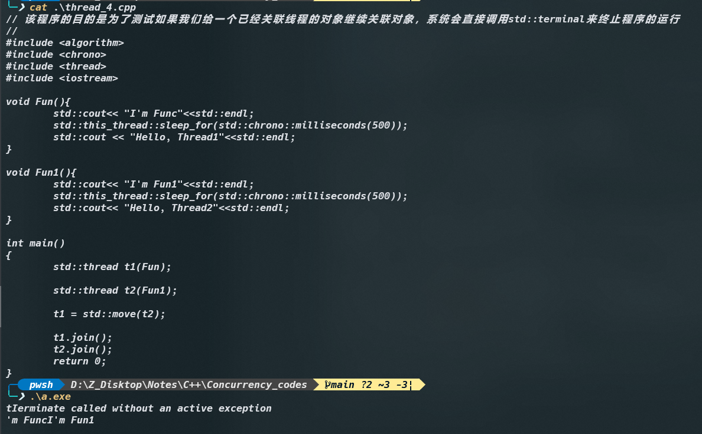

# 第二章 线程管理

## 2.1 线程基本操作

我们除了向线程构造函数传递函数名之外：

```c++
void do_some_work();
std::thread my_thread(do_some_work);
```

还可以通过含有函数操作符类型的实例进行构造：

```c++
class background_task
{
public:
	void operator()() const
  {
    do_something();
    do_some_thing_else();
  }
};

background_task f;

std::thread my_thread(f);
```

注意：我们所提供的函数对象会复制到新线程的存储空间中，函数对象的执行和调用全部都会在线程的内存空间中进行。

> 对于这里有一件事情需要我们注意，当我们将函数对象传入到线程构造函数的时候，需要避免“最令人头痛的语法解析”。如果你传递的是一个临时的变量，而不是一个命名之后的变量，C++编译器会将其解析为函数的声明，而不是对类型对象的定义。
>
> 比如说下面这段代码：
>
> ```c++
> #include<thread>
> #include<iostream>
> using namespace std;
> class FUNC{
> private:
> 	int test;  
> public:
>   void operator()() const
>   {
>    		cout << this_thread::get_id() <<endl;
>   }
> };
> 
> int main()
> {
>   	thread my_thread(FUNC());  
> }
> ```
>
> 在编译器看来是长下面这样的：
>
> ```c++
> #include<thread>
> #include<iostream>
> 
> using namespace std;
> class FUNC
> {
>   
>   private: 
>   int test;
>   
>   public: 
>   inline void operator()() const
>   {
>     std::operator<<(std::cout, std::this_thread::get_id()).operator<<(std::endl);
>   } 
>   // inline FUNC() noexcept = default;
> };
> 
> int main()
> {
>   std::thread my_thread(FUNC (*)());
>   return 0;
> }
> ```
>
> 我们可以看到我们传进去的临时变量被编译器识别为一个函数指针（该函数指针指向没有参数并返回FUNC对象的函数）
>
> 我们可以看到编译器将其看作了一个函数，函数的参数是一个函数指针，函数名字为`FUNC`，并且该函数返回一个`std::thread`对象的函数。
>
> ***如何避免这个问题：***
>
> 我们可以像下面这样书写：
>
> ```c++
> std::thread my_thread((FUNC()));  // 1，使用多组括号
> std::thread my_thread{FUNC()};    // 2, 使用统一的初始化语法
> ```
>
> 还有就是，我们使用`Lambda`表达式也可以避免这个问题。

## 2.2  等待线程完成

有的时候，我们需要等待线程来保证线程访问数据的有效性。因为有的时候，在主线程已经退出的情况下，线程函数仍然持有局部变量的引用或者指针。

我们等待线程，通常是使用`join()`函数。

***当我们需要对等待中的线程进行更加灵活的控制的话，***比如说看一下某一个线程是否结束，或者只等待一段时间（超过时间就会判定为超时）。想要做到这些，我们需要使用其他的机制来完成，比如说条件变量`future`。调用`join()`，还可以清理线程相关的内存，这样的话`std::thread`对象将不再与已经完成的线程有任何的关联。这意味着，***我们只可以对一个线程使用一次`join()`，一旦使用过`join()`.`std::thread`对象就不可以再次汇入了***。当对其使用`joinable()`时，将返回`false`.

## 2.3 特殊情况下的等待

所谓特殊情况也就是当主线程运行的时候产生异常的话，而我们处理异常的时候就需要考虑调用`join()`函数，以防止线程被异常处理程序所终止，常见的操作像下面所写：

```c++
struct func{
  int &i;
  func(int &i_) : i(i_) {}
  void operator ()()
  {
    for(unsigned j = 0; j < 1000000 ; ++j)
      do_something(i); // 存在访问隐患，空引用
  }
}

void f()
{
  int some_local_state=0;
  fun my_func(some_local_state);
  std::thread t(my_func);
  
  try
  {
    do_something_in_current_thread();
  }
  catch(···)
  {
    t.join(); // 1
    throw;
  }
  t.join(); //2
}
```

我们可以看到上面的程序中如果主线程抛出了异常，就会先调用`join()`，来避免线程被异常所终止。

这种方式看起来感觉会产生代码的冗余，或者看着特别的不爽，下面还有另外一种方法：***资源获取即初始化方式（RAII，Resource Acquisition is Initialization）***,我们可以将线程封装成一个类，然后在析构函数中使用`join()`。

```c++
class thread_guard
{
  std::thread &t;
public:
  explicit thread_guard(std::thread & t_) : t(t_) {}
  // 这里加上关键字explicit是因为要告诉编译器拒绝隐式转换
  ~thread_guard(){
    if(t.joinable())  // 新的处理方案
    {
      t.join();
    }
  }
  thread_guard(thread_guard const&) = delete;
  thread_guard& operator=(thread_guard const &) = delete;
  // 直接对对象进行拷贝和赋值是很危险的
}；
  
struct func;

void f()
{
  int some_local_state = 0;
  func my_func(some_local_state);
  std::thread t(my_func);
  thread_guard g(t);
  // 这样的话，即使do_something_in_current_thread中抛出异常，这个线程的析构函数依旧会被调用
 	// 我们就不需要再手动的在各种情况下去调用`join`函数
  do_something_in_current_thread();
  
}
```

## 2.4 传递参数问题

```c++
#include<thread>
#include<iostream>
#include<string>
void  f(int i, std::string const & s)
{
  std::cout<< i << s;
}


int main()
{
  std::thread t(f,3,"hello");
  t.join();
}
```

像这样，我们传递参数时十分简单的，只需要将这些参数作为`std::thread`构造函数的附加参数即可。***需要注意的是，这些参数会拷贝至新线程的内存空间中，即使函数中的参数是引用的形式，拷贝操作也是会执行的.***

我们可以参看一下代码：

```c++
#include <chrono>
#include <iostream>
#include <ratio>
#include <thread>

using namespace std;

class Test
{
public:
        Test(int val) : _val(val) { cout <<this_thread::get_id()<< "Test::Test()" << endl; }

        Test(const Test& other) : _val(other._val) { cout <<this_thread::get_id()<< "Test::Test(const Test&)" << endl; }
        ~Test() { cout <<this_thread::get_id()<< "Test::~Test()" << endl; }
        Test& operator=(const Test& other) { this->_val = other._val; cout <<this_thread::get_id()<< "Test::operator=(const Test& other)" << endl; return *this; }
private:
        int _val;
};

void fun(int c, Test t)
{
        cout <<endl<< this_thread::get_id()<<"I'm working."<<endl;
}
int main()
{
        Test test(3);
        cout<< this_thread::get_id();
        thread t(fun, 2, test);

        t.join();
}
```

上面代码的执行结果为：

```c++
1Test::Test()
11Test::Test(const Test&)
1Test::Test(const Test&)
1Test::~Test()
// 以上输出结果是因为在编译器看来，我们写的Test test(6)实际上是这样的：
// Test test = Test(3);
// 即先构造出一个临时的对象，然后利用初始拷贝构造
2Test::Test(const Test&)
2I'm working.
2Test::~Test()
2Test::~Test()
// 从以上部分我们可以看到我们往线程里面传参之后，线程的构造函数会自动进行copy构造
1Test::~Test()
```

无论我们传进去什么值，无论是引用还是什么，`std::thread`的构造函数是并不知情的，构造函数无视函数参数类型，盲目的拷贝已经提供的变量。***而且内部代码会将拷贝的参数以右值的方式进行传递***，这就会导致一个问题，如果说我们第20行的代码修改为下面的样子：

```c++
void fun(int c, Test &t)
```

即加上一个引用，那么在线程中就以一个右值来调用该函数，但是该函数的参数是引用（不是右值），***所以说这里会出现编译错误。***

解决方法其实也很简单，对于熟悉`std::bind`的开发者来讲，很简单：我们可以使用`std::ref`将参数转化为引用的形式：

```C++
std::thread t(fun, 2, std::ref(t));
// 这样的话，对应的函数就会收到t的引用，并非数据的简单拷贝
```

`std::thread`构造函数和`std::bind`的操作在标准库中是以相同的机制进行定义的，比如说我们也可以传递一个成员函数指针作为线程函数，并提供一个合适的对象指针作为第一个参数：***bind函数就是这样来绑定参数的。***

```c++
class X
{
public:
  void do_length_work();
};

X my_x;

std::thread t(&X::do_length_work, &my_x);
// 这里传递的第一个参数就是所谓的this指针，我们知道实际上对象调用成员函数就是通过传递指针来实现的
```

## 2.5 转移所有权

***`std::uniqoe_ptr`和`std::thread`都是可移动，但是其不是可以赋值的。***

```c++
void some_function();
void some_other_function();

std::thread t1(some_function);
std::thread t2 = std::move(t1);
t1 = std::thread(some_other_function);
std::thread t3;
t3 = std::move(t2);
t1 = std::move(t3);  // 此处会报错，因为t1已经有一个关联的线程了，这里系统会直接调用std::terminal终止程序运行
```



# 第三章 共享数据

## 3.2 使用互斥量

> 2022年12月28日19点25分感悟：
>
> 锁是针对线程来讲的，比如说一个线程到达一个位置之后，在这个位置上它获得了一把锁。这个时候如果说有另外的线程到达了同样的地方，那么它会看到这里有一把锁已经被别的线程获得了，那么后来的线程就不可以继续执行程序，程序在这里就会陷入阻塞，这里也就是实现了所谓的对数据的保护，***注意啊，这里对数据的保护可不是说，线程不允许访问保护的数据了，不是的，线程仍旧可以去访问，只不过线程被另外的方法拖住了，恰巧实现了对响应数据的保护。***
>
> ***哪有什么岁月静好，只不过有人替你负重前行！！***
>
> PS: 这里的说法好像也不对，先不管先学习吧！


保护共享数据最基本的方式，是使用C++标准库提供的互斥量。

***关键就是访问共享数据之前，将数据锁住，在访问结束之后，再将数据解锁。线程库需要保证，当线程使用互斥量锁住共享数据的时候，其他的线程都必须等到之前的那个线程对数据进行解锁之后，才能进行访问数据。***

我们可以通过实例化`std::mutex`创建互斥量实例，其成员函数`lock()`可以对互斥量上锁，`unlock()`为解锁。不过我们一般不推荐直接去调用成员函数，调用成员函数意味着，我们必须在每一个函数的出口都去调用`unlock()`（包含异常的情况）。这就有可能导致我们程序员忘记去调用，程序员的记忆一般都是”很短暂的“。

所以说C++标准库为互斥量提供了RAII模板类`std::lock_guard`，在构造函数的时候，就可以提供已锁的互斥量，并且在析构的时候进行解锁的操作，即将`lock()`和`unlock()`封装到了这个类当中。

下面看一下实例：

```c++
// 在本程序中，我们创建20个进程，每一个进程都对sum累加100万次，最后将结果输出

#include <iostream>
#include <thread>
#include <mutex>
#include <vector>
using namespace std;
int sum = 0;
void func()
{
        for (int i = 1 ; i <= 1000000; i++) {

                sum++;
        }
}
int main()
{
        vector<thread> threads;
        for(unsigned i = 0; i < 20; i++){
                threads.emplace_back(func);
        }
        for (auto & entry : threads) {
                entry.join();
        }
        cout << sum <<endl;
        return 0;
}
```

我们运行之后，结果如下图所示：


***我们可以看到明显出现了竞争的现象，而且每一次竞争的结果还不一样。***

下面我们使用互斥量重复上面过程：

```c++
#include <iostream>
#include <thread>
#include <mutex>
#include <vector>
using namespace std;

int sum = 0;

mutex some_mutex;
void func()
{
        for (int i = 1 ; i <= 1000000; i++) {
                some_mutex.lock();
                sum++;
                some_mutex.unlock();
        }
}
int main()
{
        vector<thread> threads;
        for(unsigned i = 0; i < 20; i++){
                threads.emplace_back(func);
        }
        for (auto & entry : threads) {
                entry.join();
        }
        cout << sum <<endl;
        return 0;
}
```

执行结果如下图所示：


接下来我们使用标准库中封装好的模板类`std::lock_guard`.

```C++
// 在本程序中，我们来实际使用互斥量
// 使用RAII模板类std::lock_guard来进行测试

#include <iostream>
#include <thread>
#include <mutex>
#include <vector>
using namespace std;
int sum = 0;
mutex some_mutex;
void func()
{
        for (int i = 1 ; i <= 1000000; i++) {
                lock_guard<mutex> guard(some_mutex);
                sum++;
        }
}
int main()
{
        vector<thread> threads;
        for(unsigned i = 0; i < 20; i++){
                threads.emplace_back(func);
        }
        for (auto & entry : threads) {
                entry.join();
        }
        cout << sum <<endl;
        return 0;
}
```

执行结果如下：


很明显，后者使用起来更加的方便，因为我们不需要考虑各种情况如何调用`unlock()`的情况，我们比较省心。

> C++17中，添加了一种新特性，称为模板参数推导，就是我们在实例化模板的时候，不需要指定变量类型，我们只需要传进去值即可，其会自动推导出变量的类型，所以说上述的锁的代码可以简化为：
>
> `lock_guard guard(some_mutex);`
>
> 具体的模板参数推导我们可以直接交给C++17的编译器完成。

***注意：***在上述的代码中，我们是直接使用全局变量，这没有问题，但是大部分情况下，我们一般是将互斥量和需要保护的数据封装在同一个类当中，而不是定义为全局变量，遵循面向对象设计的准则。

## 3.3 死锁

一个线程A对资源a进行上锁，然后等待获得资源b, 但是很不巧与此同时另外的一个线程B先对资源b进行上锁，并且等待获得资源a，这就会使得场面陷入僵局，这就是所谓的死锁。

当我们进行对同一个类的两个不同实例A和B进行数据的交换的时候，我们为了保证数据交换操作的正确性，我们就需要避免并发的修改数据，并确保每一个实例上的互斥量都可以锁住自己要保护的区域：

## 3.4 不变量

> 对于不变量，我个人理解就是在所有的线程看来，我所访问的变量应该存在，他不应该没有，这就是大家默认的不变量。
>
> 结合实例来理解一下就是，现在有一个双向链表和两个线程：
>
> ```c++
> // 下面是具体结点的结构
> class Node{
> private:
>   Node* prev_ = nullptr;
>   Node* next_ = nullptr;
>   DataType data;
> }
> ```
>
> 线程A现在对该链表进行删除操作，删除分三步，首先将要删除的结点的***前面的结点***指向***后面的结点***，还有就是将要删除的结点***后面的结点***指向***前面的结点***，最后释放数据。很不巧啊，线程A刚刚将第一步骤做完，线程B就来从前往后然后从后往前遍历该链表，由于在线程B的眼中或者更多的线程的眼中，***在双向链表当中，如果结点A下一个结点是B，那么B的上一个结点一定是A***。但是这里出错了，因为我们将结点A指向了结点C即我们删除的结点的后面一个结点，***这里就相当于破坏了不变量。***

## 3.5 一个程序的感悟

***先上程序：本段程序是来自https://en.cppreference.com/w/cpp/thread/lock的一段测试程序：***

```c++
#include <mutex>
#include <thread>
#include <iostream>
#include <vector>
#include <functional>
#include <chrono>
#include <string>
 
struct Employee {
    Employee(std::string id) : id(id) {}
    std::string id;
    std::vector<std::string> lunch_partners;
    std::mutex m;
    std::string output() const
    {
        std::string ret = "Employee " + id + " has lunch partners: ";
        for( const auto& partner : lunch_partners )
            ret += partner + " ";
        return ret;
    }
};
 
void send_mail(Employee &, Employee &)
{
    // simulate a time-consuming messaging operation
    std::this_thread::sleep_for(std::chrono::seconds(1));
}
 
void assign_lunch_partner(Employee &e1, Employee &e2)
{
  // 1
    static std::mutex io_mutex;
    {
        std::lock_guard<std::mutex> lk(io_mutex);
        std::cout << e1.id << " and " << e2.id << " are waiting for locks" << std::endl;
    }
 
  
  // 2
    // use std::lock to acquire two locks without worrying about 
    // other calls to assign_lunch_partner deadlocking us
    {
        std::lock(e1.m, e2.m);
        std::lock_guard<std::mutex> lk1(e1.m, std::adopt_lock);
        std::lock_guard<std::mutex> lk2(e2.m, std::adopt_lock);
// Equivalent code (if unique_locks are needed, e.g. for condition variables)
//        std::unique_lock<std::mutex> lk1(e1.m, std::defer_lock);
//        std::unique_lock<std::mutex> lk2(e2.m, std::defer_lock);
//        std::lock(lk1, lk2);
// Superior solution available in C++17
//        std::scoped_lock lk(e1.m, e2.m);
        {
            std::lock_guard<std::mutex> lk(io_mutex);
            std::cout << e1.id << " and " << e2.id << " got locks" << std::endl;
        }
        e1.lunch_partners.push_back(e2.id);
        e2.lunch_partners.push_back(e1.id);
    }
    send_mail(e1, e2);
    send_mail(e2, e1);
}
 
int main()
{
    Employee alice("alice"), bob("bob"), christina("christina"), dave("dave");
 
    // assign in parallel threads because mailing users about lunch assignments
    // takes a long time
    std::vector<std::thread> threads;
    threads.emplace_back(assign_lunch_partner, std::ref(alice), std::ref(bob));
    threads.emplace_back(assign_lunch_partner, std::ref(christina), std::ref(bob));
    threads.emplace_back(assign_lunch_partner, std::ref(christina), std::ref(alice));
    threads.emplace_back(assign_lunch_partner, std::ref(dave), std::ref(bob));
 
    for (auto &thread : threads) thread.join();
    std::cout << alice.output() << '\n'  << bob.output() << '\n'
              << christina.output() << '\n' << dave.output() << '\n';
}
```

该段程序中我们可以看到我们是将数据和锁封装到一个类当中，然后实例化出4个对象出来，当然了每一个对象中都有一个单独的锁对应着，程序的执行结果为：


> 在这里，对锁的认识重新做一次总结，锁就是对线程来讲的，如果说一个线程调用锁的动作，将该锁锁定的话，那么另外的线程如果同样去调用这个锁的`lock`函数的话就会被组织执行，一直到获得锁。

此处声明了一个锁，该锁的目的是为了对输出做一个规范，防止多个线程争抢着要输出，就是怕出现下面的现象：

```c++
    static std::mutex io_mutex; // 设置为静态的锁，是为了确保所有的线程都可以访问到该锁，因为该变量是该函数的一部分
    {
        std::lock_guard<std::mutex> lk(io_mutex);
        std::cout << e1.id << " and " << e2.id << " are waiting for locks" << std::endl;
    }
```


还有就是此处使用的是代码块，所以说代码块中的局部变量在代码块结束之后就会被释放掉，即一个线程获得锁`io_mutex`之后，执行完输出字符的动作，就会释放掉该锁，接着下一个线程就会再次获得该锁，继续进行输出。

第二处的代码：

```c++
{
        std::lock(e1.m, e2.m);
        std::lock_guard<std::mutex> lk1(e1.m, std::adopt_lock);
        std::lock_guard<std::mutex> lk2(e2.m, std::adopt_lock);
// Equivalent code (if unique_locks are needed, e.g. for condition variables)
//        std::unique_lock<std::mutex> lk1(e1.m, std::defer_lock);
//        std::unique_lock<std::mutex> lk2(e2.m, std::defer_lock);
//        std::lock(lk1, lk2);
// Superior solution available in C++17
//        std::scoped_lock lk(e1.m, e2.m);
        {
            std::lock_guard<std::mutex> lk(io_mutex);
            std::cout << e1.id << " and " << e2.id << " got locks" << std::endl;
        }
        e1.lunch_partners.push_back(e2.id);
        e2.lunch_partners.push_back(e1.id);
    }
    send_mail(e1, e2);
    send_mail(e2, e1);
}
```

其中再次使用锁`io_mutex`，这里是所有的输出都全部使用一个锁来进行管理，这样的话，下面的图是结构也理所应当，就是最开始的线程肯定是第一个获得该锁，然后迅速运行到这里又获得该锁，才回导致另一个线程迟迟不输出：


你也肯定可以注意到该代码块中是嵌套着一个代码块，做到了用完即让给别人的效果，绝不占着茅坑不拉屎。

接下来就是我对于这段程序最大的疑惑了，他这里为什么要同时要让该线程获得两个锁呢？

我一开始对于锁的认识还是不够，以为我一个锁不久可以解决问题了吗？每一个线程运行到这里不都是要去调用`std::lock(e1.m, e2.m)`吗？如果我这里换成一个那不也要调用吗？那不一样会阻塞吗？

***错错错错错！！！***

我犯了一个很致命的问题，这里的e1是引用别的对象的，从下面的代码我们也可以看到, 不同的线程传参的时候是传进去不一样的参数的，比如说第一个线程使用的是`alice`和`bob`的锁，第二个线程使用的是`christina` 和`bob`的锁，如果说你说仅仅使用一个锁就可以解决问题，好我们都是用第一个参数e1来解决问题，当第一个线程访问`alice`的锁的时候，发现该锁并没有被别的线程所获得，所以线程1美滋滋的去执行任务去了，这里是有对bob的数据进行修改的哦.

接着与此同时第二个线程访问`christina`的时候发现锁也没有被别人所获取，线程2也美滋滋的去执行任务去了，这里就出现问题了，由于线程2也要对bob的数据进行修改，那么也就是说可能会有两个线程对同一块数据进行修改，我们这还是没有考虑最后那个线程的问题呢，加上最后一个线程，那就是同时有三个线程对bob的数据进行修改，这必然会出现恶意竞争的问题。

所以说这也就是为什么我们要同时对两块共享内存使用所来进行一个保护。

```c++
    std::vector<std::thread> threads;
    threads.emplace_back(assign_lunch_partner, std::ref(alice), std::ref(bob));
    threads.emplace_back(assign_lunch_partner, std::ref(christina), std::ref(bob));
    threads.emplace_back(assign_lunch_partner, std::ref(christina), std::ref(alice));
    threads.emplace_back(assign_lunch_partner, std::ref(dave), std::ref(bob));
```

看到这里，我们可以来继续死锁的话题聊一聊，我们为了防止出现像上面的恶意竞争问题，我们使用多个锁，死锁是怎么产生的呢？就是因为对多个锁进行安排的时候没安排妥当，导致线程处于等待状态，所以说我们引进了***按照相同的顺序进行上锁***，或者***使用层次锁***, 还有就是按照上面***所讲述的使用`std::lock()`来将多个锁同时进行上锁操作***。

# 第四章 同步操作