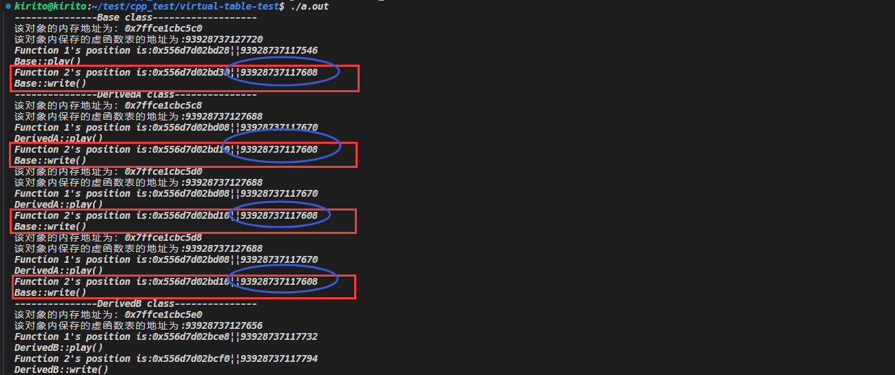
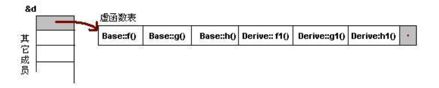
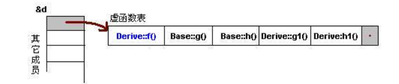
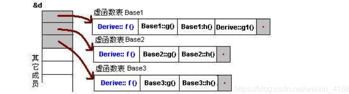

# Never Stop Learning

# 一.IO

## 1. `class stringstream`

Include library:

```C++
#include<sstream>
```

class `stringstream`是C++标准类当中的一个类，它允许我们在内存当中创建一个类似于`std::cin`和`std::cout`的流对象，这个对于我们处理字符串的时候非常有用，通常用来从字符串当中提取出相应的数据。

在实际的使用当中，还有另外的两个字符串流类：

1. `std::istringstream`:用于从字符串当中提取数据，常用于解析字符串；
2. `std::ostringstream`:用于将数据输出到字符串当中，常用于将数据格式化为字符串；

但是一般都是使用`stringstream`来进行处理的，我们只需要在每次处理之前调用相应的`clear`函数来清空相应的缓冲区，防止残留数据对我们的程序造成影响。

***Member functions(该类自己的成员函数):***

1. `str`, gets or sets the contents of underlying string device object;

***Inherited from std::basic_istream(继承自别的类的函数):***

1. `get`, extracts characters;
2. `std::stringstream& sgetline(std::stringstream& is, std::string & str, char delim = '\n')`, extracts character until the given character is found;

*示例程序：*

```C++
#include <iostream>
#include <sstream>
#include <string>
int main() {
    // test `str()`:
    std::stringstream ss;
    ss.str("hello, world\ntest\n");
    std::cout << ss.str();
    // test `get()` and `std::getline(ss, line, '\\n')`
    std::string line;
    std::cout << (char)ss.get() << std::endl;
    std::cout << "Test `std::getline(ss, line, '\\n')`" << std::endl;
    while (std::getline(ss, line)) {
        std::cout << "Line: " << line << std::endl;
    }
    return 0;
}
```

3. `clear()`, 重置其输入流的错误状态码。

> Sets the stream error state flags by assigning them the value of state. By default, assigns std::ios_base::goodbit which has the effect of clearing all error state flags.
> If rdbuf() is a null pointer (i.e. there is no associated stream buffer), then state | std::ios_base::badbit is assigned.

### 1.1 example 

題目：输入的第一行有一个数字 N 代表接下來有 N 行資料，每一行資料里有不固定個數的整數(最多 20 個，每行最大 200 個字元)，請你寫一個程式將每行的总和印出來。

輸入：

```input
3
1 2 3
20 17 23 54 77 60
111 222 333 444 555 666 777 888 999
```

输出：

```input
6
251
4995
```

```C++
#include <iostream>
#include <sstream>
#include <string>

int main(int, char**) {
    std::string s;
    std::stringstream ss;
    int n, sum, temp;
    std::cin >> n;
    std::cin.get();
    while (n--) {
        // get the input data
        std::getline(std::cin, s);
        // put the input data into stringstream
        ss.clear();
        ss.str(s);
        sum = 0;
        while (ss >> temp) {
            sum += temp;
        }
        std::cout << sum << std::endl;
    }
    return 0;
}
```


## 2. `basic_ios::clear`

```C++
#include <iostream>
#include <string>
int main()
{
    for (char c : {'\n', '4', '1', '.', '3', '\n', 'Z', 'Y', 'X'})
        std::cin.putback(c); // emulate user's input (not portable: see ungetc Notes)
    double n;
    while (std::cout << "Please, enter a number: " && !(std::cin >> n))
    {
        std::cin.clear();
        std::string line;
        std::getline(std::cin, line);
        std::cout << line << "\nI am sorry, but '" << line << "' is not a number\n";
    }
    std::cout << n << "\nThank you for entering the number " << n << '\n';
}
```

这里我们首先模拟用户的输入:`std::cin.putback(c)`, 用户输入:`XYZ\n3.14\n`。

这里的`putback(c)`函数：Puts the character c back to the input stream so the next extracted character will be c.也就是说当我调用该函数添加字符的时候，是放在缓冲区的最前面。

接着，由于`std::cin >> n `这里输入的时候一定会出错的，所以说我们为了不影响接下来的操作会`clear()`，这样之前的错误就不会影响我们的输入。

## 3. `std::getline(std::cin, str)`

*函数声明：*

```C++
template< class CharT, class Traits, class Allocator >
std::basic_istream<CharT, Traits>&
getline( std::basic_istream<CharT, Traits>& input,
         std::basic_string<CharT, Traits, Allocator>& str, 
         CharT delim );
```

返回值类型为`std::basic_istream<CharT, Traits>&`, 该类的内部重载了`operator bool()`，即类型转换符号，所以说当我们这样写：

```C++
while(std::getline(std::cin, str)) {}
```

如果`std::getline`读取数据的时候发生错误的话或者数据读取完毕的时候，返回的输入流对象会设置错误标志位，会导致该流的状态异常。而`operator bool()`重载的函数内部就是根据流的状态返回的，所以如果`std::getline`函数遇到错误的话或者数据读取完毕的时候，其当做条件的时候会隐式转换为布尔值为false,从而while循环结束。

# 二. ThreadPool

## 1. 基础概念

当进行并行的任务作业操作的时候，线程的建立与销毁的开销是阻碍性能进步的关键，因此线程池由此产生。使用多个线程，无限制循环等待队列，进行计算和操作。帮助快速降低和减少性能损耗。

## 2. 线程池的组成

1. 线程池管理器：初始化与创建线程，启动和停止线程，调配任务；
2. 工作线程：线程池当中等待分配任务的线程，一般实现是实现一个函数对象类，里面重载函数运算符即可；
3. 添加任务接口：往线程池当中添加相应的任务。其中关键点在于我们如何进行实现添加一个任意返回类型以及任意参数值的函数到线程池当中(C++具体实现是可以利用完美转发以及bind等特性来实现该目的)；
4. 任务队列：用于存放没有被处理的任务，提供一种缓冲机制，同时具有调度机制，这里其实也可以设置各种调度策略来调度各种不同优先级的任务；

## 3. 线程池工作的四种情况

1. 没有任务要执行，缓冲队列为空；
2. 队列当中任务数量，小于等于线程池当中线程任务数量；
3. 任务数量大于线程池数量，缓冲队列未满；
4. 任务数量大于线程池数量，缓冲队列已满；

## 4. 具体实现

我们要想实现一个线程池，需要一个容器来存储一开始初始化为等待状态的线程；需要一个队列来作为缓冲队列来存储相应的任务；一个信号量来调度所有的线程，当当前没有任务的时候线程就会陷入阻塞；另外还需要一个互斥锁来实现线程之间操作线程池的一个互斥情况。

具体实现的时候，其中最难的在于提交任务部分：

```C++
template<typename F, typename ...Args>
auto submit(F&& f, Args... args) -> std::future<decltype(f(args...))> {
    // 创建我们提交的函数以及绑定对应的参数
    std::function<decltype(f(args...))()> func = std::bind(std::forward<F>(f), std::forward<Args>(args)...);
    // 使用共享指针来保存我们任务，来使得其可以得到正确的释放
    auto task_ptr = std::make_shared<std::packaged_task<decltype(f(args...))()>>(func);
    // 将任务进行下一步的封装，将其封装为更一般的函数void function(void){}
    std::function<void()> wrapper_func = [task_ptr]() {
        (*task_ptr)();
    };
    // 将一般化之后的任务来插入到我们的任务队列当中
    _tasks_queue.enqueue(wrapper_func);
    // 通知一个正处于阻塞状态的线程
    _conditional_lock.notify_one();
    // 立即返回，来保证主线程不陷入阻塞
    return task_ptr->get_future(); 
}
```

这里利用了大量的C++11当中的新特性，完美转发，future等等特性。

我们接收来自线程池之外的一个函数以及对应的参数列表：

```C++
template<typename F, typename ...Args>
auto submit(F&& f, Args... args) -> std::future<decltype(f(args...))>;
```

注意这里接收的是可变参数列表，因为线程池和要执行的任务一定是不相关的，所以说这里采用可变参数列表来接收参数，之后返回的时候利用的是future来访问函数异步执行的结果，其中`decltype(f(args...))`是获取对应的函数的返回类型。

之后我们对该函数进行封住，存储在function对象当中：

```C++
std::function<decltype(f(args...))()> func = std::bind(std::forward<F>(f), std::forward<Args>(args)...);
```

这里利用的是C++的完美转发机制，将原来函数的所有的参数不变的转发给新的函数对象`func`。

我们再将其封装在`packaged_task`类当中，该类是专门将可调用对象（函数、函数对象或者lambda表达式）封装为一个异步任务，并可以获取任务的执行结果。通常和`std::future`结合使用，用在一个线程当中执行任务，并在另外的一个线程当中获取任务的执行结果。

```C++
auto task_ptr = std::make_shared<std::packaged_task<decltype(f(args...))()>>(func);
```

最后对于函数的封装，由于我们线程池当中对于具体要执行的函数的类型是不知道的，所以说我们仍然需要对上面的封装好的函数进行下一步的封装,也就是将其封装为一个普通的返回类型为void且参数列表为空的最普通的函数：

```C++
std::function<void()> wrapper_func = [task_ptr]() {
    (*task_ptr)();
};
```

之后将该封装好的函数插入到线程安全的队列当中即可。

# 三.类的基本知识

## 1. 拷贝构造函数和赋值运算符的关系

> https://www.cnblogs.com/wangguchangqing/p/6141743.html

在默认的情况下(用户没有定义，也没有显示的删除)，编译器已自动的隐式生成一个拷贝构造函数和赋值运算符。但是用户可以使用`delete`来指定不生成拷贝构造函数和赋值运算符，这样的对象就不能通过值传递，也不能进行赋值运算。

拷贝构造函数和赋值运算符的作用其实是很相似的，但其中最关键的也是最容易区分二者区别的是前者是构造函数，是在创建一个实例的时候调用的，后者是一个重载的运算符号，在调用该运算符号的时候被调用。所以说我们判断调用的是前者还是后者，主要是看是否有新的对象实例产生，如果产生了新的对象实例，那调用的就是拷贝构造函数；如果没有的话，那就是对已有的对象进行赋值，调用的是赋值运算符。

调用拷贝构造函数的场景主要有：

- 对象作为函数的参数的时候，以值传递的方式传给函数；
- 对象作为函数的返回值，以值的方式从函数返回；
- 使用一个对象对另外一个对象进行初始化；

*示例代码：*

```C++
#include <iostream>
#include <string>
class Person {
    int _age;
    std::string _name;
public:
    Person(){} 
    Person(const Person&p) {
        _age = p._age;
        _name = p._name;
        std::cout << "copy constructor is called" << std::endl;
    };
    Person& operator=(const Person& p) {
        this->_age = p._age;
        this->_name = p._name;
        std::cout << "assign func is called" << std::endl;
        return *this;
    }
};
int main(int, char**) {
    Person p; 
    Person test = p;
    p = test;
    return 0;
}
```

*执行结果：*

```shell
kirito@kirito:~/test/cpp_test/copy-constructor-test$ g++ copy_constructor_assign_test.cc -o assign
kirito@kirito:~/test/cpp_test/copy-constructor-test$ ./assign 
copy constructor is called
assign func is called
```

我们可以看到其先调用的是拷贝构造函数，后来才调用的赋值运算符。

## 2. 深拷贝和浅拷贝

拷贝构造函数和赋值运算符在默认的情况下编译器都会为我们自动生成，那为什么我们还需要手动去书写相应的拷贝构造函数和赋值运算符呢？

原因很简单，就是因为深拷贝和浅拷贝的存在。一般情况下，编译器生成的拷贝构造函数和赋值运算符都是浅拷贝，就是说类当中的所有的成员变量都是按值直接进行复制操作的，如果是指针的话，复制之后，两个指针也是会指向同一块内存区域。

深拷贝和浅拷贝主要是针对类中的**指针**和**动态分配的空间**来说的，因为对于指针只是简单的值复制并不能分割开两个对象的关联，任何一个对象对该指针的操作都会影响到另一个对象。这时候就需要提供自定义的**深拷贝**的拷贝构造函数，消除这种影响。通常的原则是：

- 含有指针类型的成员或者有动态分配内存的成员都应该提供自定义的拷贝构造函数；
- 在提供拷贝构造函数的同时，还应该考虑实现自定义的赋值运算符；

对于拷贝构造函数的实现要确保以下几点：

- 对于值类型的成员进行值复制；
- 对于指针和动态分配的空间，在拷贝中应重新分配分配空间；
- 对于基类，要调用基类合适的拷贝方法，完成基类的拷贝；

## 3. 虚函数机制的具体实现

> https://jacktang816.github.io/post/virtualfunction/
>
> https://blog.nowcoder.net/n/0d9f95c8905c4b0186fdbd1d0e78e5f8
>
> https://blog.csdn.net/TwoTon/article/details/124259178

虚函数机制的实现主要是利用的是虚函数表这个数据结构。

```C++
class A {
  public:
    virtual void v_a(){}
    virtual ~A(){}
    int64_t _m_a;
};

int main(){
    A* a = new A();
    return 0;
}
```

以上代码当中的对象A对应的实例在内存当中的分布大概就是下图所展示的内容。


每一个含有虚函数的类对应的实例对应的内存空间当中，都会有一块内存用来存储虚函数表的位置(一般都位于内存空间一开始的位置)，该部分对应的是虚函数表指针。该指针每一个新创建的实例都会有一个对应虚函数表指针，共同指向位于只读数据段当中的虚函数表，该部分是在编译的时候生成的部分。

*简单示例：*

```C++
#include <cstdint>
#include <iostream>
class Base {
public:
  virtual void play(void) { std::cout << "Base::play()" << std::endl; }
  virtual void write(void) { std::cout << "Base::write()" << std::endl; }
};

class DerivedA : public Base {
public:
  void play(void) override { std::cout << "DerivedA::play()" << std::endl; }
};

class DerivedB : public Base {
public:
  void play(void) override { std::cout << "DerivedB::play()" << std::endl; }
  void write(void) override { std::cout << "DerivedB::write()" << std::endl; }
};

typedef void (*Func)();

void showVirtualFunc(Base &base) {
  Func vpFunc[2];
  std::cout << "该对象的内存地址为：" << &base << std::endl;
  std::cout << "该对象内保存的虚函数表的地址为:" << *(int64_t *)(&base)
            << std::endl;
  vpFunc[0] = (Func) * ((int64_t *)*(int64_t *)(&base));
  std::cout << "Function 1's position is:" << (int64_t *)*(int64_t *)(&base)
            << "||" << (*(int64_t *)*(int64_t *)(&base)) << std::endl;
  vpFunc[0]();
  vpFunc[1] = (Func) * ((int64_t *)*(int64_t *)(&base) + 1);
  std::cout << "Function 2's position is:" << (int64_t *)*(int64_t *)(&base) + 1
            << "||" << *((int64_t *)*(int64_t *)(&base) + 1) << std::endl;
  vpFunc[1]();
}

int main(int, char **) {
  std::cout << "---------------Base class-------------------" << std::endl;
  Base base;
  showVirtualFunc(base);
  std::cout << "---------------DerivedA class---------------" << std::endl;
  DerivedA derived;
  DerivedA derived1;
  DerivedA derived2;
  showVirtualFunc(derived);
  showVirtualFunc(derived1);
  showVirtualFunc(derived2);
  std::cout << "---------------DerivedB class---------------" << std::endl;
  DerivedB derivedb;
  showVirtualFunc(derivedb);
}
```

*执行结果为：*

```shell
$ g++ virtualtable_test.cc 
$ ./a.out 
---------------Base class-------------------
该对象的内存地址为：0x7ffce1cbc5c0
该对象内保存的虚函数表的地址为:93928737127720
Function 1's position is:0x556d7d02bd28||93928737117546
Base::play()
Function 2's position is:0x556d7d02bd30||93928737117608
Base::write()
---------------DerivedA class---------------
该对象的内存地址为：0x7ffce1cbc5c8
该对象内保存的虚函数表的地址为:93928737127688
Function 1's position is:0x556d7d02bd08||93928737117670
DerivedA::play()
Function 2's position is:0x556d7d02bd10||93928737117608
Base::write()
该对象的内存地址为：0x7ffce1cbc5d0
该对象内保存的虚函数表的地址为:93928737127688
Function 1's position is:0x556d7d02bd08||93928737117670
DerivedA::play()
Function 2's position is:0x556d7d02bd10||93928737117608
Base::write()
该对象的内存地址为：0x7ffce1cbc5d8
该对象内保存的虚函数表的地址为:93928737127688
Function 1's position is:0x556d7d02bd08||93928737117670
DerivedA::play()
Function 2's position is:0x556d7d02bd10||93928737117608
Base::write()
---------------DerivedB class---------------
该对象的内存地址为：0x7ffce1cbc5e0
该对象内保存的虚函数表的地址为:93928737127656
Function 1's position is:0x556d7d02bce8||93928737117732
DerivedB::play()
Function 2's position is:0x556d7d02bcf0||93928737117794
DerivedB::write()
```

我们可以看到其中关于`class DerivedA`的多个实例其虚函数表的指针是完全一样的，说明某一个类的所有的实例是共享一个虚函数表的。我们仔细思考一下也是合理的，毕竟如果说每一个实例都有一个虚函数表保存在内存当中岂不是存在大量的重复，浪费空间。

其中还有一个细节就是`DerivedA`该类并没有重写基类当中的`write`函数，所以说其虚函数表当中对应的位置存储的是基类的虚函数的地址。



在这个运行结果当中，我使用蓝色的圈圈起来的内容是对应的函数的地址，我们可以看到由于类`DerivedA`没有实现基类的函数`write()`，所以说其生成的虚函数表当中对应的函数的地址仍然是基类当中的函数的地址。

另外，派生类生成对应的虚函数表的时候，其经过三个步骤：

1. *第一步，将父类虚表内容拷贝到子类虚表当中*；
2. *第二步，将子类重写的虚函数覆盖掉表中父类的虚函数*；
3. *第三步，如果子类有新增加的虚函数，按照声明次序加到最后*；

***关于继承中的多态：***

1. 单继承无虚函数覆盖；

如果说派生类当中对于基类的虚函数一个都没有进行重写覆盖，那么虚函数会按照声明顺序存放，父类虚函数存放在派生类虚函数前面。



2. 单继承有虚函数覆盖；

覆盖的虚函数替代原来基类虚函数的位置，没有覆盖的不进行改变。



3. 多继承无虚函数覆盖；

派生类派生自多个含有虚函数基类，那么其编译后就会产生若干个虚函数表，分别对应相应的基类，派生类的子虚成员函数放在第一个父类虚函数表当中。


4. 多继承有虚函数覆盖；

在上面的基础上，覆盖的虚函数替代原来基类虚函数的位置。



## 4. POD类型

POD类型是C++当中常见的类型，用来说明类/结构体的属性，具体来说它是指没有使用面向对象的思想来设计的类/结构体。POD，Plain Old Data，通俗的讲就是类或者结构体通过二进制拷贝之后还能保持其数据不变。其中Plain表示这个类型是一个平凡的类，Old表明其与C的兼容性。C++11将其划分为两个基本概念：*平凡的(trival)和标准布局(standard layout)。*

POD的好处：

- 字节赋值，***可以放心使用memset和memcpy对POD类型进行初始化和拷贝***；
- 提供对C内存兼容，POD类型数据在C和C++间的操作是安全的；

### *1. 平凡的定义：*

- 有平凡的构造函数(*编译器默认生成的*)；
- 有平凡的拷贝构造函数(*编译器默认生成的*)；
- 有平凡的移动构造函数；
- 有平凡的拷贝赋值构造函数;
- 有平凡的移动赋值运算符;
- 有平凡的析构函数(*编译器默认生成的析构函数*)；
- 不能包含虚函数；
- 不能包含虚基类；

```C++
#include <iostream>
#include <type_traits>
class A1 {};

class A2 {
public:
  A2() {}
};

class A3 {
public:
  A3(A3 &&) {}
};

class A4{
public:
    A4& operator=(const A4&){ return *this;}
};

class A5{
public:
    A5& operator=(A5&&){ return *this;}
};

class A6{
public:
    ~A6(){}
};
class A7:A1 {};
class A8:A2 {};
int main(int, char **) {
  std::cout << std::boolalpha << std::is_trivial<A2>::value << std::endl;
  std::cout << std::boolalpha << std::is_trivial<A3>::value << std::endl;
  std::cout << std::boolalpha << std::is_trivial<A4>::value << std::endl;
  std::cout << std::boolalpha << std::is_trivial<A5>::value << std::endl;
  std::cout << std::boolalpha << std::is_trivial<A6>::value << std::endl;
  std::cout << std::boolalpha << std::is_trivial<A7>::value << std::endl;
  std::cout << std::boolalpha << std::is_trivial<A8>::value << std::endl;
  std::cout << std::boolalpha << std::is_trivial<A1>::value << std::endl;
  return 0;
}
```

上述程序对应的输出为：

```shell
$ ./podtest 
false
false
false
false
false
true
false
true
```

### *2. 标准布局的定义：*

- 所有的非静态成员有相同的访问权限；

```C++
class A{
private:
  	int _val;
public:
  	int _data;
}; 
// 该类就是违反了所有的非静态成员具有相同的访问权限
//     ||
// 所以就会导致下面的函数返回false
std::cout<< std::boolalpha << std::is_standard_layout<A>::value << std::endl;
```

- 继承树当中最多只能有一个类有非静态数据成员；

```C++
class B{
  static int _val;
};
```

- 子类的第一个非静态成员不可以是基类类型；

```C++
class C1{}
class C:public C1{
  C1 c;
};
```

- 没有虚函数；

```C++
class D{
  	virtual void function() = 0;
};
```

- 没有虚基类；

```C++
class E:public D{
  void function() override {}
}
```

- 所有的非静态成员都符合标准布局类型；

```C++
class F{
  A x;
};
```

### 3. POD类型的使用

```C++
#include <cstddef>
#include <cstring>
#include <iostream>
#include <type_traits>

class A{
public:
    int x;
    double y;
};

int main(int, char**){
    if(std::is_pod<A>::value) {
        std::cout << "before" << std::endl;
        A a;
        a.x = 8;
        a.y = 10.5;
        std::cout << a.x << std::endl;
        std::cout << a.y << std::endl;

        size_t size = sizeof(a);
        char *p = new char(size);
        memcpy(p, &a, size);

        A *pa = (A*)p;
        std::cout << "after" << std::endl;
        std::cout << pa->x << std::endl;
        std::cout << pa->y << std::endl;

        delete p;
    }

    return 0;
}
```

STL里面我们可以利用模板编程的一些技巧来区分某一类型是否为POD类型，以此来决定我们应该使用什么方式来进行一些更高效率的初始化。

比如说我们可以在STL的`type_traits.h`文件当中发现：

```C++
/*
This header file provides a framework for allowing compile time dispatch
based on type attributes. This is useful when writing template code.
For example, when making a copy of an array of an unknown type, it helps
to know if the type has a trivial copy constructor or not, to help decide
if a memcpy can be used.

The class template __type_traits provides a series of typedefs each of
which is either __true_type or __false_type. The argument to
__type_traits can be any type. The typedefs within this template will
attain their correct values by one of these means:
    1. The general instantiation contain conservative values which work
       for all types.
    2. Specializations may be declared to make distinctions between types.
    3. Some compilers (such as the Silicon Graphics N32 and N64 compilers)
       will automatically provide the appropriate specializations for all
       types.

EXAMPLE:

//Copy an array of elements which have non-trivial copy constructors
template <class T> void copy(T* source,T* destination,int n,__false_type);
//Copy an array of elements which have trivial copy constructors. Use memcpy.
template <class T> void copy(T* source,T* destination,int n,__true_type);

//Copy an array of any type by using the most efficient copy mechanism
template <class T> inline void copy(T* source,T* destination,int n) {
   copy(source,destination,n,typename __type_traits<T>::has_trivial_copy_constructor());
}
*/
```

该段话的意思是当我们对一个未知类型的数组进行拷贝操作的时候，这些类可以帮助我们知道这些类是否有编译器默认生成的构造函数，从而帮助我们决定采用什么样的方式来进行内存的复制。

```C++
//Copy an array of elements which have non-trivial copy constructors
template <class T> void copy(T* source,T* destination,int n,__false_type);
//Copy an array of elements which have trivial copy constructors. Use memcpy.
template <class T> void copy(T* source,T* destination,int n,__true_type);

//Copy an array of any type by using the most efficient copy mechanism
template <class T> inline void copy(T* source,T* destination,int n) {
   copy(source,destination,n,typename __type_traits<T>::has_trivial_copy_constructor());
}
```

比如说我们可以像上面代码这样重载两个版本的`copy`函数，之后调用的时候利用`typename _type_traits<T>::has_trivial_copy_constructor()`来决定是哪一个重载函数版本。下面是一些关于`_type_traits`类的定义。

```C++
struct __true_type {
};

struct __false_type {
};
template <class type>
struct __type_traits { 
   typedef __true_type     this_dummy_member_must_be_first;
                   /* Do not remove this member. It informs a compiler which
                      automatically specializes __type_traits that this
                      __type_traits template is special. It just makes sure that
                      things work if an implementation is using a template
                      called __type_traits for something unrelated. */
   typedef __false_type    has_trivial_default_constructor;
   typedef __false_type    has_trivial_copy_constructor;
   typedef __false_type    has_trivial_assignment_operator;
   typedef __false_type    has_trivial_destructor;
   typedef __false_type    is_POD_type;
};

// Provide some specializations.  This is harmless for compilers that
//  have built-in __types_traits support, and essential for compilers
//  that don't.

__STL_TEMPLATE_NULL struct __type_traits<char> {
   typedef __true_type    has_trivial_default_constructor;
   typedef __true_type    has_trivial_copy_constructor;
   typedef __true_type    has_trivial_assignment_operator;
   typedef __true_type    has_trivial_destructor;
   typedef __true_type    is_POD_type;
};

__STL_TEMPLATE_NULL struct __type_traits<signed char> {
   typedef __true_type    has_trivial_default_constructor;
   typedef __true_type    has_trivial_copy_constructor;
   typedef __true_type    has_trivial_assignment_operator;
   typedef __true_type    has_trivial_destructor;
   typedef __true_type    is_POD_type;
};
```


# 四.同步和异步知识

## 1. C++自旋锁🔄的实现

自旋锁是一种busy-waiting的锁，即进程或者线程如果申请不到锁，就会一直不断地循环检查锁的状态是否可用(会消耗CPU时间)，一直到获取到这个锁为止。

*优点：*不会使得进程的状态发生切换，即进程一直会处于`active`状态，不会进入阻塞状态，获得锁之后，不用进行上下文切换，执行速度快。

*缺点：*没有获得锁前，会一直消耗CPU时间。


`std::atomic_flag`是一个原子的布尔类型，可以支持两种原子操作：

1. `test_and_set`: 如果`atomic_flag`对象被设置，则返回`true`;如果`atomic_flag`对象没有被设置，则设置之并且返回`false`。
2. `clear`: 清除`atomic_flag`对象；

*简单示例：*

```C++
class spin_clock{
private:
    std::atomic_flag _flag;

public:
    spin_clock() = default;
    spin_clock(const spin_clock&) = delete;
    spin_clock& operator=(const spin_clock&) = delete;
    void lock() {
        while (_flag.test_and_set()) {}
    }
    void unlock(){
        _flag.clear();
    }
};
```

## 2. 互斥锁

这里的互斥锁就是我们平时最经常使用的`std::mutex`，其底层实现是只有一个线程可以获得该锁，其余的线程在访问该锁的时候，如果没有获得的话其会陷入阻塞状态，并不像自旋锁那样占用CPU资源。

## 3. 读写锁

就是读者写者问题。

## 4. 乐观锁

前面所提到的互斥锁、自旋锁、读写锁都属于悲观锁，因为他们认为多线程同时修改共享资源的概率比较高很容易出现冲突，导致访问共享资源的时候，先要进行上锁。那相反的话，如果说多线程同时修改共享资源的概率比较低的话，那就是乐观锁。

*乐观锁的工作方式是，先修改完共享资源，再去验证这段时间内关于共享资源的修改有没有产生冲突，如果没有其他的线程在修改资源，那么操作完成；如果发现有其他的线程已经修改过这个资源的话，就会放弃本次操作。*

我们可以发现乐观锁全程没有进行加锁的操作，所以它也称为无锁编程。


# 五.智能指针知识

## 1. `shared_ptr`

*Q1: 什么时候`shared_ptr`指向的内存会被释放？*

- the last remaining `shared_ptr` owning the object is destroyed;
- the last remaining `shared_ptr` owning the object is assigned another pointer via [operator=](https://en.cppreference.com/w/cpp/memory/shared_ptr/operator%3D) or [reset()](https://en.cppreference.com/w/cpp/memory/shared_ptr/reset).

*Q2: 引用计数具体是如何进行实现的？怎么做到多个`shared_ptr`之间的计数共享以及同步更新呢？*

> 来自[cppreference.com](https://en.cppreference.com/w/cpp/memory/shared_ptr#Implementation_notes):
>
> In a typical implementation, `shared_ptr` holds only two pointers:
>
> - the stored pointer (one returned by [get()](https://en.cppreference.com/w/cpp/memory/shared_ptr/get));
> - a pointer to *control block*.
>
> The control block is a dynamically-allocated object that holds:
>
> - either a pointer to the managed object or the managed object itself;
> - the deleter (type-erased);
> - the allocator (type-erased);
> - the number of `shared_ptr`s that own the managed object;
> - the number of `weak_ptr`s that refer to the managed object.
>
> When `shared_ptr` is created by calling [std::make_shared](https://en.cppreference.com/w/cpp/memory/shared_ptr/make_shared) or [std::allocate_shared](https://en.cppreference.com/w/cpp/memory/shared_ptr/allocate_shared), the memory for both the control block and the managed object is created with a single allocation. The managed object is constructed in-place in a data member of the control block. When `shared_ptr` is created via one of the `shared_ptr` constructors, the managed object and the control block must be allocated separately. In this case, the control block stores a pointer to the managed object.
>
> The pointer held by the `shared_ptr` directly is the one returned by [get()](https://en.cppreference.com/w/cpp/memory/shared_ptr/get), while the pointer/object held by the control block is the one that will be deleted when the number of shared owners reaches zero. These pointers are not necessarily equal.
>
> The destructor of `shared_ptr` decrements the number of shared owners of the control block. If that counter reaches zero, the control block calls the destructor of the managed object. The control block does not deallocate itself until the [std::weak_ptr](https://en.cppreference.com/w/cpp/memory/weak_ptr) counter reaches zero as well.
>
> In existing implementations, the number of weak pointers is incremented ([[1\]](https://stackoverflow.com/questions/43297517/stdshared-ptr-internals-weak-count-more-than-expected), [[2\]](https://www.reddit.com/r/cpp/comments/3eia29/stdshared_ptrs_secret_constructor/ctfeh1p)) if there is a shared pointer to the same control block.
>
> To satisfy thread safety requirements, the reference counters are typically incremented using an equivalent of [std::atomic::fetch_add](https://en.cppreference.com/w/cpp/atomic/atomic/fetch_add) with [std::memory_order_relaxed](https://en.cppreference.com/w/cpp/atomic/memory_order) (decrementing requires stronger ordering to safely destroy the control block).

我们可以看到`shared_ptr`内部是含有两个指针的，一个指针就是指向具体对象的指针；*还有另外的一个指针指向一个控制块(顾名思义就是该共享指针的控制块喽!!!)*

其中control block(控制块)是动态进行分配的，也就是说该部分内容是分配在堆当中的，之后采用一个指针来保存该控制块在内存当中的地址。

***control block holds:***

1. either a pointer to the managed object or the managed object itself, *这里为什么说保存一个指向被管理的对象的指针或者这个对象本身呢？*原因在于如果说我们使用`std::make_shared`或者`std::allocate_shared`来创建`shared_ptr`的话，被管理的对象就会在控制块的相关内存当中就地进行构造，类似于移动构造那种，此时控制块当中存储的是一个被管理的对象自身；还有一种情况就是当利用`shared_ptr`的构造函数来对其进行构造的话，被管理的对象和控制块就得分开进行申请内存，该种情况下，控制块当中会存储一个指针指向相应的被管理的对象。
2. the deleter, 我们自己定义的类似于*析构函数的函数*，也就是说当`shared_ptr`共享指针计数器为零的时候，我们可以自己定义如何释放资源。
3. the allocator.
4. the number of `shared_ptr` that own the managed object, 所谓的引用计数，这里计数为零的时候就会调用对应的析构函数或者我们指定的deleter.
5. the number of `weak_ptr` that refer to the managed object, 弱引用计数，没啥卵用，内存是否释放关键还是看强引用计数。

***注意：***

> To satisfy thread safety requirements, the reference counters are typically incremented using an equivalent of [std::atomic::fetch_add](https://en.cppreference.com/w/cpp/atomic/atomic/fetch_add) with [std::memory_order_relaxed](https://en.cppreference.com/w/cpp/atomic/memory_order) (decrementing requires stronger ordering to safely destroy the control block).

为了满足线程安全要求，通常使用 std::atomic::fetch_add 和 std::memory_order_relaxed 的等效项来递增引用计数器（递减需要更强的排序才能安全地销毁控制块）。从这里可以看到关于引用计数的修改一定是线程安全的。

## 2. weak_ptr

> `std::weak_ptr` is a smart pointer that holds a non-owning ("weak") reference to an object that is managed by [std::shared_ptr](https://en.cppreference.com/w/cpp/memory/shared_ptr). It must be converted to [std::shared_ptr](https://en.cppreference.com/w/cpp/memory/shared_ptr) in order to access the referenced object.

weak_ptr的存在是为了弥补一些`shared_ptr`一些天生的缺陷，比如说循环引用等问题。

*先说说`weak_ptr`的使用：*

```C++
#include <iostream>
#include <memory>
std::weak_ptr<int> gw;
void observe()
{
    std::cout << "gw.use_count() == " << gw.use_count() << "; ";
    // we have to make a copy of shared pointer before usage:
    if (std::shared_ptr<int> spt = gw.lock())
        std::cout << "*spt == " << *spt << '\n';
    else
        std::cout << "gw is expired\n";
}
int main()
{
    {
        auto sp = std::make_shared<int>(42);
        gw = sp;
        observe();
    }
    observe();
}
```

我们可以看到，我们使用`weak_ptr`的时候，*如果要访问其指向的内容，需要先借助于`lock()`将其转换为`shared_ptr`才可以进行后面的工作，如果转换失败的话就会返回nullptr，如果成功就会返回对应的`shared_ptr`，并且其强引用计数加一。(注意这一点很关键)*

为什么说这里很关键呢？*因为正是借助于这一点，我们可以解决关于共享对象的线程安全问题以及观察者模式当中的一些线程安全问题*。

1. 比如说多个线程共同访问同一个共享资源的时候：

```C++
#include <chrono>
#include <functional>
#include <iostream>
#include <memory>
#include <thread>

class Test {
public:
    Test(int id): _id(id) {}
    void showID() {std::cout << _id << std::endl;}
private:
    int _id;
};


void delefunc(std::shared_ptr<Test>& ptr) {
    ptr.reset();
    std::cout << ptr.use_count() << std::endl;
}

void func(std::shared_ptr<Test>& ptr) {
    std::cout << ptr.use_count() << std::endl;
  	ptr->showID();
}

int main(int, char**) {
    Test test(10);
    std::shared_ptr<Test> ptr = std::make_shared<Test>(test);
    std::thread t1(delefunc, std::ref(ptr));
    std::this_thread::sleep_for(std::chrono::seconds(2));
    std::thread t2(func, std::ref(ptr));
    t1.join();
    t2.join();
    return 0;
}
```

以上有两个线程同时对一个共享资源进行访问以及修改，其中一个线程将共享资源释放掉，但是与此同时另外的一个线程正试图对该共享资源进行访问，这个过程就会发生不可预期的错误。这个时候，我们就可以借助于`weak_ptr`来解决这个问题，我们使用`weak_ptr`来进行传参，当我们想要访问对应对象的内容的话，我们需要先利用其方法`lock()`来将`weak_ptr`提升为`shared_ptr`强智能指针。提升过程中通过检查它所观察的强引用计数来判断指向的共享对象是否存活，并对其进行相应的操作，这样就不会出现安全问题。

```C++
#include <chrono>
#include <functional>
#include <iostream>
#include <memory>
#include <thread>

class Test {
public:
    Test(int id): _id(id) {}
    void showID() {std::cout << _id << std::endl;}
private:
    int _id;
};


void delefunc(std::shared_ptr<Test>& ptr) {
    ptr.reset();
    std::cout << ptr.use_count() << std::endl;
}

void func(std::weak_ptr<Test> ptr) {
    std::shared_ptr<Test> pointer = ptr.lock();
    std::cout << pointer.use_count() << std::endl;
    if(pointer)
        pointer->showID();
    else
        std::cout << "the resource is expired!" << std::endl;
}

int main(int, char**) {
    Test test(10);
    std::shared_ptr<Test> ptr = std::make_shared<Test>(test);
    std::thread t1(delefunc, std::ref(ptr));
    std::weak_ptr<Test> wptr = ptr;
    std::this_thread::sleep_for(std::chrono::seconds(2));
    std::thread t2(func, ptr);
    t1.join();
    t2.join();
    return 0;
}
```

2. 观察者模式

*观察者模式就是当观察者观察到某一些事件发生之后，需要通知监听者进行事件处理的一种设计模式。*

在多数的实现当中，观察者通常都在另一个独立的线程当中，这就涉及到在多线程环境下，共享对象的线程安全问题(具体解决就是使用上述的`weak_ptr`指针)。这是因为在找到监听者并让其处理相应的事件的时候，我们并不能确定此时监听者是否还存活，所以此时如果我们不管不顾的去通知这样已经析构的监听者是一定会出现问题的。

所以，当观察者运行在独立的线程当中的话，在通知监听者处理该事件的时候，应该先判断监听者对象是否存活，如果监听者已经析构，那么就不用进行监听，并且需要从map表当中删除这样的监听对象：

```C++
// 存储监听者注册的感兴趣的事件
unordered_map<int, list<weak_ptr<Listener>>> listenerMap;

// 观察者观察到事件发生，转发到对该事件感兴趣的监听者
void dispatchMessage(int msgid) {
  auto it = listenerMap.find(msgid);
  if (it != listenerMap.end()) {
    for (auto it1 = it->second.begin(); it1 != it->second.end(); ++it1) {
      shared_ptr<Listener> ps = it1->lock();            // 智能指针的提升操作，用来判断监听者对象是否存活
      if (ps != nullptr) {                              // 监听者对象如果存活，才通知处理事件
        ps->handleMessage(msgid);
      } else {
        it1 = it->second.erase(it1);                    // 监听者对象已经析构，从map中删除这样的监听者对象
      }
    }
  }
}
```


# 六.STL知识

## 1. 迭代器失效

*1.1 vector里面的迭代器失效：*

```C++
iterator erase(iterator position) {
  // 如果传入的参数不是最后一个参数，那么我们需要将(position+1, finish)之间的内容复制到(position, finish - 1)的位置
  // 这样刚好可以实现将相应的资源释放。
  if (position + 1 != end())
    copy(position + 1, finish, position);
	// 如果传入的参数position已经是最后一个参数的话，我们只需要调整finish
  // 指向的位置，然后将最后一个数据资源释放即可。
  --finish;
  destroy(finish);
  return position;
}
iterator erase(iterator first, iterator last) {
  // copy(first, last, result);
  // 这里是将我们传入的last参数与finish之间的参数复制到first的位置
  // vector里面的空间分布：
  // +++++++++++++++++++++++++++++++++++---------------
  // |(start)                          |(finish)      |(end_of_storage)
  //           |(first)       |(last)
  // first和last是我们传入erase函数的一个区间，我们要删除该部分的数据的话，
  // 可以先将(last, finish)之间的数据复制到first处，我们想要删除的数据就会
  // 被覆盖，之后我们只需要调整finish迭代器所指向的内容即可。
  iterator i = copy(last, finish, first);
  destroy(i, finish);
  finish = finish - (last - first);
  return first;
}
```

我们从其源码实现可以看到，当我们销毁其中某一个元素的时候，由于`vector`是序列化容器，所以可能会导致销毁的元素之后的所有的元素往前进行移动。这就可能会导致原来的迭代器失效：

```C++
#include <iostream>
#include <vector>
int main(int, char**) {
    std::vector<int> vec{1, 2, 3, 4, 5, 6};
    for(auto it = vec.begin(); it != vec.end(); ++it) {
        if(*it > 2) {
            vec.erase(it);
        }
    }
    for(auto it = vec.begin(); it != vec.end(); it++) {
        std::cout << *it << " ";
    }
    std::cout << std::endl;
    return 0;
}
```

这段程序本来的意图是删除容器当中所有大于2的元素,但是由于其中存在着迭代器失效的潜在危险，就导致其运行结果不是我们预先想要的：

```shell
$ g++ vector_iterator_test.cc -g
$ ./a.out 
1 2 4 6 
```

我们可以修改程序来避免迭代器失效的情况:

```C++
#include <iostream>
#include <vector>
int main(int, char**) {
    std::vector<int> vec{1, 2, 3, 4, 5, 6};
    for(auto it = vec.begin(); it != vec.end(); ) {
        if(*it > 2) {
            it = vec.erase(it);
        }else{
            ++it;
        }
    }
    for(auto it = vec.begin(); it != vec.end(); ++it) {
        std::cout << *it << " ";
    }
    std::cout << std::endl;
    return 0;
}
```

因为我们调用`erase`的时候会返回销毁的元素的下一个元素的迭代器，所以说我们可以对其进行保存。

除了该种情况之外，像`vector`、`deque`这样的序列化容器，迭代器失效的情况：

1. 当容器调用`erase()`方法之后，当前位置到容器尾部元素的所有的迭代器全部失效；
2. 当容器调用`insert()`方法之后，当前位置到容器尾部元素之间的所有的迭代器失效；
3. 如果容器扩充的话，在其他的地方重新又开辟了一块内存，原来容器底层的内存上所保存的迭代器全部失效了；

---

*2.链表式容器，如list里面的迭代器失效：*

list底层实现是双向链表，节点在内存当中的分布是分开的不是连续的。所以说当我们删除其中某一个节点的时候，该节点对应的迭代器会失效，其余的迭代器不会失效，但是如果对已经失效的迭代器进行累加或者累减操作的话，会引发*Segmentation fault*。

```C++
#include <iostream>
#include <list>
int main(int, char**) {
    std::list<int> lis{1, 2, 3, 4, 5, 6};
    for(auto it = lis.begin(); it != lis.end(); ++it) {
        if(*it > 2) {
            lis.erase(it);
        }
    }
    for(auto it = lis.begin(); it != lis.end(); ++it) {
        std::cout << *it << " ";
    }
    std::cout << std::endl;
    return 0;
}
```

上述程序之后的执行结果为：

```shell
$ g++ list_iterator_test.cc -g -o list
$ ./list 
Segmentation fault (core dumped)
```

---

*3. 关联式容器，map, set, multimap, multiset等迭代器失效的情况：*

同样的，对于关联式容器，删除当前的迭代器，仅仅会使得当前的迭代器失效，只要在`erase`之前递增当前迭代器即可。我们一种解决方案就是采用`erase(iterator++)`的方案进行删除指定的元素，该过程涉及三个部分，*第一是将iterator复制到函数里面，第二是将iterator累加，最终才是执行`erase`函数。*


# (额外补充)

## 1.memcpy函数的具体实现

```C++
#include <string.h>
void *memcpy(void *dest, const void *src, size_t n);
```

该函数的作用是用于任意内存块的复制，不仅仅限于字符串，它将指定长度的字节从源地址赋值到目标地址,不考虑内存重叠的情况，仅仅是按照字节进行简单的复制。

```C++
char* strcpy(char* dst, const char *src) {
    assert(dst != nullptr && src != nullptr);
    char* ret = dst;
    while ((*dst++=*src++) != '\0'); 
    return ret;
}
```

## 2.memmove函数的具体实现

```C++
#include <string.h>
void *memmove(void *dest, const void *src, size_t n);
```

该函数的作用和`memcpy`函数的作用相同，只不过`memmove`函数考虑内存重叠的情况，所以说`memmove`比`memcpy`更加的安全。

```C++
char *memmove(char *dest, const char *src, std::size_t size) {
  char *d = dest;
  const char *s = src;
  size_t i;
  std::cout << "Hello,world" << std::endl;
  if (d < s) {
    for (i = 0; i < size; ++i) {
      d[i] = s[i];
    }
  } else if (d > s) {
    i = size;
    while (i-- > 0) {
      d[i] = s[i];
    }
  }
  return d;
}
```

我们这里简单的模拟一下具体的实现，在Linux源码当中，具体条件判断是一样的，但是具体实现使用的是内嵌汇编来进行实现的。关键就在于判断目标地址是否小于源地址，如果小于的话，那就正常遍历一个一个字节的进行复制；如果大于的话，我们就需要逆着进行复制。

Linux当中具体的实现：

```C
extern inline void * memmove(void * dest,const void * src, int n)
{
if (dest<src)
__asm__("cld\n\t"
	"rep\n\t"
	"movsb"
	::"c" (n),"S" (src),"D" (dest)
	:"cx","si","di");
else
__asm__("std\n\t"
	"rep\n\t"
	"movsb"
	::"c" (n),"S" (src+n-1),"D" (dest+n-1)
	:"cx","si","di");
return dest;
}
```

