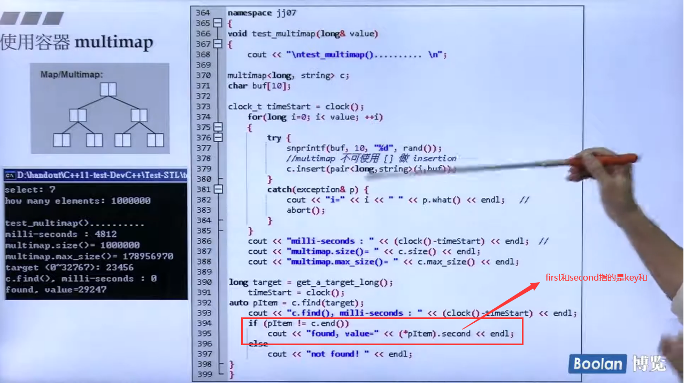
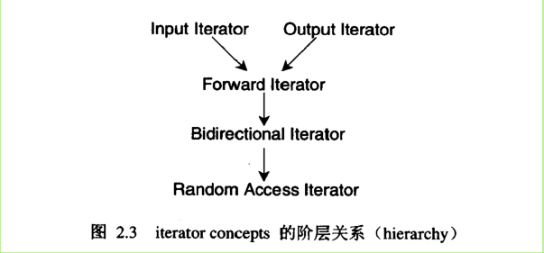
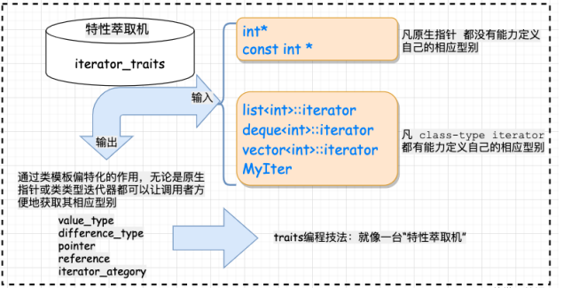

# ***OOP是数据和算法的结合！GP(Generic programming ，泛型编程)是将数据和算法分开！***

 


- 容器是用来存储我们的数据；
- 分配器主要就是为了我们内存分配所服务的，我们使用容器是看不到其中的内存分布的；
- 容器和算法是STL最重要的部件；
- 算法通过迭代器去操控我们容器里面的数据，迭代器是泛化的指针；
- 仿函数就是一个函数,标准库中会给我们提供很多的仿函数；
- Adapter仿函数适配器，官方给的仿函数功能一般是不能满足我们想实现的逻辑，对我们的部件进行一些转化，以适应我们想要实现的逻辑；


## 0. ***第一个简单程序***

```c++
#include <memory>
#include <vector>
#include <algorithm>
#include <functional>
#include <iostream>

using namespace std;

int main()
{
	int ia[6] = {27, 210, 12, 47, 109, 83};
	vector<int,allocator<int>> vi(ia,ia+6);
    // 使用容器vector的时候，第一个参数为我们实例化容器的类型；
    // 而我们容器是要和分配器搭配使用的，我们需要分配器帮他分配内存，我们这里也可以不填，即默认使用源码提供的默认分配器，我们平时大多数的时候都是使用其提供的默认的分配器。所以说我们在第二个参数alloctor<int>，这个分配器也是一个模板，我们需要声明该分配器所要分配的资源的类型。
    // 这样之后，我们就完成一个容器的实例化。
    // 我们实例化一个容器，该容器里面放的是int类型的数据，其使用的分配器是alloctor<int>。
	cout << count_if(vi.begin(), vi.end(), not1(bind2nd(less<int>(), 40)));
    // cout_if就是标准模板库部件中的算法部件，该算法就是根据我们提供的参数去输出对应的值
    // 这里条件是小于40,标准库里面有一个仿函数less比大小,比较a和b的大小，但是我们这里不是拿a和b来比较，我们是拿每一个数字去和指定不变的40去比较，这就需要“变压器”，也就是仿函数适配器，让该仿函数去适应我们的程序
    // 标准库提供了adapter就是适配器，bind2nd，也就是绑定第二参数，一开始是我们比较a和b,现在已经转化为a和40去比较。 
    // count_if() Defined in header <algorithm>
    // 刚才是小于40，现在前面加上not1也就是不小于40，大于等于40.
	return 0; 
}

```

## 1.***理解迭代器（泛化的指针）：***

```c++
#include <algorithm>
#include <iostream>
#include <numeric>
#include <string>
#include <vector>
 
int main()
{
    std::vector<int> nums {1, 2, 4, 8, 16};
    std::vector<std::string> fruits {"orange", "apple", "raspberry"};
    std::vector<char> empty;
 
    // Print vector.
    std::for_each(nums.begin(), nums.end(), [](const int n) { std::cout << n << ' '; });
    std::cout << '\n';
 
    // Sums all integers in the vector nums (if any), printing only the result.
    std::cout << "Sum of nums: "
              << std::accumulate(nums.begin(), nums.end(), 0) << '\n';
 
    // Prints the first fruit in the vector fruits, checking if there is any.
    if (!fruits.empty())
        std::cout << "First fruit: " << *fruits.begin() << '\n';
 
    if (empty.begin() == empty.end())
        std::cout << "vector 'empty' is indeed empty.\n";
}
```

输入结果如下：

```out
// 编译
g++ -std=c++23  -O2 -Wall -Wextra -pedantic -pthread -pedantic-errors main.cpp -lm  -latomic  && ./a.out
1 2 4 8 16 
Sum of nums: 31
First fruit: orange
vector 'empty' is indeed empty.
```

我们可以看到代码的第23行，输出容器fruits的第一个元素是通过类似于指针的操作输出该元素的数据的，所以说`begin()`返回的是一个指针，在手册中查看是这样解释：

> Return value
>
> Iterator to the first element.
>
> 就是说返回的是一个迭代器，也就是指针，***只不过是泛化的指针***,现在暂且这样理解。


> 我们选择容器的标准，取决于数据的分布、数量、以及我们对其要做的动作等等。


***注意：Iterator在各个中其中实现的时候，除了array和vector容器之外，其余的几乎所有的容器想要实现Iterator的话，都需要借助一类，因为只有这样才能实现出一个满足我们需求的Iterator。***


## 2.***复杂度O()***

注意括号里面的n只有在达到十万或者几百万的时候，O(n)才有意义。


## 3. ***前闭后开区间 [ )***

标准库规定，容器的头和尾是向下图中所展示的样子定义的。

即如图中所示的，begin这个泛化指针指向的是容器中的第一个元素，end这个泛化指针指向的是容器中最后一个元素的下一个元素，***注意不是指向最后一个元素***。


每一个容器的iterator，即迭代器都是不一样的，如果我们想要声明一个迭代器变量：

```c++
Container<T>::iterator ite = c.begin();
for(;ite != c.end();++ite)
    ···
```

iterator是一个泛化的指针，所以说指针可以做的事情，iterator都可以做。

***ranger-based for statement (since C++11) :(for循环更高级的写法)***

```c++
for (decl : coll) {
    statement
}
// decl 是声明
// coll 是容器,任何容器

for(int i : {2, 3, 5, 7, 9, 13, 17, 19}) {
    std::cout << i << std :: endl;
}
// 此处输出结果为：
//2
//3
//5
//7
//9
//13
//17
//19
//即将i依次赋值为我们给定的值

std::vector<double> vec;
···
for( auto elem : vec) {
    // 让编译器去给我们推导参数的类型，因为编译器很清楚器类型是什么？
    std::cout << elem <<std::endl;
}

for( auto& elem : vec) {
    elem *= 3;
    // 利用容器改变容器里面的值
}
```

## 4.***容器与分类***


容器又分为三类：

- 序列容器，Sequence Containers;
- 关联性容器，Associative Containers;
- 无规则容器,不定序容器·，Unordered Containers;

（红色圈起来的东西是C++11新增的内容）

***序列容器：***


Array的大小是一定的，其多大就会是多大，后面不会动态变化；

而Vector就不一样了，其大小是可以根据存储的数据的多少实现动态变化的，如果其容量不够大的时候，其就会动态的去分配内存，如果有浪费，其就会调用`shrink_to_fit()`去释放额外的内存空间。其内存的扩充和缩减是分配器所左的事情。

`Deque`队列；

`LIst`是双向链表；

`Forward_list`是单向链表；

***关系型容器：***对于大量的数据来说最有用的！


利用红黑树，一种特殊的二分树，高度平衡二分树，左边和右边的高度会动态平衡。

`Set:`

每一个结点既是key，又是value，元素不能重复；

`Multiset:`

***key可以重复，也就是元素可以重复；***

`Map`

每一个节点都有key和value，我们寻找元素的时候，就是利用key来寻找value的；

元素的key不能重复；

`Multimap:`

***key可以重复；***


## ---------序列容器--------

> 有些容器是由于功能的限制，是不允许在前端加入元素或者在后端加入元素！
>
> stack和queue容器是我们设计的具有特殊功能的容器，stack是先进后出，queue是先进先出，因此不会提供函数让我们得到iterator，即不会得到一个泛化指针指向我们的某一个元素。我们也可以从类的成员函数中可以看到，并没有提供返回iterator相关的函数。我们只能入栈操作、出栈操作、取栈顶元素等等。

##  5. ***array容器测试***

```c++
#include <array>
#include <iostream>
#include <ctime>
#include <cstdlib>
#include <iterator>
#include <limits.h>
#include <stdio.h>
#include <stdlib.h>
#include <time.h>
#define ASIZE 500000
using namespace std;

long get_a_target_long()
{
	long target = 0;
	cout << "target (0 ~ "<< RAND_MAX <<"): ";
	cout << target;
	return target;
}

string get_a_target_string()
{
	long target = 0;
	char buf[10];

	cout << "target (0~" << RAND_MAX <<"): ";
	cin >> target;
	snprintf(buf, 10, "%d", target);
	return string(buf);
}

int compareLongs(const void* a,const void* b)
{
	return (*(long *)a - *(long *)b);
}

int compareStrings(const void *a,const void *b)
{
	if(*(string *)a > *(string *)b)
		return 1;
	else if (*(string*)a < *(string *)b)
		return -1;
	else
		return 0;
}

int main()
{
	cout << "test_array()\n";
	array<long,ASIZE> c;
	clock_t timestart = clock();
	for(auto &elem : c)
		elem = rand();
	cout << "milli-seconds : "<< (clock() - timestart) <<endl;
	cout << "array-size() : "<< c.size() <<endl;
	cout << "array-front() : "<< c.front() <<endl;
	cout << "array-back() : "<< c.back() <<endl;
	cout << "array-data's address : "<< c.data() <<endl;


	return 0;
}

```

## 6. vector容器测试

```c++
// 该程序的目的是为了测试容器vector的特性
#include <cstdlib>
#include <ctime>
#include <vector>
#include <iostream>
#include <algorithm> // include sort（）
using namespace std;

template <typename T>
int compare(const void *a,const void *b) {
        const auto &arg1 = *(static_cast<const T*>(a));
    const auto &arg2 = *(static_cast<const T*>(b));
    const auto cmp = arg1 - arg2;
    return cmp < 0 ? -1
        :  cmp > 0 ? +1
        :  0;
}


int main()
{
vector<int> vec;
clock_t timestart = clock();
        for (int i = 0; i < 500000; i++) {
                vec.push_back(rand());
        }
        // 这里需要注意我们需要注意内存是否足够使用，如果空间不足使用的话，我们需要进行捕捉异常并且退出
		// 容器的内存都是动态分配的，当分配1个元素的时候，其是成2倍2倍的增长的。
        cout << "milli-seconds: "<< (clock() - timestart) <<endl;
        cout << "vector.size(): "<< vec.size() << endl;
        cout << "vector.front(): "<< vec.front() <<endl;
        cout << "vector.back(): "<< vec.back() <<endl;
        cout << "vector.data(): "<< vec.data() <<endl;
    	// vector.capacity()，返回当前容器所被分配的容量
        cout << "vector.capacity(): "<< vec.capacity() <<endl;

int a = 23412;
        // 此处find函数为全局函数，我们使用nvim编写的时候，先写入：：可以看到后面是有提示的
        timestart = clock();
auto pItem = ::find(vec.begin(), vec.end(), a);
        cout << "::find() cost time " << (clock() - timestart) << "ms" <<endl;
        if(pItem == vec.end())
                cout << "failed to find!!!" <<endl;
        else
                cout << "sucessfully to find target!!!" <<endl;
        timestart = clock();
        sort(vec.begin(),vec.end());
const int*p = static_cast<int*>(bsearch(&a, vec.data(), vec.size(), sizeof(int), compare<int>));

        cout << "value " << a;
        (p) ? cout << " found at position " << (p - vec.data()) << '\n'
        : cout << " not found\n";
        cout << "container vector located at the position is "<< vec[p - vec.data()] << endl;

        cout << "bsearch() cost "<< (clock() - timestart) << "ms"<<endl;
        return 0;
}
```

## 7. list 容器测试

```c++
// 该程序用来测试容器list的一些特性
#include <exception>
#include <iostream>
#include <list>
#include <cstdio>
#include <cstdlib>
#include <stdio.h>
#include <stdlib.h>
#include <time.h>

using namespace std;

int main()
{
        list<string> lis;
        char buf[10];
        clock_t timestart = clock();
        for (long i = 0; i < 1000000; i++) {
                try {
                        snprintf(buf, 10, "%d", rand());
                        lis.push_back(string(buf));
                } catch (exception& p) {
                        cout << "i="<< i << " " << p.what() << endl;
                        abort();
                }
        }
        cout << "the initiation cost time : "<< (clock() - timestart)<<"ms"<<endl;
        cout << "the max-size of list is: " << lis.max_size() <<endl;
        timestart = clock();
        lis.sort();
    	// 注意这里使用的是该容器自己提供的sort函数，容器本身都提供了，说明其更快一点
        cout << "sort() cost time : " << (clock() - timestart) <<"ms"<<endl;
        return 0;
}
```

## 8. forward_list 单向链表测试


单项链表仅仅提供`push_front()`函数。

## 9. `slist`容器

```c++
#include<ext\slist>  // externsion
```

和forward_list容器一模一样，很早就存在了，只不过forward_list是C++11规定的。

## 10. deque 容器

deque号称是连续的，但是其并不连续的，其实际是一段一段的叠放在一起，分段连续。


下面的map存放的是指针，存放的是各段的先后顺序。

每次扩充内存都是扩充一个buffer，即扩充一个段。

> 从上面的测试程序可以看到，我们在查找元素的时候或者排序容器的时候，时间花费很多毫秒，但是关联式容器就不一样了，速度要比序列式容器快的多。

## 11. stack容器 


## 12. queue

> 容器queue和容器stack都没有自己的数据结构，都是借用deque实现的。
>
> 该两种也成为容器的Adaptor,即适配器。
>
> 
>
> 

## ---------关联容器--------

***小型关联数据库！！***


***关系型容器：***对于大量的数据来说最有用的！


利用红黑树，一种特殊的二分树，高度平衡二分树，左边和右边的高度会动态平衡。

`Set:`

每一个结点既是key，又是value，元素不能重复；

`Multiset:`

***key可以重复，也就是元素可以重复；***

`Map`

每一个节点都有key和value，我们寻找元素的时候，就是利用key来寻找value的；

元素的key不能重复；

`Multimap:`

***key可以重复；***


## 13. multiset 容器

该容器是基于红黑树实现的，该二叉树是高度平衡的，是自动形成完美二叉树，然后默认的规则是按照从大到小进行排序。当然了，我们也可以自定义一些排序规则。因为在源码中，默认的参数是std::less，所以就按照从小到大的顺序进行排序。

> 红黑树可以参考：https://www.cnblogs.com/skywang12345/p/3245399.html

### 13.1 文档中定义

`std::multiset` is an associative container that contains a sorted set of objects of type Key. Unlike set, multiple keys with equivalent values are allowed. Sorting is done using the key comparison function Compare. Search, insertion, and removal operations have logarithmic complexity.

### 13.2 该类中成员函数以及成员变量

```c++
namespace std {
  template<class Key, class Compare = less<Key>,
           class Allocator = allocator<Key>>
  class multiset {
  public:
    // types
    using key_type               = Key;
    using key_compare            = Compare;
    using value_type             = Key;
    using value_compare          = Compare;
    using allocator_type         = Allocator;
    using pointer                = typename allocator_traits<Allocator>::pointer;
    using const_pointer          = typename allocator_traits<Allocator>::const_pointer;
    using reference              = value_type&;
    using const_reference        = const value_type&;
    using size_type              = /* implementation-defined */;
    using difference_type        = /* implementation-defined */;
    using iterator               = /* implementation-defined */;
    using const_iterator         = /* implementation-defined */;
    using reverse_iterator       = std::reverse_iterator<iterator>;
    using const_reverse_iterator = std::reverse_iterator<const_iterator>;
    using node_type              = /* unspecified */;
 
    // construct/copy/destroy
    multiset() : multiset(Compare()) { }
    explicit multiset(const Compare& comp, const Allocator& = Allocator());
    template<class InputIt>
      multiset(InputIt first, InputIt last,
               const Compare& comp = Compare(), const Allocator& = Allocator());
    multiset(const multiset& x);
    multiset(multiset&& x);
    explicit multiset(const Allocator&);
    multiset(const multiset&, const Allocator&);
    multiset(multiset&&, const Allocator&);
    multiset(initializer_list<value_type>, const Compare& = Compare(),
             const Allocator& = Allocator());
    template<class InputIt>
      multiset(InputIt first, InputIt last, const Allocator& a)
        : multiset(first, last, Compare(), a) { }
    multiset(initializer_list<value_type> il, const Allocator& a)
      : multiset(il, Compare(), a) { }
    ~multiset();
    multiset& operator=(const multiset& x);
    multiset& operator=(multiset&& x)
      noexcept(allocator_traits<Allocator>::is_always_equal::value &&
               is_nothrow_move_assignable_v<Compare>);
    multiset& operator=(initializer_list<value_type>);
    allocator_type get_allocator() const noexcept;
 
    // iterators
    iterator               begin() noexcept;
    const_iterator         begin() const noexcept;
    iterator               end() noexcept;
    const_iterator         end() const noexcept;
 
    reverse_iterator       rbegin() noexcept;
    const_reverse_iterator rbegin() const noexcept;
    reverse_iterator       rend() noexcept;
    const_reverse_iterator rend() const noexcept;
 
    const_iterator         cbegin() const noexcept;
    const_iterator         cend() const noexcept;
    const_reverse_iterator crbegin() const noexcept;
    const_reverse_iterator crend() const noexcept;
 
    // capacity
    [[nodiscard]] bool empty() const noexcept;
    size_type size() const noexcept;
    size_type max_size() const noexcept;
 
    // modifiers
    template<class... Args> iterator emplace(Args&&... args);
    template<class... Args> iterator emplace_hint(const_iterator position, Args&&... args);
    iterator insert(const value_type& x);
    iterator insert(value_type&& x);
    iterator insert(const_iterator position, const value_type& x);
    iterator insert(const_iterator position, value_type&& x);
    template<class InputIt>
      void insert(InputIt first, InputIt last);
    void insert(initializer_list<value_type>);
 
    node_type extract(const_iterator position);
    node_type extract(const key_type& x);
    template<class K> node_type extract(K&& x);
    iterator insert(node_type&& nh);
    iterator insert(const_iterator hint, node_type&& nh);
 
    iterator  erase(iterator position);
    iterator  erase(const_iterator position);
    size_type erase(const key_type& x);
    template<class K> size_type erase(K&& x);
    iterator  erase(const_iterator first, const_iterator last);
    void      swap(multiset&)
      noexcept(allocator_traits<Allocator>::is_always_equal::value &&
               is_nothrow_swappable_v<Compare>);
    void      clear() noexcept;
 
    template<class C2>
      void merge(multiset<Key, C2, Allocator>& source);
    template<class C2>
      void merge(multiset<Key, C2, Allocator>&& source);
    template<class C2>
      void merge(set<Key, C2, Allocator>& source);
    template<class C2>
      void merge(set<Key, C2, Allocator>&& source);
 
    // observers
    key_compare key_comp() const;
    value_compare value_comp() const;
 
    // set operations
    iterator       find(const key_type& x);
    const_iterator find(const key_type& x) const;
    template<class K> iterator       find(const K& x);
    template<class K> const_iterator find(const K& x) const;
 
    size_type      count(const key_type& x) const;
    template<class K> size_type count(const K& x) const;
 
    bool           contains(const key_type& x) const;
    template<class K> bool contains(const K& x) const;
 
    iterator       lower_bound(const key_type& x);
    const_iterator lower_bound(const key_type& x) const;
    template<class K> iterator       lower_bound(const K& x);
    template<class K> const_iterator lower_bound(const K& x) const;
 
    iterator       upper_bound(const key_type& x);
    const_iterator upper_bound(const key_type& x) const;
    template<class K> iterator       upper_bound(const K& x);
    template<class K> const_iterator upper_bound(const K& x) const;
 
    pair<iterator, iterator>               equal_range(const key_type& x);
    pair<const_iterator, const_iterator>   equal_range(const key_type& x) const;
    template<class K>
      pair<iterator, iterator>             equal_range(const K& x);
    template<class K>
      pair<const_iterator, const_iterator> equal_range(const K& x) const;
  };
 
  template<class InputIt,
           class Compare = less</*iter-value-type*/<InputIt>>,
           class Allocator = allocator</*iter-value-type*/<InputIt>>>
    multiset(InputIt, InputIt,
             Compare = Compare(), Allocator = Allocator())
      -> multiset</*iter-value-type*/<InputIt>, Compare, Allocator>;
 
  template<class Key, class Compare = less<Key>, class Allocator = allocator<Key>>
    multiset(initializer_list<Key>, Compare = Compare(), Allocator = Allocator())
      -> multiset<Key, Compare, Allocator>;
 
  template<class InputIt, class Allocator>
    multiset(InputIt, InputIt, Allocator)
      -> multiset</*iter-value-type*/<InputIt>,
                  less</*iter-value-type*/<InputIt>>, Allocator>;
 
  template<class Key, class Allocator>
    multiset(initializer_list<Key>, Allocator) -> multiset<Key, less<Key>, Allocator>;
 
  // swap
  template<class Key, class Compare, class Allocator>
    void swap(multiset<Key, Compare, Allocator>& x,
              multiset<Key, Compare, Allocator>& y)
      noexcept(noexcept(x.swap(y)));
}
```

### 13.3 示例代码

```c++
// 本程序的目的是为了简单的测试一下multiset的基本的印象

#include <functional>
#include <iostream>
#include <set>
#include <algorithm>
#include <stdio.h>
#include <stdlib.h>

using namespace std ;

int main()
{
        multiset<int,greater<int>> greadterSet;
        multiset<int,less<int>> lessSet;
        multiset<int> defaultSet;


        for (int i = 0; i < 10; i++) {
                int v = int (10 * rand());
                greadterSet.insert(v);
                lessSet.insert(v);
                defaultSet.insert(v);
        }

        for (int v: greadterSet) {
                printf("%d ",v);
        }

        printf("\n");

        for (int v : lessSet) {
                printf("%d ",v);
        }

        printf("\n");

        for (int v : defaultSet) {
                printf("%d ",v);
        }

        printf("\n");
        return 0;
}
```

```c++
// 该程序的目的是为了测试自定义类和自定义排序规则在multiset中的应用测试，已测试其泛型
#include <iostream>
#include <cstring>
#include <algorithm>
#include <set>
#include <string.h>

using namespace std;

struct Student
{
        char name[20];
        int id;
        double gpa;
};

Student student[] = {
        {"Jack",112,3.4},{"Mary",102,3.8},
        {"Mary",117,3.9},{"Ala",333,3.5},
        {"Zero",101,4.0},{"Cindy",102,4.8}
};

struct Rule {
        bool operator()(const Student & s1,const Student & s2) {
                if(s1.gpa != s2.gpa)
                        return s1.gpa > s2.gpa;
                        // 按照分数进行排序
                else
                        return (strcmp(s1.name, s2.name) < 0);
                        // 分数相等的话，按照姓名排序
        }
};

int main()
{
        multiset<Student,Rule> st;

        for(int i = 0;i < 5;++i)
                st.insert(student[i]);

        multiset<Student,Rule>::iterator p;

        for (p = st.begin() ; p != st.end() ;p++) {
                cout << p->gpa << " " << p->name
                         << " " << p->id <<endl;
        }
        Student s = {"Mary",1000,3.9};
        p = st.find(s);

        if(p != st.end())
                cout << "find sucessfully!" <<endl;
        return 0;
}
```


## 14. set 容器

### 14.1 文档中定义

该容器和multiset容器比较起来唯一的区别就是上面的容器中的元素可以重复，但是set容器中的元素是不可以重复的。

> `std::set` is an associative container that contains a sorted set of unique objects of type `Key`. Sorting is done using the key comparison function [*Compare*](https://en.cppreference.com/w/cpp/named_req/Compare). Search, removal, and insertion operations have logarithmic complexity. Sets are usually implemented as [red-black trees](https://en.wikipedia.org/wiki/Red–black_tree)

该容器是关系型容器，它包含一组已经排序过后的Key类型的唯一对象，也就是说，里面的元素都是唯一的。排序是使用键比较函数比较完成的。搜索、删除和插入操作具有对数复杂度。集合实现通常为红黑树。

### 14.2 该类中的成员函数以及成员变量

```c++
namespace std {
  template<class Key, class Compare = less<Key>,
           class Allocator = allocator<Key>>
  class set {
  public:
    // types
    using key_type               = Key;
    using key_compare            = Compare;
    using value_type             = Key;
    using value_compare          = Compare;
    using allocator_type         = Allocator;
    using pointer                = typename allocator_traits<Allocator>::pointer;
    using const_pointer          = typename allocator_traits<Allocator>::const_pointer;
    using reference              = value_type&;
    using const_reference        = const value_type&;
    using size_type              = /* implementation-defined */;
    using difference_type        = /* implementation-defined */;
    using iterator               = /* implementation-defined */;
    using const_iterator         = /* implementation-defined */;
    using reverse_iterator       = std::reverse_iterator<iterator>;
    using const_reverse_iterator = std::reverse_iterator<const_iterator>;
    using node_type              = /* unspecified */;
    using insert_return_type     = /*insert-return-type*/<iterator, node_type>;
 
    // construct/copy/destroy
    set() : set(Compare()) { }
    explicit set(const Compare& comp, const Allocator& = Allocator());
    template<class InputIt>
      set(InputIt first, InputIt last,
          const Compare& comp = Compare(), const Allocator& = Allocator());
    set(const set& x);
    set(set&& x);
    explicit set(const Allocator&);
    set(const set&, const Allocator&);
    set(set&&, const Allocator&);
    set(initializer_list<value_type>, const Compare& = Compare(),
        const Allocator& = Allocator());
    template<class InputIt>
      set(InputIt first, InputIt last, const Allocator& a)
        : set(first, last, Compare(), a) { }
    set(initializer_list<value_type> il, const Allocator& a)
      : set(il, Compare(), a) { }
    ~set();
    set& operator=(const set& x);
    set& operator=(set&& x)
      noexcept(allocator_traits<Allocator>::is_always_equal::value &&
               is_nothrow_move_assignable_v<Compare>);
    set& operator=(initializer_list<value_type>);
    allocator_type get_allocator() const noexcept;
 
    // iterators
    iterator               begin() noexcept;
    const_iterator         begin() const noexcept;
    iterator               end() noexcept;
    const_iterator         end() const noexcept;
 
    reverse_iterator       rbegin() noexcept;
    const_reverse_iterator rbegin() const noexcept;
    reverse_iterator       rend() noexcept;
    const_reverse_iterator rend() const noexcept;
 
    const_iterator         cbegin() const noexcept;
    const_iterator         cend() const noexcept;
    const_reverse_iterator crbegin() const noexcept;
    const_reverse_iterator crend() const noexcept;
 
    // capacity
    [[nodiscard]] bool empty() const noexcept;
    size_type size() const noexcept;
    size_type max_size() const noexcept;
 
    // modifiers
    template<class... Args> pair<iterator, bool> emplace(Args&&... args);
    template<class... Args> iterator emplace_hint(const_iterator position, Args&&... args);
    pair<iterator,bool> insert(const value_type& x);
    pair<iterator,bool> insert(value_type&& x);
    iterator insert(const_iterator position, const value_type& x);
    iterator insert(const_iterator position, value_type&& x);
    template<class InputIt>
      void insert(InputIt first, InputIt last);
    void insert(initializer_list<value_type>);
 
    node_type extract(const_iterator position);
    node_type extract(const key_type& x);
    template<class K> node_type extract(K&& x);
    insert_return_type insert(node_type&& nh);
    iterator           insert(const_iterator hint, node_type&& nh);
 
    iterator  erase(iterator position);
    iterator  erase(const_iterator position);
    size_type erase(const key_type& x);
    template<class K> size_type erase(K&& x);
    iterator  erase(const_iterator first, const_iterator last);
    void      swap(set&)
      noexcept(allocator_traits<Allocator>::is_always_equal::value &&
               is_nothrow_swappable_v<Compare>);
    void      clear() noexcept;
 
    template<class C2>
      void merge(set<Key, C2, Allocator>& source);
    template<class C2>
      void merge(set<Key, C2, Allocator>&& source);
    template<class C2>
      void merge(multiset<Key, C2, Allocator>& source);
    template<class C2>
      void merge(multiset<Key, C2, Allocator>&& source);
 
    // observers
    key_compare key_comp() const;
    value_compare value_comp() const;
 
    // set operations
    iterator       find(const key_type& x);
    const_iterator find(const key_type& x) const;
    template<class K> iterator       find(const K& x);
    template<class K> const_iterator find(const K& x) const;
 
    size_type      count(const key_type& x) const;
    template<class K> size_type count(const K& x) const;
 
    bool           contains(const key_type& x) const;
    template<class K> bool contains(const K& x) const;
 
    iterator       lower_bound(const key_type& x);
    const_iterator lower_bound(const key_type& x) const;
    template<class K> iterator       lower_bound(const K& x);
    template<class K> const_iterator lower_bound(const K& x) const;
 
    iterator       upper_bound(const key_type& x);
    const_iterator upper_bound(const key_type& x) const;
    template<class K> iterator       upper_bound(const K& x);
    template<class K> const_iterator upper_bound(const K& x) const;
 
    pair<iterator, iterator>               equal_range(const key_type& x);
    pair<const_iterator, const_iterator>   equal_range(const key_type& x) const;
    template<class K>
      pair<iterator, iterator>             equal_range(const K& x);
    template<class K>
      pair<const_iterator, const_iterator> equal_range(const K& x) const;
  };
 
  template<class InputIt,
           class Compare = less</*iter-value-type*/<InputIt>>,
           class Allocator = allocator</*iter-value-type*/<InputIt>>>
    set(InputIt, InputIt,
        Compare = Compare(), Allocator = Allocator())
      -> set</*iter-value-type*/<InputIt>, Compare, Allocator>;
 
  template<class Key, class Compare = less<Key>, class Allocator = allocator<Key>>
    set(initializer_list<Key>, Compare = Compare(), Allocator = Allocator())
      -> set<Key, Compare, Allocator>;
 
  template<class InputIt, class Allocator>
    set(InputIt, InputIt, Allocator)
      -> set</*iter-value-type*/<InputIt>,
             less</*iter-value-type*/<InputIt>>, Allocator>;
 
  template<class Key, class Allocator>
    set(initializer_list<Key>, Allocator) -> set<Key, less<Key>, Allocator>;
 
  // swap
  template<class Key, class Compare, class Allocator>
    void swap(set<Key, Compare, Allocator>& x,
              set<Key, Compare, Allocator>& y)
      noexcept(noexcept(x.swap(y)));
}
```

### 14.3 示例代码

## 15. multimap 容器

`Map`

每一个节点都有key和value，我们寻找元素的时候，就是利用key来寻找value的；

元素的key不能重复；

`Multimap:`

***key可以重复；***




## 16. unordered_multiset 容器


主要是利用哈希表实现的！

Unordered multiset is an associative container that contains set of possibly non-unique objects of type Key. Search, insertion, and removal have average constant-time complexity.

Internally, the elements are not sorted in any particular order, but organized into buckets. Which bucket an element is placed into depends entirely on the hash of its value. This allows fast access to individual elements, since once hash is computed, it refers to the exact bucket the element is placed into.

无序多集是一个**关联容器**，它包含一组可能不唯一的Key类型对象。**搜索、插入和删除具有平均的恒定时间复杂度**。在内部，元素不会按任何特定的顺序排列，而是组织到桶中。**元素放入哪个桶完全取决于其值的哈希**。这允许快速访问单个元素，因为一旦计算哈希，它就会引用元素放置到的确切桶。

> 哈希表：也叫做散列表。是根据关键字和值（Key-Value）直接进行访问的数据结构。也就是说，它通过关键字 key 和一个映射函数 Hash(key) 计算出对应的值 value，然后把键值对映射到表中一个位置来访问记录，以加快查找的速度。这个映射函数叫做哈希函数（散列函数），用于存放记录的数组叫做 哈希表（散列表）。 哈希表的关键思想是使用哈希函数，将键 key 和值 value 映射到对应表的某个区块中。可以将算法思想分为两个部分：
>
> 向哈希表中插入一个关键字：哈希函数决定该关键字的对应值应该存放到表中的哪个区块，并将对应值存放到该区块中
> 在哈希表中搜索一个关键字：使用相同的哈希函数从哈希表中查找对应的区块，并在特定的区块搜索该关键字对应的值


”篮子“的个数会随着数据的数据的增加而增加 ，篮子的个数可以远远大于数据的值，因为有的篮子可能不会放东西，因为所有的元素的哈希值计算之后，并不能实现完全覆盖某一个范围。篮子里面不能放太多的元素。如果元素大于某一个值，容器会自动的将篮子的个数进行一个扩充。

## 17. unordered_multimap 容器

## ----------Iterator----------

迭代器一共分为5种不同的`concept`：Input Iterator、Output Iterator、Forward Iterator(单向迭代器，只能一个方向遍历的迭代器)、Bidirectional Iterator(双向迭代器，可以双向遍历的迭代器)、Random Access Iterator(随机迭代器，就是我们可以使用下标的迭代器)。

## 1. Input Iterator

- Input Iterator，我们可以将其理解为用来提领元素用的，但不是用来修改元素的，仅仅是访问。所以说其中我们不需要任何的更改对象的方法，我们可以提领出一个Input Iterator ,但是不能对提领之后的结果赋予新的值，也就是说`*p = x`不一定有效。
- Input Iterator 仅仅支持我们所习惯之指针运算中极小一部分子集。比如说可以累加，但不一定可以递减，就是说该种迭代器仅仅可以实现`Iterator++`这种最基本的操作。
- 在比较形式方面，Input Iterator也是仅仅支持最基本的是否相等，但是如果你去比较两个Input Iterator谁更大的话，就不一定可以比较出来结果。

当我们使用Input Iterator这种类型的迭代器的时候，我们就像是从终端机或者网络连线读取数据一样地的读进输入值：我们可以取出下一个值，但是一旦迭代器指向下一个值得内存空间的时候，就不能再去指向前面的值了。如果希望再次取得前一个值，我们必须自行将取自迭代器的数据保存下来。

## 2. Output Iterator

该种就是与Input Iterator相对应的迭代器。

## 3. Forward Iterators

由于以上两种迭代器的特性显然不能满足算法的需求，所以说，下面讲述含有更多功能的迭代器。

先说一下Input Iterator和Output Iterator的缺点;

- Input Iterator具有只读性，Output Iterator 具有只写性，这就意味着任何需要读取并修改某一区间的算法，都无法单就这些concept来运作。就是说，我们只可以利用Input Iterator来写出某一种***查找算法***，但是无法写出***查找并且置换算法***。

Forward Iterators支持的指针运算是与Input Iterators 以及Output Iterators同级（你可以写`++p`，但是不能写`--p`或者`p += 5`）

## 4. Bidirectional Iterators

***双向迭代器***。支持双向移动。

就相当于前面的Iterator增加了operator --。就是我们利用迭代器可以获取前面的元素。

## 5. Random Access Iterators

STL的最后一个iterator concept涵盖所有的指针运算：加法、减法、下标、两个Iterator相减，以及前后次序关系等等。就是我们最常使用的指针的概念，该种迭代器是与我们的指针相似度最高的时候。



## ---------偏特化-----------

参考文章：https://blog.csdn.net/flyingleo1981/article/details/50911717

### 1. 特化

我们先讲一下特化的概念：

我们在使用模板template的时候，一般是根据各种类的关系和共性，编写一个一般化的类，里面的属性全部都使用的是模板，但是我们在使用的过程中可能会遇到一些情况，***使得这个一般化的条件可能不能满足我们的需求，这个时候就需要特化，去根据我们产生的特殊性狂去另行考虑***。

比如说下面的情况：

```c++
#include <iostream>
using namespace std;
 
template <class T>
class TClass
{
public:
     bool Equal(const T& arg, const T& arg1);
};
 
template <class T>
bool TClass<T>::Equal(const T& arg, const T& arg1)
{
     return (arg == arg1);
}
 
int main()
{
     TClass<int> obj;
     cout<<obj.Equal(2, 2)<<endl;
     cout<<obj.Equal(2, 4)<<endl;
}
```

我们如果想要对`double`和`float`类型的变量进行特别的情况分析的话，我们可以下面这一种写法：

```c++
#include <iostream>
#include <cmath>
using namespace std;
 
template <class T>
class Compare
{
public:
     bool IsEqual(const T& arg, const T& arg1);
};
 
// 已经不具有template的意思了，已经明确为float了
template <>
class Compare<float>
{
public:
     bool IsEqual(const float& arg, const float& arg1);
};
 
// 已经不具有template的意思了，已经明确为double了
template <>
class Compare<double>
{
public:
     bool IsEqual(const double& arg, const double& arg1);
};
 
template <class T>
bool Compare<T>::IsEqual(const T& arg, const T& arg1)
{
     cout<<"Call Compare<T>::IsEqual"<<endl;
     return (arg == arg1);
}
 
bool Compare<float>::IsEqual(const float& arg, const float& arg1)
{
     cout<<"Call Compare<float>::IsEqual"<<endl;
     return (abs(arg - arg1) < 10e-3);
}
 
bool Compare<double>::IsEqual(const double& arg, const double& arg1)
{
     cout<<"Call Compare<double>::IsEqual"<<endl;
     return (abs(arg - arg1) < 10e-6);
}
 
int main()
{
     Compare<int> obj;
     Compare<float> obj1;
     Compare<double> obj2;
     cout<<obj.IsEqual(2, 2)<<endl;
     cout<<obj1.IsEqual(2.003, 2.002)<<endl;
     cout<<obj2.IsEqual(3.000002, 3.0000021)<<endl;
}
```

***这样的话如果我们实例化模板的时候传进来的是`double`类型，他就会去执行我们的特化版本的模板，而不是那个泛化的模板，也就是说特化就是如果你想要对某一种类型做特殊的处理的话，你就可以利用特化。***


需要说明一点，该种特化是特化为绝对类型，也就是说直接为某个特定类型做特化，这是我们最常见的一种特化方式。此处是为了与下面介绍的另外几种

### 2. 偏特化


模板的偏特化和特化不一样，他也只是一个模板，不是特化一样的只针对某一些特殊情况，可以理解为模板的模板，它既是泛型，但是又不是泛型。

以下部分是STL源码中的iterator_traits特化，源码如下：

```c++
template <class _Iterator>
struct iterator_traits
{
     typedef typename _Iterator::iterator_category iterator_category;
     typedef typename _Iterator::value_type        value_type;
     typedef typename _Iterator::difference_type   difference_type;
     typedef typename _Iterator::pointer           pointer;
     typedef typename _Iterator::reference         reference;
};
 
// specialize for _Tp*
template <class _Tp>
struct iterator_traits<_Tp*> 
{
     typedef random_access_iterator_tag iterator_category;
     typedef _Tp                         value_type;
     typedef ptrdiff_t                   difference_type;
     typedef _Tp*                        pointer;
     typedef _Tp&                        reference;
};
 
// specialize for const _Tp*
template <class _Tp>
struct iterator_traits<const _Tp*> 
{
     typedef random_access_iterator_tag iterator_category;
     typedef _Tp                         value_type;
     typedef ptrdiff_t                   difference_type;
     typedef const _Tp*                  pointer;
     typedef const _Tp&                  reference;
};
```

```c++
#include <iostream>
using namespace std;
 
// 一般化设计
template <class T, class T1>
class TestClass
{
public:
     TestClass()
     {
          cout<<"T, T1"<<endl;
     }
};
 
// 针对普通指针的偏特化设计
template <class T, class T1>
class TestClass<T*, T1*>
{
public:
     TestClass()
     {
          cout<<"T*, T1*"<<endl;
     }
};
 
// 针对const指针的偏特化设计
template <class T, class T1>
class TestClass<const T*, T1*>
{
public:
     TestClass()
     {
          cout<<"const T*, T1*"<<endl;
     }
};
 
int main()
{
     TestClass<int, char> obj;
     TestClass<int *, char *> obj1;
     TestClass<const int *, char *> obj2;
 
     return 0;
}
```

代码的执行结果为：

```c++
T, T1
T*, T1*
const T*, T1*
```

也就是说这一种特化其实就不是一种绝对的特化，而是说，他只是对类型做了某些限定，但是仍然保留了一定的模板性，这样的特化给我们带来了极大的遍历，这样的话，我们就不需要再去对`int *`、`float *`、`double *`等类型再分别做特化了。

该种特化就被称为***偏特化***。

***也就是说特化了，但是没有完全特化，并不是说把相应的类型完全限定死。***

## ----iterator_traits-------

参考：https://www.cnblogs.com/xiaoshiwang/p/11937275.html

重点参考：http://mtw.so/6deUNx

***traits的作用，即萃取机的作用，就是为了搭配泛型编程中的算法使用，因为有的时候，我们的泛型算法会在中间去定义相应的变量参数来执行算法的过程，这个前提肯定是需要先知道对应对象的数据类型。还有我们的算法如果需要返回我们的对象所对应的参数类型该怎么办？为了获取相应对象的类型相关信息，我们引入了萃取机制，就是为了获取对应类型的数据的类型，萃取机制的实现实质上就是通过给对应的对象起别名并获取。***


-----------------------------------------------------------------以下内容是参考上面的博客所写-------------------------------------------------------------------

在STL编程中，算法和容器是独立设计的，容器里面存放的是数据，而算法则是提供了对数据的操作，在算法操作数据的过程中，要使用到迭代器，迭代器可以看作是算法和容器的桥梁。


**智能指针：**

STL是泛型编程的产物，是以泛型编程为指导而产生的。具体来说，STL中的迭代器将泛型算法（find、count、find_if）等应用于某个容器中，给算法提供一个访问容器元素的工具，iterator就扮演者这个重要的角色。

稍微看过 STL 迭代器[源码](https://so.csdn.net/so/search?q=源码&spm=1001.2101.3001.7020)的，就明白迭代器其实也是一种智能指针，因此，因此，它也就拥有了⼀般指针的所有特点——能够对其进⾏ * 和 -> 操作。

```c++
template<typename T>
class ListIterator {
    T *m_ptr;
public :
    ListIterator(T *p) : m_ptr(p) {}
    T& operator*() const {return *m_ptr;}
    T* operator->() const {return m_ptr;}
    //···
}
```

但是在遍历容器的时候，不可避免的要对遍历的容器内部有所了解，所以，干脆把迭代器的开发工作交给容器的设计者，如此，所有实现细节反而得以封装起来不被使用者看到，这也是为什么每一种STL容器都提供有专属迭代器的缘故。好处比如：

- 不⽤担⼼内存泄漏（类似智能指针，析构函数释放内存）
- 提供统⼀接⼝

**template参数推导：**

参数类型推导能够帮我们解决什么问题呢？

在算法中，你可能会定义一个简单的中间变量或者设定算法的返回变量类型，这时候，你可能会遇到这样的问题，假如你需要知道迭代器所指元素的类型是什么，进而获取这个迭代器的算法的返回类型，但是问题是C++没有typeof这类判断类型的函数，也无法直接获取，那该如何是好？

注意是类型，不是迭代器的值，虽然C++提供了一个typeid()的操作符，但是这个操作符只能获得类型的名称，但是不能用来声明变量。要想获得迭代器型别，这个时候要怎么办呢？

可以通过`function templete`的参数类型推导。

比如：如果 I 是某个指向特定对象的指针，那么在 func 中需要指针所指向对象的型别的时候，怎么办呢？这个还⽐较容易，模板的参数推导机制可以完成任务

> **批注：**
>
> 这里的参数推导就是通过传进模板的参数我们利用嵌套和迭代，在模板里面去获得我们想要的参数类型。

```c++
template <class I>
inline void func(I iter) {
    func_imp(iter,*iter); //传入iter和iter所指向的值，函数会通过变量值自动推导出该变量所对应的类型 
}
```

> **批注：**
>
> 这一段代码中最重要的是`func_imp`中传进来的第二个参数。我们可以回想一下，平时的时候，我们如果传一个实参到指定的函数当中，我们的函数就会自动会去推导我们的参数类型，该处就是利用了这个原理。

```c++
template <class I, class T>
void func_imp(I iter, T t) {
    T tmp; //这里我们的模板函数已经通过参数类型推导得到了我们的参数类型，这里就可以直接去定义我们对应对象的类型变量了
}

int main() {
    int i;
    func(&i);// 这里传进去的是一个迭代器(原生指针也是一种迭代器)
}
```


上⾯的做法呢，通过多层的迭代，很巧妙地导出了 T ，但是却很有局限性，⽐如，我希望 func() 返回迭代器的value type 类型返回值，*** 函数的 " template 参数推导机制" 推导的只是参数，⽆法推导函数的返回值类型。万⼀需要推导函数的返回值，好像就不⾏了，那么又该如何是好？***

这就引出了下⾯的内嵌型别。

> **批注：**
>
> 如果说我们的模板函数，也想要去返回我们传进去的参数的类型，就是说我们在声明的时候就需要去知道相应的对象的参数类型，我们在书写声明的时候需要使用到，这个时候我们可以声明内嵌型别。

**声明内嵌型别：**

上述所说的**迭代器所指对象的型别，称之为迭代器的 value type** 。

尽管在func_impl中我们可以把T作为参数的返回值，但是问题是用户需要调用func而不是func_impl。

如果在参数的类型推导上加上内嵌级别typedef呢？为指定的对象类型定义一个别名，然后直接获取，这样来看一下实现：

```c++
template <typename T>
class MyIter{
pubilc:
    typedef T value_type; // 内嵌类型声明
    MyIter(T *p = 0) : m_ptr(p) {}
    T& 	operator*() const {return *m_ptr;}
private:
    T *m_ptr;
}

// 以迭代器所指对象的类型作为返回类型
// 注意typename是必须的，他告诉编译器这是一个类型，因为编译器一开始什么都不知道，你需要去告诉他
template<typename MyIter>
typename MyIter::value_type Func(MyIter iter) {
    return *iter;
}

int main(int argc,const char*argv []) {
    MyIter<int> iter(new int(666));
    std::cout << Func(iter)<<std::endl;
}

```

> **批注：**
>
> 上述代码最关键的两行为第4行和第14行代码：
>
> `typedef T value_type;`
>
> `typename MyIter::value_type Func(MyIter iter)`
>
> 第4行代码利用声明内嵌级别声明了我们传进去的参数类型，然后第14行代码利用这个类内声明来获取相应的变量返回类型


上⾯的解决⽅案看着可⾏，但其实呢，实际上还是有问题，这⾥有⼀个隐晦的陷阱：**实际上并不是所有的迭代器都是 class type ，原⽣指针也是⼀种迭代器，由于原⽣指针不是 class type ，所以没法为它定义内嵌型别**。

> **批注：**
>
> 什么意思呢？
>
> 意思就是说上面那个类型是我们自定义的一个类，我们可以在里面添加一个内嵌类型，然后通过类去访问类内变量的类。但是并不是所有的变量都是我们定义的类，还有一些变量的类型是一些原生的类型，就是最基本的类型，比如说`int`、`double`这一类的最基本的类型，这个时候我们该怎么办，我们怎么去设计才可以让模板知道传进去的数据的类型，并且可以返回中类型的数据。

我们如果想解决这个问题，就需要模板偏特化（是特化但又不完全是特化）。

**Partial specialization (模板偏特化)：**

​	所谓偏特化是指如果一个class template拥有一个以上的template参数，我们可以针对其中某个（或者多个，但不是全部）template参数进行特化，比如下面：

```c++
template <typename T>
class C{···};//此泛化版本可以是任何类型

template <typename T>
class C<T *> {···};// 特化版本，仅仅适用于T为原生指针的情况，是泛化类型的限制版

```

所谓特化，就是**特殊情况特殊处理**`，第一个类为泛化版本，T可以是任意类型，第二个类为特化版本，是第一个类的特殊情况，值针对原生指针

## 原生指针怎么办？特性“萃取”traits

还记得前⾯说过的**参数推导机制+内嵌型别机制获取型别**有什么问题吗？问题就在于原⽣指针虽然是迭代器但不是 class ，⽆法定义内嵌型别，⽽偏特化似乎可以解决这个问题。

有了上⾯的认识，我们再看看 STL 是如何应⽤的。STL定义了下面的类模板，它专门用来“萃取”迭代器的特性，而value type就是迭代器的特性之一。

traits 在 bits/stl_iterator_base_types.h 这个⽂件中：

```c++

// 该traits是最基本的traits，利用相应迭代其中内置好的变量来再次定义别名，然后利用iterator_traits来获取对应的类型
// 可能你看完上面的文章之后，看着一段代码，感觉没有什么用，如果没有原生指针的话，的确可以这样说，就是说iterator_traits存在的意义就是为了可以同时处理我们自定义类型的迭代器和原生变量所对应的指针

template<typename Iterator>
struct iterator_traits
{
    // 迭代器的种类
    typedef typename Iterator::iterator_category iterator_category;
    // 迭代器所指数据的类型
    typedef typename Iterator::value_type value_type;
    // 迭代器之间的距离,对于原生指针，STL以C++内建的ptrdiff_t作为原生的difference_type
    typedef typename Iterator::difference_type difference_type;
    // 迭代器所指对象的类型的引用
    typedef typename Iterator::reference reference;
    // 相应的指针的类型
    typedef typename Iterator:pointer pointer;
}

// 由于无法使用iterator的内置信息，所以traits针对如果传进来的参数是原生的参数，其对应的迭代器的类型需要traits在自己去定义

// 局部特化，C++指针

template<typename T>
struct iterator_traits<T *>
{
    // 原生指针一定是随机访问迭代器
    typedef random_access_iterator_tag iterator_category;
    typedef T value_type;
    typedef ptrdiff_t difference_type;
    // 定义该原生指针迭代器所对应的指针
    typedef T* pointer;
    // 定义该原生指针迭代器所对应的引用
    typedef T& reference;
}

// 局部特化，强制类型的C++指针

template<typename T>
struct iterator_traits<const T *>
{
    typedef random_access_iterator_tag iterator_category;
    typedef T value_type;
    typedef ptrdiff_t difference_type;
    typedef const T & reference;
    typedef const T * pointer; 
}
```


> **批注：**
>
> 通过上面图示，我们可以看到我们如果想获得迭代器的型别，首先我们使用模板参数进行自动推导，但是这样无法推导出函数的返回值的类型，所以我们需要内嵌型别，但是我们这个时候不能完全的泛化，就是不能解决原生指针的内嵌型别，所以我们利用特性萃取traits，原生指针如何处理呢，我们利用模板的偏特化对traits进行处理。

## 示例：

```c++
#include<iostream>

template<class T>
struct MyIter {
	typdef T value_type;        
	T *ptr;
    MyIter(T* p = 0) : ptr(p) {}
    T& operator*() const {return *ptr;}
};

// class type

tempalte<class T>
struct my_iterator_traits {
    typedef typename T::value_type value_type;
};

// traits的关键在于下面部分
// 偏特化，指针
template<class T>
struct my_iterator_traits<T *> {
    typedef T value_type;
};

// ⾸先询问 iterator_traits<I>::value_type,如果传递的 I 为指针,则进⼊特化版本,iterator_traits直接回答;如果传递进来的 I 为 class type,就去询问 T::value_type.
// 偏特化，针对const T *

template<class T>
struct my_iterator_traits<const T*> {
    typedef T value_type;
    typedef const T * pointer;
}

// 我们定义一个函数，来展示一下iterator_traits是如何工作的？
template<class I>
typename my_iterator_traits<I> :: value_type Func(I ite) {
    std::cout << "NORMAL VERSION" <<std::endl;
    return *ite;
}
    


```




> **重点：**
>
> 这一种偏特化是针对可调用函数Func的偏特化，使其泛化，想象一种极端情况，加入Func有几百万行代码，那么如果不这样做的话，我们得另外的考虑如果是原生指针的情况，就会造成大量的代码污染	，同时增加了代码的冗余。
