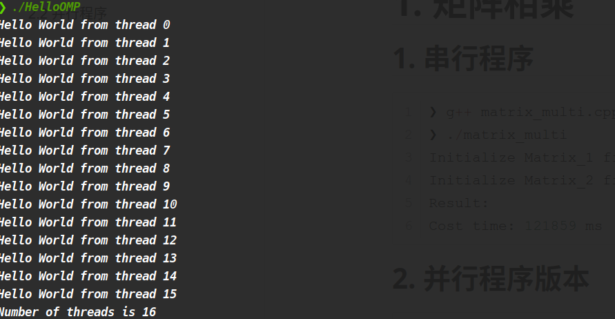
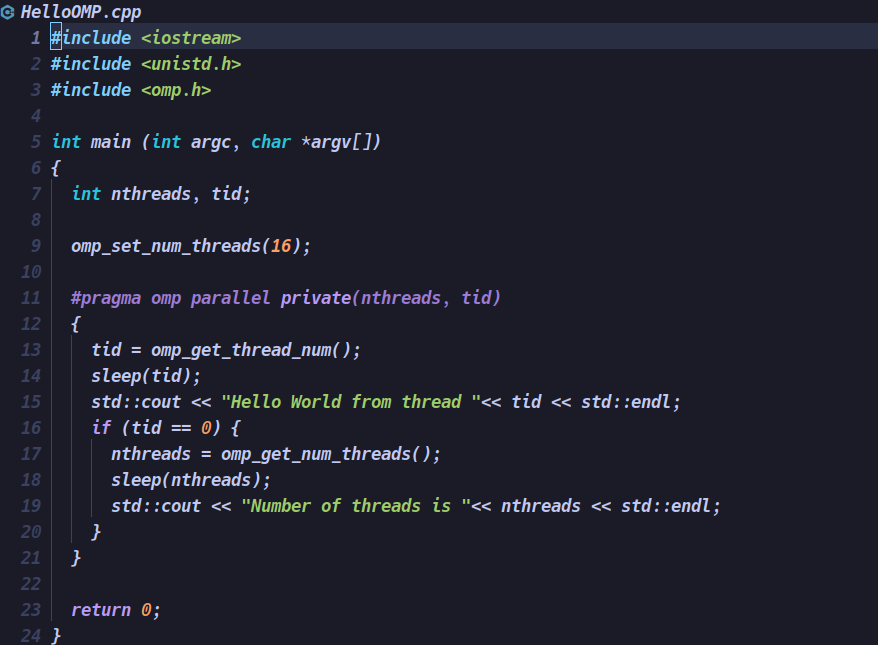

# 1. `OpenMP`程序的编译和运行

## 1.1 执行结果：



## 1.2 相关代码：



# 2. 矩阵乘法的`OpenMP`实现与性能分析

## 2.1 串行程序执行结果

```C++
❯ g++ matrix_multi.cpp -o matrix_multi
❯ ./matrix_multi
Initialize Matrix_1 finished
Initialize Matrix_2 finished
Result: 
Cost time: 121859 ms
```

## 2.2 并行程序版本执行结果

```C++
#pragma omp parallel for shared(a, b, result) private(j, k) schedule(dynamic)  
    // #pragma omp parallel for 
    for (i = 0; i < max; i++) {
      for (j = 0; j < max; j++) {
        int temp = 0;
        for (k = 0; k < max; k++) {
          temp += a[i][k]* b[k][j];
        }
        result[i][j] = temp;
      }
    }
```

```output
❯ lvim matrix_multi_parallel_v1.cpp
❯ g++ -fopenmp matrix_multi_parallel_v1.cpp -o parallel_v1
❯ ./parallel_v1
Initialize Matrix_1 finished
Initialize Matrix_2 finished
Result: 
Cost time: 20700 ms
The Max of error is :0
Average Error is :0
```

我们经过计算可以得到加速比为5.89。

## 2.3 测试性能

### 2.3.1 线程数量一定，矩阵规模不一定

**线程数量一定为8；**

| 矩阵大小       | 200*200 | 1500*1500 | 2000*2000 | 2500*2500 |
| :------------- | ------- | --------- | --------- | --------- |
| 运行时间（ms） | 36      | 8219      | 20698     | 43692     |

### 2.3.2 矩阵规模一定，线程数量不一定

**矩阵规模一定为2000*2000；**

| 线程数量       | 1      | 2     | 4     | 8     | 16    |
| -------------- | ------ | ----- | ----- | ----- | ----- |
| 运行时间（ms） | 100610 | 50251 | 25862 | 20698 | 21643 |


# 3. 通过积分计算π

求出$\int_{0}^{1}\frac{4}{1+x^{2}}\frac{\mathrm{d} }{\mathrm{d} x}$的值。

## 2.1 串行程序

```C++
#include <iostream>
#include <chrono>

using namespace std;

static long num_step = 100000000;
double step;
int main (int argc, char *argv[])
{
  int i;
  double x, pi, sum = 0.0;
  
  step = 1.0/(double) num_step;

  
  chrono::milliseconds start_time = chrono::duration_cast<chrono::milliseconds>(chrono::system_clock::now().time_since_epoch());
  for (i = 0; i < num_step; ++i) {
    x = (i + 0.5) * step;
    // x = (i + 0.4) * step;
    sum = sum + 4.0/(1.0 + x * x);
  }
  chrono::milliseconds end_time = chrono::duration_cast<chrono::milliseconds>(chrono::system_clock::now().time_since_epoch());
  pi = step * sum;
  
  std::cout <<"The result: "<< pi << std::endl;
  cout << "cost time: " <<  chrono::milliseconds(end_time).count() - chrono::milliseconds(start_time).count() << "ms" << endl;

  return 0;
}
```

运行结果：

```C++
❯ g++ first.cpp -o first
❯ ./first
The result: 3.14159
cost time: 215ms
```

## 2.2 并行程序

```C++
#include <iostream>
#include <chrono>
#include <omp.h>
using namespace std;

static long num_step = 100000000;
double step;
#define NUM_THREADS 8
int main (int argc, char *argv[])
{
  
  double pi = 0.0;
  step = 1.0/(double) num_step;
  int number;

  
  chrono::milliseconds start_time = chrono::duration_cast<chrono::milliseconds>(chrono::system_clock::now().time_since_epoch());
  omp_set_num_threads(NUM_THREADS);
  #pragma omp parallel
  {
    int i, id, nthreads;
    double x, sum;
    id = omp_get_thread_num();
    nthreads = omp_get_num_threads();
    if (id == 0) {
      number = nthreads;
    }
    #pragma omp for
    for (i = 0; i < num_step; ++i) {
      x = (i + 0.5) * step;
      // x = (i + 0.4) * step;
      sum = sum + 4.0/(1.0 + x * x);
    }
    #pragma omp critical
    pi = step * sum;
  }
  chrono::milliseconds end_time = chrono::duration_cast<chrono::milliseconds>(chrono::system_clock::now().time_since_epoch());
    
  std::cout <<"The result: "<< pi << std::endl;
  cout << "cost time: " <<  chrono::milliseconds(end_time).count() - chrono::milliseconds(start_time).count() << "ms" << endl;

  return 0;
}

```

程序执行结果：

```C++
❯ ./PI_Parallel_v2
The result: 3.14159
cost time: 52ms
```

我们经过计算可以得到加速比为4.13.
