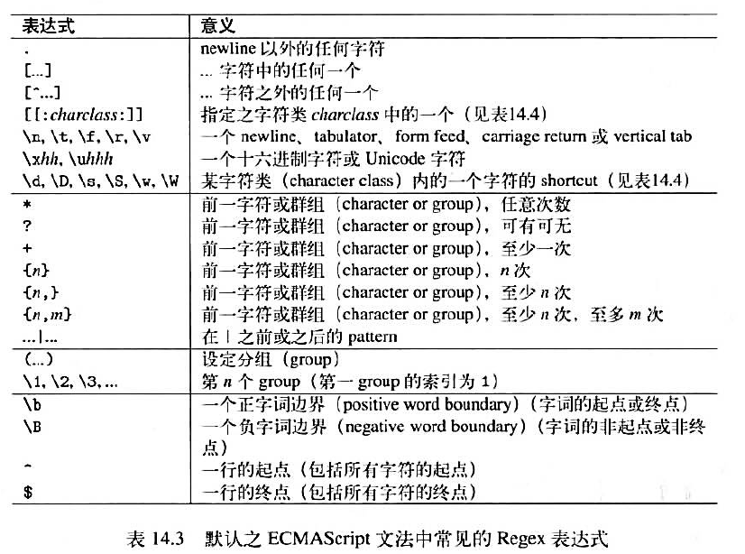
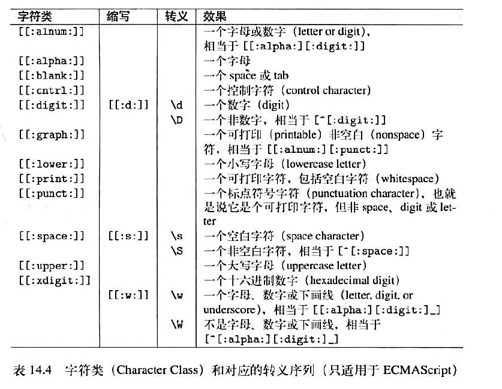
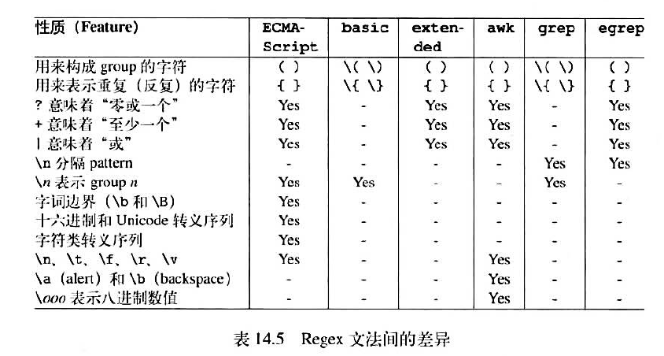
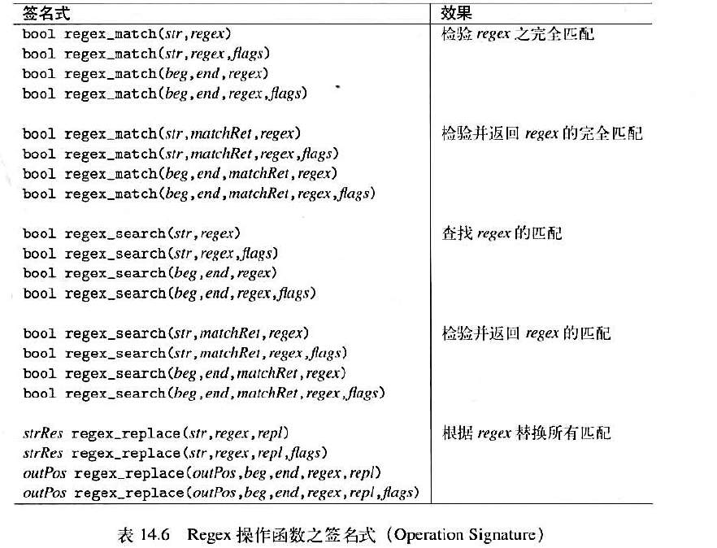

# 1. `regex_match`

<h4>1.1 match和search不一样的是，match是全文匹配，要求整个字符串符合匹配规则。</h2>

```C++
cout << regex_match("123", regex("\\d")) << endl;		//结果为0
cout << regex_match("123", regex("\\d+")) << endl;		//结果为1

// 函数返回结果为bool值
```

- `\d`表示匹配一个数字字符；
- `+`表示匹配前面的一个或者多个表达式；

<h4>1.2 匹配结果</h4>

如果需要获得匹配的结果，并且对结果进行操作，这时候就需要对匹配结果进行存储，一共有两种存储方式：

```C++
match_results<string::const_iterator> result;

smatch result;// 推荐使用
```

```C++
// 博客代码：
string str = "Hello_2018";
smatch result;
regex pattern("(.{5})_(\\d{4})");	//匹配5个任意单字符 + 下划线 + 4个数字

if (regex_match(str, result, pattern))
{
	cout << result[0] << endl;		//完整匹配结果，Hello_2018
	cout << result[1] << endl;		//第一组匹配的数据，Hello
	cout << result[2] << endl;		//第二组匹配的数据，2018
	cout<<"结果显示形式2"<<endl;
	cout<< result.str() << endl;	//完整结果，Hello_2018
	cout<< result.str(1) << endl;	//第一组匹配的数据，Hello
	cout << result.str(2) << endl;	//第二组匹配的数据，2018
}

//遍历结果
for (int i = 0; i < result.size(); ++i)
{
	cout << result[i] << endl;
}
```

# 2. `regex_search`

<h4>2.1 基本概念</h4>

search是搜索字符串中存在符合规则的子字符串。

```C++
cout << regex_match("123", regex("\\d")) << endl;		//结果为0
cout << regex_search("123", regex("\\d")) << endl;		//结果为1
```

如果在目标字符中寻找到了符合相应规则的子字符串，则返回第一个匹配的子字符串的相关信息。

```C++
//regex/regex2.cpp
#include <string>
#include <regex>
#include <iostream>
using namespace std;

int main (int argc, char *argv[])
{
  string data = "<person>\n"
                " <first>Nico</first>\n"
                " <last>Jone</last>\n"
                "</person>\n";


  regex reg("<(.*)>(.*)</(\\1)>");

  smatch m;
  // 1. 这里就可以体现出regex_search 和regex_match之间的区别所在，一个regex_match 检验所有的字符串是否符合我们定义的模式
  // 另一个是检验目标字符串中是否含有符合我们定义的模式的子字符串, 如果说目标字符串中存在匹配的字符串，那么会返回第一个
  // 匹配结果的相关信息
  bool found = regex_search(data,
                          m,
                          reg);

  // 2. 使用迭代器来表明目标字符串的范围
  string::const_iterator iterStart = data.begin();
  string::const_iterator iterEnd = data.end();

  for (; regex_search(iterStart, iterEnd, m, reg); iterStart = m[0].second) {
    cout << "match:     " << m.str() << endl; 
    cout << "tag:       " << m[1] << endl;
    cout << "value:     " << m[2] << endl;
  }

  return 0;
} 
```

> 输入结果：
>
> ```C++
> match:     <first>Nico</first>
> tag:       first
> value:     Nico
> match:     <last>Jone</last>
> tag:       last
> value:     Jone
> ```

# 3. `regex_replace`

<h4>3.1 基本概念</h4>

replace是替换匹配，即将那些符合规则的子字符串替换为其他的字符串。

```C++
string str = "Hello_2018!";
regex pattern("Hello");	
cout << regex_replace(str, pattern, "") << endl;	//输出：_2018，将Hello替换为""
cout << regex_replace(str, pattern, "Hi") << endl;	//输出：Hi_2018，将Hello替换为Hi
```

***除了可以直接替换之外，还可以用来调整字符串内容（缩短、顺序等）。***

```C++
string str = "Hello_2018!";	
regex pattern2("(.{3})(.{2})_(\\d{4})");				//匹配3个任意字符+2个任意字符+下划线+4个数字
cout << regex_replace(str, pattern2, "$1$3") << endl;	//输出：Hel2018，将字符串替换为第一个和第三个表达式匹配的内容
cout << regex_replace(str, pattern2, "$1$3$2") << endl;	//输出：Hel2018lo，交换位置顺序
```

# 4. 给正则表达式添加条件限制

有的时候，我们希望能够匹配的时候忽略大小写，这个时候就要用到`Regex`的语法选项了。

```C++
cout << regex_match("aaaAAA", regex("a*", regex::icase)) << endl;	//结果为1
cout << regex_match("aaaAAA", regex("a*")) << endl;					//结果为0
```

`regex::icase`：匹配时忽略大小写。

# 5. 文法

就是书写正则表达式的规则，有很多种，我们默认使用的文法是`RegexECMAScript`文法，它比其他所有的文法的威力都要强大得多。







# 6. `Regex`函数签名



> 参考文章：
>
> https://blog.csdn.net/qq_34802416/article/details/79307102