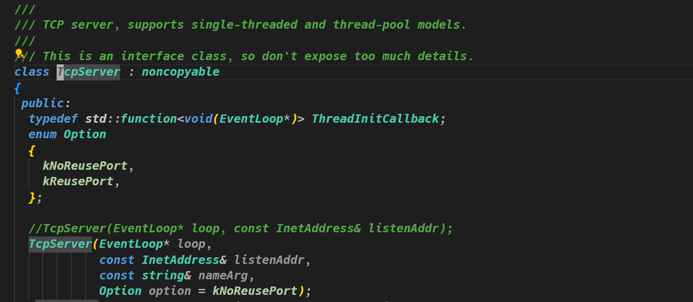

# Muduo Learning

# 0. Introduction to Muduo

`muduo`网络库主要提供三个类：

- `EventLoop`类，事件循环类，负责事件的分发和处理。它会不断地等待事件的发生，然后调用相应的回调函数来处理这些事件。在Muduo网络库当中，事件主要是指的是网络I/O事件，例如连接、接受数据、发送数据等等。而且`EventLoop`使用底层的`epoll`等系统调用实现了`I/O`多路复用机制，以监听多个文件描述符上的事件，从而提高了网络I/O的效率和性能；
- `TcpServer`类，用来创建和管理TCP服务器的重要组件。它封装了底层的网络细节，使得用户以方便的构建高性能的TCP服务器应用程序。
  - **监听连接**：`TcpServer` 负责监听指定的端口，等待客户端的连接请求。一旦有客户端连接请求到达，`TcpServer` 就会接受连接，并创建一个 `TcpConnection` 对象来处理该连接；
  - **管理连接**：`TcpServer` 维护了一个连接管理器，用于管理所有与服务器建立的连接。它负责创建新的 `TcpConnection` 对象，并且在连接建立或断开时进行管理和维护；
  - **事件分发**：`TcpServer` 使用事件驱动的模式来处理网络事件，它会将收到的网络事件（如新连接、数据到达等）分发给用户注册的回调函数来处理。这些回调函数通常包括连接建立、连接断开、收到数据等；
  - **回调函数注册**：用户可以通过 `TcpServer` 提供的接口来注册一系列回调函数，用于处理不同的网络事件。例如，可以注册一个回调函数来处理新连接建立事件，另一个回调函数来处理数据到达事件；
  - **多线程支持**：`TcpServer` 支持多线程模式，可以通过设置线程数量来控制服务器的并发处理能力。在多线程模式下，`TcpServer` 会将连接分配给不同的线程处理，从而提高了服务器的并发处理能力;
- `TcpClient`类，用于创建和管理 TCP 客户端的重要组件。它封装了底层的网络细节，使得用户可以方便地构建高性能的 TCP 客户端应用程序。
  - **发起连接**：`TcpClient` 负责与服务器建立连接。用户可以通过调用 `TcpClient` 的 `connect()` 方法来发起与服务器的连接请求；
  - **管理连接**：一旦连接建立成功，`TcpClient` 会创建一个 `TcpConnection` 对象来管理该连接。它负责监视连接状态，并在连接断开时进行重连等操作；
  - **事件分发**：`TcpClient` 使用事件驱动的模式来处理网络事件。它会将收到的网络事件（如连接建立、连接断开、收到数据等）分发给用户注册的回调函数来处理。用户可以注册回调函数来处理不同的网络事件；
  - **重连机制**：`TcpClient` 提供了重连机制，当连接断开时，它会自动尝试重新连接服务器。用户可以通过设置重连间隔和最大重连次数来控制重连的策略；
  - **心跳检测**：`TcpClient `可以定期发送心跳消息给服务器，以检测连接的状态。如果长时间没有收到服务器的响应，`TcpClient` 可以关闭连接并尝试重新连接；

`muduo`库当中的核心思想：`epool` + 线程池 + 事件驱动；


# 1. How to use it in our projects?

## 1.1 Create a simple echo server.

### 1.1.1 Import relative classes.

1. First we should import the TcpServer and EventLoop:

```C++
#include <muduo/net/EventLoop.h>
#include <muduo/net/InetAddress.h>
#include <muduo/net/TcpServer.h>
using namespace muduo;
using namespace muduo::net;

class EchoServer {
public:
private:
  TcpServer _server;
  EventLoop* _loop;
};
```

### 1.1.2 Implement the constructor

2. Then we should implement the constructor:

We can first find out which parameters the _server needs.



From above picture we can find we need these parameters: 

- @parameter loop, the eventloop;
- @parameter listenAddr, the IP and PORT we bind the server;
- @parameter nameArg, the name of server ;
- @parameter option, let it alone;

So we should pass these parameters to the constructor:

```C++
ChatServer(EventLoop *loop, const InetAddress &listenAddr,
             const std::string &nameArg)
      : _server(loop, listenAddr, nameArg), _loop(loop) {}
```

### 1.1.3 Register the callback functions

3. Then we should register the callback functions in the constructor to handle the requests from clients:

- register the connection callback function, this function will be called when the client connect and disconnect;

```c++
ChatServer(EventLoop *loop, const InetAddress &listenAddr,
             const std::string &nameArg)
      : _server(loop, listenAddr, nameArg), _loop(loop) {
		_server.setConnectionCallback(const ConnectionCallback& cb);        
}
```

> Notes: The `setConnectionCallback`function's parameter is `const ConnectionCallback& cb`. 
>
> ```C++
> typedef std::function<void (const TcpConnectionPtr&)> ConnectionCallback;
> ```
>
> Attention! The function only has one parameter, so if we need pass two parameters function we need to use `std::bind()` to solve it.

We define the callback function:

```C++
class ChatServer {
public:
  ...
private:
  void onConnection(const TcpConnectionPtr& connection) {
    // output the message about the connection
    if (connection->connected()) {
      std::cout << connection->peerAddress().toIpPort() << "->"
                << connection->localAddress().toIpPort() << " status is ONLINE"
                << std::endl;

    } else {
      std::cout << connection->peerAddress().toIpPort() << "->"
                << connection->localAddress().toIpPort() << " status is OFFLINE"
                << std::endl;
      connection->shutdown();
      // _loop->quit();
    }
  }
}
```

We note the function has two parameters: `this` and `connection`.So we should use `std::bind()` to solve it:

```C++
class ChatServer {
public:
  ChatServer(EventLoop *loop, const InetAddress &listenAddr,
             const std::string &nameArg)
      : _server(loop, listenAddr, nameArg), _loop(loop) {
    //...
    _server.setConnectionCallback(
        std::bind(&ChatServer::onConnection, this, _1));
    //...
  }
private:
  //...
}
```

- register the message function callback, this will be called when receive a message or send one.

```c++
ChatServer(EventLoop *loop, const InetAddress &listenAddr,
             const std::string &nameArg)
      : _server(loop, listenAddr, nameArg), _loop(loop) {
    // connection callback function setting:
		_server.setConnectionCallback(const ConnectionCallback& cb);  
    // connection callback function setting:
    _server.setMessageCallback(
        std::bind(&ChatServer::onMessage, this, _1, _2, _3));
}
```

We can press key `gd` to see the definition of function `setMessageCallback`:

```c++
// TcpServer.h
/// Set message callback.
/// Not thread safe.
void setMessageCallback(const MessageCallback& cb)
{ messageCallback_ = cb; }

// Callbacks.h
// the data has been read to (buf, len)
typedef std::function<void (const TcpConnectionPtr&,
                            Buffer*,
                            Timestamp)> MessageCallback;
```

Then we can define our callback function in the class:

```c++
class ChatServer{
public:
private:
  void onMessage(const TcpConnectionPtr &connection, Buffer *buffer,
                 Timestamp timestamp) {
    std::string buf = buffer->retrieveAllAsString();
    std::cout << "recv data: " << buf << "time:" << timestamp.toString()
              << std::endl;
    connection->send(buf);
  }
}
```

Then we use it in the constructor:

```c++
class ChatServer {
public:
  ChatServer(EventLoop *loop, const InetAddress &listenAddr,
             const std::string &nameArg)
      : _server(loop, listenAddr, nameArg), _loop(loop) {
    //...
    _server.setMessageCallback(
        std::bind(&ChatServer::onMessage, this, _1, _2, _3));
    //...
  }
private:
  //...
}
```

### 1.1.4 Set the number of thread on server

We should set the number of thread on server. And the eventloop will has a simple thread for work, and other threads will be used to handle other requests.

```C++
class ChatServer {
public:
  ChatServer(EventLoop *loop, const InetAddress &listenAddr,
             const std::string &nameArg)
      : _server(loop, listenAddr, nameArg), _loop(loop) {
    //...
    _server.setThreadNum(8);
    //...
  }
private:
  //...
}
```

### 1.1.5 Start the server

Then we should call `_server.start()`to start the server:

```C++
class ChatServer {
public:
  //...
  void start() { _server.start(); }
  //...
private:
  //...
}
```

Finally, we can use this class in `main` function like this:

```c++
int main(int argc, char **argv) {
  EventLoop loop; // epoll
  InetAddress addr("127.0.0.1", 6000);
  ChatServer server(&loop, addr, "ChatServer");
  // listenfd epoll_ctl => epoll
  server.start(); 
  // set the event loop to run
  // the same as epoll_wait
  loop.loop();
}
```


 