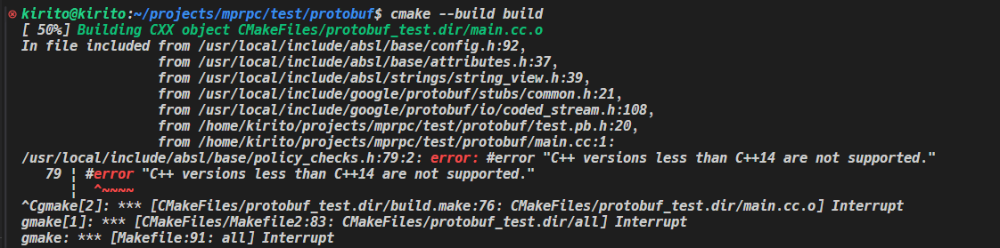

# Protobuf Learning

## 1. [Introduction](https://github.com/protocolbuffers/protobuf)

Protocol Buffers (a.k.a., protobuf) are Google's language-neutral, platform-neutral, extensible mechanism for serializing structured data. You can learn more about it in [protobuf's documentation](https://protobuf.dev/).

This README file contains protobuf installation instructions. To install protobuf, you need to install the protocol compiler (used to compile .proto files) and the protobuf runtime for your chosen programming language.

## 2. How to install?

***2.1 The LATESET VERSION:***

> [!WARNING]
>
> If you choose the latest VERSION to install, the C++ version must more than C++14.
>
> If you don't do this, it will occur the error:
>
> 

Install the Protobuf compiler: https://github.com/protocolbuffers/protobuf/blob/main/src/README.md

Install the Protobuf Runtime: https://github.com/protocolbuffers/protobuf/tree/main/src

```shell
# get the source codes
git clone https://github.com/protocolbuffers/protobuf.git
cd protobuf
git submodule update --init --recursive

# using CMake to compile and install it
# set the cpp standard:
cmake . -DCMAKE_CXX_STANDARD=14
cmake --build . --parallel 10
# install it 
sudo make install
```

After install, we can check the protobuf version and protoc version:

```shell
kirito@kirito:~$ grep GOOGLE_PROTOBUF_VERSION /usr/local/include/google/protobuf/stubs/common.h 
#define GOOGLE_PROTOBUF_VERSION 5027000
#define GOOGLE_PROTOBUF_VERSION_SUFFIX "-dev"
  ::google::protobuf::internal::VerifyVersion(GOOGLE_PROTOBUF_VERSION, __FILE__)
kirito@kirito:~$ protoc --version
libprotoc 27.0-dev
```

> [!IMPORTANT]
>
> If you find the two version don't same, I suggest you to make them same(reinstall one of them) because it will occurs error when you compile your source codes.

***2.2 The old VERSION install:***

以`3.20.0`版本为例：

```shell
# First get the source codes:
wget https://github.com/protocolbuffers/protobuf/releases/download/v3.20.0/protobuf-all-3.20.0.tar.gz

# unzip it and enter:
tar -zvxf protobuf-all-3.20.0.tar.gz
cd protobuf-all-3.20.0
# generate the configure file
./autogen.sh

./configure

# compile the source codes, it will cost much time, so be patient
# (let it alone the warnings in the compiling)
make 
# check the compile result:
make check
      # if you pass, it will display:
      PASS: protobuf-test
      PASS: protobuf-lazy-descriptor-test
      PASS: protobuf-lite-test
      PASS: google/protobuf/compiler/zip_output_unittest.sh
      PASS: google/protobuf/io/gzip_stream_unittest.sh
      PASS: protobuf-lite-arena-test
      PASS: no-warning-test
      ============================================================================
      Testsuite summary for Protocol Buffers 3.20.3
      ============================================================================
      # TOTAL: 7
      # PASS:  7
      # SKIP:  0
      # XFAIL: 0
      # FAIL:  0
      # XPASS: 0
      # ERROR: 0
      ============================================================================
      make[3]: Leaving directory '/home/kirito/github/protobuf/src'
      make[2]: Leaving directory '/home/kirito/github/protobuf/src'
      make[1]: Leaving directory '/home/kirito/github/protobuf/src

sudo make install
# refresh shared library cache.
sudo ldconfig
```


******

## 3. How to use Protobuf?


## Build it with CMake

### 1. Solution1(simple):

***Using the function: `protobuf_generate_cpp()`***

```cmake
cmake_minimum_required(VERSION 3.10)
project(protobuf_test)

set(CMAKE_CXX_STANDARD 11)
set(CMAKE_EXPORT_COMPILE_COMMANDS ON)

find_package(Protobuf 3.20.3 REQUIRED)
message(STATUS "Using protobuf ${Protobuf_VERSION}")
message(STATUS "${Protobuf_INCLUDE_DIRS}")
message(STATUS "${PROTOBUF_LIBRARIES}")
message(STATUS "${Protobuf_PROTOC_EXECUTABLE}")

# the function to generate related files
protobuf_generate_cpp(PROTO_SRCS PROTO_HDRS test.proto)

message(STATUS "${PROTO_SRCS}")
message(STATUS "${PROTO_HDRS}")

get_filename_component(PROTO_PATH ${PROTO_HDRS} DIRECTORY)
message(STATUS "${PROTO_PATH}")

include_directories(${PROTO_PATH})

aux_source_directory(. DIR_SRCS)

add_executable(protobuf_test ${DIR_SRCS} ${PROTO_SRCS})

target_include_directories(protobuf_test PRIVATE ${Protobuf_INCLUDE_DIRS})
target_link_libraries(protobuf_test ${PROTOBUF_LIBRARIES})
```

