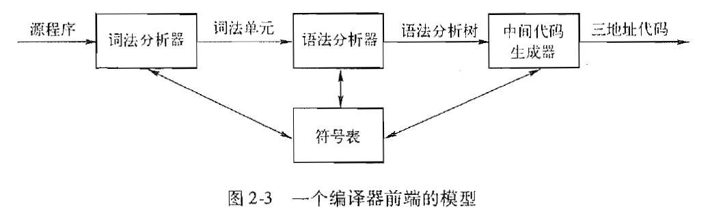
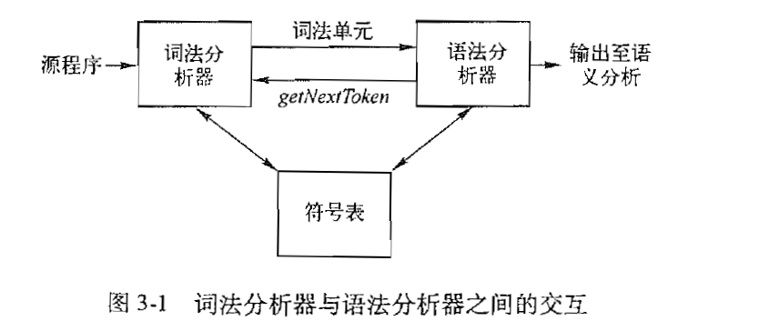

# 1. 语法制导翻译

## 1.1 ***语法的定义：***

> 终结符号、非终结符号。

一个上下文无关文法由四个元素组成：

- 一个终结符号集合；
- 一个非终结符号集合；
- 一个产生式集合；
- 指定一个非终结符号为开始符号；

> 词法单元（***token***） 和 终结符号:
>
> ***token***是由两个部分所组成：名字和属性值。token的名字就是语法分析器进行语法分析时候使用的抽象符号，我们经常将这些词法单元名字称为终结符号。***通常将词法单元和终结符号当作同义词，在实际的编程中，词法分析器会读入我们的字符流，并输出相应的token流给语法分析器，其实返回的token就是所谓的终结符号。***

## 1.2 语言的定义

> 可以从开始符号推导得到的所有的终结符号串的集合称为该文法定义的语言。

## 1.3 语法分析树

> 就是我们利用bison以及上下文无关文法想要去构建的那一棵树。***为一个给定的终结符号串构建一棵语法分析树的过程称为对该符号串进行语法分析。***就是词法分析器会根据我们的输入的字符串流返回一个token流给语法分析器，供其进行语法分析。

## 1.4 二义性

如果一个文法可能有多棵语法分析树能够生成同一个给定的终结符号串，我们就称这样的文法具有二义性。

## 1.5 左递归

> 递归下降语法分析器有可能进入无限循环，当出现如下所示的“左递归”产生式时，分析器就会出现无限循环：
>
> ​		${expr \to expr + term}$
>
> 这个时候最简单的一种解决方法，但是该种方法并不能解决所有的左递归，因为有的左递归不是直接产生的，而是经过两步或者更多的推导之后才产生的左递归：
>
> ​		${S \to A a \mid b}$
>
> ​		${A \to A c \mid S d \mid \epsilon }$
>
> 因为${S \Rightarrow Aa \Rightarrow Sda}$, 所以说非终结符号S是左递归的，但是他并不是立即左递归的。

***解决直接左递归的简单方法：***

- 存在左递归的产生式：${A \to Aa \mid \beta}$.

- 我们对其进行修改之后的产生式：

  ${A \to \beta R}$

  ${R \to \alpha R \mid \epsilon}$

我们使用了一个新的非终结符号R，并且按照上面的方式进行修改，我们仍然可以达到相同的效果。

# 2. 词法分析

## 2.1 Lex是如何将它的输入程序变成一个词法分析器的

> 转换的核心是被称为有穷自动机的表示方法，有穷自动机又分为两种：
>
> - ***不确定的有穷自动机，NFA；***
> - ***确定的有穷自动机，DFA， 对于每一个状态以及自动机输入字母表中的每个符号，确定的有穷自动机有且只有一条离开该状态、以该符号为标号的边；***

# 3. 语法分析

## 3.1 