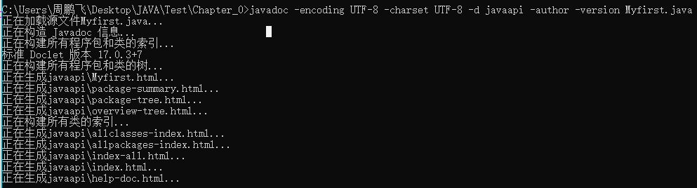
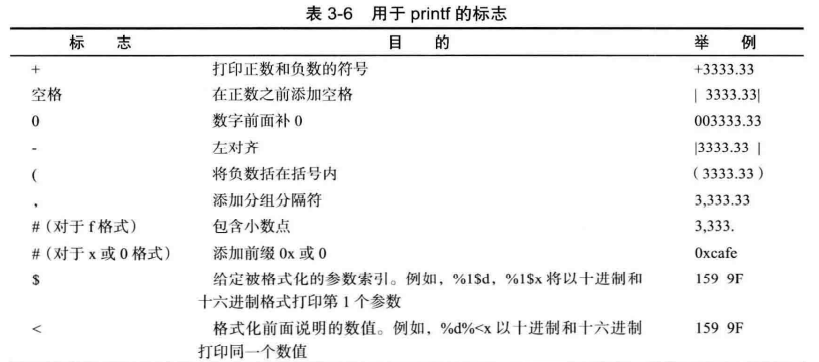
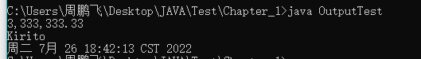
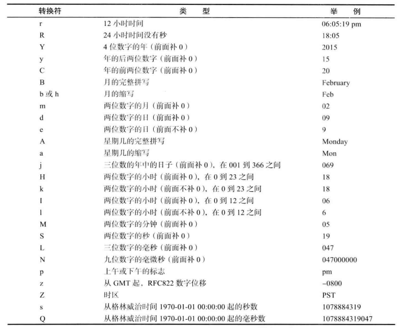
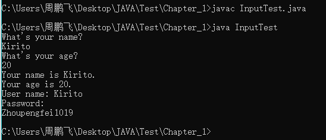
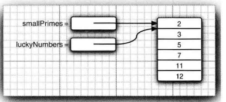

# JAVA_第三章 Java的基本程序设计结构

## 0.第一章 相关问题

### 1.初始问题

*1.编写源代码，文件名为party.java; 由编译器来进行编译，产生party.class文件（该文件是由字节码所组成）；最后启动Java虚拟机（JVM）来运行party.class 文件。*

*2.Java中的int类型和bool类型并不能相容；while(true)和while(1)并不一样，后者不能当作判断语句。*

***3.编译阶段：***

*-编译阶段主要就是检查JAVA源程序是否符合JAVA语法，如果符合的话可以生成相应的字节码文件（xxx.class）,该文件无法直接在操作系统中执行；*

*-程序员首先需要在某一个位置新建一个.java扩展名的文件（JAVA源文件，该文件中编写的就是Java源代码）；*

*-编译的时候，我们需要利用DOS命令使用JDK当中自带的Javac.exe命令来对源文件进行编译；*

*（javac的使用规则：javac java源文件的路径,例如javac ···/party.java；）*

*-使用命令行编译的时候，我们可以使用绝对路径，例如：*

***C:\>javac C:\Users\周鹏飞\Desktop\JAVA\Test\HelloWord.java***

*也可以使用相对路径，就是在Java文件存储的地方，直接打开cmd,那样的话，就可以直接Test目录下操作了，例如：*

***C:\Users\周鹏飞\Desktop\JAVA\Test>javac HelloWord.java***

*-需要我们注意的是，我们运行的时候运行的是.class文件，和之前的.java文件没有关系（删除了也没有关系）；*

*-编译结束后，我们可以讲.class文件拷贝到别的操作系统之中运行（前提是别的操作系统得提前安装好JVM，即Java虚拟机，这就是Java的跨平台）*

***4.运行阶段：***

*-JDK安装之后，除了一个自带的javac.exe之外，还有另一个工具，叫做java.exe；*

*-同样的，我们在运行的时候，一样在DOS窗口利用DOS命令来运行的；*

*-运行的时候，一定要注意java命令后面跟的不是文件路径，而是一个类的名字，而且更重要的是：*

***-我们需要先将DOS窗口中的目录切换到HelloWord.class文件所在目录；***

*-也可以不切换，不过首先我们得先配置一个环境变量，像之前那样配置javac一样那样，只不过我们现在配置的是.class文件的路径，但是配置之后也有弊端啊，就是以后运行的时候，只会去我们配置的路径寻找文件，别的地方都不去寻找！！！！*

*（java的使用规则：java 类名，例如比如硬盘上有一个party.class文件，那么我们运行的时候就是：java party）*

*PS：java.exe命令会启动Java虚拟机（JVM），JVM会启动类加载器ClassLoader,该加载器会去硬盘上搜索party.class文件，然后将该文件的字节码装载到JVM之中，JVM将字节码文件解释为二进制101010101这样的数据，然后操作系统执行二进制和底层硬件平台进行交互。*

*5.额外补充：*

*-windows操作系统是如何搜索硬盘上某一个命令的呢？*

*-首先会从当前目录下搜索，接着如果当前目录搜索不到的话，就去环境变量path指定的路径上去搜索；*

*（classpath环境变量是Java特有的环境变量，是给类加载器指路的。）*

*-如果都搜索不到的话，就会出现报错；*

*-所以很多我们使用的软件，在使用之前都需要进行环境变量配置，尤其是和DOS窗口打交道的软件；*

***5.JAVA和C++的不同之处：***

*-一个最大的不同就是，Java没有了C++中的头文件了，意思就是在Java中不需要再像C++一样当我们需要什么输出输入函数的时候，需要先包含iostream头文件等等。在Java中，我们只需要直接去调用包含这个函数的类即可；*

*-还有就是Java中不再有类似于指针运算的东西，甚至指针语法都没有；*

*-Java中也没有操作符重载这一类的内容，虚基类也没有；*

***-Java中还有一个很重要的不同就是，类与类之间不再有多重继承一类的，取而代之的是简单的接口概念；***

### 2.每一个类都可以有自己的主函数以及自己的入口

*比如下面这个例子：*

```java
//每一个类都可以有自己的主函数，然后该源文件编译后，会生成A、B、C、D四个.class文件
//如果我们想要从下面某一个类的入口进去执行的话，就直接调用相对应的.class文件
//比如java A
//比如java B等等

//当然了，在实际开发的时候，一个软件是不可能有很多个执行入口的，所以说实际用途的时候main方法只要有一个就行了
//下面仅仅是一个测试
class A
{
	public static void main(String [] args){
		System.out.println("A");
	}
}

class B
{
	public static void main(String [] args){
		System.out.println("B");
	}
}

class C
{
	public static void main(String [] args){
		System.out.println("C");
	}
}

class D
{
	public static void main(String [] args){
		System.out.println("D");
	}
}
```

### 3.javadoc注释文档的使用

*生成一些对源代码文件的注释文件！*

*格式是：javadoc -encoding UTF-8 -charset UTF-8 -d javaapi -author -version 提取的文件名.java*

```java
-encoding UTF-8 -charset UTF-8
//使编码格式为UTF-8，字符格式为UTF-8，解决GBK乱码问题
```


*javaapi是将生成的帮助文档存放的文件名，author和version是如果有作者和版本信息的话，就将其提取出来，后面的是要提取的文件名字。*



*这样的话，我们就有一个和源代码配套的API帮助文档，如下图所示：*


*当然了，利用IDEA软件也可以进行相关的操作，暂且不讲！*

## 1.第二章 对标识符和关键字的理解

### 1.1 对标识符的理解

*在Java程序中，使用编写工具进行代码编写的时候，有的单词是蓝色、有的单词是红色、还有的单词是绿色、还有的是黑色、紫色、粉色···*

*高亮颜色中，颜色为黑色的单词属于标识符。*

*标识符可以标识类名、方法名、变量名、接口名、常量名等等。*

*（凡是程序员有权利自己命名的单词都是标识符）*

*标识符只能由数字、下划线、字母（包括汉字）、美元$符号组成，不能含有其他符号，标识符中不能含有空格。*

*标识符不能以数字作为开头，和C++是一样的。*

***我们编写代码的时候不仅仅要遵循规则（相当于现实中的法律），还要遵循规范（相当于现实生活中的道德，便于其他人理解）！***

***规范：见名知意，就是命名要易于理解；驼峰命名，就是首字母得大写；类名和接口名首字母大写，后面每一个单词都得大写；变量名、方法名首字母小写，后面的每个单词首字母大写；常量名是全部都得大写，单词与单词之间采用下划线衔接；***

### 1.2 对关键字的理解

*就是其中在开发Java的时候已经定义好的具有特殊意义的单词，不能拿来用作标识符。*

## 2.第三章 基础程序设计结构

### *2.1 基础知识*

*1.0 在Java中，bool类型的数据替换为boolean,而且Java中的int类型的数据和boolean类型的数据并不相通，不能像下面这样做：*

```java
int x = 1;
while(1){}
```

*只能利用boolean类型的变量或者boolean测试来判断：*

```java
boolean isTrue = true;
int x = 4;
while(isTrue){}
//或者向下面这样
while(x == 4){}
```

*1.1 在Java中，Java是完全面向对象的语言，所有的内容都包含在类中，包括主函数main也在类中，一个程序只需要一个main来运行：*

```java
public class HelloWord{
	public static void main(String[] args){
		System.out.println("Hello,Word!");
		}
}
//函数的输出有println和print两种，二者的区别在于前者输出的时候，会在最后面插入换行，让后续的输入以新的一行开始!
//主函数入口出args变量名是可以修改的；
```

***1.2 文件名和公共类的名字**：*

*我们在编写代码的时候，一定要注意，我们在文件中声明的类是公共的话，那么该类必须和文件名字保持一致。而且在A.java中我们可以定义很多个类，但是其中只允许定义一个顶级的公共类，该类的名字和该文件必须保持一致。*

***1.3 注释：***

*Java和C++注释是一样的。*

```java
//单行注释；
/*
多行注释；
*/

/**
*类的注释信息
*@version 1.0
*@author 
*该注释是可以被javadoc.exe解析识别并提取到帮助文档当中的。
*/
```

***1.4 命名规范：***

*标准的命名规范为，类名是以大字母开头的名字。如果名字是由多个单词组成的话，那么每一个单词的第一个字母都必须大写，例如：FirstSample等等。*

***1.5 方法的调用：***

*在该处的代码，System.out对象调用了它的println方法,并且传入一个字符串参数。在Java中我们使用（.）来调用方法。*

```java
System.out.println("Hello,Word!");
```

### ***2.2 数据类型***

*Java一共有8种基本类型，有4种整型、2种浮点类型、1种用于表示Unicode编码的字符单元的字符类型char，以及还有一个表示真值的boolean类型。*

***2.1 整型***

*byte（**1字节**）、short（**2字节**）、int（**4字节**）、long（**8字节**）*

*整型用来表示没有小数部分的数值，可以是负数，所以在Java中没有任何无符号形式的int、long、short、byte类型。*

*byte  b = 2,在计算机中表示为0000_0010（对应计算机中1个字节）;*

*short b = 2，在计算机中表示为0000_0000 0000_0010（对应计算机中两个字节）；*

*int b = 2，在计算机中表示为0000_0000 0000_0000 0000_0000 0000_0010（对应计算机中4个字节）；*

***2.2 浮点类型***

*float（**4字节**）、double（**8字节**）*

***2.3 char类型（2字节）***

*就正常之前所学习的char类型。*

*（采用unicode编码方式，具体的实现即UTF-8、UTF-16、UTF-32等等）*

*字面量使用单引号，不能使用双引号。*

*一个汉字使用两个字节来存储，这里刚好字符char可以容纳一个汉字，这一点和C语言是不一样的！*

***2.4 boolean 类型（1字节）***

*Boolean类型有两个值：false和true，用来判定逻辑条件。但是需要注意的是Java和C++不一样的是Java中的boolean值不能使用数值或者指针来代替！！*

***2.5 枚举类型***

*有的时候，变量的取值只能在一个有限的集合中，虽然我们可以进行编码，但是变量中还是很可能保存的是一个错误的不位于我们所定集合中的值，针对这一种情况，我们可以自定义枚举类型。枚举类型包括有限个命名的值。比如下列例子：*

```java
//自定义枚举类型
enum Size{SMALL,MEDIUM,LARGE,EXTRA_LARGE};
//声明该类型的变量
Size s = Size.MEDIUM;
```

### 2.3 变量

*在Java中不区分变量的声明和定义。*

### 2.4 常量

*Java和C++不一样的是，Java利用关键字final指示常量。并且我们习惯上常量名字使用全大写字母。*

```java
public static void main(String[] args){
		final double TEST = 2.54;//使用final来指示常量，和C++一样，常量不能被改变；
}
```

*在Java中，我们如果想要某个常量在一个类中的多个方法中使用，则我们需要利用关键字**static final**设置一个类常量。类常量要定义在main方法的外部，所以在同一个类中的其他方法也可以使用这个常量。而且，如果一个常量被声明为public的话，则在不同类的方法也可以使用这个常量。*

```java
//示例：
public class HelloWord{
	//main函数
	public static final double TEST = 5.21;
	public static void main(String[] args){
		System.out.println("Hello,Word!");
		System.out.println(TEST);
		test();
	}
	static int test(){
		System.out.println("测试成功！"+TEST);
		return 0;
	}
}
```

### 2.5 运算符

*整数除以0会出现异常报错，但是可以通过编译。但是浮点数除以0将会得到无穷大或者NaN结果。*

***所有的浮点数计算都遵循IEEE754规范，其中Java中有三个特殊的浮点数值：正无穷大、负无穷大和NaN(不是一个数字)，这三个数字用来表示溢出和出错情况的结果。而且我们需要注意的是，所有”非数值“的值都是不同的，所以说我们不能利用下面的方式来检测一个特定的值是否等于Double.NaN:***

```JAVA
if(x == Double.NaN)//is never true
```

*我们要想进行检测的话，可以利用Double.isNaN函数（方法）来进行判断：*

```java
if(Double.isNaN(X))//用来检查x是否不是一个数字，即检查x是否为NaN
```

*我们使用该函数的典型情况是检查parseInt和parseFloat方法的返回值。*

*parseInt函数的用法可以参照CSDN上面的文章，该函数主要含有两个参数，一个是字符串string，另一个是进制数radix。将指定字符串转换为相应进制的数字。（2<=radix<=32,如果不在该范围之内的话，该函数就返回NaN）*

*以下内容为除数为0时候的测试：（ps：被除数为整数时，自然会报错；但是为浮点数的话就不一样了。）*

*（1）1.0/0（浮点数/0）：*

```java
public class Test
{ 
	public static void main(String[] args)
	{ 
		System.out.println(1.0/0); 
	} 
}
//输出结果为Infinity,即正无穷大
```

*（2）-1.0/0：*

```java
public class Test
{ 
	public static void main(String[] args)
	{ 
		System.out.println(-1.0/0); 
	} 
}
//输出结果为-Infinity,即负无穷大
```

*（3）0.0/0：*

```java
public class Test
{ 
	public static void main(String[] args)
	{ 
		System.out.println(0.0/0); 
	} 
}
//这里如果是0/0的话，编译不会报错，但是运行的过程会报错；
//如果是0.0/0的话编译正常通过，运行正常，最终输出结果是NaN；
```

*ps:在Java中自增和自减运算符和在C++中差不多，++n（前缀）和n++（后缀），前缀形式的时候，先进行加法后进行运算；后缀形式的时候，先进行运算后进行加法；*

### 2.6 数学函数

*和C++一个样子，有各种的数学函数可以直接调用，不过和C++唯一的不同是Java不需要包含math.h头文件，直接调用数学类中的静态方法即可。（静态方法和实例方法的区别参考文章：https://m.php.cn/java/guide/480484.html，本质上就是静态方法可以直接通过类来调用，但是实例方法则必须先通过类实例化一个对象，然后通过该对象来调用相应的方法。）*

```java
public class Test
{ 
	public static void main(String[] args)
	{ 
		double y = Math.pow(2,2);
		System.out.println(y); 
		y = Math.sqrt(2);
		System.out.println(y);
		//在Java中还有两个用于表示Π和e常量的近似值；
		System.out.println(Math.E);
		System.out.println(Math.PI);
	} 
}
```

*当然了，我们也可以不在数学方法名和常量名前面添加前缀“Math”，只要在源文件的顶部加上下面这一行代码即可：*

```java
import static java.lang.Math.*;
```

以下例子就是如此：

```java
import static java.lang.Math.*;//类似于C++中导入头文件	那样导入其他的类
// java.lang是默认导入的
public class Test
{ 
	public static void main(String[] args)
	{ 
		double y = pow(2,2);
		System.out.println(y); 
		y = sqrt(2);
		System.out.println(y);
		//在Java中还有两个用于表示Π和e常量的近似值；
		System.out.println(E);
		System.out.println(PI);
	} 
}
```

### 2.7 字符串(String)

#### 2.7.1字符串的相关操作

##### *(1)提取子串；*

```java
String greeting = "Hello!";
String s = greeting.substring(0,3);
//以上操作就是从一个较大的字符串中直接提取出来一个子串，位置是从0开始，直到3未知，但是并不包括3；
```

##### *(2) 拼接字符串；*

```java
String expletive = "Expletive";
String PG13 = "deleted";
String message = expletive + PG13;
//JAVA中的拼接字符串允许+号连接两个字符串
//而且当一个字符串与一个非字符串的值进行拼接的时候，后者被转换为字符串
//任何一个Java对象都可以转换为字符串
```

##### *(3) 定界符分割函数，静态join方法；*

```java
String temp = String.join("/","李四","张三","李五")；	
//第一个参数存放的是分割不同字符串的字符
```

##### *(4) Java中的字符串不可修改，但是可以通过现有的字符串进行操作；*

```java
String greeting = "Hello!";
greeting = greeting.substring(0,3)+"p！";
```

*在Java中，存放在公共存储池中的字符串"Hello!"永远是包含字符H、e、l、l、o、!的代码单元序列，我们不可以修改其中任何一个字符，但是我们可以修改字符串变量greeting，让其引用另一个字符串，就比如将存放3的数值变量改为存放4一样。*

*也可以说是共享字符串，意思就是公共存储池中的字符串”Hello!“,如果大家复制的话，仅仅只指向存放该字符串的位置，但是并不能对该字符串及逆行修改！C++String对象也会自动的进行内存的分配与回收，不会发生内存遗漏！*

##### *(5) Java中的检测字符串是否相等；*

*Java中比较两个字符串是否相同使用equals方法：*

```java
String a = "Hello!";
String b = "Hello!";
//切忌使用==来进行检测，该符号只能检测出两个字符串是否存放在同一个位置，当然了，如果字符串放置在同一个位置，他们必然相等，但是，完全有可能将内容相同的多个字
//符的拷贝放置在不同的位置上，如下面例二所示;
//例1：
if(a==b)
	System.out.println("字符串a和字符串b存放的位置一样！");
else
	System.out.println("字符串a和字符串b存放的位置不一样！");
//结果输出第一个

//例2：
if(a.substring(0,3) == "Hel")
	System.out.println("字符串a和字符串b存放的位置一样！");
else
	System.out.println("字符串a和字符串b存放的位置不一样！");
//结果输出第二个

//例3：
if(a.substring(0,3).equals("Hel"))
	System.out.println("字符串a和字符串b相同");
else
	System.out.println("字符串a和字符串b不相同");
//结果输出第一个


// java中有一个很关键的概念叫做hash值，我们可以理解为一个对象的唯一编码或者摘要值，具体实现可能是内存地址
```

*通过上面测试我们在Java中千万不要去使用==运算符测试字符串的相等性，以免出现bug，保险起见还是使用equals方法；*

*补充：Java中还有一个方法compareTo和C++中的strcmp完全类似，当结果等于0的时候，说明相应的字符串相同！*

```java
if(a.substring(0,3).compareTo("Hel") == 0)
			System.out.println("5.测试compareTo方法\n字符串a和字符串b相同");
		else
			System.out.println("字符串a和字符串b不相同");
```

##### *(6) 空串和null串；*

*空串""是长度为0的字符串，也是一个Java对象，可以其与指定的变量相关联。*

*检查一个字符串是否为空：*

```java
String zeroStr = "";
int length = zeroStr.length();
//返回该字符串的长度，由此也可以知道在Java中字符串对象有自己的串长度以及内容
```

*在Java中由于String本质上相当于一个指针，指向所存储的字符串的位置，所以如果说该"指针"并未指向任何字符串，那么该变量存储一个特殊的值，名为null。这表示目前没有任何Java对象与该变量关联。*

*检查一个字符串是否为null，要使用如下条件：*

```java
//检查一个字符串是否为null
if(str == null)
//检查一个字符串既不是null也不是空串
// 因为一个String类型的变量虽然不是null,但是仍有可能指向一个空串，空串在缓冲区中也是有对应的内存地址的
if(str!=null&&str.length()!=0)
```


### 2.8 Java中的输入和输出

#### 2.8.1 Java中的输出

##### （1）简单输出；

*简单输出的话，就是很简单的调用**print**和**println**方法即可！*

##### （2）格式化输出；

*Java中的格式化输出沿用C语言中的**printf方法**！用法几乎和C语言中的一样！*

*我们可以指定控制格式化输出外观的各种标志，比如说打印整数和负数的符号、在数字的前面补0、添加分组分隔符等等。*



##### （3）printf方法中日期与时间的格式化选项

*这些新的代码，应当使用**java.util**包的方法！*

```java
import java.util.*;
public class OutputTest
{
	public static void main(String [] args){
		double num = 3333333.33333;
		System.out.printf("%,.2f\n",num);

		String name = "Kirito";
		System.out.printf("%s\n",name);

		System.out.printf("%tc",new Date());

	}
}
```






#### 2.8.2 Java中的输入

*Java中的输入和C++中的输入不一样，较之更加的复杂一点！*

```java
public class InputNum
{
	public static void main(String [] args){
		//创建一个键盘扫描器对象
        //然后就可以利用这个扫描器对象进行各种数据的读入，以及对数据进行筛选；
		java.util.Scanner s = new java.util.Scanner(System.in);
		//接受用户的输入，从键盘上接受一个int类型的数据
		int inputUserNum = s.nextInt();
        
        int temp = s.nextInt();
		System.out.println("输入的两个数字为：" + inputUserNum + " " + temp);
		//利用该对象里面的方法next()来读取输入流中的字符串
        String str = s.next();
		System.out.println("输入的字符串为：" + str);
	}

}
//输入的数据最大值为2147483647（整好超过20亿）(1111_1111 1111_1111 1111_1111 1111_1111)，最小值为-21474843648（1111_1111 1111_1111 //1111_1111 1111_1111）
```

***一些常用的读取输入的方法：***

```java
import java.util.*;

//nextLine方法将读取一行输入，包括空格等特殊字符
System.out.print("What is your name?");
String name = in.nextLine();

//next方法将会读取一个单词，以空白符为间断
String firstName = in.next();

//nextInt方法将会读取一个整数
Int age = in.nextInt();

//nextDouble方法将会读取一个浮点数
double test = in.nextDouble();
```

***当然了，上面中最重要的Scanner类是定义在java.util包中，当我们所使用的类不是定义在基本的java.lang包中的话，一定要使用import指令导入相应的包，也可以不导入，但是构造对象的时候，就很麻烦。***

```java
//由于输入是可见的，所以说Scanner类不适用于从控制台读取密码。使用Console类来实现这个目的：
import java.io.*;
Console cons = System.console();
String username = cons.readLine("User name: ");
char[] passwd = cons.readPassword("Password:");

//此时输入密码的时候就是不可见的，如下图所示
```



#### 2.9 Java中的文件输入与输出

##### 2.9.1 Java中的读取文件

*和前面的输入一样，只不过前面的读取输入是从输入流中读取的，构造Scanner对象的时候，可以看见参数是**"System.in"**，后者构造Scanner对象的时候参数是Paths.get()和"UTF-8"，后者读取输入是从文件读取的。*

*Java核心卷一上面使用的是java.nio.file.Path类中的方法，这是比较建议使用的一种方法**Path.of**，这个是和其他函数保持一致，对于下面这一种函数的相关说明如下：*

https://docs.oracle.com/en/java/javase/18/docs/api/java.base/java/nio/file/Paths.html

```java
import java.util.*;
import java.nio.file.*;//
import java.io.*;
public class FileInOut
{
	public static void main(String [] args) throws IOException
	{
		//Scanner in = new Scanner(Paths.get("myfile.txt"),"UTF-8");
		Scanner in = new Scanner(Path.of("myfile.txt"),"UTF-8");
		String temp = in.nextLine();

		System.out.printf("文件中第一行的内容为：%s",temp);

	}

}
```

##### 2.9.2 Java中的写入文件

*写入文件的时候，首先是需要构造一个**PrintWriter对象，**然后就可以利用该对象像输出到System.out一样使用print、println、以及printf命令。*

***注意输入完之后，将该文件输入流关闭，就像C++中的一样！否则的话，文件什么也不会写入！***

```java
import java.io.*;
public class FileInOut
{
	public static void main(String [] args) throws IOException
	{
		String temp = "Hello,Word!";
		PrintWriter out = new PrintWriter("myfile.txt","UTF-8");
		out.println(temp);
		//out.flush();
		out.close();//注意输入完之后，将该文件输入流关闭，就像C++中的一样！
	}
}
```

### 2.9 控制流程

#### 2.9.1 块作用域

*块是指由若干条Java语句组成的语句，并用一对大括号括起来。就是我们平时用到的大括号以及大括号里面的语句，if条件语句，后面可以是一条语句，也可以是多条语句，如果是多条语句的话，就得需要用到我们的块语句。*

#### 2.9.2 条件语句-if

#### 2.9.3 循环语句-while

*和C/C++一样的用法，一个是**while循环**，一个是**do-while循环**。*

#### 2.9.4 确定循环-for

*和C/C++中一样的用法，不过后面会介绍一个foreach循环。*

#### 2.9.5 多重选择：switch语句

*和C/C++完全一样！*

#### 2.9.6 中断控制流程的语句

*这里和**goto**语句有关，goto语句称为无条件转移语句，与汇编中的jmp指令相同，一般的书写格式为：*

```c
judge:
if(getchar()!='\n')
{
    n++;
    goto judge;
}
```

*但是使用goto语句被认为是一种拙劣的程序设计的风格，因为这样设计的程序很可能让人很难看懂。尽管Java的设计者将goto作为保留字，但是实际上并没有打算在语言中使用它。*

*无限制的使用goto语句确实很容易导致错误，但是在有一些的情况下，偶尔的使用goto跳出循环是有益处的，所以在Java中，Java设计者增加了一条新的语句：带标签的break，起作用也相当于goto语句。*

***普通的break语句仅仅跳出一层循环，但是使用带标签的break语句，这样的话可以用于跳出多重嵌套的循环语句，直接跳出去完，不需要一层一层的跳出去。示例：***

```java
read_data:
while(...)
{
    ...
    for(...)
    {
        System.out.print("Enter a number >= 0 : ");
        n = in.nextInt();
        if(n < 0)
            break read_data;
        ...
    }
}
```

### 2.10 大数

*如果基本的整数和浮点数精度不能够满足需求，那么可以使用java.math包中两个很有用的类：**BigInterger**和**BigDecimal**。这两个类可以处理包含任意长度数字序列的数值。**BigInteger**类可以实现任意精度的整数运算，**BigDecimal**可以实现任意精度的浮点数运算。*

```java
import java.math.*;

public class BigNumber
{
	public static void main(String [] args)
	{
		BigInteger a = BigInteger.valueOf(100);
		BigInteger b = new BigInteger("23231321315145464687879465413213548645313213551512131512");
		//int temp = 12315464648797895641321;报错整数太大
		System.out.println(a);
		System.out.println(b);
		//System.out.println(temp);
	}
}
```

### 2.11 数组

#### 2.11.1 数组的定义

```java
int [] a = new int [100];
//数组长度不再像C/C++中的那样是一个常量，也可以是一个参数n,像下面这样会很方便
Scanner in = new Scanner(System.in);
int [] b = new int [in.nextInt()];
//也可以这样定义数组
int [] c = {12,12,12,12,12,12,12,12};

//数组的长度
int length = array.length
```

#### 2.11.2 数组的性质

*1）数组的长度不再要求是一个常数，new [n]会创建一个长度为n的数组*

*2）创建一个数字数组时，所有的元素初始化都为0；boolean数组的元素全部会被初始化为false；对象数组的元素会被初始化为一个特殊的值null，表示这些元素未存放任何对象。但是如果希望一个字符串数组包含空串的话，需要给元素一一去赋值。*

*3)一旦创建的了数组的话，就不可以再去改变它的大小，如果需要改变的话，需要使用另一种数据结构--数组列表。*

***匿名数组：***

```java
System.out.println(new String[]{"a","b"});//这里就是创建了一个匿名数组，并且打印输出
```

*1）匿名数组是一个没有名字的数组；*

*2）匿名数组与普通的数组的语法是一样的，比如说new[]{}，不同的是创建完该数组后不会存储在任何一个变量上；*

*3）使用匿名数组的策略仅仅就是创建、初始化、应用，因为他没有任何名字所以我们无法启用它。*

#### 2.11.3 foreach循环

*用来依次对数组的每一个元素进行相同的处理操作，不用再去考虑下标的问题。*

```java
for(variable:collection) statement
```

*定义了一个变量用于暂存集合中的每一元素，并执行相应的语句或者语句块。collection这一集合表达式必须是一个数组或者是一个实现了Interable接口的类对象（例如，数组列表）。*

```java
int [] a = new int[100];
for(int element : a)
    System.out.println(element);
```

#### 2.11.4 打印数组

*利用Arrays类中的toString方法。调用Arrays.toString(a)，a是数组名字，该方法会返回一个包含数组元素的字符串，这些元素包围在中括号内，并且使用逗号分隔，比如说，[1,2,2,34,4]。*

```java
import java.util.*;
int [] a = {17,19,21,31,37};
System.out.println(Arrays.toString(a));
```

#### 2.11.5 数组拷贝

*在Java中，允许将一个**数组变量拷贝到另一个数组变量**，直接赋值即可。（在Java中数组本质上类似于C/C++里面的指针（但是没有指针运算），在定义数组的时候，new操作是申请一片内存空间，并且将该内存的首地址返回赋值给数组变量，所以当我们将一个数组变量赋值给另一个数组变量的时候，两个数组变量指向的是同一片内存空间，所以我们修改一个数组的时候，另一个数组也会跟着发生变化！）*



```java
int [] a = {1,2,3,4,5,6,7};
int [] b = a;
b[0] = 100;//修改b数组的同时a数组也会跟着发生变化，a[0]也是100；
```

*还可以调用**Arrays类的copyOf方法***：

```java
import java.util.*;
int copiedArrays = Arrays.copyOf(tempArray,tempArray.length);
//第一个参数是数组名字，第二个参数是新数组的长度
//我们可以利用后面的参数来进行数组的扩容或者缩减
```

*如果数组元素是数值型的话，那么额外的元素将被赋值为0；如果数组元素是布尔型，则将赋值为false。相反，如果新的数组的长度小于原来数组的长度，那么只拷贝前面的值。*

#### 2.11.6 命令行参数

*这里可以对每一个Java应用程序中的那个String [] args参数进行解释。这个参数表明main方法将接收一个字符串数组，也就是命令行上指定的参数。*

```java
public class Message
{
	public static void main(String [] args)
	{
		if(args.length == 0 || args[0].equals("-h"))
			System.out.print("Hello,");
		else if (args[0].equals("-g"))
		{
			System.out.print("Goodbye,");
		}

		for(int i = 1;i < args.length;i++)
			System.out.print(" " + args[i]);
		System.out.println("!");
	}
}
```

*在运行该Java程序的时候，如果这样写的话：*

```java
java Message -g cruel world
```

*args数组将会包含以下内容：*

**args[0] : "-g"**

**args[1] : "cruel"**

**args[2] : "world"**

#### 2.11.7 数组排序

*如果我们要对数值型数组进行排序的话，我们可以去使用Arrays类中的sort方法：*

```java
int [] a = new int[100];
Arrays.sort(a);//该方法采用的是优化后的快速排序方法
```

*此外，还可以利用Arrays类中的方法来比较两个数组是否相同。*

#### 2.11.8 多维数组

***数组的数组！！！***

***遍历多维数组：***

```java
for(double [] row : a)
    for(double value : row)
        do something with value
```

#### 2.11.9 不规则数组

*即数组的每一行有不同的长度就是不规则数组！*

**比较：**

**C++:**

```c++
double ** balance = new double *[10];
for(int i = 0;i < 10;i++)
    balance[i] = new double[6];
```

**Java：**

```java
double [][] = new double[10][6];
```

***创建不规则数组：***

*首先需要分配一个数组包含这些行：*

```java
int [][] odds = new int[MAX +1][];
```

*接下来分配这些行：*

```java
for(int n = 0;n <= MAX;n++)
    odds[i] = new int[n + 1];
```

