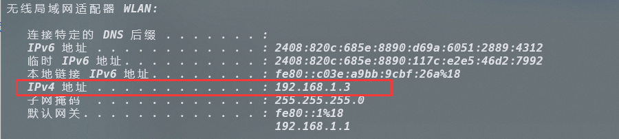
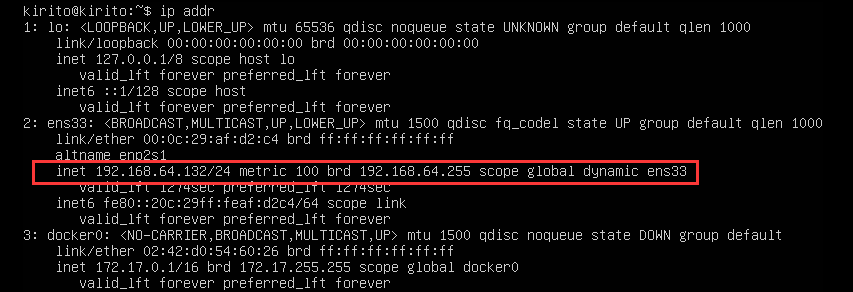
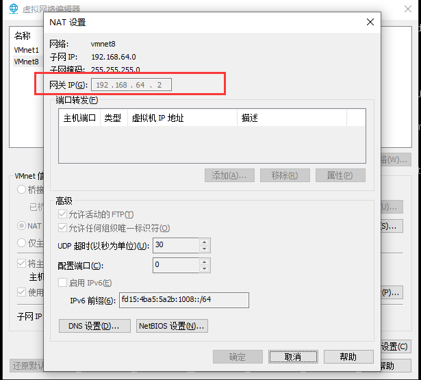
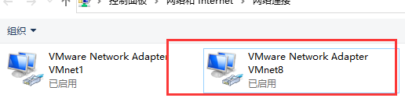
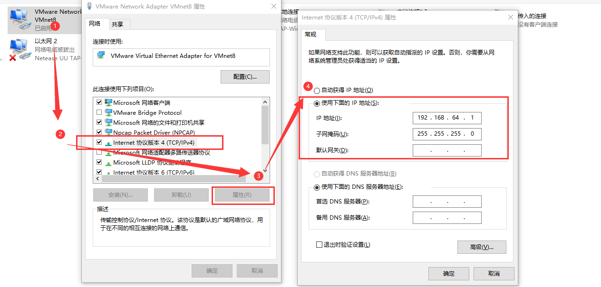
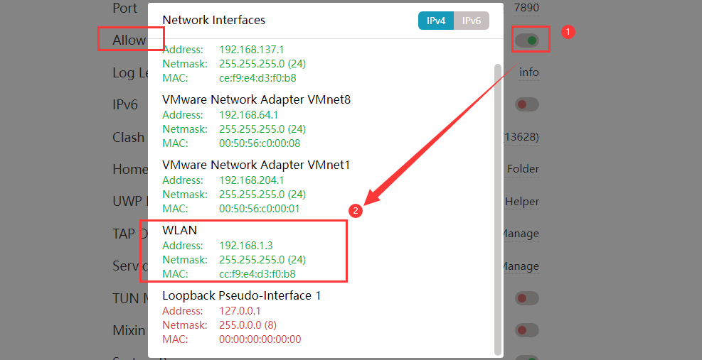
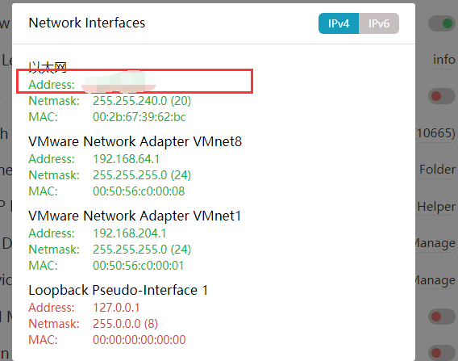
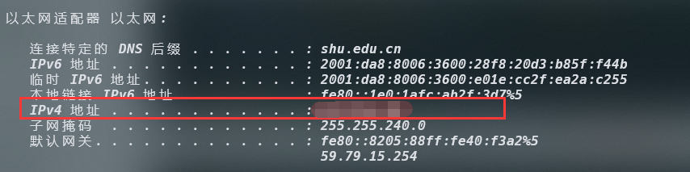
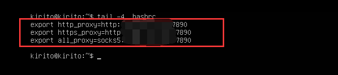

# 1. 设置`zsh` 和 `ohmyzsh` 各种插件

***第一步：***

访问网站： https://github.com/ohmyzsh/ohmyzsh/wiki/Installing-ZSH#how-to-install-zsh-on-many-platforms

根据自己的平台选择合适的安装方法，比如说Ubuntu很简单，就是简单的`sudo apt insatll zsh`。

*刚安装之后可能并不会发生变化，这个时候需要我们去重新启动一下终端。*

***第二步：***

访问网站： https://github.com/ohmyzsh/ohmyzsh

去安装一下`zsh`的插件管理软长度件, 用来管理我们`zsh`的配置文件的。

有很多方法：

```linux
wget https://raw.githubusercontent.com/ohmyzsh/ohmyzsh/master/tools/install.sh
sh install.sh
```

***第三步：***

从官网上我们就可以查看到许多的`zsh`的插件，我们选择下载安装即可。

***主题下载：***

> 注意：这里安装主题之前，先去网上下载Nerd字体。

https://github.com/romkatv/powerlevel10k#oh-my-zsh

***插件下载：***

[zsh-autosuggestions](https://github.com/zsh-users/zsh-autosuggestions)

一个自动提示的插件：

```linux
git clone https://github.com/zsh-users/zsh-autosuggestions ${ZSH_CUSTOM:-~/.oh-my-zsh/custom}/plugins/zsh-autosuggestions
```

[zsh-syntax-highlighting](https://github.com/zsh-users/zsh-syntax-highlighting)

一个高亮显示插件：

```linux
git clone https://github.com/zsh-users/zsh-syntax-highlighting.git ${ZSH_CUSTOM:-~/.oh-my-zsh/custom}/plugins/zsh-syntax-highlighting
```

https://gitee.com/yuxiaoxi/zsh-syntax-highlighting.git

https://gitee.com/githubClone/zsh-autosuggestions.git

# 2. 关于`wget:unable to resolve host address `问题

***解决办法：***

这个问题的原因是DNS服务器没有配置好的问题，我们只需要将`/etc/resolv.conf`文件中的`nameserver`地址修改为谷歌的一组解析服务器：

```linux
nameserver 8.8.8.8
nameserver 8.8.4.4
```

# 3. Ubuntu更换软件源

> 参看网站即可：
>
> https://mirrors.tuna.tsinghua.edu.cn/help/ubuntu/

***最后一步：***

```cmd
sudo apt-get update // 更新软件列表

sudo apt-get upgrade // 更新软件
```

***可能会遇到的问题：***


***解决方案：***

```cmd
sudo apt-key adv --keyserver keyserver.ubuntu.com --recv-keys 40976EAF437D05B5

sudo apt-key adv --keyserver keyserver.ubuntu.com --recv-keys 3B4FE6ACC0B21F32

// 视情况进行选择
```

# 4. `nodejs` 安装与升级

> 2023年4月1日12:47:27
>
> 下面的下载方法不要再去使用，比较麻烦:
>
> ```shell
> // 升级nodejs
> sudo npm install -g n
> // 将nodejs 升级到最新版本
> n latest
> ```
>
> 推荐使用nvm：
>
> "NVM" stands for "Node Version Manager," which is a tool used to manage multiple versions of Node.js on a single machine.
>
> Node.js is a popular JavaScript runtime environment that allows developers to write server-side applications using JavaScript. As Node.js evolves, new versions are released with new features and bug fixes, and sometimes it's necessary to switch between different versions depending on the requirements of the project.
>
> NVM allows developers to easily install and manage multiple versions of Node.js on the same machine, and switch between them as needed. This is useful because different projects may require different versions of Node.js or different packages that only work with specific versions of Node.js.
>
> With NVM, developers can install multiple versions of Node.js and easily switch between them using simple command line commands. This makes it easy to test code with different versions of Node.js, and to keep up with the latest developments in the Node.js ecosystem.

```c++
// ubuntu 安装nvm:
// https://github.com/nvm-sh/nvm#installing-and-updating
curl -o- https://raw.githubusercontent.com/nvm-sh/nvm/v0.39.3/install.sh | bash
wget -qO- https://raw.githubusercontent.com/nvm-sh/nvm/v0.39.3/install.sh | bash
```

> Running either of the above commands downloads a script and runs it. The script clones the nvm repository to ~/.nvm, and attempts to add the source lines from the snippet below to the correct profile file (~/.bash_profile, ~/.zshrc, ~/.profile, or ~/.bashrc).
>
> ```shell
> export NVM_DIR="$([ -z "${XDG_CONFIG_HOME-}" ] && printf %s "${HOME}/.nvm" || printf %s "${XDG_CONFIG_HOME}/nvm")"
> [ -s "$NVM_DIR/nvm.sh" ] && \. "$NVM_DIR/nvm.sh" # This loads nvm
> ```

***How to use nvm?***

```shell
# 罗列出所有的nodejs版本
sudo nvm ls available
# 下载执行的版本
sudo nvm install 18.5.0
sudo nvm install 19.8.1
# nodejs 版本切换
sudo nvm use 19.8.1
# 罗列出所有的nodejs版本
```

# 5. 什么是软件存储库？

> 参考：https://devpress.csdn.net/linux/62ed122f89d9027116a11db4.html

所有的Linux发行版都拥有自己的软件存储库。Linux用户无需访问供应商的网站即可下载与Windows不同的应用程序。

软件存储库是Linux系统从中检索、安装软件更新和应用程序的集中存储位置。这些存储库包含根据操作系统发行安和版本专门编译的包。

<h2>5.1 什么是包管理器？</h2>

包管理器是一个工具,它使 Linux 用户能够以自动化的方式下载、安装、卸载或升级软件包。

它们在 Linux 软件管理中扮演着非常重要的角色。它们会跟踪您系统上安装的所有软件,并在应用程序或操作系统本身有可用的新更新或升级时通知您。

每个 Linux 发行版,例如 `Ubuntu`、`Red Hat` 或` Arch Linux`,每个人都有自己的包管理器工具。

<h2>5.2 什么是包？</h2>

一个包包含了在我们的系统上实现特定功能或者软件应用程序所需要的所有的文件、元数据和说明。	

在所有的基于`Debian`的操作系统配置软件存储库的位置可以在`/etc/apt/sources.list`文件中，也可以在`/etc/apt/souurces.list.d/`目录下的单独文件进行配置，文件名字必须要以`list`扩展名结尾。

# 6. Clash for windows 配置网络代理

网络代理设置为手动，并将HTTP代理、HTTPS代理、SOCKS代理设置为127.0.0.1，端口设置为Clash 对应的端口。

我们直接可以在终端进行代理：

```shell
export http_proxy='http://localhost:7890'
export https_proxy='http://localhost:7890'
export PATH=$PATH:/home/zpf/downloads/Clash
```

# 7. Git 网络问题解决方法

> https://blog.csdn.net/zpf1813763637/article/details/128340109?spm=1001.2014.3001.5506

完成配置Clash for windows或者其他的翻墙软件之后，配置相关的代理：

```shell
# 配置sock5代理
git config --global http.proxy socks5 127.0.0.1:7890
git config --global https.proxy socks5 127.0.0.1:7890

# 配置http代理
git config --global http.proxy 127.0.0.1:7890
git config --global https.proxy 127.0.0.1:7890
```

# 8. 安装输入法Fcitx5

> https://zhuanlan.zhihu.com/p/508797663

***需要安装三部分基本内容：***

1. fcitx5主程序
2. 中文输入引擎
3. 图形界面相关

```shell
sudo apt install fcitx5 \
fcitx5-chinese-addons \
fcitx5-frontend-gtk4 fcitx5-frontend-gtk3 fcitx5-frontend-gtk2 \
fcitx5-frontend-qt5
```

***安装中文词库：***

```shell
# 下载词库文件
wget https://github.com/felixonmars/fcitx5-pinyin-zhwiki/releases/download/0.2.4/zhwiki-20220416.dict
# 创建存储目录
mkdir -p ~/.local/share/fcitx5/pinyin/dictionaries/
# 移动词库文件至该目录
mv zhwiki-20220416.dict ~/.local/share/fcitx5/pinyin/dictionaries/
```

***进行配置：***

```shell
im-config
```

根据弹出窗口的提示配置首选输入法，将其设置为fcitx5即可。

设置开机启动，

***fcitx5相关主题设置：***

命令行界面输入`fcitx5-configtool`，然后在弹出来的窗口进行配置即可。

另外主题可以Github上进行寻找，推荐：

> https://github.com/tonyfettes/fcitx5-nord

# 9.Kitty 无法输入中文的解决方案
> https://blog.csdn.net/lxyoucan/article/details/124423741
>
> https://github.com/kovidgoyal/kitty/issues/469

终端下编辑文件`.pam_environment`, 在里面写入：
```
NPUT_METHOD DEFAULT=fcitx5                                             
GTK_IM_MODULE DEFAULT=fcitx5                                           
QT_IM_MODULE DEFAULT=fcitx5                                            
XMODIFIERS DEFAULT=\@im=fcitx5                                         
SDL_IM_MODULE DEFAULT=fcitx                                            
GLFW_IM_MODULE=ibus 
```
重启即可！

# 10.好用的视频播放器

***MPV 和 VLC***

# 11.Clash For Windows 配置桌面应用图标

> https://blog.zzsqwq.cn/posts/clash-for-windows-on-linux/#fn:2

首先我们可以创建一个软链接来方便我们后面的操作，将软链接创建在我们熟悉的地方：

```shell
❯ln -s /home/kirito/Downloads/Clash_20_36/cfw /home/user/.local/bin/cfw
```

接着配置快速启动图标：

```shell
❯ sudo nvim ~/.local/share/applications/clash.desktop
# 写入下面的内容：
[Desktop Entry]
Name=Clash Fow Windows
Exec=/home/user/.local/bin/cfw
Icon=图标的路径
Type=Application
StartupNotify=true
```

图标可以在这里下载： https://zh.wikipedia.org/zh-sg/File:Clash_Logo.png

最后我们添加可执行权限之后就会在我们的桌面上发现一个应用程序图标：

```shell
sudo chmod +x ~/.local/share/applications/clash.desktop
```

# 12.VMWare虚拟机使用主机代理

> ***环境：***
>
> 虚拟机系统：ubuntu-22.04.4-live-server-amd64
>
> 虚拟机软件：VMWare
>
> 主机系统：Windows10
>
> 代理软件：Clash for Windows

虚拟机采用NAT模式：

> 什么是NAT模式？NAT是“Network Address Translation”的缩写，中文意思是“网络地址转换”，它允许一个整体机构以一个公用IP地址出现在Internet之上。顾名思义，它是一种将内部私有网络地址转换为合法网络IP地址的技术。

该模式下，主机的IP地址与虚拟机的IP地址应该是位于同一个子网当中的：

***主机：***



***虚拟机IP设置：***



***虚拟机网络编辑器：***



***网络适配器设置IP：***



这个就是NAT模式下虚拟出来的虚拟网卡供我们使用。我们需要手动指定其IP地址为192.168.64.*， 注意不能和NAT的网关一样即可。



之后打开Clash的局域网设置，并查看WLAN信息：



此时进入虚拟机配置代理即可：

```shell
export http_proxy=http://192.168.1.3:7890
export https_proxy=http://192.168.1.3:7890
export all_proxy=socks5://192.168.1.3:7890
```

这样即可实现代理上网：

```shell
kirito@kirito:~$ curl google.com
<HTML><HEAD><meta http-equiv="content-type" content="text/html;charset=utf-8">
<TITLE>301 Moved</TITLE></HEAD><BODY>
<H1>301 Moved</H1>
The document has moved
<A HREF="http://www.google.com/">here</A>.
```

在终端配置代理的话，还可以使用一些工具来配置相应的代理，比如说`proxychains`.

```shell
# 安装proxychains:
sudo apt install proxychains
# 编辑配置文件：
sudo vim /etc/proxychains.conf
# 在文件的末尾添加你的代理配置：
http your_proxy_server your_proxy_port
https your_proxy_server your_proxy_port
socks4 your_proxy_server your_proxy_port
socks5 your_proxy_server your_proxy_port
# 在终端使用使用proxychains：
prochains curl http://example.com
```

> 注意!!!
>
> 之前的配置都是基于无线网络的情况下，在有网线的情况下，我们只需要修改相应的IP地址即可：
>
> 
>
> 
>
> 


