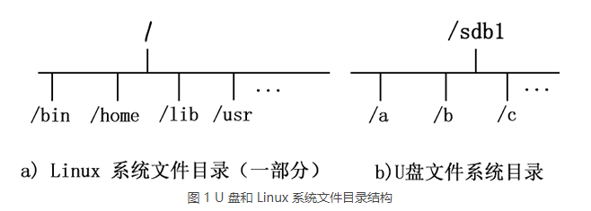
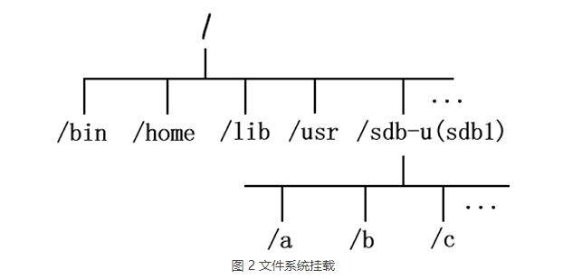

# Linux操作系统学习

## 一.基本命令

1.$提示符的前面如果是波浪号，表示当前工作目录位于当前用户home的目录下。

2.利用apt来安装软件包。

```c++
$ sudo apt install gcc//安装C语言编译器
$ sudo apt install g++//安装C++编译器
```

3.利用gcc和g++来编译源文件：

**gcc:**

```c
gcc [选项] [参数]
[选项]中有很多的选择:比如说-o，指定输出的文件名字
例子：
$ gcc -o Hello.out Hello.c
```

**g++:**

```D
$ g++ [选项] [参数]
```

**1)预处理：生成.i文件**

```d
$ g++ -E test.cpp -o test.i
```

**2)编译：生成.s文件，即汇编文件**

```d
$ g++ -S test.i -o test.s
```

**3)汇编：将汇编文件生成机器语言的二进制目标文件，即.o文件**

```d
$ g++ -c test.s -o test.o
```

**4)链接：生成bin文件，即可执行文件**

```d
$ g++ test.o -o test
```

(备用链接：https://blog.csdn.net/weixin_41326319/article/details/123937587)

**5)利用objdump可以将C++源文件进行反汇编操作：**

```d
$ objdump -j .text -S test.o
```

4. ls，列表命令。

1)ls最基本的命令会显示当前目录下的所有的文件和目录；（按照字母进行排序）

2)**$ ls -a**，将当前目录下的所有隐藏文件和普通文件目录一起显示出来；

3)**$ ls -F**，可以轻松的区分文件以及目录；

4)**$ ls -R**，可以列出来当前目录下包含的子目录中的所有文件。

5)**$ ls -l**，列出文件的详细信息。

## 二.采用scp命令实现本地文件和远程服务器的文件互传

### 2.1 拷贝本地文件到远程服务器：

```d
scp [本地文件路径]  [user]@[远程服务器地址] :[文件在远程服务器的存放路径]
```

### 2.2 拷贝服务器文件到本地：

```d
scp [user]@[远程服务器地址]:[服务器文件路径] [文件在本地存放路径]
```

### 2.3 windows上传文件夹到linux服务器中：

```d
scp -rp [本地文件夹路径] [user]@[远程服务器地址]：[文件在服务器的存放路径]
```

## 三. Linux挂载

Linux系统中***“一切皆文件”***，所有的文件都放置在以根目录为树根的树形目录结构中。在Linux看来，任何硬件设备都是文件，他们各有自己的一套文件系统（目录文件结构）。

因此，产生一个问题，当Linux系统中使用这些硬件设备的时候，我们无法通过命令行的方式来找到对应的硬件设备，比如当我们插入U盘也是如此，所以说只有将Linux本身的文件目录与硬件设备的文件目录合二为一的时候，硬件设备才可以被我们所用，合二为一的过程称0为***挂载***。

从图1变成图2的过程就被称为***挂载***。



***我们挂载的时候，也不是说，任何目录都可以作为挂载点的，由于挂载操作会使得原有目录中文件被隐藏，因此根目录以及系统中原有的目录都不要作为挂载点，就会造成系统异常甚至崩溃，挂载点最好是新建的空目录。***

## 四.如何杀死，暂停，继续一个后台进程

***4.1暂停一个进程***

`kill -STOP PID`将进程号对应的进程暂停；

或者在进程中按键Ctrl +Z;

***4.2 继续一个进程***

如果要让它恢复到后台，使用：

`kill -CONT PID`很多在前台运行的程序这样是不行的。

如果要恢复到前台的话，请在当时运行该进程的那个终端使用jobs命令查询暂停的进程。（jobs命令可以用来查看当前终端放入后台的进程信息）

然后使用`fg [jobnum]`将进程恢复到前台。

（关于jobs指令可以参考：http://c.biancheng.net/view/1077.html）

> 1.fg(Foreground)
>
> 将后台运行的进程搬到前台运行
>
> 2.bg(Background)
>
> 将进程搬到后台运行
>
> 3.jobs
>
> 用来查看当前终端放入后台的进程信息
>
> 4.&
>
> 将进程后台运行
>
> 5.Ctrl + Z
>
> 将正在前台运行的进程放到后台，并且暂停

