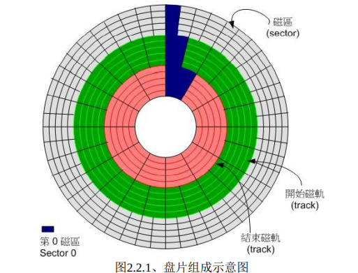

# 鸟哥私房菜

# 零. 计算机概述

## 1. 操作系统核心

操作系统本质上来将也是一组程序，该程序的主要功能就是管理电脑的所有活动以及驱动系统中的所有的硬件。所以说如果我们想自己去编写一个操作系统的话，我们就得去针对电脑的每一个功能，去设计操作系统，让其可以对电脑的所有活动进行管理。

操作系统的功能就是让CPU可以开始判断逻辑与运算数值、让内存可以开始载入/读出数据、让硬盘可以被读取、让网卡可以开始传输数据等等。实现这些功能的就是操作系统的核心（Kernel），也就是我们经常所说的Linux内核。

## 2. 操作系统的核心功能

- 系统调用接口
- 程序管理

***当我们有很多任务要执行的时候，核心所要做的事情就是控制这些任务，让CPU的资源有效的分配。***

- 内存管理

控制整个系统的内存管理，系统所有的程序码与数据都必须事先存储在内存中去。核心通常会提供虚拟内存的功能，当内存不足的时候可以提供***内存交换***的功能。

- 文件系统管理

计算机中有着大量的文件，如果核心不懂得怎么去管理文件，那么计算机不就全乱套了。***更何况Linux中，一切皆文件！***我们常见的文件管理系统，在Windows中我们使用盘符的概念、在Linux中我们使用文件树的概念。

如果核心不认识某一个文件系统的话，那么就将无法使用该文件格式的文件。

- 设备的驱动

在计算机中，有很多的硬件，但也就只是有很多，还得我们去一个一个去调用驱动管理硬件，目前都有所谓的“可载入模块”功能，可以将驱动程序编辑成模块，就不需要重新的编译核心。

我们经常使用的硬盘、显卡、主板等等，我们的操作系统是不认识的，我们的操作系统要想驱动这些硬件，会提供一个开发接口给硬件开发商，让他们根据接口设计可以驱动硬件的“驱动程序”，这样我们安装驱动之后，就可以使得操作系统驱动这些硬件了。

#   一. 主机规划与磁盘分区

## 0. 磁盘的相关知识

下图是单独拿出来一个盘面的俯视图：

- A是磁道，多个磁盘的同一个磁道重叠起来叫做**柱面**，它包含了很多个扇区。

- B是几何上的扇区，只做标示，此处无特殊含义。
- C是扇区，扇区是磁盘的最小组成单元，通常是512字节（有的磁盘时4096字节）。
- D是磁盘块（簇），块/簇是操作系统虚拟出来的概念，它由多个扇区组成。

读取磁盘数据时，磁盘上的磁头不断旋转变道，然后读取数据。因此寻道时间越短，I/O操作越快，目前磁盘的平均寻道时间一般在3－15ms，一般都在10ms左右。

- ***早期的磁盘每个磁道上的扇区数目是一样的，限制了磁盘的容量；后来为了增大磁盘容量采用了新技术，就是说越往外每磁道扇区数目越多，比如下图所示：***；
- 早期的硬盘是每个磁道有相同的扇区,但是现在的硬盘采用线性寻址,所以每个磁道上扇区数不一样,外面的多,里面的少.光盘跟硬盘差不多.但是用螺线的.不像硬盘采用同心圆；
- 不过，还是可以用CHS（柱面，磁道，扇区）的方式来定位， 因为IDE磁盘做了内部转换，让你看起来好像每条磁道上面的簇数量都是一样的

#### 0磁道是在磁盘的外圈还是内圈

- 由于历史原因 ， 磁盘的0磁道在最外圈（过去的老式硬盘，每条磁道上的簇的数量都是一样多的。也就是说最里面和最外面的磁道的簇的数目是一样的。显然，磁密度越低，数据的 安全越有保障。而MBR放在0柱面的，第0个磁道的，第1个簇上面，为了这个关键数据的安全，所以磁道要从最外开始安排。）
- 但是，光盘的0磁道和磁盘，软盘刚好向盘，光盘的0磁道是在最内圈的

## 1.开始流程中的BIOS与UEFI开机检测程序

通过前面的知识，我们可以知道我们操作系统会控制所有的硬件并且提供核心功能，因此我们的计算机可以认识硬盘内的文件系统，并进而去读取文件。

***但是又有一个新的问题，我们的操作系统也是软件啊，我们的计算机又是如何认识这个操作系统的呢？***

这就牵扯到我们的开机程序了！当前主要有BIOS和UEFI两种！	

### 1.1 MBR与GPT磁盘分区表

#### 1.1.1 MBR分区表

开机管理程序记录区和分区表统统放在磁盘的第一个扇区，这个扇区通常是512Bytes的大小（旧的）：

- 主要开机记录区MBR：可以安装开机管理程序的地方，有446字节；
- 分区表：记录整个硬盘分区的状态，有64字节；

#### 1.1.2 GPT磁盘分区表

MBR分区的时候，每一组分区表仅仅有16Bytes的大小，所以其记录的信息是十分有限的，会导致以下问题：

- 操作系统无法抓取到2.2T以上的磁盘容量！
- MBR仅有一个区块存放在第一次磁道的第一扇区，若被破坏之后，经常无法补救！
- MBR存放开机管理程序的区块仅仅446Bytes，无法容纳较多的程序码！

*** 所以就出现了GPT这个磁盘分区的格式。***

### 1.2 BIOS搭配MBR/GPT的开机流程

> 在计算机概论里面我们有谈到那个可爱的BIOS与CMOS两个东西， CMOS是记录各项硬件参数且嵌入在主板上面的储存器，BIOS则是一个写入到主板上的一个固件（***再次说明， 固件就是写入到硬件上的 一个软件程序***）。
>
> 这个***BIOS就是在开机的时候，计算机系统会主动执行的第一个程序***了！ 
>
> 接下来BIOS会去分析计算机里面有哪些储存设备，我们以硬盘为例，BIOS会依据使用者的设置去取得能够开机的硬盘， 并且到该硬盘里面去读取第一个扇区的MBR位置。
>
> MBR这个仅有446Bytes的硬盘容量里面会放置***最基本的开机管理程序***， 此时BIOS就功成圆满。
>
> 而接下来就是MBR内的开机管理程序的工作了。 这个***开机管理程序的目的是在载入（load）核心文件***， 由于开机管理程序是操作系统在安装的时候所提供的，所以他会认识硬盘内的文件系统格式，因此就能够读取核心文件。
>
>  然后接下来就是***核心文件的 工作***，开机管理程序与 BIOS 也功成圆满，将之后的工作就交给大家所知道的操作系统啦！ 简单的说，整个开机流程到操作系统之前的动作应该是这样的：
>
> 1. BIOS：开机主动执行的固件，会认识第一个可开机的设备；
> 2. MBR：第一个可开机设备的第一个扇区内的主要开机记录区块，内含开机管理程序；
> 3. 开机管理程序（boot loader）：一支可读取核心文件来执行的软件；
>    1. 核心文件：开始操作系统的功能...