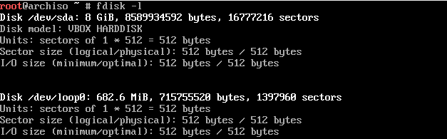

> 本次安装下载仅仅是在VirtualBox中进行安装下载的

# 1. EFI和BIOS的选择

如果你要安装双系统的话，一般是选择EFI进行启动，因为现在实际上几乎所有的笔记本电脑都是选择使用EFI来启动操作系统。

这里关于二者的区别可以参考GPT的回答: https://chat.openai.com/share/1fd8955e-0876-4eec-a064-70d6a097afa5 总的来讲就是BIOS已经OUT了。

这里唯一需要我们注意的是，BIOS使用MBR(Master Boot Record)主引导记录来识别引导设备，它的主要作用就是告诉CPU具体是去硬盘的哪一个分区寻找操作系统。而EFI采用的是GPT(GUID Partition Table)来管理磁盘分区。另外EFI支持操作系统独立的引导过程，因此更加的容易与多个操作系统进行兼容，无需修改引导顺序。


***我们首先需要确定我们是采用哪一方式来启动操作系统，这一点我们安装操作系统时候的最后一步是紧密相连的，我们在这里选择的启动方式决定着我们后面的磁盘分区以及引导工具Grub的安装方式。所以说你需要在一开始选择采用哪一种启动方式，如果你是比较新的主板的话，一般都是选择的是EFI的启动方式。***

所以我们最好选择EFI的启动方式即可。

# 2. 打开官方文档

> 官方文档: https://wiki.archlinux.org/title/Installation_guide\
>
> 镜像下载: https://archlinux.org/download/

## 2.1 准备安装介质

制作启动盘软件 https://etcher.balena.io/ ，注意选择UEFI模式。

本次安装是在VirtualBox进行安装的，所以说不需要制作启动盘，直接创建一个虚拟机即可。这里需要注意一点: ***Arch Linux安装镜像不支持UEFI BIOS的安全启动功能，所以说，如果你是安装在实机的话，你需要先进入BIOS修改相关的选项，你在重新安装之后可以再次选择打开安全启动选项。***

## 2.2 配置控制台键盘布局以及字体

```shell
setfont ter-132b
```

## 2.3 验证引导方式

```shell
ls /sys/firmware/efi/efivars
```

如果命令结果显示了目录且没有报告错误，则系统是以 UEFI 模式引导。如果目录不存在，则系统可能是以[BIOS](https://zh.wikipedia.org/wiki/BIOS)模式（或 [CSM](https://en.wikipedia.org/wiki/Compatibility_Support_Module) 模式）引导。如果系统没有以您想要的模式引导启动，请您参考自己的计算机或主板说明书。

## 2.4 连接到互联网屏

这里由于在安装的时候宿主机是直接连接着网线的，只需要执行下面的命令即可:

```shell
dhcpcd
```

如果你是在一个完全新的没有任何操作系统的电脑上进行安装的话，你需要按照下面的指引来连接网络:(这里笔者并没有进行尝试，仅仅是在虚拟机中进行安装，最好还是参考官方文档来 https://wiki.archlinuxcn.org/wiki/Iwd#iwctl 进行WiFi网络的连接)

最好还是直接连接网线，这样的话就不要进行扫描连接网络。

## 2.5 创建硬盘分区(\*\*\*\*\*)

首先查看计算机的硬盘设备：

```shell
$ fdisk -l(此处为小写字母l)
```


这里我们可以看到下面的第一行是我们的硬盘设备，由于笔者的安装环境是虚拟机，所以这里的名称是很简短的，如果你是实机安装的话，名字应该是很长的一串字符。

接下来我们对系统进行分区，一般的分区表有两种，一种是基于BIOS的分区，另一种是基于UEFI的分区。


我们这里输入`fdisk + 我们在上一步骤中看到的硬盘设备`，在笔者的环境中也就是`fdisk /dev/sda`.输入之后就会看到上面的界面，上面的界面就是fdisk对硬盘进行分区的界面，我们按下`m`按键的话会打印出所有的帮助信息：


从上面的图示中我们可以看到其中最下面我们选择创建什么分区表，第一个是创建一个新的空的GPT分区表，第三个是创建一个新的MBR分区表，这里你需要进行选择你在一开始选择的是什么启动方式。笔者一开始选择的是EFI启动方式，所以这里选择按键g创建一个新的GPT分区表:


之后我们需要创建分区，我们从帮助信息中可以看到按键`n`是创建新的分区：


这里可以看到我们需要设置一个分区的编号，我们最好是按照一开始的分区表的图示来进行编号：1 是`efi_system_partition`分区; 2 是`swap_partition`分区，也就是swap分区; 3 是`root_partition`分区也就是我们的主分区。

还可以看到要求我们设置First sector: 也就是对应分区的起始位置，回车是默认，Last sector是设置该分区的结束位置: `+500M`。如果是G的话，就输入`+1G`这样。

> !!!!!!***注意：***
>
> 注意如果你想安装多系统的话，你之前就不需要创建`efi_system_partion`分区，如果你是多系统的话，你这里对`efi_system_partition`分区进行格式化的话，会对其余的操作系统的引导加载程序造成破坏。

下面截图是笔者的分区情况：


其中有一个错误是因为笔者忘记`+1G`中的`+`符号。

按键`p`对分区的情况进行打印：


然后我们最终需要按下按键`w`将分区信息写入磁盘：


这样我们就完成了分区的创建，但是我们还需要对分区进行格式化以及挂载。

## 2.6 对分区进行格式化(\*\*\*\*\*)

- 对`efi_system_partition`进行格式化为`Fat32`。

注意如果你想安装多系统的话，你之前就不需要创建`efi_system_partion`分区，如果你是多系统的话，你这里对`efi_system_partition`分区进行格式化的话，会对其余的操作系统的引导加载程序造成破坏。

```shell
$ mkfs.fat -F 32 /dev/efi_system_partition
```


- 对`swap_partition`进行格式化：

```shell
$ mkswap /dev/swap_partition（交换空间分区）
```


- 对`root_partition`进行格式化：

```shell
$ mkfs.ext4 /dev/root_partition（根分区）
```


## 2.7 挂载分区(\*\*\*\*\*)

将根磁盘挂载到`/mnt`上：

```shell
$ mount /dev/sda3 /mnt
```

注意如果你想安装多系统的话，你之前就不需要创建`efi_system_partion`分区，如果你是多系统的话，你这里对`efi_system_partition`分区进行格式化的话，会对其余的操作系统的引导加载程序造成破坏。

对于UEFI系统，挂载EFI系统分区：

```shell
$ mount --mkdir /dev/sda1 /mnt/boot
```

对于交换空间,输入下面的命令进行启用：

```shell
$ swapon /dev/sda2
```

# 3 开始安装系统

## 3.1 选择镜像网站

要获取 [pacman-mirrorlist](https://archlinux.org/packages/?name=pacman-mirrorlist)包 的按国家分列的原始镜像列表，在挑选了能用的镜像之后，可以执行

```shell
$ pacman -Sy pacman-mirrorlist
```

再将 `/etc/pacman.d/mirrorlist.pacnew` 复制到 `/etc/pacman.d/mirrorlist` 并进行编辑。

这个文件接下来还会被 *pacstrap* 拷贝到新系统里，所以请您确保设置正确。

## 3.2 安装必需的软件包

使用 [pacstrap(8)](https://man.archlinux.org/man/pacstrap.8) 脚本，安装 [base](https://archlinux.org/packages/?name=base)包 软件包和 Linux [内核](https://wiki.archlinuxcn.org/wiki/内核)以及常规硬件的固件：

```shell
$  pacstrap -K /mnt base linux linux-firmware sudo git vim neovim man-pages dhcpcd net-tools 
```

这时候可以同时额外安装计算机的 CPU 微码包。如果计算机是 Intel 的 CPU ，使用 [intel-ucode](https://archlinux.org/packages/?name=intel-ucode)包，AMD CPU 则使用 [amd-ucode](https://archlinux.org/packages/?name=amd-ucode)包。也可以暂时都不安装，等到进入系统后再安装。

> 注意这里需要安装相关的网络包： `dhcpcd net-tools`，并且将dhcpcd设置为开机启动。否则待会启动会出现连接不到网络的情况。

# 4 配置系统

## 4.1 生成fstab文件

> 关于fstab文件： https://www.cnblogs.com/z-books/p/9244065.html

```shell
$ genfstab -U /mnt >> /mnt/etc/fatab
```

## 4.2 chroot到新安装的系统

```shell
$ arch-chroot /mnt
```


## 4.3 设置时区

```shell
$ ln -sf /usr/share/zoneinfo/Asia/Shanghai /etc/localtime

$ hwclock --systohc
```


目前还不能查看系统时间。

## 4.4 区域化与本地设置

程序和库如果需要本地化文本，都依赖[区域设置](https://wiki.archlinuxcn.org/wiki/Locale)，后者明确规定了地域、货币、时区日期的格式、字符排列方式和其他本地化标准。

需要设置这两个文件：`locale.gen` 与 `locale.conf`。

编辑 `/etc/locale.gen`，然后取消掉 `en_US.UTF-8 UTF-8` 和其他需要的[区域设置](https://wiki.archlinuxcn.org/wiki/Locale)前的注释（#）。

接着执行 `locale-gen` 以生成 locale 信息：

```
# locale-gen
```

然后创建 [locale.conf(5)](https://man.archlinux.org/man/locale.conf.5) 文件，并 [编辑设定 LANG 变量](https://wiki.archlinuxcn.org/wiki/Locale#系统区域设置)，比如：

```
/etc/locale.conf
LANG=en_US.UTF-8
```


## 4.5 网络配置

创建Hostname文件：

```
/etc/hostname
myhostname（主机名）
```

请接着完成新安装的环境的[网络配置](https://wiki.archlinuxcn.org/wiki/网络配置)，配置过程中可能需要安装合适的[网络管理](https://wiki.archlinuxcn.org/wiki/网络配置#网络管理)软件。

***编辑/etc/hosts，输入下面信息：***


## 4.6 设置root密码

```shell
$ passwd
```

# 5. 安装引导程序(最重要的一步)

需要安装 Linux 引导加载程序，才能在安装后启动系统，可以使用的的引导程序已在[启动加载器](https://wiki.archlinuxcn.org/wiki/Boot_loaders)中列出，请选择一个安装并配置它，[GRUB](https://wiki.archlinuxcn.org/wiki/GRUB) 是最常见的选择。

如果有 Intel 或 AMD 的 CPU，请另外启用[微码](https://wiki.archlinuxcn.org/wiki/Microcode)更新。

**警告：** 这是安装的最后一步也是至关重要的一步，请按上述指引正确安装好引导加载程序后再重新启动。否则计算机重新启动后将无法正常进入系统。


1. 首先安装相关的软件

```shell
$ pacman -S grub efibootmgr intel-ucode os-prober
```

2. 创建相关文件夹

```shell
$ mkdir /boot/grub
```

3. 生成配置文件

```shell
$ grub-mkconfig   >  /boot/grub/grub.cfg 
```

4. 安装`grub`这里需要根据你的系统的型号以及引导的方式进行选择，笔者是选择的efi启动方法以及电脑是`x86_64`(`uname -m`)


```shell
$ grub-install --target=x86_64-efi --efi-directory=esp
```

