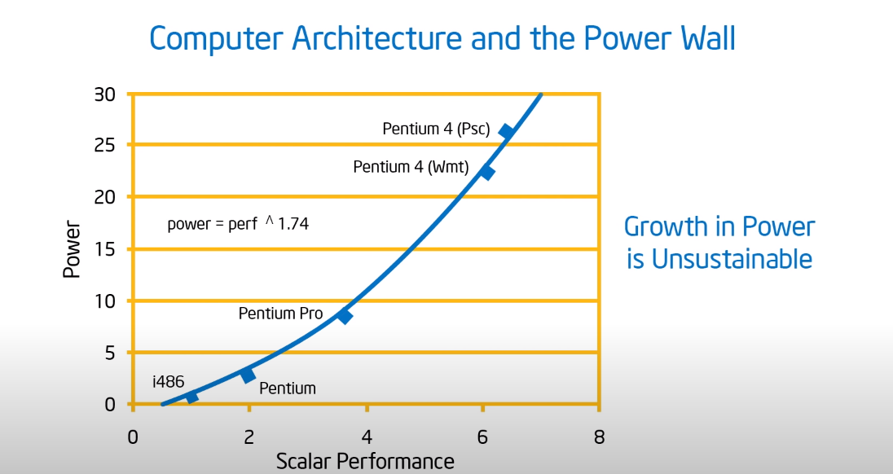
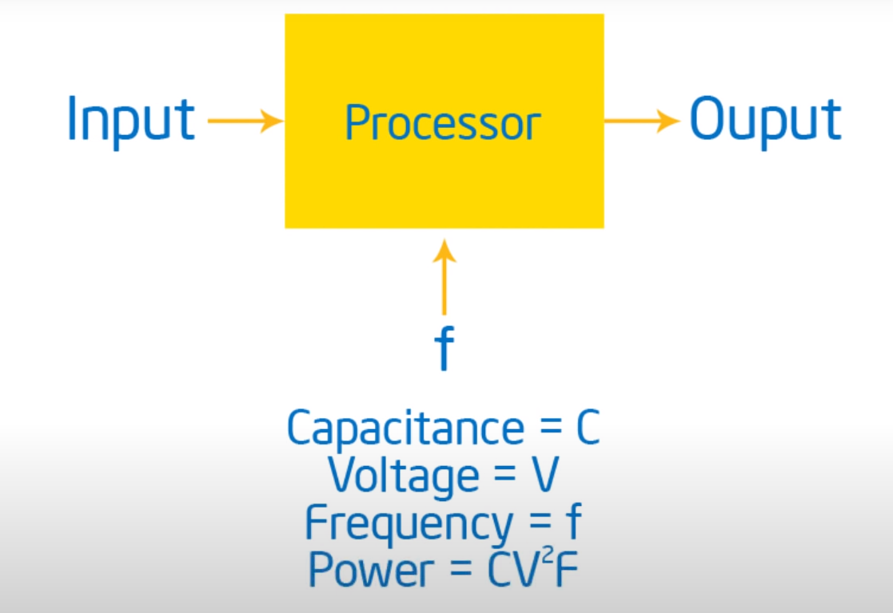
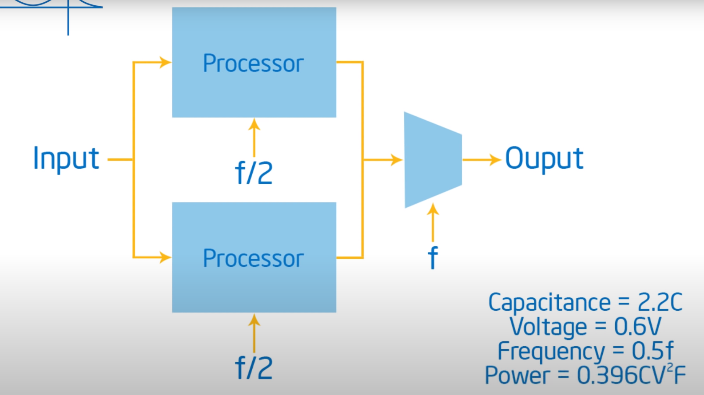
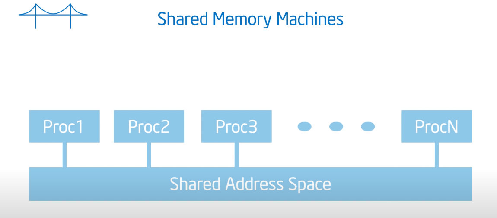
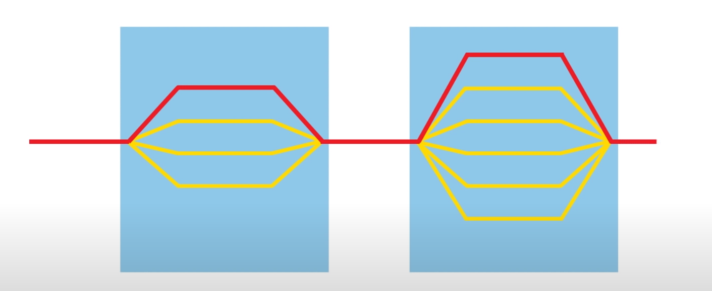
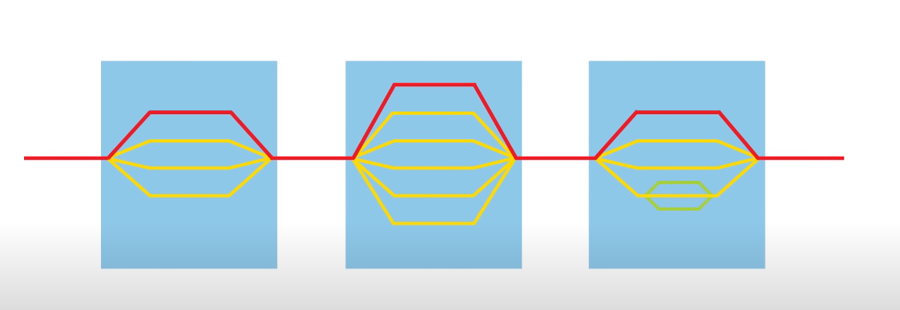
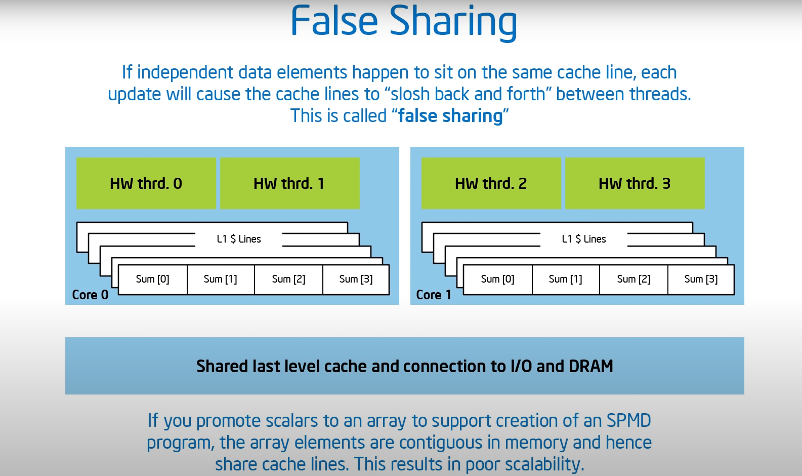
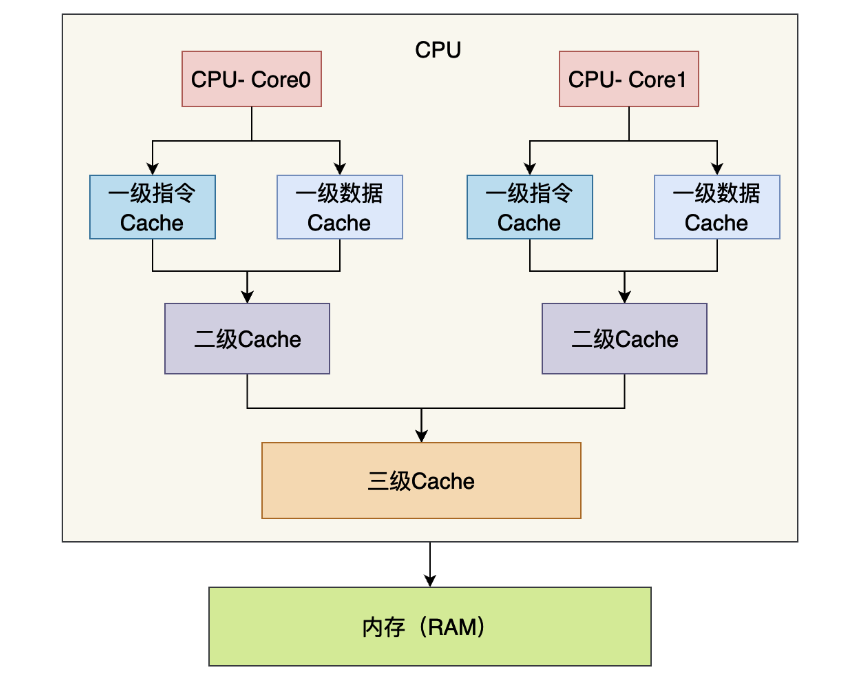
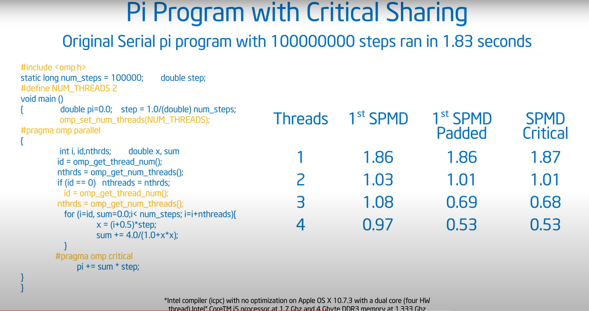

# OpenMP Learning

> https://www.youtube.com/watch?v=cMWGeJyrc9w&list=PLLX-Q6B8xqZ8n8bwjGdzBJ25X2utwnoEG&index=2

# 1. Getting Started With OpenMP

> **摩尔定律**（英语：Moore's law）是由[英特尔](https://zh.wikipedia.org/wiki/英特尔)（Intel）创始人之一[戈登·摩尔](https://zh.wikipedia.org/wiki/高登·摩爾)提出的。其内容为：[集成电路](https://zh.wikipedia.org/wiki/集成电路)上可容纳的[晶体管](https://zh.wikipedia.org/wiki/晶体管)数目，约每隔两年便会增加一倍；而经常被引用的“18个月”，则是由英特尔[首席执行官](https://zh.wikipedia.org/wiki/首席执行官)大卫·豪斯（David House）提出：预计18个月会将芯片的性能提高一倍（即更多的晶体管使其更快），是一种以[倍数增长](https://zh.wikipedia.org/wiki/倍數增長)的观测。[[1\]](https://zh.wikipedia.org/wiki/摩尔定律#cite_note-1)

摩尔定律的产生在后面的发展中，翻了一番又一番，导致了一个什么样的结果呢？

***导致一代又一代的程序员被训练成不会真正的思考很多关于性能方面的事情，因为这些都会留给硬件来做，自己不需要去考虑，当时时代的硬件足够他们去霍霍。***

就比如Java，Java是很好的语言，有很多值得人喜欢的地方，但是他并不是一个为了性能而去设计的语言，因为大量的逻辑全部交给了JVM，虚拟机帮助我们做了很多事情。



我们可以看到随着性能的提高，我们的功耗在成几何式的增长，这就不得不令我们考虑如果功耗我们负担不起了怎么办？

经过专业的公式推导我们可以知道功耗：

${Power = CV^{2}F}$

（C为电容，V为电压，F为频率）

下面是一个单核情况下，所需要的能源功耗：



下面是另外一种多核情况下，所需要的能源功耗：



我们从上面的图中可以明显的看到多核情况下所损耗的功率远远低于单核。

This is why whether you like it or not parallel computing is with us to stay because it gives us the ability to get same amount of work done with multiple cores at a lower frequency at a tremendous.

这也就是为什么，不管你喜不喜欢并发编程，它一定是始终存在的，因为它让我们可以使用多核来以更低的功耗来完成相同量的工作。

我们不能说将所有的性能全部压在硬件之上，现在摩尔定律已经不可用了，那么这个时候我们该怎么去维持这个信息愈发爆炸的时代呢！

免费午餐时代即将结束了！

> http://www.gotw.ca/publications/concurrency-ddj.htm
>
> https://www.cnblogs.com/bombe1013/p/3294307.html

免费的性能午餐，到了我们这个时代已经结束了，我们不能说再去等待硬件的迭代。

这意味这并行，这意味着我们不得不使得我们的软件可以并行计算。不可能以后等待一种编译器来帮助我们将一个串行的代码编译成并行的代码来执行。


***Concurrency(并发) VS Parallelism(并行)***

***OpenMP：***

***An API for writing multithreaded applications.***

> ***用于编写多线程应用程序的 API。***

***A set of compiler directives and library routines for parallel application programmers.***

> 一组供并行应用程序程序员使用的编译器指令和库例程

***Greatly simplifies writing multi-threaded(MT) programs in Fortran, C and C++.***


<h2>1.1 OpenMP core syntax(核心语法)</h2>

Most of the constructs in OpenMP are compiler directives.

> 大部分都是编译器指令

```c++
#pragma omp construct [clause[clause]...]

#pragma omp parallel num_threads(4)
```

Function prototypes and types in the file

> 文件中的函数原型和类型

```C++
#include<omp.h>
```

Most OpenMP constructs apply to a "Structured Block" .A block of one or more statements with one point of entry at the top and one opint of exit at the bottom.

> 大多数 OpenMP 构造适用于“结构化块”。一个或多个语句的块，顶部有一个入口点，底部有一个出口点。

> 注：
>
> Linux环境下的OpenMP编程，是使用GCC编译器的，我们什么都不用配置，只需要告诉编译器，添加相关的依赖即可：
>
> ```C++
> gcc -fopenmp foo.c
> ```
>
> For Bash Shell:
>
> ```shell
> export OMP_NUM_THREADS=4;
> ```
>
> Finally:
>
> ```shell
> ./a.out
> ```

<h2>1.2 The first exercise </h2>

> Verify that your OMP environment works, write a multithreaded program that prints "Hello World."

```C++
#include <iostream>
#include <omp.h>

using namespace std;

int main (int argc, char *argv[])
{
  // we just to know what it does is it says give me a bunch of threads
  // and since we didn't tell it it's gonna say give me the default number of threads 
  #pragma omp parallel 
  {
    int ID = omp_get_thread_num();
    printf("hello(%d)", ID);
    printf("world(%d)\n", ID);
  }
  return 0;
}
```

`g++ -fopenmp HelloOMP.cpp`

***输出结果：***

```out
// 1. 第一次运行结果
hello(7)world(7)
hello(0)world(0)
hello(2)world(2)
hello(4)world(4)
hello(6)world(6)
hello(5)world(5)
hello(1)world(1)
hello(3)world(3)

// 2. 第二次运行结果
hello(4)world(4)
hello(3)world(3)
hello(2)world(2)
hello(7)world(7)
hello(5)world(5)
hello(1)world(1)
hello(6)world(6)
hello(0)world(0)
```

我们会发现我们每一次运行的结果不一样，也就是发生了竞争，我们想要保证每一次输出都是我们理想的结果的话，我们需要对其进行同步，这样的话，我们才可以避免发生竞争。

这个是并行编程中的难点。


***OpenMP Overview***

1. OpenMP is a multi-threading, shared address model;



> Thread communicate by sharing variables.
>
> We can get these variables sitting that heap of the process all the threads can see that so the threads interact by lookong at these variables .
>
> 所有的线程共享的资源是在进程当中的，所有的线程都是可以进行访问的，所以说线程之间通过这些公共的可以访问的值来进行交流。

# 2. The Core Features of OpenMP

<h2>2.1 How to create threads in OpenMP</h2>

> 我们如何在OpenMP中创建线程？

OpenMP背后重要的模型是***Fork / Join Model***。

> 可以和我们在进程中所学习的Fork / Join 进行类比。



> 主线程ID为0,其余的线程的ID从1开始往后面排列。

First, our program starts as a single thread we're going to call that the master thread.(我们一般称最初始的线程为master线程)  

The master thread will working through the whole program.(master线程会在工程的生命周期中一直运行)

Then the master thread comes to same point in the execution where additional threads could help out.(当master线程运行到某一个时刻，在这个时刻额外的线程加入的话可以帮助master线程解决一些问题)

What it's going to do is it's going to fork a number of threads at that point.（这个时刻master线程会fork出来一些线程）

----------- parallel beginning ---------

When they finish, they will join back together again.(当线程完成了他们的任务，即完成了并行，这个时候会join 到一块)



当然了在一个***并行区域***当中，一组中的一个线程也可以额外的去申请和使用更多的线程，这样的话，他就可以分叉出自己的线程团队。

```C++
// Later we will fork a team of four threads
omp_set_num_threads(4);
#pragma omp parallel

// 这里还有另外一种写法：
#prama omp parallel num_threads(20)
// 这里你可能会注意到这里申请的线程的数量大于自己机器的总核数也是可以的
// 此时我们只有一个进程和若干个线程共享进程当中的资源，这个时候CPU会对其进行调度
// 进行换入和换出，由于在同一个进程，所以切换线程十分的简单，并不是说我们的每一个
// 核心只能有一个线程在运行，不是这样的
```

观察下面代码：

```C++
// 代码段一：
void func()
{
    foobar();
}
pthread_t tid[4];
for(int i = 1; i < 4; ++i)
   pthread_create(&tid[i], 0, thunk, 0);
think();

for(int i = 1; i <4; ++i)
    pthread_join(tid[i]);
```

```C++
// 代码段二：
#pragma omp parallel num_threads(4)
{
    foobar();
}
```

我们惊奇的发现，这两段代码实现的是一样的功能！！

<h2>2.2 Second exercise</h2>

一个简单的求积分：

$\int_{0}^{1}\frac{4}{1+x^{2}}\frac{\mathrm{d} }{\mathrm{d} x}$

C++ 简单代码实现：

```C++
#include <iostream>
#include <chrono>

using namespace std;

static long num_step = 100000000;
double step;
int main (int argc, char *argv[])
{
  int i;
  double x, pi, sum = 0.0;
  
  step = 1.0/(double) num_step;

  
  chrono::milliseconds start_time = chrono::duration_cast<chrono::milliseconds>(chrono::system_clock::now().time_since_epoch());
  for (i = 0; i < num_step; ++i) {
    x = (i + 0.5) * step;
    // x = (i + 0.4) * step;
    sum = sum + 4.0/(1.0 + x * x);
  }
  chrono::milliseconds end_time = chrono::duration_cast<chrono::milliseconds>(chrono::system_clock::now().time_since_epoch());


  pi = step * sum;
  
  std::cout <<"The result: "<< pi << std::endl;
  cout << "cost time: " <<  chrono::milliseconds(end_time).count() - chrono::milliseconds(start_time).count() << "ms" << endl;

  return 0;
}

```

上述串行程序执行结果为：

```output
The result: 3.14159
cost time: 210ms
```

我们的任务是什么？

> Create a parallel version of the pi program using a parallel construct.
>
> Pay close attention to shared versus private variables.
>
> Some functions you may be need:
>
> `int omp_get_num_threads();`
>
> Number of threads in the team;
>
> `int omp_get_thread_num();`
>
> Thread ID or rank;
>
> `double omp_get_wtime();`
>
> Time in seconds since a fixed point in the past;

> 答案：
>
> ```C++
> #include <iterator>
> #include <omp.h>
> #include <chrono>
> #include <iostream>
> using namespace std;
> static long num_steps = 100000;
> static double step;
> #define NUM_THREAD 5
> int main (int argc, char *argv[])
> {
>   int i, nthreads;
>   double pi, sum[NUM_THREAD];
> 
>   step = 1.0/(double) num_steps;
>   omp_set_num_threads(NUM_THREAD);
> 
>   chrono::milliseconds start = chrono::duration_cast<chrono::milliseconds>(chrono::system_clock::now().time_since_epoch()); 
>   double test_start = omp_get_wtime();
>   #pragma omp parallel
>   {
>    int i, id, nthrds;
>    double x;
>    id = omp_get_thread_num();
>    // 1. 当我们在并行区域当中请求一定数量的线程的时候，不一定系统就会给你分配对应数量的线程，
>    // 系统也可以选择给你很少的线程，所以说我们需要去检查一下我们最终得到了多少个线程资源
>    // When we enter a parallel region in openmp you request a number of threads but an environment can choose to give you fewer threads so i actually have to check how many threads i got.
>    // 所以说在这里我们选择了主线程去获得当前所有线程的数量
>    nthrds = omp_get_num_threads();
>    if(id == 0) 
>      nthreads = nthrds;
>    for (i = id, sum[id] = 0.0; i < num_steps; i = i + nthrds) {
>      // 此处的循环采用的是循环迭代的方法，可以实现一种线程之间一定不会发生竞争的问题
>      // thread_0 去处理 0 2 4 6 8 10………………
>      // thread_1 去处理 1 3 5 7 9 11………………
>      x = (i + 0.5) * step;
>      sum[id] += 4.0/(1.0 + x * x);
>    }
>   }
>   double test_end = omp_get_wtime();
> 
>   for (i = 0; i < nthreads; i++) {
>    pi += sum[i]*step;
>   }
>   chrono::milliseconds end = chrono::duration_cast<chrono::milliseconds>(chrono::system_clock::now().time_since_epoch());
> 
>   std::cout << "The threads number is: " << NUM_THREAD << std::endl;
>   cout << "result: " << pi << endl;
>   cout << "cost: " << chrono::milliseconds(end).count() - chrono::milliseconds(start).count() << "ms" << endl;
>   std::cout << "parallel cost: " << test_end - test_start << std::endl;
>   return 0;
> }
> ```
>
> 第一版代码的执行结果为：
>
> ```output
> The threads number is: 4
> result: 4.95157e+132
> cost: 920ms
> parallel cost: 0.919766
> ```

<h2>2.3 False Sharing </h2>

> 导致有些时候并行会比串行慢！！！	



> 实质上就是所有线程访问公共变量表面上看来是………
>
> 参考文章：https://xie.infoq.cn/article/dcf4c88d4003336fbdbd80279



<h3>2.3.1 缓存行</h3>

当CPU从更慢级别的缓存（数字越大，级别更慢，比如三级Cache的级别很慢）当中读取数据的时候（三级Cache会从内存当中读取数据，二级Cache会从三级Cache当中读取数据，一级Cache会从二级Cache当中读取数据，缓存的级别越低，访问速度越快）。

***CPU并不是一个字节一个字节的读取的，而是一次会读取一块数据，然后将这个数据缓存到CPU当中，而这个数据块被称作缓存行。***

> 目前主流CPU的缓存行大小都是64字节，也就是512位。这是因为内存的一次传输的单位也是64字节。
>
> 那么我们为什么会做这种优化呢？这是因为**局部性原理**，所谓局部性原理简单说来就是，当时使用一个数据的时候，它附近的数据在未来的一段时间你也很可能用到，比如说我们遍历数组，我们通常从前往后进行遍历，比如我们数组当中的数据大小是 8 个字节，如果我们的缓存行是 64 个字节的话，那么一个缓存行就可以缓存 8 个数据，那么我们在遍历第一个数据的时候将这 8 个数据加载进入缓存行，那么我们在遍历未来 7 个数据的时候都不需要再从内存当中拿数据，直接从缓存当中拿就行，这就可以节约程序执行的时间。

<h3>2.3.2 假共享， False Sharing</h3>

当两个线程在CPU上两个不同的内核上执行代码的时候，如果说两个线程使用了同一个缓存行的话，而且是对缓存行中的不同的变量进行读写操作，比如说线程A对变量a进行写操作，线程B对变量b进行写操作。而由于缓存一致性（Cache coherence）协议的存在，***如果其中 A 线程对缓存行 C 中变量 a 进行了写操作的话，为了保证各个 CPU 核心的数据一致（也就是说两个 CPU 核心看到了 a 的值是一样的，因为 a 的值已经发生变化了，需要让另外的 CPU 核心知道，不然另外的 CPU 核心使用的就是旧的值，那么程序结果就不对了）***，其他核心的这个缓存行就会失效，如果他还想使用这个缓存行的话就需要重新三级 Cache 加载，如果数据不存在三级 Cache 当中的话，就会从内存当中加载，而这个重新加载的过程就会很拖累程序的执行效率，而事实上线程 A 写的是变量 a，线程 B 写的是变量 b，他们并没有真正的有共享的数据，只是他们需要的数据在同一个缓存行当中，因此称这种现象叫做**假共享（False Sharing）**。

上面我们谈到了，当缓存行失效的时候会从三级 Cache 或者内存当中加载，而多个不同的 CPU 核心是共享三级 Cache 的（上图当中已经显示出来了），其中一个 CPU 核心更新了数据，会把数据刷新到三级 Cache 或者内存当中，因此这个时候其他的 CPU 核心去加载数据的时候就是新值了。

上面的代码

现在知道了什么是False Sharing 之后，我们在对上面的代码进行改进：

```c++
// PI_Parallel_v1.cpp
#include <iterator>
#include <omp.h>
#include <chrono>
#include <iostream>
using namespace std;
static long num_steps = 100000000;
static double step;
#define PAD 8
#define NUM_THREAD 4
int main (int argc, char *argv[])
{
  int i, nthreads;
  double pi, sum[NUM_THREAD][PAD];

  step = 1.0/(double) num_steps;
  omp_set_num_threads(NUM_THREAD);

  chrono::milliseconds start = chrono::duration_cast<chrono::milliseconds>(chrono::system_clock::now().time_since_epoch()); 
  double test_start = omp_get_wtime();
  #pragma omp parallel
  {
    int i, id, nthrds;
    double x;
    id = omp_get_thread_num();
    nthrds = omp_get_num_threads();
    if(id == 0) 
      nthreads = nthrds;
    for (i = id, sum[id][0] = 0.0; i < num_steps; i = i + nthrds) {
      x = (i + 0.5) * step;
      sum[id][0] += 4.0/(1.0 + x * x);
    }
  }
  double test_end = omp_get_wtime();


  for (i = 0; i < nthreads; i++) {
    pi += sum[i][0]*step;
  }
  chrono::milliseconds end = chrono::duration_cast<chrono::milliseconds>(chrono::system_clock::now().time_since_epoch());

  std::cout << "The threads number is: " << nthreads << std::endl;
  cout << "result: " << pi << endl;
  cout << "cost: " << chrono::milliseconds(end).count() - chrono::milliseconds(start).count() << "ms" << endl;
  std::cout << "parallel cost: " << test_end - test_start << std::endl;
  return 0;
}
```

我们会发现，我们将一维数组变成了二维数组，而且每一行是由8个dou ble变量的，而我们一般缓存行的大小是64个字节的，这样的话我们不同的线程去访问数据的时候，一定是不会说不同的线程所访问的数据位于同一个缓存行当中，这样的话就不会出现***False Sharing***的情况，就可以一定程度上避免这个问题，比如说下面的该段程序的执行结果：

```output
The threads number is: 4
result: 3.14159
cost: 91ms
parallel cost: 0.0907044
```

> 注意，上述结果每一次都不一样，有的差距有点大，有点离谱！

That was ugly I mean you expect me to know the size of the cache line, you expect me every time I move this piece of software to another machine to figure out the size of the cache line and readjust the pad.

3. Working With OpenMP

# 4. Advanced OpenMP Topics

> 该模块中，我们会进行同步主题的讨论。

***Over MP Overview:***

1. OpenMP is a multi-threading, shared address model.（OpenMP 是一种多线程、共享地址的模型）
2. Unintended sharing of data causes race conditions.（不经意间数据的共享导致条件竞争）
3. To control race conditions, use synchronization to protect data conflicts.（为了控制条件竞争，我们需要利用同步来防止数据冲突）
4. Change how data is accessed to minimize the need for synchronization.（改变数据的访问方式，以降低同步带来的性能损耗）

## 4.1 Barrier synchronization (障碍物同步)

> ***Synchronization***
>
> 第一种，高级同步***High level synchronization:***
>
> *Critical* 临界变量
>
> *Atomic* 原子操作 
>
> *Barrier* 障碍物
>
> *Ordered* 
>
> 第二种， 低级同步***Low level synchronization:***
>
> *Flush*
>
> *Locks(both simple and nested)* 锁

 

> Each thread wait at the barrier until all threads arrive.


```C++
#pragma omp parallel
{
    int id = omp_get_thread_num();
    A[id] = big_calc1(id);
    #pragma omp barrier
    B[id] = bid_calc2(id, A);
}
```

在上面的程序中，所有的线程在运行到第五行的时候，都会陷入阻塞，知道所有的线程全部完成自己的相应任务。因为下面的过程中是需要使用到整个A数组的，所以说如果有的线程没有完成相应的工作的话，就会导致数组A不完整，下面的工作也就不会继续运行下去。

***下面的例子中，我们使用Critical Construct即临界变量！***

We need remember what critical does is it's mutual exclusion!我们需要记住临界的作用就是相互排斥。

```C++
float res = 0;
#pragma omp parallel
{
    float B;
    int i, id, nthrds;
    id = omp_get_thread_num();
    nthrds = omp_get_num_threads();
    for(i = id; i < nthrds; i++ )
    {    
        B = big_job(i);
    	#pragma omp critical
        // We can guarantee only one thread at a time is working on that critical section
    	res += consume(B);
    }
}
```

***下面的例子中，我们来学习atomic!***

```C++
#pragma omp parallel
{
    double tmp, B;
    B = DOIT();
    tmp = big_ugly(B);
    #pragma omp atomic
    X += tmp;
}
```





## 4.2 Mutual Exclusion (互相排斥)

> Define a block of code that only one thread at a time can execute
>
> 就是声明一个代码块，这个代码块，同一时间只能有一个线程可以执行。即原子操作。


## 4.3 More operation

```C++
#pragma omp parallel 
{
    #pragma omp for
    for(int i = 0; i < N; i++)
        NEAT_STUFF(i);
}

// also, we can put them together
#pragma omp parallel for
{
    for(int i = 0; i < N; i++)
        NEAT_STUFF(i);
}
```

上述例子中，我们有一个循环，我们需要这个循环的操作进行分配，分配到不同的线程当中，但是我们有的时候并不想去做这些繁琐的事情，所以我们可以直接使用`#pragma omp for`编译参数。我们直接告诉编译器：***Will you please take loop and split it up between a bunch of threads.***编译器直接就会帮助我们做相关的事情。

## 4.4 #pragma omp parallel reduction(op:list)

归约操作：

OpenMP使用归约变量为每一个线程创建一个私有的变量，用来存储自己归约的结果，所以说归约的代码不需要使用Critical进行保护。

```C++
reduction(op:list)

    
// A local copy of each list variable is made and initialized depending on the 'op'
// e.g. 0 for "+"
```

`reduction`子句会为每一个线程提供一个私有的list变量，而且会根据前面的操作符对拷贝的变量进行初始化，一般都是如果是`+`则初始化为0； 如果是`*`则初始化为1……

> ***初始值的确定方法***就是上面提到的：**+(0),\*(1),-(0),&~(0),|(0),^(0),&&(1),||(0)**。

然后每一个线程会在会各自执行自己的操作，最后将自己的运算的结果和原来初始值加在一起或者乘在一起，得到最终的结果。

实例：

```C++
#include <iostream>
#include <omp.h>

int main (int argc, char *argv[])
{
  int sum = 100;
  #pragma omp parallel for reduction(+:sum) num_threads(4)
  for (int i = 0; i < 10; i++) {
    sum += i;
    // sum = 1;
  }
  std::cout << "Sum: "<< sum << std::endl;
  return 0;
} 
```

上述操作中就是首先分配了四个线程，然后每一个线程会有一个sum的拷贝，初始值为0，因为操作符号是+，接着四个线程会去执行各自的操作，最后将所有线程的结果全部累加在一起并且于最初始的sum（100）相加，最终得到的结果是：

```output
❯ g++ -fopenmp reduction.cpp -o reduction

❯ ./reduction
Sum: 145
```

接下来我们看另外的一个版本以助于理解：

```C++
#include <iostream>
#include <omp.h>

int main (int argc, char *argv[])
{
  int sum = 100;
  #pragma omp parallel for reduction(+:sum) num_threads(4)
  for (int i = 0; i < 10; i++) {
    sum += i;
    sum = 1;
  }
  std::cout << "Sum: "<< sum << std::endl;
  return 0;
} 
```

我们看一下最终的运行结果：

```output
❯ g++ -fopenmp reduction.cpp -o reduction
❯ ./reduction
Sum: 104
```

我们会发现最终的结果是104，这是为什么呢？这就是reduction的工作机制，每一个线程都会有一个拷贝，然后经过运算（该情境中每一个线程运算之后sum都为1）,所以说最终进行相加的时候，是4个1和100相加，得到结果104.


## 4.5 #pragma omp parallel for

> omp中的for指令用于告诉编译器，拆分接下来的for循环，并分别在不同的线程中运行不同的部分。如果for指令后没有紧接着for循环，编译器会报错。

```C++
#include <iostream>
#include <omp.h>

int main (int argc, char *argv[])
{
  int sum = 0;

  #pragma omp parallel for num_threads(4) reduction(+:sum)
  for (int i = 0; i <= 100; i++) {
    sum +=i; 
  }

  std::cout << "result:" << sum << std::endl;
  omp_set_num_threads(4);
  #pragma omp parallel 
  {
    #pragma omp for 
    for (int i = 0; i < 10; i++) {
      #pragma omp critical
      std::cout << "Hello, " << omp_get_thread_num() << std::endl;
    }
    #pragma omp critical 
    std::cout << "This is " << omp_get_thread_num() << std::endl;
  }
  
  #pragma omp parallel for
  for (int i = 0; i < 10; i++) {
    #pragma omp critical
    std::cout << "World " << omp_get_thread_num() << std::endl;
  }
  return 0;
}
```

```output
result:5050
Hello, 2
Hello, 2
Hello, 3
Hello, 3
Hello, 0
Hello, 0
Hello, 1
Hello, 1
Hello, 1
Hello, 0
This is 3
This is 1
This is 0
This is 2
World 3
World 3
World 1
World 1
World 1
World 2
World 2
World 0
World 0
World 0
```

通过上面的代码我们可以发现：

```C++
#pragma omp parallel for num_threads(4)
for(int i = 0; i < 10; ++i)
{
    #pragma omp critical
    std::cout << "Hello, world" << std::endl;
}
```

上面的for的意思是将下面的for循环分配给4个线程去执行，所以说最后会一共输出10行语句，该10行语句是由四个线程轮番进行打印所形成的。

```C++
  #pragma omp parallel num_threads(4)
// 1. 这里要求创建四个线程并行执行下面的程序
  {
     // 2. 这里要求编译器自动去支配线程执行下面的for循环
    #pragma omp for
    for (int i = 0; i < 10; i++) {
      #pragma omp critical
      std::cout << "World " << omp_get_thread_num() << std::endl;
    }
    #pragma omp critical
    std::cout << "For " << omp_get_thread_num() << std::endl;
  }
```

```output
World 3
World 3
World 2
World 2
World 1
World 1
World 1
World 0
World 0
World 0
For 1
For 0
For 3
For 2
```

## 4.6 #pragma omp parallel private()

实例：

```C++
#include <iostream>
#include <omp.h>

int main (int argc, char *argv[])
{
  int sum = 100;
  #pragma omp parallel for private(sum) num_threads(4)
  for (int i = 0; i < 10; i++) {
#pragma omp critical
    std::cout << "sum:" << sum << std::endl;
    // sum += i;
  }
  std::cout << "Sum: "<< sum << std::endl;
  return 0;
} 
```

```output
❯ g++ -fopenmp private.cpp -o private
❯ ./private
sum:0
sum:0
sum:0
sum:0
sum:0
sum:0
sum:0
sum:0
sum:0
sum:0
Sum: 100
```

我们可以看到`private`子句可以将变量声明为线程私有，并且每一个线程会有一个该变量的副本，初始值也看到了为0，***而且最重要的是原变量在并行部分不起任何作用，也不会收到并行部分内部操作的影响。***

## 4.7 #pragma omp parallel firstprivate()

```C++
#include <iostream>
#include <omp.h>

int main (int argc, char *argv[])
{
  int sum = 100;
  #pragma omp parallel for firstprivate(sum) num_threads(4)
  for (int i = 0; i < 10; i++) {
#pragma omp critical
    std::cout << "sum:" << sum << std::endl;
    // sum += i;
  }
  std::cout << "Sum: "<< sum << std::endl;
  return 0;
} 
```

```OUTPUT
❯ g++ -fopenmp firstprivate.cpp -o firstprivate
❯ ./firstprivate
sum:100
sum:100
sum:100
sum:100
sum:100
sum:100
sum:100
sum:100
sum:100
sum:100
Sum: 100
```

我们从上面的执行结果可以看到，每一个线程都会产生一个变脸的副本，但是初始值是串行部分变量的值，相当于将值继承了下来，***同样的，原变量在并行部分没有起到任何作用，也不会受到并行部分内部操作的影响。***

## 4.8 #pragma omp parallel lastprivate()

> lastprivate子句在退出并行部分时将计算结果赋值回原变量
>
> lastprivate必须要搭配firstprivate一起使用
>
> 需要注意的是，在循环迭代中，是最后一次迭代的值赋值给原变量；如果是section结构，那么是程序语法上的最后一个section语句赋值给原变量。
>
> 如果是类(class)变量作为lastprivate的参数时，我们需要一个缺省构造函数，除非该变量也作为firstprivate子句的参数；此外还需要一个拷贝赋值操作符。
>
> ```C++
> int main(int argc, char* argv[])
> {
>     int t = 20, i;
>     // YOUR CODE HERE
>     #pragma omp parallel for firstprivate(t), lastprivate(t)
>     // END OF YOUR CODE
>     for (i = 0; i < 5; i++)
>     {
>         t += i;
>         printf("t = %d\n", t);
>     }
>     printf("outside t = %d\n", t);
>     return 0;
> }
> ===== OUTPUT =====
> t = 20
> t = 24
> t = 23
> t = 21
> t = 22
> outside t = 24
> ```

## 4.9 parallel

> parallel告诉编译器开始 一个并行块，编译器会创建一个包含N（在运行时决定，通常为服务器的逻辑核数，在Linux上查看机器的逻辑核数命令为：`cat /proc/cpuinfo| grep "processor"| wc -l`）个线程的线程组，所有线程都运行接下来的语句或者由”{…}"包含的代码块，在这执行结束之后，又回到主线程，创建的这N个线程会被回收。
>
> ```C++
> #pragma omp parallel
> {
>     cout << "parallel run!!!\n";
> }
> ```
>
> 以上代码在逻辑核数为4的cpu的电脑上运行时，输出了4行”parallel run!!!"。即编译器创建了一个包含4个线程的线程组来运行这段代码。在这段代码运行结束后，程序执行回到主线程。GCC编译器的实现方式是在内部创建一个函数，然后将相关的执行代码移至这个函数，这样一来代码块中定义的变量成为了线程的局部变量，互不影响。而ICC的实现方式是利用fork()来实现。
>
> 线程之间共享的变量是通过传递引用或者利用register变量来实现同步的，其中register变量在代码执行结束之后或者在flush指令调用时进行同步。
>
> 我们也可以利用if条件判断来决定是否对后续的代码采用并行方式执行，如：
>
> ```C++
> externint parallelism_enabled;
> #pragma omp parallel for if(parallelism_enabled)
> for(int c=0; c<n;++c)
>     handle(c);
> ```
>
> 在这个例子中，如果parallelism_enabled为false，那么这个for循环只会由一个线程来执行。

## 4.10 #pragma omp parallel for schedule(static|dynamic)

> Schedule指令提供对for指令中线程调度更多的控制能力。它有两种调度方式：static和dynamic。
> static：每个线程自行决定要执行哪个块，即每个线程执行for循环中的一个子块。
> dynamic：一个线程并不是执行for循环的一个子块，而是每次都向omp运行时库索取一个for循环中的迭代值，然后执行这次迭代，在执行完之后再索取新的值。因此，线程有可能执行任意的迭代值，而不是一个子块。
> 之前的”`#pragma omp parallel for`“实际上的效果是”`#pragma omp parallel for schedule(static)`"。如果我们将之前的示例采用dynamic调度方式，即：
>
> ```C++
> #pragma omp parallel  for schedule(dynamic)
> for (int i = 0; i < 10; ++i)
> {
>    printf("%d ", i);
> }
> ```
>
> 那么打印的结果则有可能不是局部有序的。
>
> 在dynamic调度方式中，还可以指定每次索取的迭代值数量。如
>
> ```c++
> #pragma omp parallel  for schedule(dynamic，3)
> for (int i = 0; i < 10; ++i)
> {
>    printf("%d ", i);
> }
> ```
>
> 在这个例子中，每个线程每次都索取3个迭代值。执行完之后，再拿3个迭代值，直到for循环所有迭代值都运行结束。在最后一次索取的结果有可能不足3个。在程序内部，上面的例子与下面的代码是等价的：
>
> ```c++
> int a,b;
> if(GOMP_loop_dynamic_start(0,10,1,3,&a,&b))
> {
>     do{
>         for(int n=a; n<b;++n) printf(" %d", n);
>     }
>  	while(GOMP_loop_dynamic_next(&a,&b));
> }
> ```

# 5. Recapitulation(概括)	