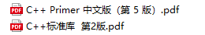

# Notes
>  Here is all my notes!

[TOC]

# Assembly

## 1. **基本知识点总结**： [Assembly.md](Assembly\Assembly.md)

*下面部分为学习过程中的补充部分：*

2. **ATT格式的汇编部分知识点总结：** [ATT格式的汇编.md](Assembly\ATT格式的汇编.md) 

3. **汇编中的CALL和RET指令：** [CALL&&RET.md](Assembly\CALL&&RET.md) 

4. **汇编中的内外中断：** [内外中断.md](Assembly\内外中断.md) 

5. **学习过程中一些有用的程序：** [有用的程序.md](Assembly\有用的程序.md) 

# C++

## 1.学习过程中一些知识点总结以及***C/C++知识点盲区总结***： [C++.md](C++\C++.md) 

> ​		参考的书籍有：
>
> ​		

## 2. C++中的并发编程学习笔记： [Concurrency.md](C++\Concurrency.md) 

## 3.***C++STL学习知识总结：***

3.1 [1.STL源码剖析--一些我们可能不知道的语法.md](C++\1.STL源码剖析--一些我们可能不知道的语法.md) 

3.2 [2.STL源码剖析--空间配置器(allocator).md](C++\2.STL源码剖析--空间配置器(allocator).md) 

3.3 [3.STL源码剖析--迭代器概念和traits编程技法.md](C++\3.STL源码剖析--迭代器概念和traits编程技法.md) 

3.4  [4.STL源码剖析--序列式容器.md](C++\4.STL源码剖析--序列式容器.md) 

***(仅仅学习了一小部分，后续会进行补充！)***

> ***参考的书籍有：*** 
>
> [泛型编程与STL中文版.pdf](C++\泛型编程与STL中文版.pdf) 
>
> [STL容器重点.pdf](C++\STL容器重点.pdf) 

## 4. ***C++并发编程学习***： [Concurrency.md](C++\Concurrency.md) 

> ***参考的书籍有：***
>
> [C++并发编程实战](C++\C++ 并发编程实战（第二版）.pdf)
>
> [C++ 并发编程实战（第二版）.pdf](C++\C++ 并发编程实战（第二版）.pdf) 
>
> [C++ Concurrency in Action.pdf](C++\C++ Concurrency in Action.pdf) 

## 5. ***正则表达式学习：*** [regex.md](C++\regex.md) 

## 6. ***GoogleTest***:  [GoogleTest.md](C++\GoogleTest.md)

# JAVA

##  [3. 第三章 Java的基本程序设计结构.md](JAVA\3. 第三章 Java的基本程序设计结构.md)

##  [4. 第四章 对象与类.md](JAVA\4. 第四章 对象与类.md)

## [5. 第五章 继承.md](JAVA\5. 第五章 继承.md)

## [6. 第六章 接口.md](JAVA\6. 第六章 接口.md)

## [7. 第七章 异常、断言和日志.md](JAVA\7. 第七章 异常、断言和日志.md)

## [JDBC API.md](JAVA\JDBC API.md)

## [Spring实战.md](JAVA\Spring实战.md)

> ***参考的书籍有：***
>
> Java核心技术·卷1和卷2

# 操作系统学习

## 1. Linux基本命令和操作： [Linux操作系统学习.md](Linux\Linux操作系统学习.md)

## 2. 操作系统知识点总结： [操作系统.md](Linux\操作系统.md)

## 3. 进程和线程学习： [进程和线程.md](Linux\进程和线程.md) 

## 4. 内存管理学习： [内存管理.md](Linux\内存管理.md)

## 5. 《操作系统真相还原》学习： [操作系统底层.md](Linux\操作系统底层.md)

> 参考书籍：
>
> 《操作系统真相还原》建议购买纸质书籍反复阅读。

## 6. 鸟哥私房菜学习笔记： [鸟哥私房菜.md](Linux\鸟哥私房菜.md)

> 推荐书籍：
>
>  [Linux-UNIX系统编程手册（上、下册） (Michael Kerrisk) (z-lib.org).pdf](Linux\Linux-UNIX系统编程手册（上、下册） (Michael Kerrisk) (z-lib.org).pdf) 
>
>  [鸟哥的Linux私房菜 基础学习篇 第四版 (鸟哥) (z-lib.org).pdf](Linux\鸟哥的Linux私房菜 基础学习篇 第四版 (鸟哥) (z-lib.org).pdf) 
>
> 推荐网站：
>
> https://xiaolincoding.com/os/

# 数据库学习

## 1. 自己的笔记  [Mysql_study.md](MySQL\Mysql_study.md) 

## 2. 别人的笔记  [Mysql_others.md](MySQL\Mysql_others.md) 

## 3. 数据库索引学习： [索引.md](MySQL\索引.md) 

> 参考书籍：
>
>  [MySQL是怎样运行的(带目录) (小孩子4919) (z-lib.org).pdf](MySQL\MySQL是怎样运行的(带目录) (小孩子4919) (z-lib.org).pdf) 
>
>  [MySQL必知必会 = MySQL crash course (Ben Forta 著 刘晓霞, 钟鸣 译) (z-lib.org).pdf](MySQL\MySQL必知必会 = MySQL crash course (Ben Forta 著 刘晓霞, 钟鸣 译) (z-lib.org).pdf) 
>
>  [高性能MySQL(第3版) ( etc.) (z-lib.org).pdf](MySQL\高性能MySQL(第3版) ( etc.) (z-lib.org).pdf) 

# Parallel Computing(并行计算)

## 1. OpenMP学习：  [OpenMP.md](Parallel Computing（并行计算）\OpenMP\OpenMP.md) 

## 2. MPI学习：  [README.md](Parallel Computing（并行计算）\MPI\README.md) 

# QT学习

> 仅仅学习一点点
>
>  [QT.md](QT\QT.md) 

# 虚幻引擎学习

##  [1. 创建地形（包含对灯光的讲解）.md](Unreal Engine 4\1. 创建地形（包含对灯光的讲解）.md) 

##  [2. 关于碰撞.md](Unreal Engine 4\2. 关于碰撞.md) 

##  [3. 游戏制作.md](Unreal Engine 4\3. 游戏制作.md) 

##  [AI.md](Unreal Engine 4\AI.md) 

##  [虚幻四.md](Unreal Engine 4\虚幻四.md) 

##  [游戏制作.md](Unreal Engine 4\游戏制作.md) 

> 参考书籍：
>
>  [大象无形：虚幻引擎程序设计浅析.pdf](Unreal Engine 4\大象无形：虚幻引擎程序设计浅析.pdf) 

