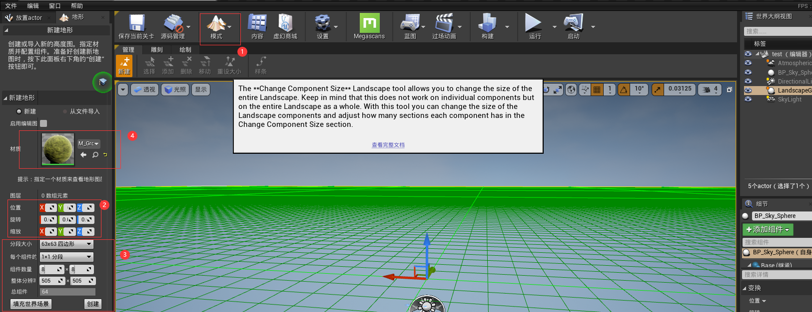

# 创建地形

# 1. 创建一个新的关卡（添加光源）

> 补充：参考文章：https://blog.csdn.net/wubaohu1314/article/details/120803187
>
> ***关于点光源，我们只需要将其理解为可以实现灯泡的照明效果即可。***
>
> 关于聚光灯，简而言之，其工作原理类似于手电筒或者舞台照明灯，聚光用嘛，***我猜测我们可以利用这一点做出一个手电筒来！***
>
> 关于矩形光源，其简单地说就是相当于模仿电视的照明效果，即矩形物体的照明。***我们可以利用其来实现路灯的效果！***

我们创建一个新的关卡的时候会发现，我们看到的界面全是黑色的，我们什么也看不见。

那是因为我们没有添加光照之类的组件，这个时候我们只需要添加进行相应的组件即可：

- 第一个组件就是***定向光源***，那么什么是定向光源呢，就是模拟了一个无限远的光源发射出光线，而且该光线并不会随着距离的增长而增长，***这种就很接近我们现实生活中的太阳光，所以说我们一般是使用定向光源来当作我们的太阳光使用。***

> 对于定向光源，我们无论将其放置在任何一个位置，都不会影响到定向光源的效果，同时对定向光源的缩放也是没有任何意义的。因为无论你将其缩放为多大或者多小，其都是向所有的方向发射光线，***但是我们可以通过改变定向光源的角度从而改变平行光的照射角度，物体的受光也会随着跟着改变，这就好比我们现实中的太阳的移动。***

- 其次就是天空光源，简称为天光，该光源也是十分的重要，该光源会采集整个场景较远的所有的物体，然后生成一个类似于HDR的贴图，然后将其作为发光源对整个场景进行照明。***大概实现效果就是可以看见处于别的物体的影子的区域的物体。***

> 如果我们不添加天空光源的话，我们看见墙壁处的椅子是这样的：
>
> 
>
> 如果我们添加了天空光源是这样的：
>
> 
>
> 所以我们一般都要添加天空光源来保证我们可以看到处于阴影下的物体的轮廓。

接下来，你会发现你虽然添加了***定向光源***和***天空光源***，但是仍然是一片漆黑，这个时候我们应该添加第三种组件：

***BP_Sky_Sphere***,也被称为蓝图天空球，是用来模拟基本的物理天空的效果的，同时俗称为天空盒。

我们刚将其丢进我们的场景中的时候会发现，天空的颜色是黄色的，这个时候我们可以选择一个方向光来绑定我们的天空盒。

同时，我们也可以参考一篇博客：https://www.bilibili.com/read/cv8748588/ 来手动修改天空的颜色（***这里实质上就是修改太阳的高度，值越大即天色越亮，越小的话，即晚上，天色越暗。***），*修改浮云的飘动速度*，*修改星星的亮度，修改云彩的颜色*等等.

最后一个添加的组件就是***大气雾***。

- 添加大气雾；

> 大气雾提供一种光透过行星大气的光散射的近似现象，就是提供一种散射的现象。
>
> 使用大气雾可以修改雾和天空的属性，比如说雾的密度或者亮度、天空的亮度、颜色等等。
>
> ***注意：大气雾是影响整个场景的，相当于大气雾笼罩整个场景，一旦调节，影响的是整个场景效果。***

# 2. 创建地形

我们创建地形的话，是在模式选项当中有一个地形，我们点击之后的界面是上面所展示的样子，我们这个时候设置填充物就是我们的材质之类的内容，然后选择位置，以及创建的大小即可。

我们创建之后会显示一个***雕刻工具***，该工具完成我们的地形的绘制的功能。雕刻出来一些山脉之类的内容等等。

雕刻工具界面如下图所示：

我们可以选择我们的笔刷的大小以及笔刷的衰减度就是我们影响地面的因素，还有就是***工具强度***，就相当于灵敏度的效果。

## 2.1 利用高度图生成相应的地形

上述过程是我们手动去雕刻、创建高度图，我们***除此之外还可以利用高度图直接导入，我们在网上可以随意的搜索出几张高度图，然后利用PS将其进行灰度化，并且选择16位，之后导出为PNG格式的图片文件即可。***我们在创建地形的时候选择从文件导入即可。

# 3. 添加植被

我们在植物的选项里面添加相应的植物即可，***注意记得添加碰撞模型。***