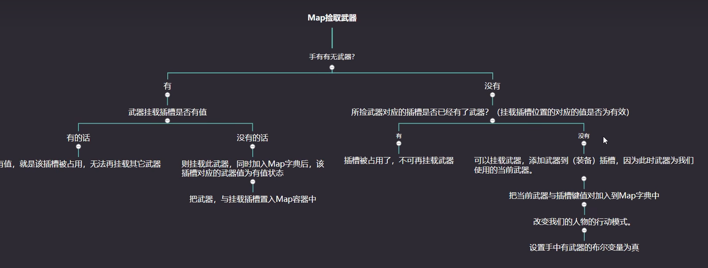
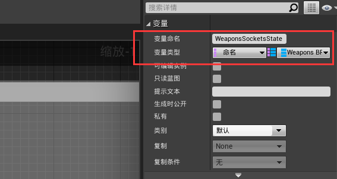
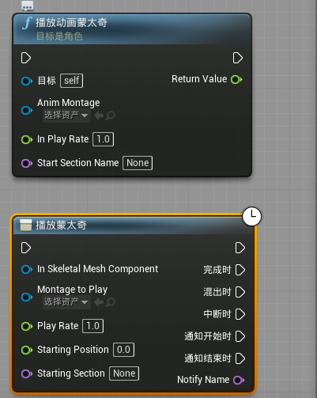
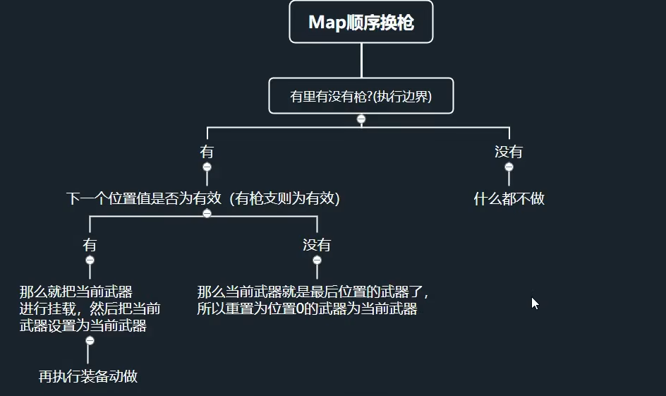
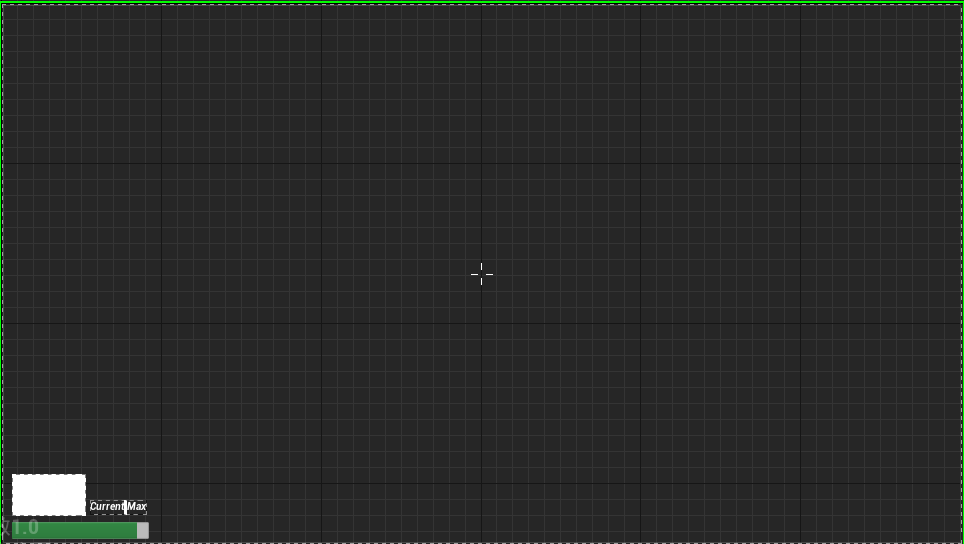
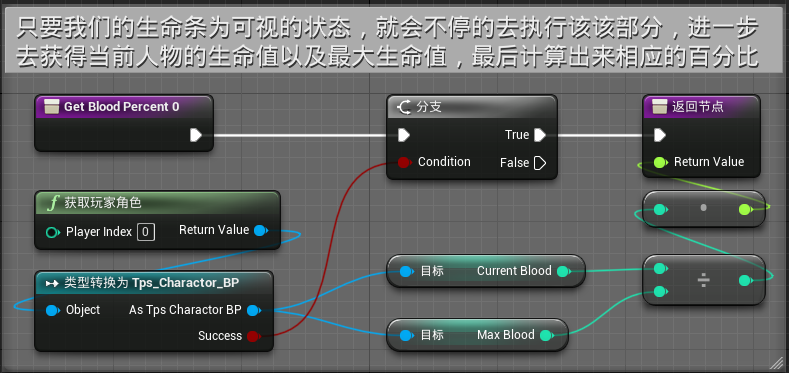
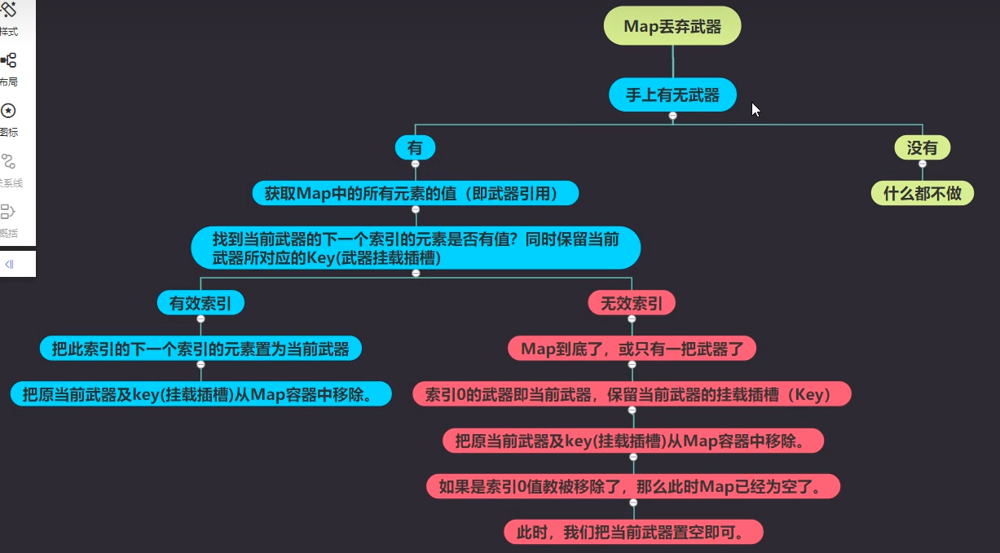

[TOC]

# 0. 一些想法

1. 制作的是第三人称射击动作游戏；
2. 游戏中的任务可以自由的移动、蹲下、趴下、匍匐前进；
3. 里面应该有武器系统，具备基本的射击功能；
4. UI界面设计

> 学习B站视频：
>
> https://www.bilibili.com/video/BV11Y411W7xH/?spm_id_from=pageDriver&vd_source=fab299451215981d1b6ba4532cbf0861

# 1. 武器系统



***我们在这里采用C++中所学习的STL中的MAP容器来进行存储，KEY对应我们的武器插槽，VALUE对应我们的武器。***

首先我们捡取武器的时候先进行判断手中是否持有武器，如果有的话，我们就去检查背包中对应的武器插槽是否具有空位置，如果有的话，就挂载该武器，同时将其加入***MAP字典当中***，并且将该插槽对应的武器的状态设置为已经有武器，最后将武器和挂载插槽置入MAP容器当中。

如果说我们手中当前没有武器的话，我们就去检查背包中的插槽是否已经含有武器，如果说有的话，我们就不可以将该武器捡起来，因为我们的设定就是***我们捡起来的武器不可以重复***，如果说背包中也没有武器，那么我们此时应该将武器放在手上进行装备，***因为此时我们的手中以及背包中都没有该武器，那么我们理应直接进行配备，***随后将该武器与插槽加入到MAP字典当中，接着改变我们人物的行动模式，并且设置我们的手中持有武器。



我们的插槽的类型都是命名，所以前面的Key的类型我们选择命名，后面是我们的武器的引用即映射中所对应的值。


MAP类型的变量中我们有上面所示函数：

```c++
// f 包含:
// 检查键是否包含在提供的映射当中

// f 查找:
// 寻找于键相关的值

// f 关键帧
// f 清除

// f 添加
// 即往我们的映射当中添加对应的键值对

// f 移除
// 即将指定的键值对移除

// f 长度
// 确定该映射中有多少条目

// f 值
// 输出该映射中所有值的数组
```

> 很多的时候我们最好不要销毁变量，因为如果我们后面使用到的话，我们就得需要重新构造这就会造成性能的损耗，所以说我们最好是将其以各种方式隐藏起来。

# 2. 拾取武器时候的UI

首先我们选择使用***覆层！***简单的说这样的话，控件就可以重叠在彼此之上，使得每一个图层内容的简单流布局。

# 3. 拾取武器时候的动画蒙太奇设置

动画蒙太奇可以进行一帧一帧的设置，我们可以在某一帧的时候发出信号触发指定的事件，我们人物的收枪的动画的设置就是通过动画蒙太奇进行的。

我们如果有一个动画进行过渡的话，拾取枪械的过程就会很完美！



一个是延时的函数，一个是立即执行的函数。

# 4. 按照顺序切换武器

​	

跟着做项目的时候，我们***设置鼠标往上面滑动是逆时针切换武器，鼠标往下滑动是顺时针切换武器***。同时设置快捷键1是切换到武器位置1中的武器，快捷键2是切换到武器位置2的武器，如果没有武器就不进行切换，快捷键3是切换为手枪。

# 5. 主UI蓝图的设计

关于主UI的设计，***就是在屏幕上显示当前使用枪支以及当前武器的子弹数目和弹夹中的子弹数目，还有人物的血量，最后还有我们的准心的设计。***



***我们通过绑定人物的相应数据来进行实时的更新, 只要我们将该Widget设置为可视，那么其就会一直调用相应的函数去更新。***



# 6. 丢弃武器设计

   

# 7. 更换子弹


# 8. 利用接口实现伤害的传递

# 9. 小地图的制作

***人物坐标在地图中移动的效果的实现：***

我们通过反向移动小地图来实现人物在地图中的移动。 

# 10. 背包的制作


