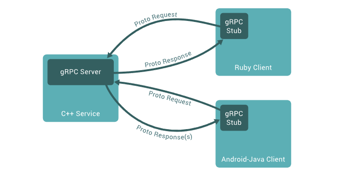

# gRPC Learning

# 1. Introduction to gRPC

什么是RPC？(Remote Procedure Call), 也就是远程过程调用。简单的理解的话，客户端通过网络连接调用服务端的服务，并且服务端将该部分服务执行的结果返回给客户端。至于服务端和客户端之间底层信息交换格式，这被称为***序列化***，序列化是将数据结构或者对象转换为一种格式，以便在网络当中进行传输或者存储，而在接收端进行相应的反序列化操作。序列化的目的就是将复杂的数据结果转换为可传输或者可以存储的格式，使其在不同的系统或者平台之间能够进行有效的交换。

在RPC当中，序列化用于将远程调用的参数、返回值等数据进行编码，以便在网络当中进行传输。常见的序列化格式包括JSON、XML、Protocol Buffers(protobuf)、MessagePack等，gRPC当中默认选择的是***Protocol Buffers***进行信息传输。

在gRPC当中，一个位于客户端的应用程序可以直接去调用位于不同主机之间的服务端程序的方法，仿佛该方法就是位于客户端本地一样，这会使得我们来创建分布式应用或者一些服务。就像大多数的RPC框架一样，gRPC同样是选择定义service接口, 并且在其中声明一些函数，这些函数可以通过传递参数来被远程调用并且返回相应的类型。在服务端，会对这些接口进行具体的实现，接着会运行相应的gRPC来处理客户端的请求。对于客户端来说，客户端会具有一个***stub***(就是其他语言当中的client)， 该client会提供server端实现的这些方法供其进行调用。

> In gRPC, a client application can directly call a method on a server application on a different machine as if it were a local object, making it easier for you to create distributed applications and services. As in many RPC systems, gRPC is based around the idea of defining a service, specifying the methods that can be called remotely with their parameters and return types. On the server side, the server implements this interface and runs a gRPC server to handle client calls. On the client side, the client has a stub (referred to as just a client in some languages) that provides the same methods as the server.
>
> gRPC clients and servers can run and talk to each other in a variety of environments - from servers inside Google to your own desktop - and can be written in any of gRPC’s supported languages. So, for example, you can easily create a gRPC server in Java with clients in Go, Python, or Ruby. In addition, the latest Google APIs will have gRPC versions of their interfaces, letting you easily build Google functionality into your applications.

# 2. Introction to Protocol Buffers

gRPC默认情况下采用Protocol Buffers进行序列化以及反序列化。当然你也可以选择其余的序列化格式，比如说JSON、XML等等。

